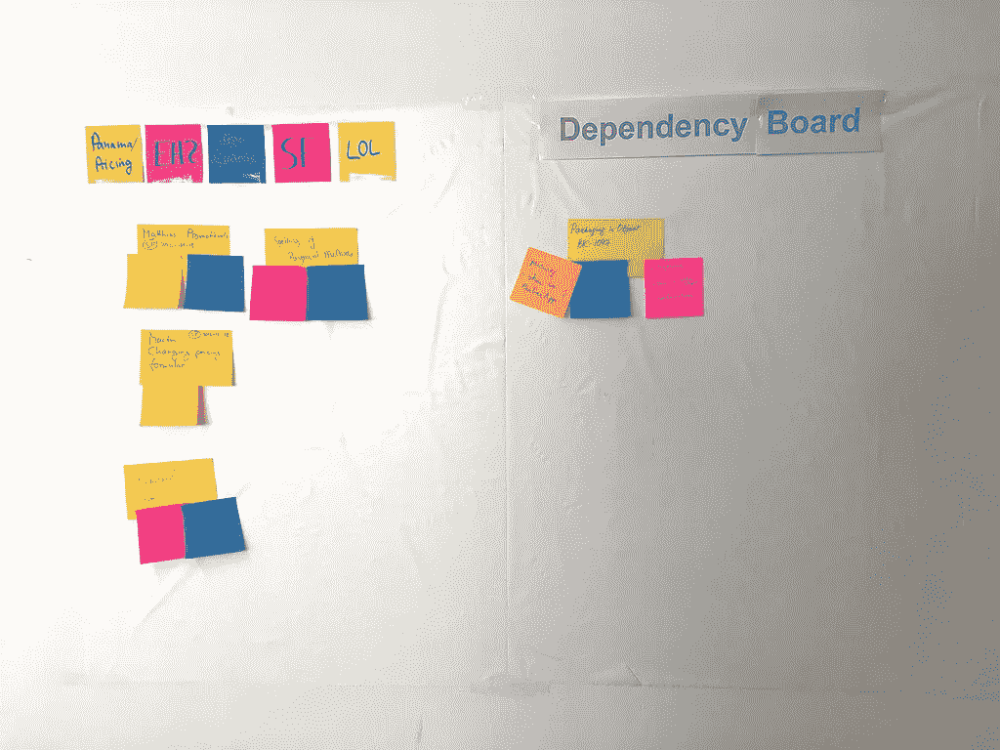

# 如何联合 Scrum 团队

> 原文：<https://medium.com/swlh/how-align-scrum-teams-99b907e67edd>

# TL；DR:如何联合 Scrum 团队

你还记得组织成立第一个 Scrum 团队的美好时光吗？新的工程小子“仅仅”应该在 sprint 结束时交付潜在的可交付产品增量？

第一个团队是为即将到来的向学习型组织的转变敲响警钟。当时我们对这条道路上的挑战知之甚少。当团队 2、3 和 4 加入时，在 sprint 结束时交付产品增量首先变得复杂，然后变得复杂。

事实证明，成为敏捷不仅仅需要创建(Scrum)团队。获得成为敏捷的全部好处，成为围绕软件构建的学习型组织，也需要改变工程实践。如今，一切都是关于持续的价值交付。

# 为什么联合 Scrum 团队是有益的

当扩展 Scrum 时，产品交付组织需要解决两个层次的一致性:

## 产品和流程层面的一致性:

哪个团队构建什么？产品级的一致性是避免单个团队级的交付优化所必需的。这种形式的局部优化是组件团队熟悉的模式，因为他们专注于特定的技术领域。

然而，在这个专业领域工作，可能并不总是在给定的时刻给客户或组织带来最大的价值。相比之下，这个团队无法完成的另一个团队的任务可能更有价值。

## 技术层面的一致性:

这一级处理工程实践，例如持续集成和持续交付。它也与软件架构相关。在大多数情况下，这是 monolith vs . micro-service architecture 的争论。(阅读更多:[安息吧:现实生活例子中的微服务 vs 独石](https://medium.freecodecamp.com/rest-in-peace-to-microservices-or-not-6d097b6c8279#.k826cc5p6)。)

# 你调整 Scrum 团队的努力失败的迹象

如果第一个 Scrum 团队的实验证明是成功的，组织通常会开始创建更多的 Scrum 团队。

无论您的工程实践如何，您都会很快发现，相比之下，通信开销将呈指数级增长。这种开销的增长对于创建组件团队和开发单一应用程序的组织来说尤其明显。

尽管 Scrum 团队之间需要更好的沟通对每个人来说都是一件很容易的事情，但是观察团队之间的沟通惯性是很有趣的——即使彼此相邻。

开始时通常会产生一些对齐反模式:

*   “他们”——意思是另一个 Scrum 团队——触及了“我们的代码。”(没有我们的批准:在团队层面上，一种被感知的甚至被鼓励的代码所有权。)
*   单个 Scrum 团队的部署是在没有与其他团队事先沟通的情况下进行的，因此会造成问题。(‘正在研究我们的分级系统’综合症。)
*   团队之间没有定期的知识共享，例如，如果没有管理层的命令，就对同事进行新代码的培训。
*   不参加 Scrum 的 scrum 会议。(常见借口:a)“Scrum 有这么多会议，我应该什么时候完成我的工作？”b)“我们的问题没有影响任何其他 Scrum 团队。”)

# 改善团队间沟通的必要性

产生通信开销的原因是团队之间的依赖性，导致创建队列、浪费以及延迟成本。

为了减少 Scrum 团队之间的依赖，他们需要自治。然而，没有问责制的自治等于无政府状态。因此，调整 Scrum 团队的过程需要从组织的文化层面开始。

改善文化不能由最高管理层的法令来命令。它需要是一个包含所有受影响的人的旅程。如果 Scrum 团队要走出他们的舒适区，接受责任，失败必须是一种安全的体验，彻底的透明性需要被接受。

理想情况下，在流程层面上调整 Scrum 团队所需要的文化变革，是由向抗脆弱或弹性系统架构的同步过渡来支持的。

在这一变革过程中，无论前期投入了多少努力，技术失败都是不可避免的。因此，在系统层面处理失败的有效方法是，根本不要把重点放在防止它发生上。有效的方法是创建一个容错环境，该环境擅长回滚危险的部署。(Jez Humble 关于敏捷组织中高绩效团队的更多信息:[转至 2015 为什么扩展敏捷不起作用](https://www.youtube.com/watch?v=2zYxWEZ0gYg)。)

## 请点击“心脏按钮”💚下面，如果你觉得这篇文章有用，它将对我意义重大！

***如果你喜欢邮件通知，请*** [***注册我的每周简讯***](https://age-of-product.com/subscribe/?ref=Food4ThoughtMedium) ***并加入 6369 位同行……***

# 调整 Scrum 团队的第一步

改变工程流程以及应用程序的架构可能需要时间。不过，要立即开始校准过程，需要一些预备步骤:

*   首先，避免个人的冲刺长度和开始日期，而是调整所有团队的冲刺。
*   建立一个“Scrum of Scrums”仪式，以及一个依赖板。(这两种方法都是通向完全自主和一致的 Scrum 团队的临时训练轮。)
*   在发布前应用 LGTM(“看起来不错”)过程:这听起来像是官僚主义，但如果灾难即将来临，这是不可避免的。(有趣的问题是:Scrum 团队会自己解决这个问题，还是等待管理层来‘解决’它？)
*   建立同伴教学和辅导计划。一个简单的结对编程板——谁想从谁那里学到什么——可能是一个好的开始。
*   用一个需要所有 Scrum 团队修复、共享和维护的问题库来跟踪技术债务。

# 敏捷过渡——来自战壕的手册

最新的 94 页版本的**“敏捷过渡——来自战壕的实践手册”**可以在这里**、**获得，并且是**免费的！**

[Download the PDF here](https://age-of-product.com/download-agile-transition-hands-guide-trenches/)

[下载内容以 PDF 格式发送到您的电子邮件地址](https://age-of-product.com/download-agile-transition-hands-guide-trenches/)。请注意，如果您还没有订阅的话，下载此内容还会为您订阅我们广受欢迎的专业策划的每周“敏捷思维的食粮”时事通讯。你当然可以随时退订。

# 最终，通过转移到自治的特性团队来联合 Scrum 团队

最后，至少这是我的观点，对齐 Scrum 团队只能基于自治的特性团队。任何其他设置都会产生太多的依赖性，从而浪费金钱、人力和时间。这也将阻止本组织成为一个学习型组织。

如果您还不能转移到功能团队，下面是一些可能会减轻过渡的观察:

*   持续集成是特性团队的先决条件。这个过程需要完美无缺
*   您构建它，发布它，并运行它:功能团队中的每个人都需要做“QA”，避免孤立的质量保证或将其委托给单个团队成员
*   如果你继续使用功能分支，让任务尽可能的小，并尝试在晚上将所有分支合并回主服务器。这种实践将为每个人提供即时的反馈，并且修复会更便宜(也更痛苦)
*   开始测量提前期和周期时间以识别队列。(阅读更多:[敏捷过渡:敏捷度量——好的、坏的和丑陋的](https://age-of-product.com/agile-metrics-good-bad-ugly/)。)
*   如果你在做一个整体，如果可行的话，考虑转移到微服务架构。

# 结论

你如何联合 Scrum 团队？请在评论中分享你的经历。

# 相关职位

[如何开始您的敏捷转变(第 1 部分)](https://age-of-product.com/agile-transition-scrum-team-1/)

[敏捷的大图景:如何向利益相关者推销敏捷思维](https://age-of-product.com/big-picture-agile/)

***请点击【心形按钮】*** *💚下面，如果你觉得这篇文章有用——它对我来说意义重大！*

***要不要这样多读书？嗯:***

*   📰 ***加入 6369 位同行和*** [***报名参加本周刊快讯***](https://age-of-product.com/subscribe/?ref=Food4ThoughtMedium)
*   🐦 ***关注我上*** [***推特***](https://twitter.com/stefanw) ***并订阅我的博客*** [***产品时代***](https://age-of-product.com)
*   💬 ***或者，加入我全新的*** [***松弛团队【动手敏捷】免费***](https://goo.gl/forms/XIsABn0fLn9O0hqg2)***…***

## 这个故事发表在 [The Startup](https://medium.com/swlh) 上，这是 Medium 最大的企业家出版物，拥有 292，582+人。

## 在这里订阅接收[我们的头条新闻](http://growthsupply.com/the-startup-newsletter/)。

