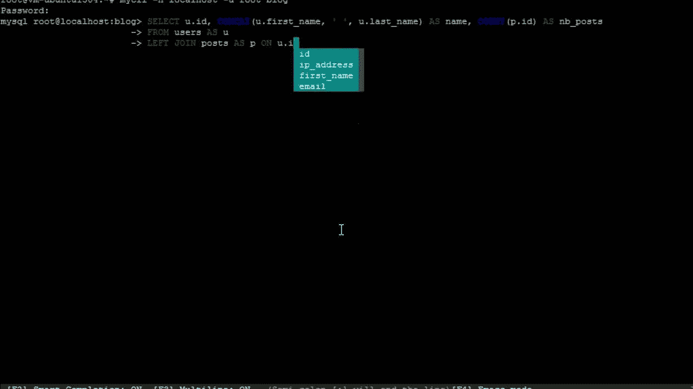

# iPad Pro 是一台专注、简单的编码机器

> 原文：<https://medium.com/swlh/how-am-i-using-my-ipad-pro-as-a-development-machine-e4912a31744e>


所以最近我写了一篇关于为什么开发者可能会把 iPad Pro 用作家用机器的文章。今天，我将详细说明我每天是如何使用它的。

# 所以你在当地做不了什么

实际上，作为一个本地开发环境，iPad Pro 真的没什么可做的。我习惯了基于 Linux/Unix 的机器，这些沙盒应用程序不适合我，没有什么东西接近 iPad 上的完整开发系统(对不起，我知道！)，我都懒得去尝试。所以我很快选择了一个可以远程访问的远程 Linux 机器。

我买了一台能够添加蜂窝数据的 iPad Pro，这样我就可以从任何有数据的地方连接到我的远程服务器上，这使得这成为了一个坚实的可能性。我知道我基本上是在作弊，但是，我仍然需要调查是否有一个足够无痛的设置，我可以在 iPad 上使用，我会继续使用。因此，快速启动的服务器、良好的网络连接和足够好的编辑环境是必不可少的。

# 编辑代码

既然我已经拉开了帷幕(你真的不能只在 iPad 上编码)，我们需要决定一种远程编辑代码的方法。我使用 Vim 已经很多年了，对我来说，我很高兴使用一些终端客户端 ssh 到服务器上，设置一个好的 Vim 环境，然后就完成了。一切都进行得很顺利，但不幸的是，当你缺少一个退出键时，vim 编辑就糟糕多了。这是 iPad Pro 智能键盘所没有的，我不会为了 ESC 键而携带第二个键盘。


Yup, no esc key.

有其他快捷方式让 esc 工作，也有终端客户端为 IOS 提供的屏幕 esc 键，但它只是一样的，我十年的 Vim 肌肉记忆使整个事情太痛苦了，当我不停地敲击 backtick。所以维姆被扔出了窗外。

我尝试了几种不同的选择，但最终， [GoCoEdit](http://gocoedit.com) 是最好的选择。它可以通过 ssh 远程安装文件夹，它在网络上表现很好，并且它有一个相当不错的界面(sublime textish，如果有帮助的话)。


如果你做更多基于网络的编辑，我听说 Coda 很棒，但不是我想要的。我是一个更多的终端，管道和 grepping，而不是漂亮的网页和 CSS。

我最终可能会做的是用 emacs 配置设置 [Spacemacs](http://spacemacs.org) ，看看我是否能最终扣动扳机，开始使用 Emacs 的疯狂快捷键，但我现在并没有学习一套全新的编辑器快捷键。


# 执行应用程序

## 哪个远程服务器

我需要一种能够启动/关闭远程 Linux 机器的方法，让它非常快速地启动，并且尽可能以无痛的方式完成，因为当我自己只是偶尔使用它时，我不会为持续的正常运行时间付费。我还希望它每次都可以通过相同的访问细节进行连接，以避免每次启动服务器时都必须将新的服务器 IP 放入我的终端客户端。

我为此尝试了 Vultr 和 DigitalOcean，主要是因为它们相对简单易用，而且这主要是为了让我玩玩东西，而不是生产运行时间机器。所以最终归结为速度和应用质量。长话短说，数字海洋赢了。它支持保留 ip，这意味着我不需要依赖类似 dyn DNS/的东西，在每次关机/开机时等待 DNS 传播(或者手动设置 IP)。它旋转起来也非常快，快得令人震惊。如果我通过 DigitalOcean IOS 应用程序请求启动，当我切换到 ssh 客户端并连接时，它已经启动了，这对我来说太好了。我还可以从伦敦运行一个实例，这为我减少了很多延迟，这是一个优于 Vultr 的优势。此外，可以连接到 DigitalOcean 的应用程序似乎质量更好(实际上工作正常，这很好)。测试的应用程序没有一个特别令人惊讶，但是 DigitalOcean 一直运行良好。因此，从我的角度来看，我强烈建议数字海洋进行这样的设置。


所以人们知道，我尝试的数字海洋应用程序是[数字海洋管理器](https://itunes.apple.com/us/app/digitalocean-manager/id633128302?mt=8)和 Vultr 一个被称为[秃鹫](https://itunes.apple.com/us/app/vulture-unofficial-vultr-app/id1116844578?mt=8)。

# 远程连接

下面是我用来连接各种我可能需要的服务的工具列表。

## SQL 客户端

因此，在 App Store 上有一些 SQL 客户端，但它们看起来都不怎么样。所以我只是在服务器上使用 [mycli](http://www.mycli.net) 就可以了。



## [白蚁](https://itunes.apple.com/gb/app/termius/id549039908?mt=8)

我已经是 Linux 用户很多年了，我非常习惯在命令行上工作。Termius 是 IOS 上事实上的 ssh 终端客户端，这是有充分理由的。我运行了它，它运行得非常完美，甚至都懒得看其他任何东西。


## [码头工人](https://www.docker.com)

如果你还没有的话，我强烈建议你学习一些码头知识。能够在远程机器上快速启动服务真的很方便。例如，我想从我的静态内容 pelican 站点迁移到 Medium，但是 Medium 只接受 Wordpress 文档。因此，我创建了一个基本的 Wordpress Docker，使用一个快速脚本(带有一些我自己的错误修正)将我的静态内容导入 Wordpress 并导出到 Medium，所有这些都没有触及父操作系统。都很好看！

# 一个方便的提示

因此，有一件事可能很有用，那就是当你退出你的小服务器时，让它自动关闭，这样你就不需要一直记得通过应用程序关闭服务器。如果您想这样做而不需要每次都输入密码，首先运行这个命令开始编辑 sudoers 文件。

```
sudo visudo
```

然后添加这一行以允许无密码访问 poweroff 命令。

```
username   ALL=(ALL) NOPASSWD: /sbin/poweroff, /sbin/reboot, /sbin/shutdown
```

然后为您的用户创建一个别名，这样当您点击 exit 时，它实际上会关闭机器。把这个放在你的。巴沙尔或者。zshrc 或您的 shell 使用的任何 rc。

```
alias exit=’sudo poweroff’
```


## 这个故事发表在 [The Startup](https://medium.com/swlh) 上，这是 Medium 最大的创业刊物，有 295，232+人关注。

## 订阅接收[我们的头条](http://growthsupply.com/the-startup-newsletter/)。

