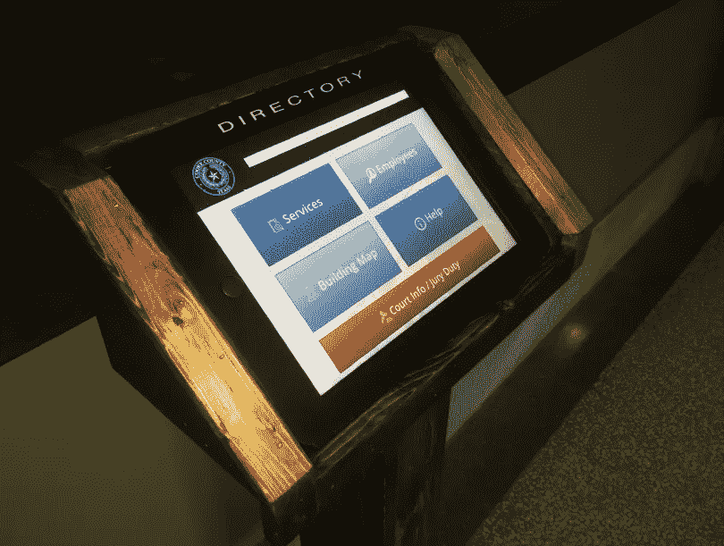
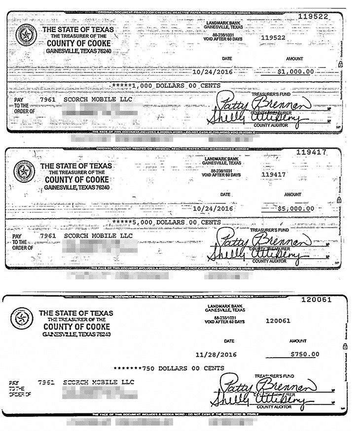
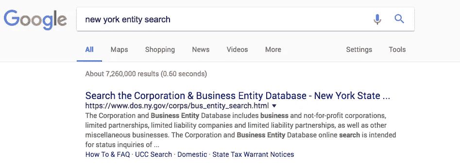
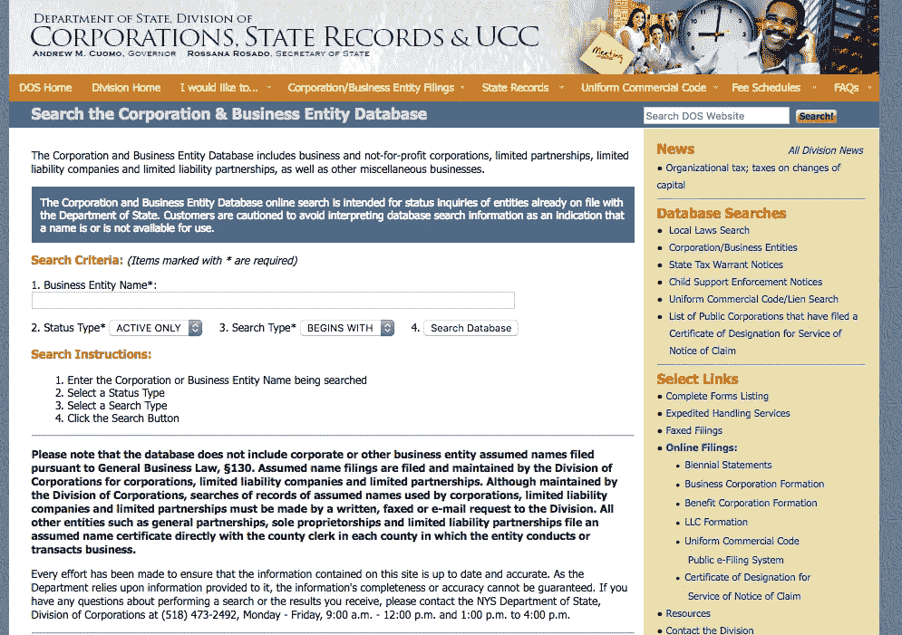
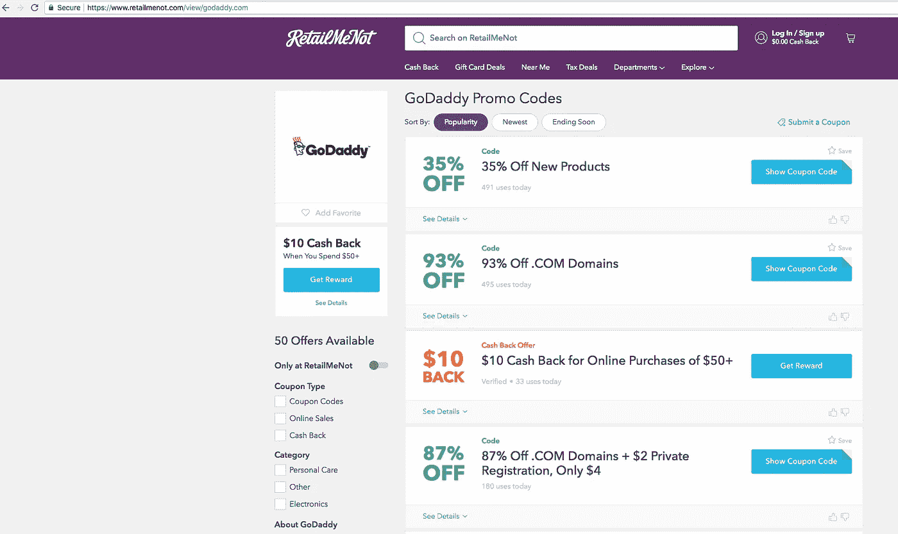
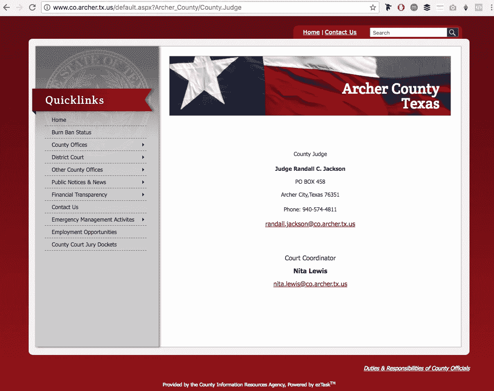

# 我如何通过为法院创建一个无聊的 Kiosk 应用程序在两周内赚了 6750 美元。

> 原文：<https://medium.com/swlh/how-an-indie-developer-made-6-750-in-two-weeks-by-creating-a-boring-kiosk-app-for-a-courthouse-8be8ca1697aa>

# **证明:**

【http://imgur.com/a/wh98r】app 截图&管理面板:

只是一点关于我的背景故事…自从 iPhone 问世以来，应用程序就是我的最爱。在 6-7 年的时间里，我可能已经花了超过 10 万美元来开发应用程序。然而，我几乎从未在我的大部分项目上实现收支平衡。
为什么？…因为我很长一段时间都在忙着喝可乐。

有没有听人说过:

-你需要改变游戏应用的皮肤来赚钱
-你需要建立一个本地的、社交的、照片共享的“insert-buzz-word-here”应用
-你需要制作一个免费的应用&专注于让它“病毒化”
-你需要担心“ASO”

..谁在乎麻生！..开玩笑，你应该的；)

如果你认为你可以简单地复制 Snapchat 的 Evan、Whatsapp 的 Jan 或优步的 Travis 所做的事情，你可能更有可能赢得强力球。

这很大程度上与时机、运气和关系有关。如果你没有这些，那么你就不走运了，我的朋友。TBH，直到我决定宁愿“无聊”&富有，然后“酷”&破产，我的运气才开始改变。现在，我所做的就是对那些告诉我他们正在开发下一代 Snapchat 的人竖起大拇指，然后继续向无聊的行业推销应用。

这些行业真的在“乞求”与“Instagram”一代保持联系，他们为此花费了大量的金钱。几乎没有竞争，因为每个人都忙着通过说他们“创造了下一个 Snapchat”来泡妞。

举个例子，我开发的 iPad“kiosk”应用程序以 6750 美元的价格卖给了当地的县法院。我只花了 2-3 周就完成了。这不是“十亿美元的估值”……但谁在乎呢？这仍然是一个很好的小变化。

这可能是我做过的最小的项目之一。现在，我的大多数其他项目都在 25000 到 75000 美元之间。我通常只专注于向中端市场 B2B 公司、当地县和其他无聊的小行业销售。

最疯狂的事？

我在北印度只有 2-3 名兼职开发人员为我工作，我每月支付 700 美元。我为我需要做的任何事情找到高质量、高成本效益的供应商。就像我说的，无聊/富有胜过冷静/破产。

我知道如何编码吗？**没有** …谁在乎呢？

你可以花很少的钱雇人，不用做实际的细节工作就能把事情做完。必须热爱全球化，对不对？

作为一个企业主，你的主要精力应该放在争取客户上。这篇文章的目的是提供一个可行的计划，帮助你制作一个类似于我所做的应用程序。你可以用这些步骤为自己复制它。

最重要的是，**你不需要知道编码**。

凡是你做不到的，都可以超级便宜的轻松外包。我将证明，在无聊、无趣的行业中有巨大的赚钱机会。你可以选择是否分享我要分享的内容。

*免责声明:结果因情况而异。如果对你没用，不要抱怨。*

现在没有进一步告别:

## **我建立法院信息亭应用程序的可行计划&利润:**

请注意，有些步骤可能不适用于您。如果需要，可以随意跳过这些步骤。我为*n00b 企业家*写这篇文章。谁是 no0bp 创业者？他们比 wantrepreneurs 低一级。

想要创业的人可能已经有了一个公司，名片，电子邮件，一个时髦的网站等等……但是实际上并没有“赚”到钱。

他们可能接受家庭的“投资”，或者试图筹集“资金”，但并没有真正验证他们的想法。

你要知道**投资人一个美元都不给& # &！！关于你的想法**。

通过赚到$或获得用户来验证你的想法，他们会像大米中的白米饭一样围绕着你。你甚至不需要向他们推销。

对于想要创业的人来说，这完全是关于经营企业的“形象”……而不是真正理解经营企业的意义..

*…去制作#@ &！！钱。*

企业家更糟糕。他们只是花时间“阅读”如何变得富有，但却坐以待毙。一切都很好…我已经在那里，做了…很多年了。无论如何，如果你是一个想要更高职位的人，那么你可以跳过这些步骤。然而，如果你是一名企业家，那么继续阅读:

**n00b 指令:**

**1)** 想出一个吸引人的公司名称，并确保它能在你所在的州使用。你可以通过输入你的州名和“实体搜索”来检查它是否可用。例如，如果你在纽约，你可以输入“纽约实体搜索”。见下文:

如果你点击第一个链接:[https://www.dos.ny.gov/corps/bus_entity_search.html](https://www.dos.ny.gov/corps/bus_entity_search.html)你可以搜索看看你的名字是否被占用。

如果这个企业名称没有结果，这意味着没有人使用它，你应该很好！反正这个不用太担心。这是你以后需要的有用信息。

**2)** 一旦你选定了一个名字，找一个 0.99 美元的 Godaddy 推广码，买一个域名，设置一个公司邮箱(用 Zoho Mail，他们是免费的)。在你得到你的域名&托管后，设置一个时髦的签名。

样本签名:
-

**富兰克林飞利浦** 斯科奇有限责任公司//总裁
网站@[http://scorchmobile.com](http://scorchmobile.com/)
邮箱@[frank@scorchmobile.com](mailto:frank@scorchmobile.com)
电话@ 111.111.1111

听起来很不寻常..但我们这样做的主要原因是，如果你试图用你的个人电子邮件地址向高层决策者推销某样东西，你会看起来像个白痴。你想让自己看起来像个经营大公司的球员。不是车库里的某个家伙。当你和企业类型的客户打交道时，印象很重要。

反正重点是，**不要像个傻逼**。

答应吗？爽，继续看…

**3)** 去谷歌，输入“你的县名+州名”。比如“德州阿彻县”。你应该得到官方的县站:[http://www . co . archer . tx . us](http://www.co.archer.tx.us)。

对于法院，决策者通常是郡法官。所以如果你去阿彻县的网站&去县办公室>县法官>，你会在网站上看到法官的电话&电子邮件。

*(顺便说一句，请不要给杰克逊法官发邮件。他已经被投了 lol)*

…很好，对吗？K..*继续前进……*

窃取我的电子邮件推介模板:[http://scorchmobile.com/ch/email](http://scorchmobile.com/ch/email)，用它来联系你当地县的法官，使用你新创建的商务电子邮件。不要忘记附上展台图片。一张照片胜过千言万语。或者……可以直接打电话给法官。如果他们要求参考资料，你可以说你把项目“转包”给了斯科奇。大多数企业都有处理应用程序开发等事务的“供应商”..这种情况也没什么不同。根据需要定制音高。如果需要，我很乐意做你的推荐人。

**6)** 下一步是得到一个演示构建。记住，你甚至还没有在你的生意上花 5 美元。现在是投资一点创造产品的时候了。你可以把我之前提供的 app &管理面板截图，从 Upwork，Elance，Craigslist，Fiverr 等那里雇人。

或者你可以以非常便宜的价格购买我为库克县法院创建的**精确代码**(比雇佣开发人员来构建整个系统要便宜得多)。如果你能遵循基本的指令，你也不需要知道如何编码。

# [点击此处下载法院捆绑包](http://my.prkr.xyz/scorch)

*(使用促销代码****medium 100****优惠 100 美元)*

我不会保留这个太久..只是想给这篇帖子的读者提供一些价值！我的法院包包括完整的重新换肤说明，供那些不知道如何编码的人使用。该应用程序的一切都可以从管理面板定制，包括按钮颜色，标志，添加员工，部门，服务等。唯一需要一点技术专业知识来改变的是建筑地图，但我可以帮助你，或者你可以从 Upwork 雇佣一个 IOS 开发人员来快速完成。

设置这一切需要几个技术步骤(如部署到您的服务器、上传数据库、设置 web 服务 URL、添加应用程序图标等)，但最多一两个小时就可以完成。

这就像建立一个 Wordpress 网站一样简单。然而，如果你一点科技技能都没有，那么最好请人帮你几个小时。那应该不会超过几百美元。或者联系我。

再说一次，我提供这个的目的是为了节省你寻找和面试开发者的繁重工作，开发它的实际时间，寻找设计师等等。从本质上说，我在努力为你节省时间和金钱。它还包括所有的 PSD 的&设计文件，一份样本合同的副本，我发送的确切建议的副本，ipad/admin 代码，加上一个空白的数据库&演示数据库文件。这基本上是你需要的一切。

记住这是一个真实的生意，当开始一个真实的生意时，会有一些启动成本..不过不要太多…不要把时间浪费在填充材料上，比如名片、时髦的网站、徽标等等。

如我之前所说，你应该把重点放在产品和达成交易上。

**7)** 达成交易的最佳方式是向你自己的县法院推销这个应用创意。你可以说你是你所在县的居民，经营着一家小型企业，你正在努力发展它。他们喜欢帮助当地的小企业，因为你创造了新的就业机会，为国家带来了价值。

如果他们看起来感兴趣，给他们发一份建议，包括付款时间表、可交付成果等。这一步你可以尽情发挥创造力。记住，不要报什么 1000 美元之类的狗屁数目。你会看起来像一个在车库里工作的孩子。

…嘘，他们不需要知道你是 LOL——)

Heck 随便报个比我高的吧。事后看来，我想我本可以收更多的钱。当你收取真正的美元时，你看起来像一个真正的公司。*不退而求其次*。

如果他们在看完你的提案演示后给你开了绿灯，那就赶紧去喝杯啤酒..拍拍自己的背，然后赶紧回去工作！

你现在可以“正式”组建你的新公司了。通过访问你所在州的网站来做到这一点(他们相当快)。大多数州都有网上申报的方式。

例如，如果你住在得克萨斯州，你可以去这里:[https://www.sos.state.tx.us/corp/sosda/index.shtml](https://www.sos.state.tx.us/corp/sosda/index.shtml)&自己动手。

你甚至可以通过拜访当地的县书记办公室来做到这一点。输入“县书记+你所在的城市名”就可以找到你当地的县书记。德克萨斯州达拉斯县书记官..这个地址应该会出现在谷歌上。就出现说你想成立一家公司。了解有限责任公司和 S-Corp 之间的区别很有帮助，因为你需要选择你将组建哪种实体([https://www.legalzoom.com/articles/s-corp-vs-llc](https://www.legalzoom.com/articles/s-corp-vs-llc))。

如果钱不重要，就雇一家像 Legalzoom.com 这样的公司来帮你组建公司。(无隶属关系)

**10)** 从 https://sa.www4.irs.gov/modiein/individual/index.jsp 国税局网站
获取一个 EIN(雇主 ID 号)。这是你企业的“社保#”。你需要这个来创建你的银行账户。

**11)** 设置一个商业银行账户。这是给你开始收集你的面团。你需要带着你的公司章程和 SS4 表格去银行。获得一个基本的帐户设置并存入 20 美元。

告诉银行家你把一些支票落在家里了，你很快就会有一大笔存款了(这样他们就不会像失败者一样把你一笔勾销了哈哈)。

请寄一份合同样本和第一批货的发票。我更喜欢用 Pandadoc 或者 Echosign 这样的公司(没有隶属关系)。只是看起来更官方。但是，如果他们有一个 RFP 流程，那么就遵循它。

一旦他们签署了合同，你就可以向他们索要所有的内容、品牌文档、徽标等。您将使用它来为他们定制合适的应用程序。我建议你在等待第一张支票的时候，收集他们所有的东西，启动这个项目。如果一个县签了合同，你就能拿到钱，这几乎是板上钉钉的事。然而，这完全是你的电话。

**13)** 一旦你完成了应用程序，确保你正确地测试了它。之后，也让他们测试一下。如果一切看起来不错，发送最终发票，并等待您的支票到达。然后将其部署到他们将要使用的 iPad 上。

如果你雇佣了开发人员，那么他们可以很容易地为你做这一切。否则，如果你下载了我的代码，我会一步一步地告诉你如何自己去做。顺便说一下，你甚至可以在报价中加入 iPad。如果你的收入是它的 10 到 15 倍，600 到 700 美元算什么？还记得我们之前关于不做白痴的承诺吗？不要浪费你的钱在周五晚上买瓶子服务。利润再投资，&继续奔忙。你现在可以冲洗/重复这个过程，并降落其他法院。

这是一个如何让**赚钱的应用程序的分步计划。不像 99%的应用开发者卖 0.99 美元的应用会赔钱。你也不需要成为一名程序员，或者处理任何技术上的、本质上的东西。**

如果你讨厌这个想法，那就想想其他可以针对无聊行业的酷点子。只要你能提供大量的价值，无聊的企业会更乐意付钱给你，让你为他们开发解决问题的应用程序。

**...而且他们居然有钱花！**

想想你需要卖出多少个 0.99 美元的应用程序才能赚到 6750 美元！😂

不管怎样，这就像那些愚蠢的 FB 广告承诺一个月内赚 10 万美元一样容易吗？

**号**

是 Snapchat 或者 Instagram 之类的性感 app 照片分享吗？

**No.**

做这个你会成为亿万富翁吗？

**号**

你需要知道如何编码吗？

**号**

这个循序渐进的过程会帮你赚几千块钱一点点时间&肘脂。关键是，你可以通过向不性感的利基市场销售应用来赚钱。此外，竞争也不激烈，因为每个人都在努力开发下一款“棒极了”的照片应用，发送消失的裸照。停止梦想成为亿万富翁，开始做点什么吧！如果你真的想赚钱，你就必须做些该死的工作，不要再到处鬼混了！同样，您可以节省大量资金，并获得准确的代码、模板和我用来实现这一点的所有东西:

# [点击此处下载法院捆绑包](http://my.prkr.xyz/scorch)

*(使用促销代码****medium 100****优惠 100 美元)*

就像我之前说的，我只在有限的时间内提供代码，过一段时间就会被删除。不管怎样，现在我给了你一个可行的计划，你真的会执行吗？或者你打算坐在你的屁股上，浪费又一年的时间去梦想，而不是真正“做”任何事情？

## 去工作吧！

## 这个故事发表在 [The Startup](https://medium.com/swlh) 上，这是 Medium 最大的创业刊物，拥有 316，638+人关注。

## 在此订阅接收[我们的头条新闻](http://growthsupply.com/the-startup-newsletter/)。

