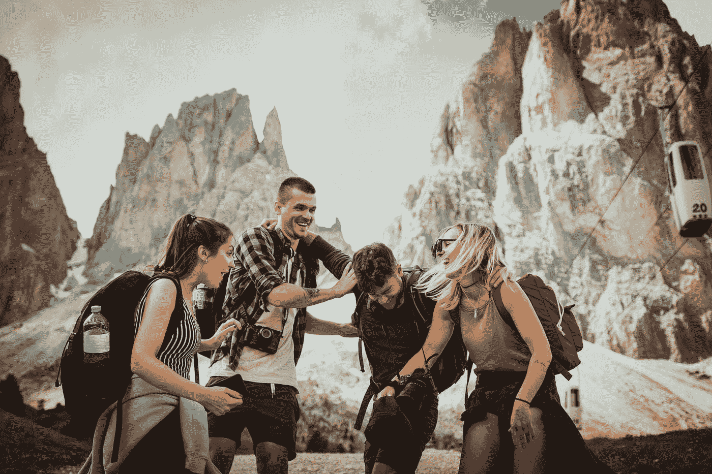

# 一次旅行经历如何以及为什么会改变初创公司的生活

> 原文：<https://medium.com/swlh/how-and-why-a-travel-experience-can-change-the-life-of-a-startup-db75e45b026a>

## 和创业创始人的生活

Photo by [Felix Rostig](https://unsplash.com/@felixrstg?utm_source=medium&utm_medium=referral) on [Unsplash](https://unsplash.com?utm_source=medium&utm_medium=referral)

布莱恩·赫尔夫曼的采访

# 1.你对旅游行业的兴趣是怎么来的？

事实是，直到 2015 年 10 月我决定进入旅游这个“行业”时，我才对它产生了浓厚的兴趣。尽管我一直对旅行充满热情，尤其是在大自然中度过的时光，我发现这些年的旅行经历总能带来巨大的个人成长。当我的联合创始人乔希和我想创建一个平台来帮助有抱负的企业家时，我们决定旅行将是这个平台。旅行带来视角，激发自我意识和高度的同理心。旅行帮助你更好地管理风险，找到平衡，培养耐心。这些都是成功的创始人需要的属性。我猜你可以说我们进入旅游业的原因和其他人选择进入“科技”行业的原因一样。旅行是我们的平台，科技是他们的平台。

# 2.给我们讲一个你第一次意识到旅行和整体幸福的整合潜力的故事。

在整个大学期间，我有一些令人大开眼界的旅行经历，但直到经历了一场个人悲剧后，我才感受到旅行作为整体幸福催化剂的力量。2012 年 8 月，我爸在与癌症长期斗争后去世。接下来的几个月是我一生中最痛苦和孤独的几个月。有一次，我的朋友马特告诉我，他将作为滑雪教练在科罗拉多州度过冬天，并建议我一起去。我被这个机会吸引住了。在我父亲去世后，我觉得人生苦短，不能每天都呆在小隔间里，为别人的底线而努力。所以我辞掉了高薪的公司工作，去科罗拉多做了一名滑雪教练。我知道我不想把这作为我的新职业，但我也知道内心深处，即使我当时不能清楚地表达出来，这种经历是我所需要的。

在一个远离我的舒适区的新环境中，周围的人与我一起长大和一起上大学的人非常不同，我开始再次感觉到自己。那个冬天救了我的命。

# 3.你能举几个例子来说明旅行是如何影响世界上最成功的企业家的吗？

这样的例子真的太多了。最受欢迎的可能是史蒂夫·乔布斯的故事，关于他如何在创办苹果公司前不久前往印度进行为期七个月的朝圣，并将其列入他一生中最重要的三次经历中。

霍华德·舒尔茨 29 岁时去了一趟意大利，在那里他发现了意大利的咖啡文化，并受到启发将这一概念带回美国，在那里他开了一家名为星巴克的小咖啡店。

巴塔哥尼亚的创始人和《让我的人民去冲浪》(我刚刚读完)一书的作者芮伟航·舒伊纳德年轻时花了很多时间在美洲旅行，爬山、冲浪和滑雪。他受到启发，为登山者创造更好的工具，并在几十年的时间里，将业务发展成为全球公认的品牌，现在是世界上最具环保意识的公司之一。这个清单还在继续。

# 4.是什么样的旅行体验打开了新的大门，打磨了想法？

创造性思维就是在旧思想的基础上形成新的和创新的解决问题的方法。身临其境的旅行体验有助于我们了解其他文化和不同的做事方式。当我们通过不同的视角看世界时，它会帮助我们以不同的方式处理问题，而不是局限于我们来自的地方。跳出你的常规，退一步看全局也很好。

# 5.谈论我们可以从旅行经历中获得的人际关系元素，这有益于我们的思考和感受方式。

我的一位导师曾经说过，

> "真正的友谊来自共同的经历。"

更进一步，当每个人都在一个新的和令人鼓舞的环境中时，有意分享的旅行经历会创造最深刻和最真实的人际关系。我认为任何经历过这种经历的人都可以证明他们所建立的联系的价值。

人类进化到在自然界相对较小的群体中茁壮成长。随着越来越多的人向拥挤的城市环境迁移，我们被陌生人包围，这比以往任何时候都更重要的是，我们在自然中追求有意义的体验，以使我们回归人性。

# 6.企业家如何最大限度地利用他们远离日常工作的时间？

*   和你平时不怎么说话的人说话。
*   读一本激励过你尊敬的人的书。
*   反思、记录和设定目标。

对我来说，每隔一段时间，我都会带着特定的目的去追求一次有意义的自然体验。可以在哥斯达黎加的创业岛度过一周，或者在公园里散步来反思、重置和重新聚焦。我们都受到不同事物的启发，所以尝试一下，找到适合你的。

# 7.一个人的旅行经历如何影响整个创业公司的整体表现？

一次有意义的旅行经历提供了视角、增强了自我意识、增强了同理心和风险管理技能等。这些特质可以传染，并对整个组织产生积极的影响。

# 8.你认为人们问得最多的关于旅行的问题是什么？

这要花多少钱？

# 9.你认为人们应该问更多关于旅行的什么问题？你会如何回答这个问题？

我能从这次经历中得到什么？旅行是一种时间和金钱的投资，会带来终身收益。

# 10.有你强烈推荐的目的地吗？

不胜枚举，我还有很多地方想去，比如巴塔哥尼亚、意大利和整个东南亚。我最喜欢的国家是哥斯达黎加和秘鲁，我在这两个国家呆了很长时间。

[*布莱恩·赫尔夫曼*](https://medium.com/u/385dc76735cc?source=post_page-----db75e45b026a--------------------------------) *是* [*创业岛*](https://www.joinstartupisland.com/) *的联合创始人兼首席商务官，这是一种身临其境的旅行体验，将个人带离他们的舒适区，并引导他们进行一次陪伴和自我探索的旅程。*

## 这篇文章发表在 [The Startup](https://medium.com/swlh) 上，这是 Medium 最大的创业刊物，拥有+390，426 名读者。

## 在此订阅接收[我们的头条新闻](http://growthsupply.com/the-startup-newsletter/)。

