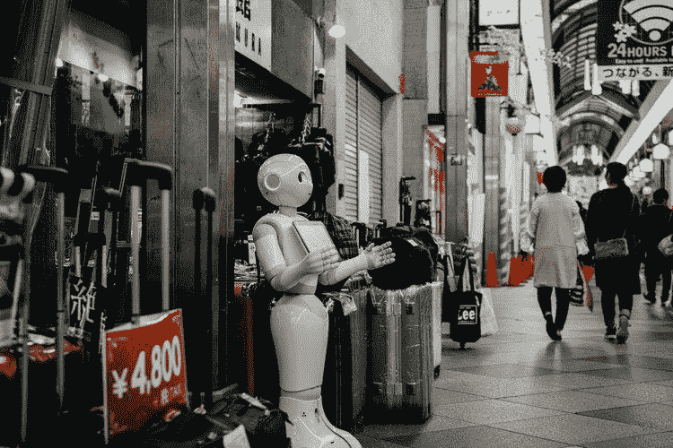

# 人工智能如何改变网络安全

> 原文：<https://medium.com/swlh/how-artificial-intelligence-is-changing-cyber-security-a243294ccdfe>

随着超过 15%的企业利用人工智能，人工智能是好是坏已经成为一个大辩论。虽然人工智能最初是在 1950 年创造的，但它在过去几年中已经出现了指数级增长，人们担心它将如何影响人类生活。关于人工智能方面的谣言四处流传。从索菲亚，机器人到 Alexa 吸引了人们的目光，让他们想知道这个领域将如何扭转局面。

Source- Unsplash

# 人工智能在网络安全中的作用——积极的一面

目前，人工智能已经进入医疗保健、制造、教育和网络安全等领域。网络安全是当今数字世界的主要关注点，人工智能的影响仍然存在不确定性。不仅是企业，政府部门也在试图掌握人工智能和机器学习来保护数据，并在各自领域创造更多机会。

随着人工智能的进步，许多公司已经开始将其作为对抗强大网络攻击和入侵的有力武器。人工智能允许你自动检测威胁和战斗，即使没有人类的参与。让您的数据保持前所未有的安全性。由于人工智能完全是机器语言驱动的，它保证你完全没有错误的网络安全服务。此外，公司也开始投入比以往更多的资源来推动人工智能驱动的技术。

Source- Unsplash

为了最大限度地利用人工智能，与正确的安全情报人员合作是对抗所有类型攻击的必要条件。恶意软件和病毒攻击在网络世界很常见。技术高超的黑客知道如何触发正确的攻击，不会让公司的网络部门知道发生了什么。AI 来拯救我们了。AI 让防守者保护和保持强大，即使面对一系列的攻击。

人工智能可能影响的另一个网络安全领域是密码保护和真实性检测系统。由于密码非常脆弱，AI 在这一部分实现了很多。这种安全系统的术语是生物特征登录。人工智能正被用于检测身体特征，如指纹、视网膜扫描等，使系统比以往任何时候都更加安全。

# 人工智能的另一面——错误的一面

但这并不是人工智能和网络安全的全部。

由于人工智能的大部分功能仍未被发现，其使用也存在漏洞。不仅仅是白帽黑客知道如何把人工智能作为盔甲，甚至还有黑帽黑客把它作为他们的武器。

黑帽人也开始探索人工智能如何成为他们的灵丹妙药。这意味着怀有错误意图的人也开始获得对人工智能的权威，使他们更加强大和熟练地完成他们的事情。他们已经开始开发黑客技术和方法，以对抗网络安全。

尽管各公司都有专门的网络安全小组，但老练的攻击者仍能找到破解这些漏洞的方法。

# 结论-

随着人工智能为企业和个人的安全部门增加价值，它也在错误的手中传播更多的权力。为了在不久的将来给 AI 更多的安全权限，我们需要确保它只属于白帽人。

虽然人工智能仍处于发展阶段，但还有很多东西需要探索。随着时间的推移，我们将能够把它归类为一个福音或一个祸害。

## 这篇文章发表在 [The Startup](https://medium.com/swlh) 上，这是 Medium 最大的创业刊物，有+368，366 人关注。

## 订阅接收[我们的头条](http://growthsupply.com/the-startup-newsletter/)。

