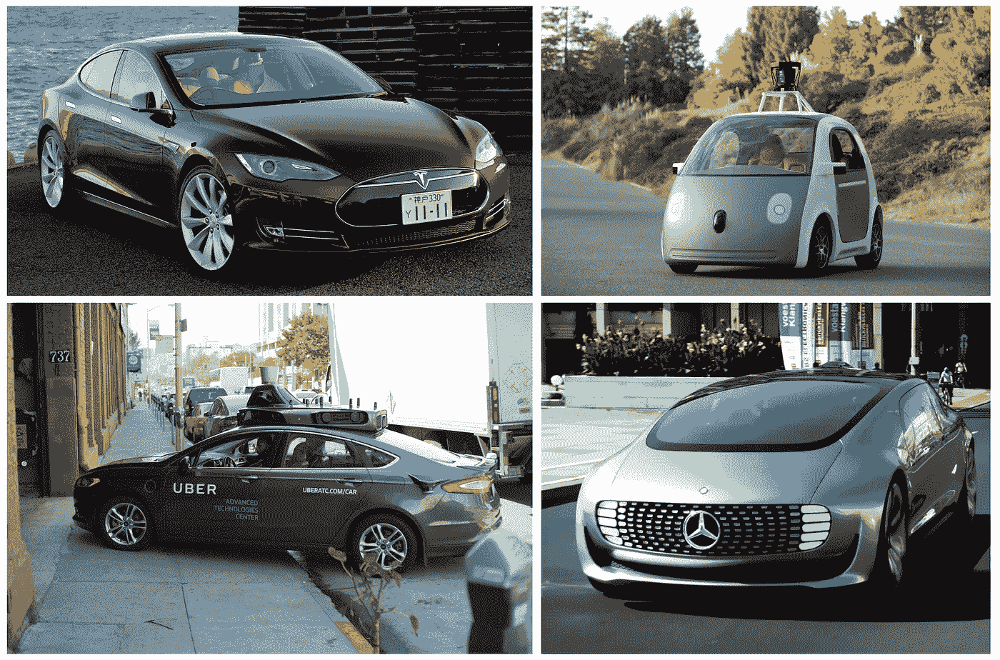
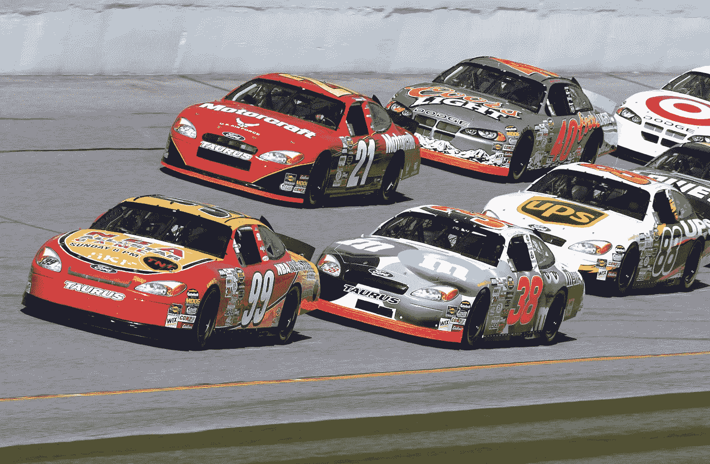

# 自动驾驶将如何改变我们的城市

> 原文：<https://medium.com/swlh/how-autonomous-driving-will-change-our-cities-4335cee7fbf1>

## 传统汽车拥有量在下降

你的通勤包括汽车吗？有可能，是的。74%在大都市工作的美国人开车上下班。其余时间，我们的汽车闲置着，等待我们需要它们的时间约占 95%，占据了大量的空间。在我们的城市中，大量的房地产专用于地面停车场、车库和路边停车位之间的闲置汽车。

当然，这一宝贵的不动产可以得到更好的利用，比如住房、就业机会或公共空间。但是，如何处理这些随时可能需要的汽车呢？我们真的需要它们吗？进入，自动驾驶汽车。

**Clockwise from top-left**: Tesla Model S, Google/Waymo self-driving car, the Mercedes F 015 Concept, and an Uber-LIDAR-retrofitted Ford Fusion

# 什么是自主？

当谈到 ADAS(高级驾驶辅助系统)支持的各个级别时，汽车工程师协会定义了六个自治级别:

*   **L0**——没有自动化:转向、刹车、油门，都由你这个人类控制
*   **L1**——特定功能自动化:例如自适应巡航控制
*   **L2** —综合功能自动化:这可能包括自适应巡航控制和车道保持技术
*   **L3** —有限自动驾驶:在特定的环境和交通条件下，无需人工干预
*   **L4**——人类——主要是可牺牲的:这款车可以在舒适的范围内处理驾驶的几乎所有方面，无论是城市环境，还是没有恶劣天气的任何地方，等等。
*   **L5** —人力完全可消耗:汽车可以处理任何和所有驾驶任务，无需人工干预，消除了对方向盘或踏板的需求

目前，我们能够获得的最佳自主能力位于第 2 级和第 3 级左右，许多新的豪华汽车可以处理高速公路驾驶和交通模式的变化，但在离开高速公路或应对恶劣天气时，需要依靠人工干预。

从硬件角度来看，当前的 Teslas 拥有实现更高级别自治所需的所有部分，唯一需要解决的领域是软件和基于策略的领域。自适应巡航控制和车道保持是目前新车中非常常见的功能。

当实现第五级自主时，许多关于使用汽车意味着什么的假设都可以抛之脑后。甚至汽车内部也已经成熟，可以进行创新，因为真正的自动驾驶可以让汽车成为移动办公室和娱乐中心，所有座位都指向中央“咖啡桌”的内部。

这可能看起来像什么的一个很好的例子可以在梅赛德斯-奔驰 F 015 概念车中看到，正如这个视频中的 [The Verge](https://www.theverge.com/2015/3/20/8263561/mercedes-benz-f-015-self-driving-video) 所展示的那样(这篇文章末尾来自梅赛德斯的更长的视频):

完全清楚地说，从技术角度来看，这是一个***何时*** 到达那里的问题，而不是***如果*** 到达那里的问题。这不是科幻小说。

# 拥有一辆汽车

有了一辆自动驾驶汽车，想象一下在你的办公楼门口下车，开车或被开车去上班。你不需要寻找停车位，而且因为你的车是自动驾驶的，所以你花了你的通勤时间处理一些电子邮件，支付账单，和一些朋友视频聊天。

现在你在工作，而不是让你的车在接下来的 8 个小时里闲置，它可以自己停在一个专门建造的车库里，那里的房地产更便宜。在这里，它可以在一天结束时为你充电。

记住汽车是自动驾驶的。它可以花一天时间在城市里开车，载人们从 A 点到 B 点，递送亚马逊包裹，等等。它可以成为城市“智能结构”的一部分，成为优步(Alibaba)和亚马逊(Amazon)等现有大型物流网络上的一个额外生产力节点。

你的车知道你什么时候完成工作，所以它永远不会让你等着被接走。会议提前结束了？还在做幻灯片吗？你的车知道你在做什么，并能相应地调整自己的日程。

你的汽车的这种日间活动意味着它可以有效地成为一种收入来源，有助于抵消其自身的维护、保险和能源成本。

这听起来不错，对吧？

如果你甚至不需要首先拥有一辆车来过这种生活呢？

# 不要拥有汽车

想象一下前面的场景，但如果你不是必须拥有未来昂贵、花哨的自动驾驶汽车，而是在交易的另一方，仅仅使用他人拥有的汽车出行，会怎么样？

它们可能属于个人(如前一个例子)，私人车队，或作为城市提供的“公共交通”。最终，作为用户，汽车来自哪里对你来说并不重要。

可以把这看作是优步和 Lyft 等城市交通公司的超高效“下一个转折点”。也许我仍然把我的车放在优步的平台上为我赚钱，但我可以在家看足球或做我的日常工作，而我的车在外面“在野外”代表我为优步和他们的用户工作。

作为一名自动拼车的用户，我看到的主要区别与我现在的乘车方式有关，这种方式保证是最有效的，同时运行一个更负担得起的标签，因为机器人不期望为他们的努力获得补偿。

这是事情变得真正有趣的地方。通过不拥有一辆车，我不必在我的生活中致力于一辆特定类型或种类的车。我可以根据需要预定一辆四门汽车，带着家人四处穿梭，但也可以很容易地叫一辆卡车去家得宝(Home Depot)，或一辆越野 SUV 去山里，或一辆苗条的敞篷车去约会。

由于没有汽车，这种平台实际上可以让我感觉我“拥有”许多不同的汽车！

# 城市的变化

那么，在我们的城市中，自动驾驶的概念对我们整体意味着什么呢？

想象一个每辆车都完全自主的城市。这对你有什么好处？

例如，拥堵会自动大幅下降，尤其是在高速公路上，汽车之间的跟随距离可以下降到接近零。今天，我们只是在开车时保持跟车距离，以防范其他司机的不可预测性，同时也考虑到我们自己反应慢的因素。

自动驾驶汽车的行为更可预测，具有更快的“反应时间”，甚至可以在一种 [P2P(点对点)网状网络](https://arstechnica.com/information-technology/2013/01/wireless-mesh-networks-at-65mph-linking-cars-to-prevent-crashes/)中相互同步数据，以提高效率。

这是[凯迪拉克](https://www.theverge.com/2017/3/9/14869110/cadillac-cts-sedan-v2v-communication-dsrc-gm)和其他公司已经在试验的东西，虽然当然为了实际工作，我们不能让通用汽车的 P2P 标准不能与德国汽车制造商的竞争 P2P 标准沟通和理解。

尤其是在高速时，这种“网状网络大篷车”的另一个主要好处(汽车以非常紧密的跟随距离聚集在一起，就像它们是一列火车的一部分)是通过更高的能源效率的形式实现的:[起草](https://en.wikipedia.org/wiki/Drafting_(aerodynamics))。起草通常用于自行车和赛车运动(纳斯卡等。)在不损失效率的情况下提高速度，并使对手更容易超车。

[Drafting at work](https://upload.wikimedia.org/wikipedia/commons/d/d6/NASCAR_practice.jpg)

不要过于简化，但绘图(也称为“滑流”)是由一个快速移动的实体(车辆，自行车等)成为可能。)在它后面形成一个空气更稀薄的口袋。在这种紧随其后的稀薄空气中，该空间中的任何其他车辆都不会面临像在其他情况下那样大的风阻力，因此可以用同样的力气获得更大的速度，或者用更少的力气保持同样的速度。这通常用于超越领头车辆。

牵引也有利于领头车辆，因为如果有另一辆车占据该空间，那么来自领头车辆后部的阻力被最小化。因此，大型车队相互牵引不仅占用道路空间更少，还能实现更高的燃油效率。

虽然 P2P 起草的汽车肯定会缓解通勤，但一旦进入城市，主要好处是不需要在高价值的房地产中停车。汽车可以全天活跃，运送人和货物。如果需求下降，一些汽车需要成为休闲资源，他们可以把自己停在城市边界外的一个大型停车场，在那里充电、清洗、维修等等。

现在我们收回了路边停车场、地面停车场和市内车库。这些区域可以成为公共空间、住宅、办公室和许多其他东西，以更大的方式提高生产力和幸福感，而不仅仅是为我们的车辆保留空间，试图优化它们，使它们尽可能靠近我们的办公室。

除了以牺牲其他空间为代价来避免方便停车的需要之外，你甚至需要标志和交通信号灯吗？

想象一下这样一个十字路口，但是没有明显的风险和人为错误的空间，因为所有车辆都是自动的，并且可以完美地实时通信:

*   想想这对拥挤的城市中的应急反应有什么作用:汽车能够像一大群金属鱼一样一致地离开救护车。
*   机场接送变得更加有效，因为车辆可以以最节省空间的方式安排自己，并根据他们要接送的人所在的准确 GPS 位置进行定位。
*   停车库可以变得更加拥挤，因为在这些自动车库中，人们将不会进出汽车，所以汽车之间不需要空间。再见，门叮当响！

当这一切在城市中进行时，郊区会发生什么呢？在汽车普及之前，许多人生活在拥挤的城市环境中，因为获得你需要的一切的唯一方法是让一切都在步行距离之内。随着汽车的出现，20 世纪中期，大量人口从这些城市中心向外辐射，开始了郊区化。

有了汽车，人们日常生活的范围大大扩大了，更便宜的房地产和仍然合理的通勤时间的吸引力是不可抗拒的。也就是说，直到通勤时间膨胀的速度超过了我们的高速公路能够容纳这种增长的速度。因此，这一趋势随后将钟摆摆回了另一边，大量的人现在选择离开漫长的通勤和昂贵的汽车，进入更昂贵的房地产，使他们能够更好地集中精力。也就是说，我们的人口中仍然有相当一部分人经历着“[极端通勤](https://www.nytimes.com/2017/07/21/realestate/extreme-commuting.html?mcubz=0&_r=0)”(NYT)，还有许多人仍然花费太多时间上下班，以至于他们无法将这些时间作为生产力来重复计算。

随着自动驾驶汽车以合理的价格水平上市(*总有一天*)，人们可以看到这将如何推动事情朝着郊区化的方向发展，或许还能缓解我们城市的过度拥挤压力。美国的大部分土地都是完全没有人的，它当然不会伤害我们扩展更多！

# 我们如何到达那里？(搭档起来！)

当谈到实现我们城市未来的愿景时，有许多星星需要对准，包括技术、商业和政策之间的巨大重叠领域。

总的来说，毫无疑问，相关技术不会成为实现这一更安全、更高效未来的瓶颈。事实上，[特斯拉声称](https://www.tesla.com/blog/all-tesla-cars-being-produced-now-have-full-self-driving-hardware)他们生产的每辆汽车都能够完全自主，需要赶上的只是可以在一夜之间通过 OTA(空中下载)更新的软件和监管政策(这肯定需要更多时间)。

在商业伙伴关系方面，已经有围绕彼此优势形成的联盟。例如，通用汽车[、Lyft 和 way mo](https://www.nytimes.com/2017/05/14/technology/lyft-waymo-self-driving-cars.html?mcubz=0)(Alphabet/谷歌家族)之间的三方合作非常有意义。Lyft 已经有了一个乘车共享网络，Waymo 已经围绕自动驾驶汽车进行了很长时间的研发，可以说他们首先开始了这场对话。但是，为什么是通用汽车呢？

使用中的汽车需要来自某个地方，谷歌或 Lyft 进入制造自己汽车的领域似乎是一种很好的努力吗？Lyft 不需要处理安全气囊的专业知识，也不需要与一个在过去 100 年里一直在 R&D 和汽车行业供应链关系中工作的组织合作。(当然，特斯拉正在内部做一切事情，但这就是为什么他们被认为是一家公司的特殊“独角兽”，特别是作为多年来唯一一家新出现的美国汽车制造商，一直坚持反对根深蒂固的现任者。)

今天，当你召唤一辆优步或 Lyft 时，来到你面前的车是司机所有(或租赁)的。如果我们将驱动因素从等式中移除，这将如何工作？如前所述，也许我个人拥有这辆车，并把它作为一种现代[旅行](https://www.getaround.com/)的平台。像优步和 Lyft 这样的公司不一定想要维护自己的车队。毕竟，他们的分布式模式让他们在没有一辆车的情况下也能如此成功，就像 Airbnb 是世界上最大的“连锁酒店”，却没有一间出租的房间。

不依赖于个人拥有的汽车，通用汽车可以在城市地区提供“种子车队”,并从共享网络的所有者那里获得财政回扣。这将使拼车初创公司不必担心车队的维护，这有助于通用汽车对冲由于部分由这些共享网络造成的汽车保有量下降而崩溃过时的风险。

有了足够的资金，城市也可以提供车队作为一种更昂贵的公共交通工具，但定价模式需要在地铁等现有基础设施蜘蛛网的情况下，不会导致资源过度拥挤。

这些自动驾驶汽车必须与各种现有的交通方式共存，作为补充，而不是替代，至少在短期内是如此。

# 故意提出会引起异议的见解以激起辩论的人

到目前为止，这一切描绘了一幅超高效城市乌托邦的画面，如果你对此感到怀疑，你可能是对的。

我之前提出的一个假设是，打开开关，想象一下如果城市里到处都是只有 T2 才有的自动驾驶汽车，我们能做些什么。当然，如果没有一段尴尬的过渡期，这不会马上发生。

这种转变必然是渐进的，同时技术会不断进步，变得更加经济实惠，监管也会适应这种变化。

我喜欢把这比作一百年前汽车首次出现并威胁到马的统治地位时的情况。你开始时，马匹和汽车试图共享道路，结果是混乱和许多可怕的车祸。

类似地，当我们朝着完全自主的方向努力时，将人类驾驶的汽车与机器驾驶的汽车混合在一起会在短期内产生更多的问题。例如，当你在一个停车标志前停下来时，你如何与另一个司机沟通，以确保你们都在做你们应该做的事情(因为相信每个人都了解适当的通行权礼仪是一个过分的要求)？这通常包括某种手势、共同的一瞥——一种共同的理解。

作为人类，我们能够传递并试图理解类似这样的模糊信号。自动驾驶汽车可能会很难读懂我们的意图(因此更谨慎)，而我们无法读懂它们的“意图”，因为没有意图——而是一组复杂的训练数据、[决策树](https://en.wikipedia.org/wiki/Decision_tree)等等。两辆自动驾驶汽车可以在十字路口共享**精确的**数据，并立即做出决定。因此，两辆自动驾驶汽车在十字路口肯定比两个人更有效，一个人和一辆自动驾驶汽车之间的协调是最低效的组合。

这种情况可以通过拥挤的城市中心要求车辆在城市范围内处于“自动模式”来缓解，但这当然假设每个人都可以使用具有这种功能的车辆。要求每个人都拥有一辆自动驾驶汽车在任何短期内都是负担不起或不合理的，但是**使用**自动驾驶确实可以商品化。

除了读懂彼此的“心思”，还有围绕安全和责任的巨大讨论。[电车问题](https://en.wikipedia.org/wiki/Trolley_problem)是一个经典的伦理思想实验，过程如下:

> 有一辆失控的电车沿着铁轨飞速行驶。前方的铁轨上，有五个人被绑着，无法动弹。电车径直朝他们开来。你站在离火车场有一段距离的地方，在一根杠杆旁边。如果你拉这个控制杆，电车就会转到另一组轨道上。然而，你注意到有一个人在旁边的轨道上。你有两个选择:
> 
> 1.什么都不做，电车撞死了主轨道上的五个人。
> 
> 2.拉动控制杆，将手推车转移到侧轨上，在那里它会杀死一个人。
> 
> 哪个选择最符合伦理？

你可以在自动驾驶汽车的背景下考虑电车问题，以及它们对行人意味着什么。例如，如果有人跳到你的自动驾驶汽车前面，它是否应该尽全力保护行人，或者如果急转弯意味着倾斜下桥，汽车是否应该继续前进并最终优先保护自己的乘客？

如果有很多行人而不是一个，这个计算会有什么变化？如果涉及到一个孩子呢？还是老年人？还是家庭宠物？如果你能检测到，你对野生动物的反应会不同于那些有微芯片的宠物吗？

如果这些是你作为车主可以设置和微调的偏好，这在道德上有多怪异和可怕？如果发生了什么事，你有责任吗？汽车制造商有责任吗？让您更改该设置的软件开发商有责任吗？告诉软件开发人员编写代码来启用这些设置的工程经理呢？

来自汽车的数据应该有助于解决这些问题，但如果认为这将适用于所有可能的情况，那就太天真了。特斯拉声称，在一名车主不负责任地使用他们的一辆汽车时死亡的案件中，他们被免除罪责，并引用了他们案件中汽车的记录数据。然而， [NTSB 认为特斯拉仍然要负部分责任](https://www.wired.com/story/tesla-ntsb-autopilot-crash-death/)，我个人觉得这开了一个危险的先例。如果由于非自动驾驶汽车发生事故而发生了可怕的事情，丰田是否仍然“负有部分责任”，因为他们生产的车辆允许某人达到最初导致事故的速度？

很自然，如果你可以退一步说，“如果这辆车是自动驾驶的，反应如此之快，难道不应该让它从一开始就避免陷入这种情况吗？”理想情况下，是的，但是在全球人口的大规模人类活动中，即使是最不可能的事件也几乎肯定会发生。

还有一些额外的因素需要记住，比如经济的二阶和三阶后果实际上是不可能预测的，无论结果是好是坏。城市的收入也严重依赖于与停车违规相关的费用和罚款，因此，为了让政策出台，围绕这类问题的疑问需要开始找到答案。

# 关闭

总会有对人类驾驶车辆的需求，但规模会有多大？由于这种基础设施破坏的回报对农村地区的影响较小，农用车辆和相关任务可能不会很快实现自动化。

尽管如此，在足够长的时间范围内，人类驾驶的汽车很可能会步马的后尘:

*   特定任务的特定工具
*   和在受控环境中娱乐的媒介(马的盛装舞步，汽车的赛道日)

我知道我不能代表每一个人，但是我绝对为这个未来的到来而欣喜若狂。波士顿咨询公司声称，到 2025 年，自动驾驶汽车将达到一定的复杂程度，价格将比其他相同的汽车高出约 1 万美元。尤其是在“所有权”的分布式、去中心化模式中，这绝对让足够多的城市人口能够获得可及的东西。

在过去的几个月里，我一直有写这篇文章的想法，直到最近才开始就这个话题动笔。这部分是因为我花了太多的时间在上下班交通中手动驾驶我的“笨”车，穿梭于那些做着完全相同的事情，燃烧着他们生命中的日子的人们之间。

## 额外资源

*   [a16z:建设中的社会——基础设施现代化](https://overcast.fm/+BlzF1eyDo)
*   副冲击:[链接](https://impact.vice.com/en_us/article/53vymk/impact-heres-what-the-future-of-city-planning-looks-like)
*   连线:[链接](https://www.wired.com/2016/10/heres-self-driving-cars-will-transform-city/)
*   遏制:[链接](https://www.curbed.com/2017/5/16/15644358/parking-real-estate-driverless-cars-urban-planning-development)
*   CityLab: [链接](https://www.citylab.com/life/2017/01/the-future-of-autonomous-vehicles-is-shared/512417/)
*   奔驰 F 015 概念:[视频](https://www.youtube.com/watch?v=KUu_M1hI0qE)

感谢阅读！

布莱克<[@ b _ t _ 沃尔什](https://twitter.com/b_t_walsh) >

## 这篇文章发表在《创业》(The Startup)杂志上，这是 Medium 针对企业家和初创公司的领先出版物。

# 在这里加入+12，417 名[获得头条新闻的人](http://growthsupply.com/the-startup-newsletter/)。

