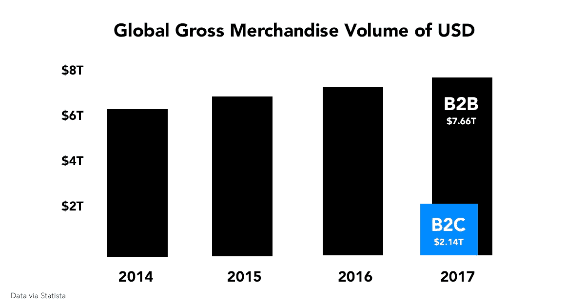
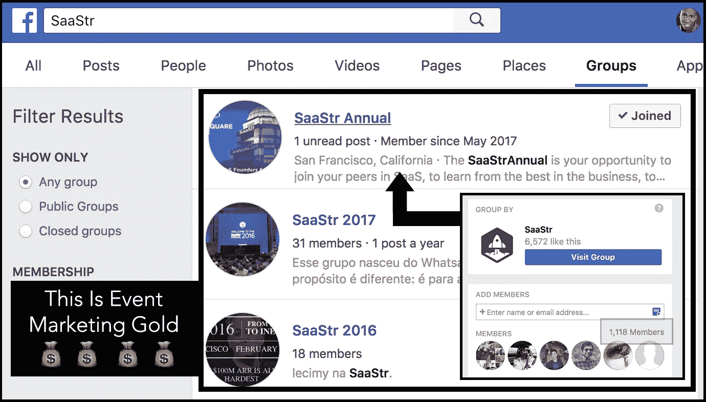
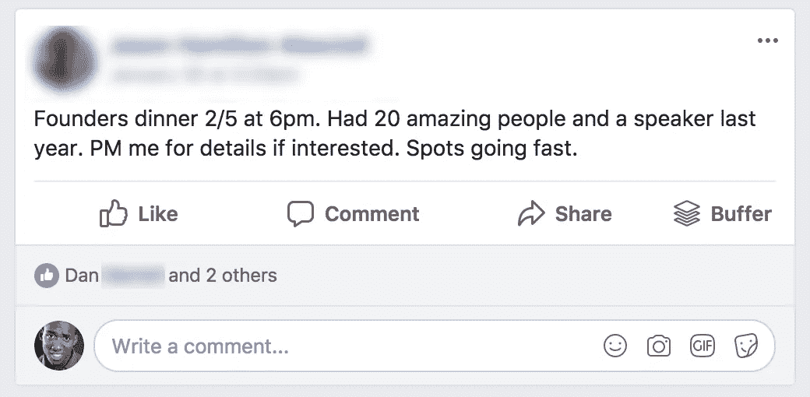
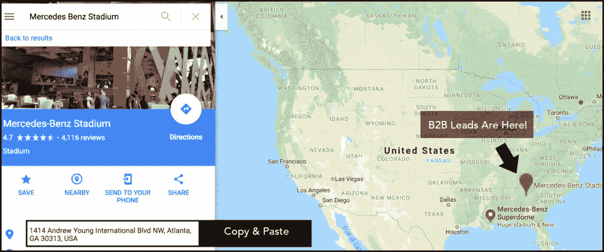
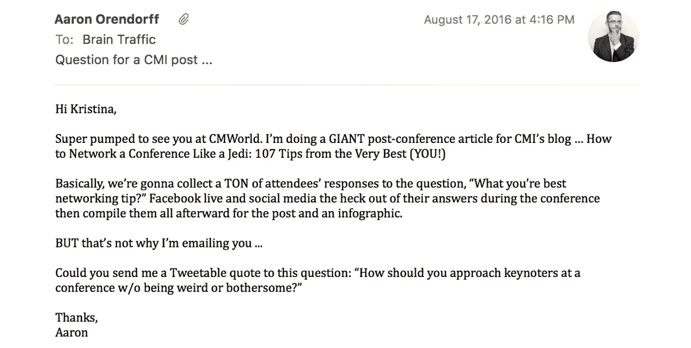
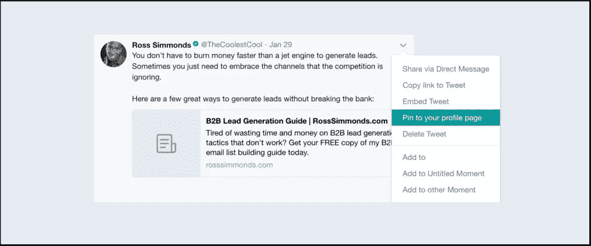
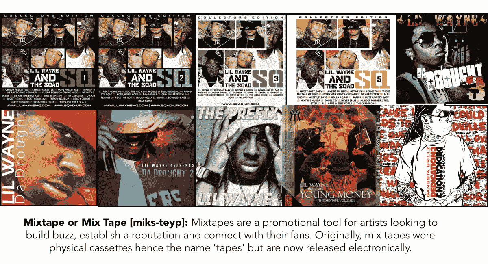
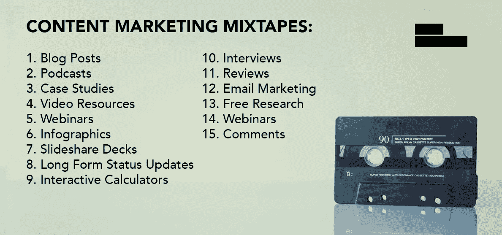
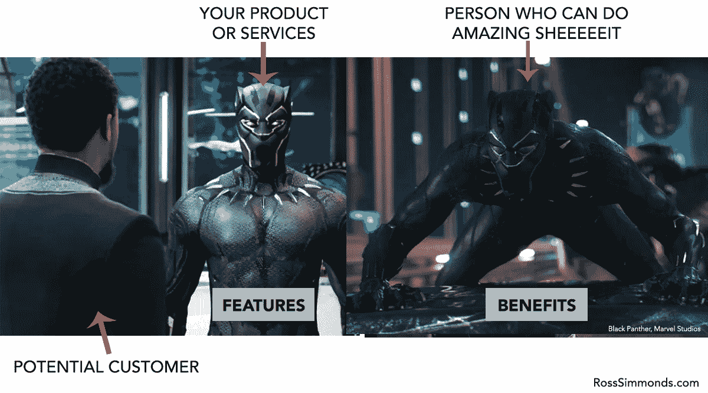
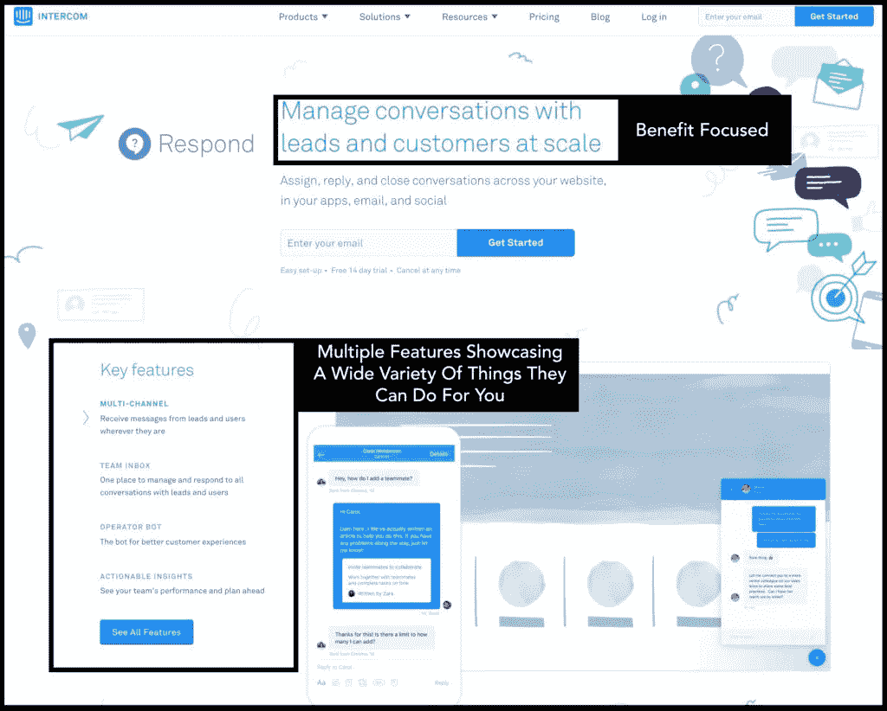

# B2B 营销团队如何通过内容营销创造更好的商机

> 原文：<https://medium.com/swlh/how-b2b-marketing-teams-can-generate-better-leads-through-content-marketing-5c6f342c7ce>

我们都知道 [B2B 销售线索挖掘](https://rosssimmonds.com/b2b-email-lists/)在帮助销售团队实现销售配额方面的重要性。这是一个简单的场景，许多 B2B 营销人员和专业销售人员对此进行了激烈的讨论:

没有线索。没有销售。

如果线索不多……成交率就会下降。

但是有好消息:

不一定要这样！

B2B 营销人员可以开始采取行动，提高他们的线索质量和这些线索的数量。在这篇文章中，我将向你展示如何吸引高质量的销售线索，在网上与他们建立信任，并确保你的 B2B 品牌(无论是服务还是产品)可以有一个稳固的渠道，你永远不会失眠，因为你不知道销售人员是否会在下一次公司会议上试图与你对抗。

这些是 B2B 品牌产生销售线索的最佳方式，也是确保营销和销售团队在季度末一起开一瓶唐培里侬香槟的万无一失的方法。

*让我们开始吧..*

# 如何在 B2B 中找到你的目标受众

任何优秀的 B2B 营销人员在发起营销活动之前首先要做的事情之一就是[确定他们的目标受众](https://foundationinc.co/lab/b2b-target-audience/)并尽可能地了解这个群体。确定 B2B 的目标受众比在 B2C 的情况下要困难一些。

你看，当谈到 B2C，购买决策过程通常要快得多，归结为一个人打电话。因此，你可以了解这个人的个人痛点，并专注于这些痛点。

不幸的是，当我们开始考虑 B2B 时，事情就没那么简单了。

对于大多数 B2B 购买，我们不是在谈论 20 美元的 t 恤或 6 美元的手机壳(除非是散装的)。B2B 中发生的大多数交易都有一个较大的平均购物车，可以被视为大宗采购。以下是 2017 年 [B2B 电子商务与 B2C 电子商务之间的资金流量差异](https://www.shopify.com/enterprise/b2b-ecommerce-how-the-best-in-b2b-sales-succeed-online):

关于 B2B 的事情是这样的:

在许多情况下，这些采购需要组织内多个级别的认可。不仅仅是高级营销人员批准你的项目，采购、数字副总裁和首席技术官都对交易有影响。

因此，准确地找出谁是你的观众可能有点挑战性！

正因如此，[基于账户的销售](https://blog.hubspot.com/sales/account-based-sales)在 B2B 品牌、营销人员和销售人员中变得相当流行。基于客户的销售(ABS)是指你实施销售和营销努力，通过多种渠道产生多个接触点，并通过技术和数据在整个公司范围内进行协调，而不是试图向组织中的一个人进行销售。

你看，不仅仅是针对你喜欢与之合作的金融科技公司的首席执行官艾莉雅，你还会针对你以前在旧公司共事的 CMO·艾琳、首席财务官詹姆斯、首席技术官艾丽西娅和高级营销人员乔希。你接触詹姆斯的方式可能与接触艾琳或乔什的方式不同。

这就是为什么跟踪各种接触点如此重要，它们是如何发生的，并使用这些数据来更好地了解他们想要什么类型的内容，他们希望如何接收它，以及他们是否已经做好足够的准备来接受你的推销。

这就是内部数据的作用。

内部数据将帮助你更好地理解你首先应该与谁交谈。首先，你应该看看谁是你最好的客户:

*   哪些客户认为你的产品或服务最有价值？
*   你给过哪些客户最大的价值？
*   你的团队喜欢为哪些客户服务？
*   哪些客户给你的爱最多？一

创建一个列表。

然后拿着这份名单，开始寻找处于相似行业、规模相似、问题相似的公司。通过这些数据，你会找到你的目标受众，一旦你找到了，就该开始把你的受众变成顾客了。

我坚信:

[**内容智能**](https://foundationinc.co/lab/ontent-intelligence-every-marketer-know/) **+内容工匠精神=内容卓越。**

没有足够多的人花时间研究他们的观众，以了解他们想要的内容。没有足够的人花足够的时间与他们的客户交谈，以了解他们的痛苦。但正是在这种情报提取过程中，品牌和营销人员能够释放出有价值的洞察力。

# 如何利用内容营销让 B2B 事件发挥作用

大多数行业都有一些商业会议，这些会议的目标受众都在同一屋檐下。许多人普遍认为，在活动中推广你的品牌只有四种不同的方式:

*   在会议上发言时
*   在会议上赞助活动
*   在会议上设立展位
*   在会议上握手

不要误会我的意思:

所有这些想法都可行。

事实上，我已经公开声明，我认为[公开演讲是 B2B 品牌产生潜在客户的最佳方式之一](https://inbound.org/blog/one-of-the-best-ways-agencies-freelancers-can-land-clients-without-referrals)

但我在这里告诉你，他们不是唯一的方法。最优秀的营销人员明白，在会议上创造销售线索可以是创造性的、战略性的。这里有一些简单的想法，可以帮助你在不做上述任何事情的情况下，让你的下一个活动成功…

# 脸书集团如何帮助 B2B 营销人员创造商机

如果你要参加一个有 1000 多人参加的活动，并且正在寻找潜在客户，建立一个脸书小组或者加入一个现有的小组是与合适的人联系的好方法。

你可以使用脸书群回答问题、分享内容、建立关系，甚至安排一些独特的事情，如*周日晨跑*或*在镇上为想要观看重大比赛的足球迷*安排会面。

当你在寻找一个脸书组织时，只需在搜索栏中输入会议名称，你就会看到以下结果:

在上面的搜索中，我在寻找与流行的软件即服务大会 [SaaStr](https://www.saastr.com/) 相关的脸书团体。快速搜索显示，有一个官方的“SaaStr”组，以及 2016 年和 2017 年的几个组。

加入 SaaStr 年度小组后，我发现它属于 SaaStr 团队，有 1100 多名成员。在这个团队中，你有机会创造机会或利用现有的机会。这是一个机会的例子:

您可以伸出手来参加这个活动或采取主动，创造自己的！

# 如何在活动中使用基于位置的广告来产生销售线索

你知道你想联系的人会参加这个活动，为什么不利用他们的位置呢？假设有一群潜在的 B2B 领导参加了在亚特兰大梅赛德斯奔驰体育场举办的会议。

你从谷歌搜索会议的确切地址开始:

在此基础上，创建受众时，您需要将该地址复制并粘贴到脸书广告管理器的“位置”部分:

现在，您已经添加了您的地址，并在地图上找到了一个大头针，一切都准备好了！确保你与大头针的距离保持在一两英里之内，而不是十英里或更远，这样你就知道你已经接近了你的观众。

## 如何让你的地理广告伟大

没有人喜欢为了花钱而花钱！

因此，建议你尽量确保你的广告尽可能相关。你知道你的观众正在参加一个活动，所以与其用一个模糊的广告来宣传你的内容，不如具体一点。这样做，增加了你的广告只被参加活动的人点击的可能性，一种方法是在文案中引用会议。使用这样的模板:

您是否参加[会议名称]？
我们的团队也来了！我们给所有与会者一份关于[主题]的免费报告。

这种方法允许那些没有参加会议但碰巧看到你的广告的人自我识别，不会因此而点击。

# 如何创建以事件为中心的内容并产生销售线索

如果有成千上万的人来到一个新城市参加一个会议，建立知名度的最简单的方法之一就是制作关于这个活动的精彩内容。我见过的最好的例子之一来自[亚伦·奥伦多夫](http://iconicontent.com/)和[娜迪亚·库拉](https://thisisnadya.com/)的，他们[接管了一个内容丰富的会议](http://iconicontent.com/blog/how-to-attend-a-conference-and-take-it-over/)。从大量的综述文章和信息图表，到个性化的视频和一对一的采访，他们做到了。

Nadya 和 Aaron 采用的我最喜欢的策略之一是创建一个大规模的综合帖子，其中包括活动中的发言者。这篇文章被制成了信息图，标题是:[如何在会议上与有影响力的人建立联系的 26 条头条新闻【信息图】](https://venngage.com/blog/connect-with-influencers-conference/)。为了让这篇大文章变得生动，他们从一个电子表格开始，编制了一份分组讨论和头条发言人的名单:

一旦名单制定出来，他们就开始联系名单上他们已经认识的人，并联系相互间的关系进行介绍。

以下是 Aaron 在与演讲者进行沟通时使用的确切电子邮件:

在这里，他整理了答案，并与 Nadya 一起创作了一段内容，以引起演讲者和活动参与者的注意。

# 如何在活动中使用社交媒体来创造商机

今天的大多数会议都有一个相关的标签，与会者可以用它来相互交流。如果你正在寻找通过事件产生潜在客户的方法，花点时间使用标签与人们互动。

当你通过社交媒体参与时，更多的人会访问你的个人资料来了解你和你的企业。作为利用这一点的一种方式，您可以使用 Twitter 上的“pin”功能将可下载资源锁定到您的 Twitter 帐户。为此，你需要发布一条推文，点击箭头，然后按“锁定至个人资料”:

当人们开始注意到你并访问你的帐户时，他们会在顶部看到这条推文。

在活动中自动参与的最简单方法之一是使用类似于 [Narrow.io](http://narrow.io/) 的工具。你可以将会议标签直接上传到 Narrow，它会自动“喜欢”包含会议标签的推文。

# 为什么应该创建事后内容资源

一旦活动全部结束，创建一个大规模的资源，分解你从各种会谈中获得的关键收获和教训。包括演讲者在他们的演讲中引用的链接以及演讲者在过去创建的可能有用的任何资源。向人们要他们的电子邮件来获取资源，但是要把 PDF 发给所有的演讲者，让他们分享你的页面。

如果你在下一次行业会议上采用这些策略，我相信你会看到结果。毫无疑问，这些想法都需要一点时间和努力，但如果你能够产生一个一致的和高质量的线索流，它肯定可以在短短几周内收回成本。

# 创作更多 B2B 混音带，发行更少专辑

在过去的三十年里，混音带对北美文化产生了巨大的影响。mixtapes 的兴起始于 20 世纪 80 年代，在 90 年代和 21 世纪初开始腾飞，当时艺术家们开始使用 mixtapes 建立他们最初的粉丝群，并最终利用他们的第一张录音室专辑和音乐巡演来推动他们的职业生涯。

发布混音带的想法很简单:

给你的听众带来价值，[用不同的声音做实验](https://rosssimmonds.com/content-experiments/)，了解他们喜欢什么，并给他们更多。大多数混音带都是免费发行的，在聚会上、音乐会上、街上或学校里免费赠送或廉价出售。正是这种原始的发行形式让许多艺术家和 DJ 有机会大放异彩，并最终成为家喻户晓的名字。

当大多数营销人员考虑产生潜在客户时，立即想到的是他们需要建立一个带有门控内容的登录页面，并要求访问者提供个人信息以交换内容。这些封闭的形式就像艺术家发行的专辑，要求他们的粉丝付费购买。但是你从一个你从未听说过的艺术家那里购买专辑的可能性有多大呢？

很渺茫。

这就是为什么我认为更多的企业需要投资发行混音带。

换句话说，对企业来说，免费向受众提供有价值的内容并获得信任非常重要，因此当他们要求粉丝发送电子邮件时，不要犹豫。这些是我所说的内容营销混合磁带:

所有这些都可以免费赠送给你的受众，让他们有足够的价值来欣赏你的业务，并建立对你的业务的信任感。

# B2B 的特点和好处有什么区别？

如果你是营销人员，这可能会让你吃惊，但是…

特征很重要。

我们都听说过这样一句话:卖的是好处，不是功能！

我明白了。

好处是吸引我们观众注意力的东西，但这并不意味着你应该从你的定价页面上抹去你提供的所有功能。如果你不能 100%确定这两者的区别，这个视频可能会有所帮助:

在上面的例子中，特征是贯穿整个服装的防弹材料和嵌入手套的金属爪。对于一些公司来说，功能是指屏幕的大小、硬盘的容量、外套的材质，或者将一种服务与另一种服务集成的能力。

虽然这些功能令人兴奋，可能值得投资，但真正吸引潜在买家注意力的是这些功能的效果。它是一种能力，能够在子弹射向你的时候幸存下来，飞向空中并四肢着地，提高生产力，完成更多交易，吸引更多线索，听更多音乐，保持健康，减轻背痛，省钱，等等等等… 好处回答问题:

*我为什么要关心…？*

关键是要认识到，是你的受众真正决定了什么时候一个功能对他们来说是重要的，什么时候一个好处对他们来说是重要的。在大多数情况下，这取决于他们在购买周期中所处的阶段，或者他们对你的产品和竞争对手的熟悉程度。如果有人处于早期研究阶段，主要的好处可能是最重要的信息，但如果有人已经研究你的产品和竞争对手数周，它的功能可能会完成交易。

在这个行业中，大多数产品之间的优势是相同的，这些特性可能会在某人的决策中发挥作用。如果有人非常熟悉你的竞争对手，并且知道他们缺少什么功能，这些功能可以在从他们转向你的过程中发挥作用。在两个非常相似的产品之间做出选择，这个选择可以归结为特性。

Intercom 网站是一个突出总体优势和多种功能的网站示例:

优势放在页面的开头，以便立即传达该服务提供的价值。类似于黑豹的例子，它清楚地传达了通过注册他们的服务，你的生活会变得更好。如果您仍未被说服并需要更多信息，关键功能可以进一步展示此服务可以提供的价值，并在与其他产品进行比较时使用。

许多 B2B 品牌犯了这样的错误，要么是太受利益驱动(没有围绕你实际做什么描绘出清晰的画面)，要么是太受功能驱动(与导致决策的激励因素无关)。因此，当你为你的网站、产品页面、电子邮件推介和网络研讨会制作内容时，想想好处和功能在制作一个好故事中扮演的角色。

# 包装东西

所以你有它…

这就是我对 B2B 营销的看法(或者至少是我对这个话题的一些想法)。如果你和我一样，可以花几个小时研究营销在 B2B 循环中的重要作用，我想你会喜欢我的其他一些帖子。

如果你已经做到这一步，你可能会厌倦阅读，所以我整理了一个 PDF 文件，你可以下载，以后再回来。这是我的一些最佳建议和 B2B 营销人员在讲述他们的故事时最常犯的一些错误的汇编:

[**下载我生成 B2B 销售线索的备忘单**](https://rosssimmonds.com/listbuilding)

让我知道你的想法，我很想听听你对下面这篇文章的看法！你以前尝试过这里列出的 B2B 想法吗？

## 这篇文章发表在 [The Startup](https://medium.com/swlh) 上，这是 Medium 最大的创业刊物，有 306，472+人关注。

## 订阅接收[我们的头条新闻](http://growthsupply.com/the-startup-newsletter/)。

