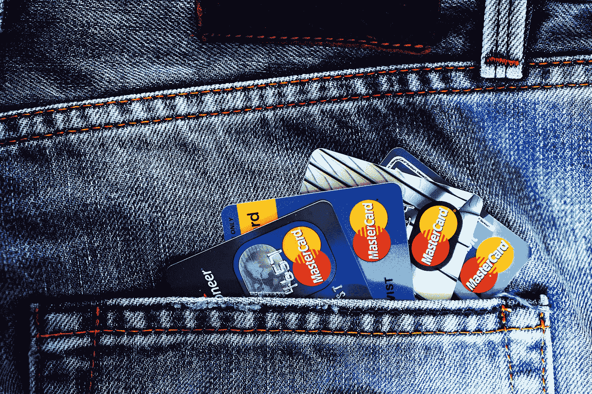

# 不良信用会毁掉你的社交生活

> 原文：<https://medium.com/swlh/how-bad-credit-can-ruin-your-social-life-26fd07dfde05>

**金钱万能。负债累累，在信贷方面过度扩张，真的会让你的社交生活和个人生活一团糟。**

**

*Photo Credit: [TheDigitalWay](https://pixabay.com/en/users/TheDigitalWay-3008341/)*

*根据华威大学发表的一项研究结果，背负更多债务的人更有可能患精神疾病:*

> *人们负债越多，就越有可能…*