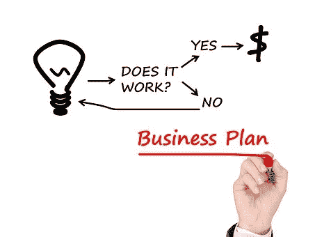

# 成为一名企业家如何帮助你提高适应能力

> 原文：<https://medium.com/swlh/how-being-an-entrepreneur-helps-you-improve-your-resilience-c27e786bfb9c>

这篇论文首先证明了成为一名企业家如何不可避免地有助于提高你的适应力和培养你内心的战斗精神。

虽然这种说法可能看起来有点夸张，但它远非如此:当谈到看待事物的本质时，尤其是在一个成为企业家或创业者似乎是通往天堂的时代，我觉得提出一个不像童话故事而是日常斗争的证词可能是有用的。

就我而言，我会从一切开始的地方开始。

很明显，某天早上醒来时我并没有这个想法。我在找工作的时候想到的。我在很多求职网站上都开了账户，我不断收到与我的职业经历完全无关的工作邀请。

这种情况一直发生，直到决定性的一天到来，我收到了工作邀请:据说与我的资料 100%匹配。坦白地说，这份工作看起来像是一个笑话，事实上，我认为这是一个笑话。我也很生气，因为有问题的就业委员会也提供付费解决方案来获得更好的服务。算法和六位数筹款的结合最终导致了一个完全不起作用的系统！

我说过我会诚实的，这就是为什么以及这一切是如何开始的！

## 所以，你会问吗？

在一位编码专家的帮助下，我们开发了**我们的**算法，并聚集了我们所有的一切(积蓄和一点爱心款)来启动我们的网站。我们花了几个月的时间联系并说服合作伙伴与我们达成协议，解释他们将如何从与我们公司的合作中获益。我们总共花了一年时间。

## 那么弹性呢:

我向来自 le Emploi 数字开发团队的一组专家介绍了我的计划。我的项目未能满足他们的要求:因为缺乏商业模式而未被接受！

我解释了我的分析:失业人数越多，解决方案、平台和求职公告板的数量就越多。这与爱情邂逅市场有着相同的完美关联:单身者越多，约会网站、平台/网络/移动应用的数量就越大，针对青少年、成年人、富人和美女、不那么富有和不那么漂亮的人、老年人和第三年龄层的市场空间也越大…

## 勇士精神？

勇士精神来了:当没有人指望你有任何主动性或想法来应对我们法国 2 位数的失业率时，然而你最终找到了一个解决方案，可以帮助填补我们数百万求职者和数十万仍未提供的工作机会之间的差距。

不用说，如果除了昂贵的沟通策略之外，你没有适当的经济支持，你被认为是可靠或值得信任的机会就会大大降低。

再说一遍，勇士精神:因为你仍然相信你的行动，你站在你的目标旁边；你继续坚持下去，相信你会提高人们对你迄今所做的事情的兴趣，不仅达到零欧元筹款的创纪录水平，而且与奖牌相反，没有现金收入的创纪录水平也是一样的。

相信我，在你开始任何事情之前，你最好确保你的精神状态足够强大，足以应对和克服逆境。

我欢迎对本文的任何评论和贡献，我真诚地希望这将有所帮助。

## 这篇文章发表在 [The Startup](https://medium.com/swlh) 上，这是 Medium 最大的创业刊物，有 277，446+人关注。

## 订阅接收[我们的头条](http://growthsupply.com/the-startup-newsletter/)。

