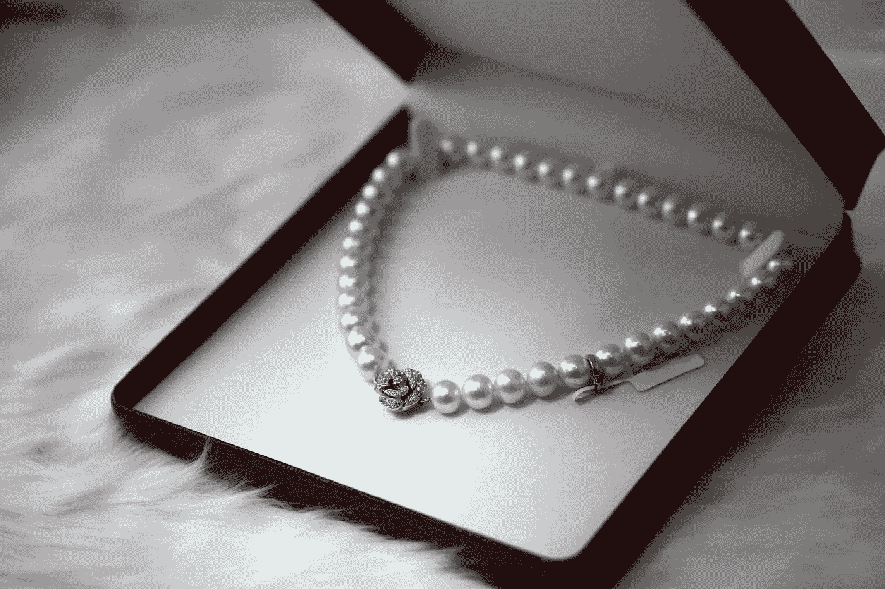

# 脆弱如何帮助你建立忠诚的追随者

> 原文：<https://medium.com/swlh/how-being-vulnerable-helps-you-build-a-loyal-following-ad129c30aa5e>

## 引起共鸣的写作秘方

Photo by Sydney Sims via Unsplash

最近看了电影[我只能想象](http://icanonlyimagine.com/)。

在那部电影的中间，当主角巴特·米勒德准备放弃并远离他成为全职音乐家的梦想时，我恍然大悟。

你可以在这里阅读整个故事。

 [## 如何发自内心地写作，改变世界

### 精心制作只有你能分享的信息

writingcooperative.com](https://writingcooperative.com/how-to-write-from-the-heart-and-change-the-world-6e8355d02bc5) 

# 我的顿悟，第二部分

从你最深的痛苦中写作是很难的。

与他人分享甚至更难，如果不是看起来不可能的话。

> 为什么我们不愿意分享伤害？大声抱怨生活多么不公平是一回事。深入了解你的绝望、失望和沮丧，并与世界分享，则完全是另一回事。

**如果你能残酷地对自己诚实，你就能在痛苦中找到一些金子。**

牡蛎制造珍珠来保护自己免受痛苦。这一切都始于一个不受欢迎的入侵者，就像一粒沙子，进入牡蛎柔软的内部。为了反击，牡蛎在沙子上覆盖了一层又一层的珍珠层。

*如果你不知道的话，珍珠质是它们的贝壳的原料。*

牡蛎养殖者通过有目的地将沙粒注入牡蛎壳来制造珍珠，根据命令激活珍珠。

我是说你应该故意激活自己的痛苦吗？

不完全是。

我是说，当痛苦来临时——它会的——你应该立即找到痛苦正在你体内形成的珍珠。

Photo by Cornelia Ng via Unsplash

# 为什么我们不制造珍珠

充分利用你的痛苦是不自然的。

> 人们很自然会逃避它，并尽一切努力让它消失。当有人不断用针扎你的时候，你不会站在那里接受吧？

当然不是。

**正视自己的痛苦需要勇气。**

*分享* *it* 需要一点胆识。原因是我们不得不反对一些我们为了生命而坚持的强有力的假设。

## 当我们分享我们的痛苦时，我们觉得我们在公共场合是裸体的。

当我们感到暴露时，我们就失去了安全感。

我们可以花很多精力隐藏自己的黑暗面。如果没人看到我们的缺点，那么他们会更喜欢我们。

也许他们甚至会认为我们已经准备好了。

至少我们不会冒险在朋友面前尴尬，更糟的是，在陌生人面前尴尬。

## 我们通过保守秘密来避免的羞愧是强大的。

羞耻是残酷的。

> 它会把原本美好的一天变成最糟糕的一天。它甚至可以改变我们一周、一年甚至余生的进程。

难怪我们像躲避瘟疫一样躲避它。

如果你从来不碰炉子，你就不会被烧伤。

如果你从不冒险，你就不会被杀死。

如果你从不承诺任何事，你也不会失望。

Photo by Ben White via Unsplash

## 我们害怕人们不再和我们说话。

当你揭露一些黑暗和潜在可耻的事情时，你会发现谁才是你真正的朋友。

那些告诉你他们理解并同情你的人是你真正的朋友。

那些感到震惊并突然不接你电话的人不是你的朋友。

问题是你不能确定谁会做什么。

所以你坐在你的秘密上，让它摧毁你的内心。

> 现在让我们来看看一种更好的与人交流的方式。

# 当你脆弱的时候，人们会和你看法一致。

古鲁站在高高的平台上。我们尊敬他们所说的一切，因为它听起来像是出自上帝之口。

如果你把他们的话刻在墙上，我们会把它变成一座国家纪念碑。

> 事实是古鲁就像你我一样。他们一次把裤子穿在一条腿上(假设他们穿裤子)。他们和你呼吸同样的空气。他们被刺的时候会像你一样自由流血。

唯一的区别是他们已经组织好了他们所知道的，并且能够以一种令人信服的方式呈现出来。

古鲁可以得到交通罚单。他们的配偶可以离开他们。如果他们忘记了一个约会，就像你和我错过了一个约会一样不体贴。

**如果人们尊敬你，与他们分享你的缺点。告诉他们你曾经做过的蠢事。并且让他们知道，有时候你会害怕，会怀疑，会挣扎着坚持下去。**

然后会发生什么？你的追随者将会看到他们在做你建议的事情。他们会知道你和他们一样是人。不管怎样，他们还是会尊敬你的！

Photo by Lina Trochez via Unsplash

# 当你分享一个秘密时，它就失去了力量。

当我们隐藏自己的脏乱时，我们会花费大量的精力去伪装。

它甚至可能会工作一段时间。

问题是当你背负着这个世界的重量时，你会感到疲倦。精心打造的完美外表开始破裂。然后你的烂摊子就会泄露给所有人看。

拥有你的烂摊子。尽你所能处理好这件事。请不要告诉别人你什么都有，当你没有的时候。

你的心会感谢你的。

# 你的故事让不可能变得可能。

每个好故事都是从奋斗开始的。

> 冲突是让你粘在剧院座位上的原因。主人公会找到走出洞穴的路吗？他能在不出卖灵魂或不被杀死的情况下击败死敌的军队吗？他会找到一个能指引他回家的导师吗？

我们*必须*知道这些问题的答案。如果一个故事没有要求他们，我们最终会花 14 美元在一个又大又黑的房间里睡两个小时。

与读者分享你的奋斗历程。很可能至少他们中的一些人自己正在经历同样的事情。你的故事可以给他们希望，让他们打好这场仗，赢得胜利。

# 你的写作将会改变

当你对自己和你的读者诚实时，你的作品会比以往任何时候都更吸引人。

这将是一个指甲里有泥土的人写的粗俗的东西。

> 这些都不会是理论。你的话将在生命的熔炉中锻造。你的真理将通过考验，磨难和折磨。你会知道你相信什么，并且一分钟都不会怀疑。

为什么？

因为你经历过。

# 现在做这个

找一个你信任的人，分享一个秘密。如果那个人是真正的朋友，他们也会和你分享一个。

我的朋友，这将会打开阻碍你的天才的大门。

今天就做，明天你会成为更好的作家。

喜欢你刚刚读的吗？鼓掌直到手心疼。把这个分享给你所有的朋友。订阅关于如何吸引读者、推销你的想法和建立你的部落的建议！

## 这个故事发表在[的创业](https://medium.com/swlh)上，这是 Medium 最大的创业刊物，有 329，974+人关注。

## 订阅接收[我们的头条新闻](http://growthsupply.com/the-startup-newsletter/)。

