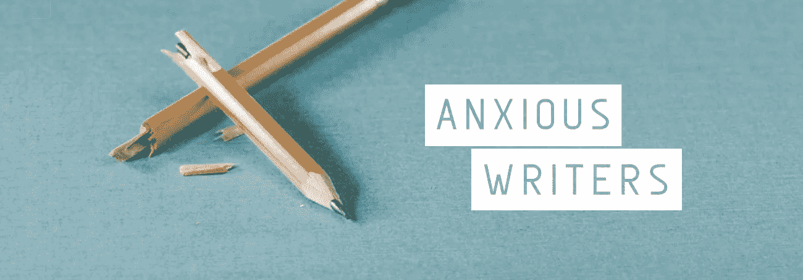

# 艺术中的脆弱是通往自由的道路

> 原文：<https://medium.com/swlh/how-being-vulnerable-in-your-art-can-be-the-path-to-freedom-46547c686199>

亲爱的作家同事:

我知道你害怕。

我知道你怀疑这是否值得开始。

也许你认为其他人以前也写过这样的东西，而且写得更好。

你可以确信你会被拒绝。

可能你认为你的故事很烂，没人会感兴趣。

或者你想知道你是否真的能够公正地对待你迫切想要分享的信息。

你是一个作家，曾经经历过一个或多个这些，或类似的事情吗？我想是的。我是怎么知道的？因为我经历过。很多次。

我已经出版了 5 本书，被成千上万的人阅读，当我开始写作时，我仍然有这种感觉。

我有更多的书的想法要写，我可能也会有这种焦虑。但是在这 5 本书的过程中，我学到的是，有可能有这些焦虑——但仍然可以突破并创造出你天生适合的作品。

写一本书，一篇博客，一首诗——无论你在写什么——这都是*的勇敢行为*。你让自己变得脆弱。你在和世界分享你自己的一部分。

在许多方面，写点东西然后出版，就像把你的心从你的身体里拿出来展示给人们看。

克服我们的写作焦虑，类似于必须鼓起勇气去面对脆弱。

> 如果你对你的艺术感到焦虑或恐惧，你并不孤单。

事实上，大多数作家内心深处对自己的作品感到不安全和焦虑。

问题是，我们有勇气写出我们的故事并与世界分享吗？

# 一起冲破恐惧

放弃是很容易的。说真的，我考虑过好几次了，甚至是最近。如果人们要拒绝我的作品，为什么要烦恼呢——因为如果他们拒绝我的作品，他们就拒绝了我。对吗？

而这正是我们需要降服自己，改变心态的地方。

我从自己对写作的焦虑和不安全感中学到的是，我们需要停止用我们所做的事情来定义我们的价值，并认识到我们有价值，因为我们活着。

我们的故事，我们的话语的价值，不是由其他任何人来定义的。我们的文字有价值，因为是我们写的。

这是突破漏洞障碍的关键。当我们通过我们是谁而不是我们做了什么来定义我们的价值时，我们可以放手，可以自由地冒险，自由地失败。

因为我们都有失败。那是生活的一部分。但这并不意味着我们是一个失败者。

脆弱永远是可怕的。我们的工作总会有不安全感。我们正在与世界分享我们的一部分——这并不容易。如果我们的工作不像我们希望的那样好，就会有悲伤。

我推出的一本书没有我希望的那么好，尽管我相信它的出版是一个成功，但我仍然为它有限的成功感到悲伤。

但我为这一失败感到难过——我把注意力集中在相对较少的读者发来的电子邮件和信息上，告诉我这对他们产生了多大的影响

最终，这些对我来说比销售数字更有意义。

我最终选择相信自己是成功的，因为这本书已经出版了。这让我摆脱了恐惧和焦虑的控制，并让我庆祝这本书出版的成就

我是说，别人有更多的资历或者追随者又怎么样？这并没有让他们的故事更有价值。你的故事是你的故事。它有价值，因为它是你的。

> 我们可能有相似的想法——但我们从未在**你的**声音中听到过。

就像我说的，我仍然对我的写作没有安全感。脆弱还是很可怕的。但我学到的是你可以克服你的恐惧。你可以学会管理它们，并从它们的力量中解脱出来。让他们坐在车后座，而不是让他们当司机。

把你的价值和你的故事的价值从回应中分离出来的决定，给了你足够的勇气去和世界分享你的作品。一旦你做到了，你就成功了。无论结果如何。我也希望你能这样。

我现在做的是帮助别人讲述他们的故事。我和有故事可分享的作家一起工作，帮助他们克服恐惧。我帮助作者将他们的创意提炼为一个清晰、简单的计划和大纲，并使整个过程不那么令人难以承受。

在他们与世界分享他们的故事的过程中，我一直陪伴着他们，为他们提供鼓励、支持和实际帮助。

我这么做只是因为我从根本上相信**我们所有的故事都很重要，因为**我们所有人都很重要。所以我们不应该让恐惧控制我们，而是要学会放手，愿意脆弱。****

我知道还有像我一样的作家，被焦虑和恐惧弄得步履蹒跚。我知道我想和他们联系，建立社区，为像我一样的人创建一个支持网络——这样我们就不会孤单了。

而这就成了[焦虑的编剧](https://www.facebook.com/groups/anxiouswriters/)。这是一个为在生活和工作中挣扎在极度恐惧和焦虑中的作家提供的在线空间。一个私密、自由、安全的空间，让你在旅途中变得脆弱并获得支持。

你可以在这里加入焦虑作家社区[。](https://www.facebook.com/groups/anxiouswriters/)

如果你想要更多的一对一支持，你可以给我发电子邮件到**james@jamesprescott.co.uk**&我们可以安排一次聊天。我很乐意帮助你克服恐惧。

我不再让恐惧阻止我认识的有着伟大故事的人分享他们的作品和寻找他们的声音。

所以不要害怕。敢于站出来分享你的故事。在你焦虑不安的时候，要知道**你并不孤单。**

一路陪着你，

詹姆斯

*(原发布于***——去那里报名免费获得两本电子书，《作家之舞》&《释放创造力》。)**