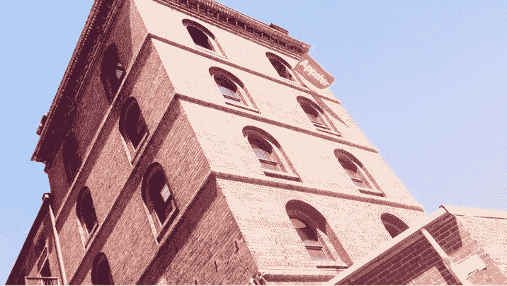
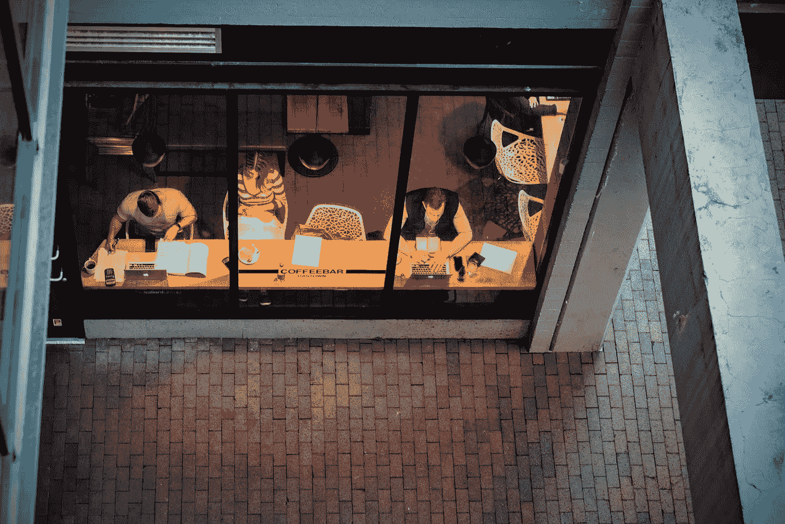

# 背叛、濒临失败和真空如何拯救了我 1900 万美元的创业资金

> 原文：<https://medium.com/swlh/how-betrayal-near-failure-and-a-vacuum-saved-my-19m-startup-de759d90cc8e>

Originally published on [http://www.appsterhq.com](http://www.appsterhq.com/?utm_source=CP&utm_medium=Medium)/

我创业生涯中的最低谷之一是围绕着一间肮脏的办公室和一台吸尘器。

那是在 2013 年。马克·麦克唐纳和我在 2011 年推出了 Appster，这项业务正在发展壮大。

我们有激进的增长目标，所以我们都没有拿薪水。相反，我们将每一美元都重新投资到公司中(除了我们在当地麦当劳的花费)。

我们住在一座 19 世纪的酿酒塔的第四层，那也是我们的办公室——那里很乱。更糟糕的是，我们的旧吸尘器坏了，我们急需一个新的。

our second office, an 1800s distillery tower

由于我们对增长的执着关注，现金储备处于历史最低点。我们刚刚度过了几个不景气的月份，我们销售团队的四分之三的成员最近辞职了。

我们没有很好地管理我们的资产负债表，突然，我们发现自己很难支付工资。生意徘徊在边缘。

这个大黑洞尽头的光芒以天使般的形式降临到我们的一位前任总经理身上，他知道我们的银行余额少得可怜。他看了看皱巴巴的外卖袋和大量的灰尘，提出给我们买一台吸尘器。

我们很谦卑(老实说，相当尴尬)，但我们接受了——我们很快就从身体上和经济上摆脱了困境。

# 崩溃测试你的承诺

很容易产生创业想法。如果你聪明、富有创造力和企业家精神，我敢打赌你有一个笔记本或应用程序充满了午夜的灵感。我也认为很多想法都很好。你可能会埋头创造一种产品或服务，填补一个体面的利基市场。

然而，挑战在于选择一个你愿意经历漫长而坎坷的项目。流行的创业故事颂扬独角兽和种子轮超级明星，但当你凝视着严重的问题时，这些赞誉是空洞的。

在过去的六年里，我们也有过其他的侥幸脱险。2013 年，我们决定在印度古尔冈建立一个工程中心，在那里我们可以培养一支由专门的开发人员、技术人员和支持人员组成的团队。我们知道这将是公司的主要资产，但是说实话，我们不知道我们在做什么。

# 执行不力的好主意

马克和我很早就意识到，我们行业中最大的五家公司都有开发交付中心，而且大多数都位于印度。但是我们和他们之间有一个主要的区别。这些公司的创始人大多来自印度，或者至少有着深厚的印度背景和稳固的本地关系。

马克是一个来自澳大利亚吉朗的 19 岁的英国孩子，而我是一个在新西兰斯特拉特福德长大的半个中国新西兰人。认为商业超越国际和文化界限是很好的，但是当你没有当地的联系，你不会说当地的语言，你不了解关键的社会细微差别，这是一个艰难的攀登。

幸运的是，我们年轻天真，渴望成功。带着 100，000 美元的预算*(可能是有史以来指定用于国际交付中心的最少金额)*，我们遇到了一家当地公司，并试图买断他们的一些核心团队成员。我们还认为，我们可以开设一个办事处，开始招聘，并迅速建立我们想要的基础设施。

什么都没用。这是一次彻底的失败。

我们修改了计划，聘请了一位有印度背景的墨尔本导演，他可以在古尔冈实地工作。开始很好，我们对自己的独创性感到满意。然而，很快，车轮就从车上飞了下来。

当我们飞往印度进行调查时，情况跌到了谷底。我们的司机坚持要带我们回到“犯罪现场”,并把车停在河边。他用蹩脚的英语和生动的手势解释说，这个新的、值得信任的雇员最近撕掉了数千张收据，并把它们扔进了水里。

我就不告诉你那些冗长的细节了，但是我们最终得知我们的新主管犯了欺诈罪，从公司偷了几十万美元。

# 回到起点…三

这种背叛是毁灭性的。我们失去了金钱、时间和信心。花了九个月的时间收拾残局，重回正轨，但我们通过聘请我们的首席技术官马丁·哈尔福德重新开始。

那时，马丁是我们招进来的最贵的员工。我们甚至不确定我们能否负担得起他，但我们也知道我们迫切需要他的经验和指导。

就在与马丁签订合同后的第七天，我们说服他登上飞往印度的飞机，收拾残局。马克也去了。他们努力重新赢得我们员工的信任，并扭转了这个项目。

在接下来的几年里，我们建立了稳固的增长模式，而交付中心在这一扩张过程中发挥了至关重要的作用。今天，我们有近 350 名开发人员和工作人员在印度工作，他们提供了 1900 万美元的年收入。

然而，当我回想起在古尔冈的早期，我仍然能感受到一边经营一家企业，一边在另一个大陆清理一个大烂摊子的巨大压力。

我几乎没睡。我想我吃了麦当劳以外的东西，但有点模糊了。

我所知道的是，我们对公司的共同热情和我们想要的影响让我们坚持了下来。我们知道我们的核心理念是合理的，我们从未忘记我们试图创造的东西。

# 金钱不能成为你的胡萝卜

我知道这是老生常谈，但这是我能提供的最好的建议之一:不要让金钱驱动你。当然，企业需要货币化，如果你想建立一个可持续发展的公司，你需要选择一个可以带来大量现金的想法。

但是，当你走投无路，一个投资者退出，你的联合创始人退出，或者其他 700 种灾难场景之一出现时，你对企业的热情将帮助你度过难关。

如果你对自己的想法或它对世界的影响不感兴趣，那就继续前进。继续思考和寻找让你夜不能寐的项目(以好的方式)。

度过那些艰难的时刻需要坚持，你的核心目标会提供急需的燃料。几年前我并不完全明白这一点，但现在我确实明白了。

# 三个问题可以帮助你快速产生想法

如果你还在寻找一个好主意，慢慢来。值得去挖掘和延伸，去寻找让你活过来的东西。以下问题看似简单，但要清晰而坚定地回答它们似乎很难:

*   什么让我沮丧？我在哪里看到或感受到了摩擦——我对这个问题的解决方案是什么？
*   我能创造一个可行的商业模式吗？人们或公司愿意为我的解决方案付费吗？是否可扩展？
*   我愿意为我的想法磨吗？我准备好投入时间、精力、资源、熬夜和清晨去做需要做的事情了吗？

最后一个问题最近一直萦绕在我的脑海中。马克和我创办了 Appster，因为我们天生具有创业精神，我们对建立一家伟大的公司感到兴奋。仅仅一年后，我们就知道专注于创业和服务创业者会让我们保持参与。每个项目和每个新客户都是不同的。太令人兴奋了。

最终，我们知道我们需要一个任务。当我们明确了我们想要做什么时，我们有了答案:为世界上最伟大的想法和创新建立一个开发中心。

我们知道为什么我们如此努力地工作——这将帮助你度过空空的银行存款余额和偷窃经理。

找到一些你能坚持五年、七年甚至十年甚至更久的事情。如果你准备花 10 年的时间来实现你的商业想法，你可能有决心熬过艰难的日子。

现在去彻底打扫一下你的办公室，开始工作吧。

//

## 感谢阅读！

# 如果你喜欢这篇文章，请随意点击下面的按钮👏去帮助别人找到它！

# 对应用程序有想法吗？[我们来谈谈](http://www.appsterhq.com/?utm_source=CP&utm_medium=Medium)。

在过去的几年里，我们已经帮助建立了超过 12 个数百万美元的创业公司。[了解我们如何帮助您](http://www.appsterhq.com/?utm_source=CP&utm_medium=Medium)。

