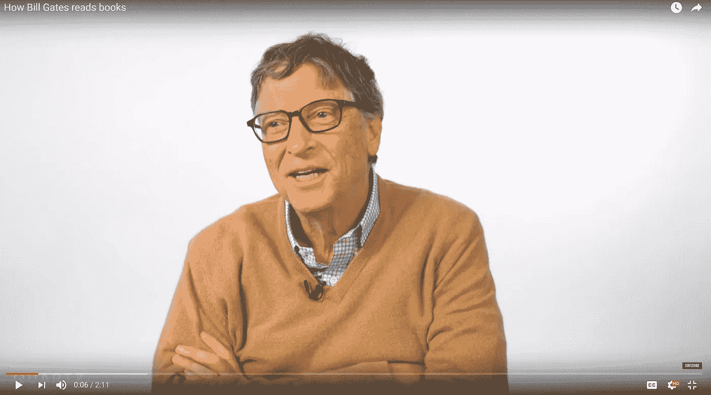
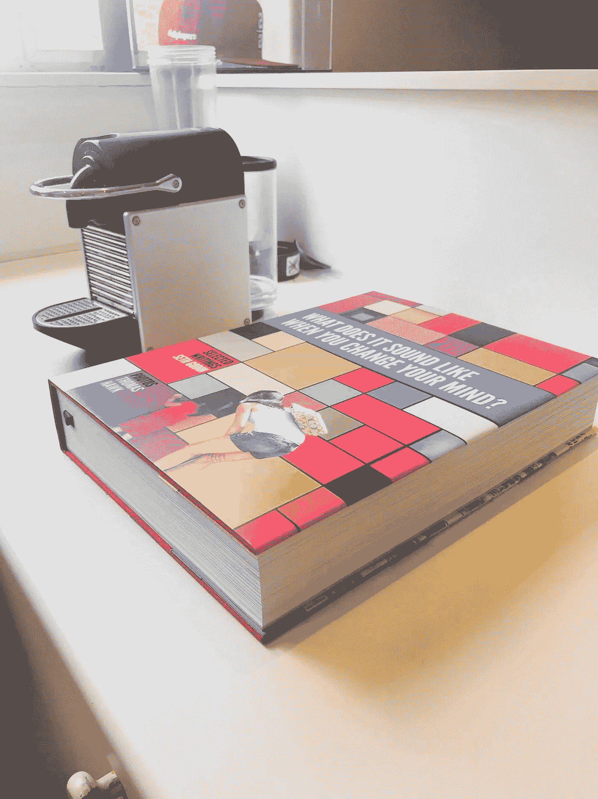

# 比尔·盖茨是如何读书的，每个营销人员都可以从中学到什么。

> 原文：<https://medium.com/swlh/how-bill-gates-reads-books-and-what-every-marketer-can-learn-from-this-e03af391d7ec>

当我看着比尔·盖茨分享他从阅读中获得最大收益的四件事时，有一个提示让我非常不舒服。

盖茨，一个热情的读者(每周消费一本书(每年 50 本))分享了以下建议。

## 1.在空白处做笔记

## 2.不要开始你不能完成的事情

## 3.纸质书>电子书

## 4.划出一个小时(来思考)

## 我简直不敢相信。比尔在他的书里写了什么？他为什么要做这种事？他不爱他们吗？为什么是比尔？

我一直被教导没有比在书上写字更大的罪行了。

这听起来很极端，我的母亲是一名英语老师，书应该受到最大的尊重，拿起笔写下一页是最大的侮辱。直到今天，我都非常保护我的收藏品。

然而，虽然一开始我对与这个星球上最聪明的人之一意见相左感到非常不舒服，但我很快意识到我没有抓住重点，这个例子中有一个有趣的见解，许多营销人员都会欣赏。

这与对错无关，这只是一种运用同理心探索不同世界观的能力，以及理解为什么我们可能拥有相同的动机和信仰，但我们的行为却完全不同。

比尔·盖茨显然和我一样热爱他的书。

他记笔记是一种情感劳动，确保他投入到内容中，并能够提取每本书的个人价值——这是一种激情的行为。

同样，我的女朋友蒋曦儿最近描述了她打开一本烹饪书时的喜悦，发现指纹显示了她最喜欢的食谱，面粉越多，爱越深。

在这三个例子中，尽管每个人的行为完全不同，但都有深深的爱和尊重。每个人对待书籍的方式似乎有些奇怪，甚至会冒犯到下一个人，然而一旦你理解了那个人的世界观，每个行为也是完全合乎逻辑的。

同样的洞察力如何帮助你考虑细分市场的方式？

如果你能够认识到产品消费方式中的这些细微差别，你将如何创造出不同的体验？

如果细分纯粹基于购买，在某些情况下，我们三个人很有可能会被归为一类，但是一个解决方案能满足我们所有的需求吗？

可能吧。但并不完美。

如果您知道您的客户想要更大的利润，或者想办法让页面没有指纹，您会采取什么不同的做法？你如何设计一种不同的体验，让读者觉得这本书是为他们而设计的？

当 Seth Godin 的 800 页、7 公斤重的 Titan 本周到达我家门口时，当我说我想买一副白手套以确保它保持“新”的感觉时，我的女朋友认为我是在开玩笑。

如果里面有一对，我的体验会得到怎样的提升？如果它们有我的名字和一封表明他理解我打算如何参与这本书的信就更好了。

当赛斯创作这本书时，他确保这本书不适合所有人，他制作了限量版并众筹了资金。他为他的部落设计了这本书，并在前五页突出了他们每个人的名字——传达了一个明确的信息——这本书是为你而作的。

## 所以作为一点乐趣，想想你消费书籍的方式。

你会如何为自己设计终极体验？

你会包括哪些功能？你会去掉什么？你会怎么说？

你会如何创造一种感觉像是专为你而造的东西？

## 然后考虑…我是否以这种专注程度来对待我自己的产品？

如果我如此了解我的完美顾客，我怎么可能创造出一种感觉像是专为他们设计的产品。

对于许多企业来说，这是非常困难的，因为当前的目标受众太广泛了。

所以问问你自己——你能进一步细分吗？如果你这样做了会发生什么？

你可能会发现你的观众数量会减少。你的产品可能不再适合所有人。但这才是重点。

为了给某人创造完美的产品，你必须做出妥协，这意味着它不再适合所有人。这种对深度而非广度的关注是我所知道的最好的增长策略，只要你比任何人都更好地满足你的观众的需求，你就永远不会缺少忠诚的顾客。

## 这个故事发表在[的《创业](https://medium.com/swlh)，这里有 262，800 多人聚集在一起阅读 Medium 关于创业的主要故事。

## 订阅接收[我们的头条新闻](http://growthsupply.com/the-startup-newsletter/)。

