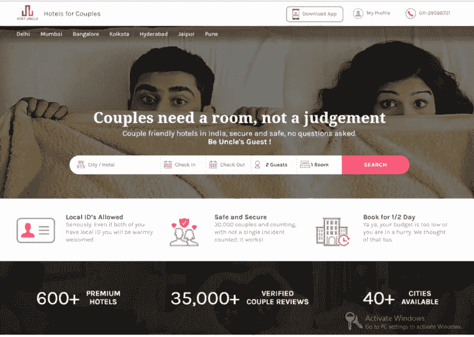
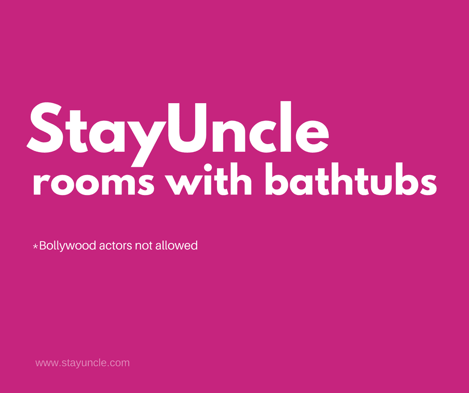
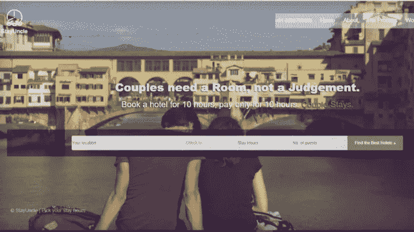
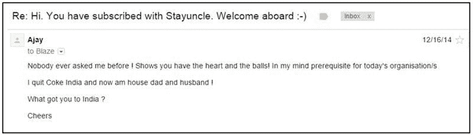
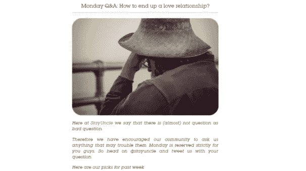

# Blaze 和 Sanchit 如何建立 StayUncle——一个适合情侣的酒店预订网站，每月收入 16 万美元

> 原文：<https://medium.com/swlh/how-blaze-and-sanchit-built-stayuncle-a-couple-friendly-hotel-booking-website-generating-160k-f3845fea1ba8>

## [推送面试](https://www.facebook.com/groups/Pushstarter/) 12:

## 关于 [Blaze](https://www.facebook.com/blaze.arizanov.kaspian) 和 [Sanchit](https://www.linkedin.com/in/sanchitsethi1/) 如何打破陈规并建立[stay ncle](https://stayuncle.com/)的旅程——一个夫妇友好的酒店预订网站，每月产生 16 万美元。

尽管印度在过去的十年里发展迅速，但它仍然吸引了许多刻板印象。

> “与未婚夫妇相关的刻板印象”领先。

在印度社会，未婚情侣之间的关系被认为是不虔诚的，那些寻求隐私的人经常受到骚扰和审判。

情侣们通常别无选择，因为如果他们没有结婚，他们会在公共场所被殴打，并被拒绝入住酒店房间。

## 通读这篇采访，了解:

> [Blaze](https://www.facebook.com/blaze.arizanov.kaspian) 和 [Sanchit](https://www.linkedin.com/in/sanchitsethi1/) 如何解决这个问题，并建立了[stay ncle](https://stayuncle.com/)-一个对夫妇友好的酒店预订网站，每月创收 16 万美元。

这是“[**push interview**](https://www.facebook.com/groups/Pushstarter/)**:帮你的访谈**[**push start**](https://www.facebook.com/groups/Pushstarter/)**”**系列的第十二期访谈由 [**Pushstart**](https://www.facebook.com/groups/Pushstarter/) 提供动力。

如果你碰巧错过了我们之前在**[**上的采访，看看我是如何建立印度最活跃的创业社区之一的**](https://hackernoon.com/how-i-built-the-most-active-startup-community-of-india-dfd83e8fe687)**。****

**** [## 我如何建立印度最活跃的创业社区之一

### 我从零到一建立创业社区的旅程

hackernoon.com](https://hackernoon.com/how-i-built-the-most-active-startup-community-of-india-dfd83e8fe687)**** 

# ****你是🕴Who 吗？****

****嘿 [**Pushstarters**](https://www.facebook.com/groups/Pushstarter/) **！**我是 [**Blaze Arizanov**](https://www.facebook.com/blaze.arizanov.kaspian) 又名 **Blaze 大叔**，在 [**StayUncle**](https://stayuncle.com/) 的联合创始人兼首席营销经理。****

********

******Hi!** [**Blaze Uncle**](https://www.facebook.com/blaze.arizanov.kaspian) **here!******

> ****在[stay ncle](https://stayuncle.com/)的团队成员被称为阿姨或叔叔！****

****我来自一个叫做**[**马其顿**](https://en.wikipedia.org/wiki/Republic_of_Macedonia) **的小城市。**我来印度参加 [**AIESEC**](https://www.aiesec.in/) 实习，很快开始在软件开发公司工作(主要是云计算和手机 app 开发)。******

****四年后，我离开了企业界，投身于创业。****

> ****创业是我接下来要做的最合乎逻辑的事情，因为我无法适应受限的企业环境。****

****在即将离开印度的时候，遇到了 [**桑奇塞提**](https://www.linkedin.com/in/sanchitsethi1/) **。**与他一场冗长的讨论让我加入了[**StayUncle**](https://stayuncle.com/)**；从那以后，我一直住在德里。******

# ****🤔 [StayUncle](https://stayuncle.com/) 怎么回事？****

****StayUncle 是一个搜索和预订情侣友好酒店的网站。****

> ****拥有当地身份证的未婚夫妇可以预订房间，而不会受到审判。****

********

****情侣们可以预订白天时段或晚上时段的房间，并支付相应的费用。****

> ****一对未婚夫妇的需求是不同的，我们已经改造了酒店房间来满足他们的需求。****

****我们有专门为情侣设计的服务和产品，如免打扰服务、特殊的爱情盒子等。****

****最近，我们推出了带浴缸的房间，为房间增添情趣。****

********

# ****💯是什么促使你开始[stay ncle](https://stayuncle.com/)的，你是如何验证这个想法的？****

****Sanchit 在果阿的 Zuari Agrochemicals 工作，他正在寻找一些相关的想法或需要解决的问题。他从调查他的社交网络中的人开始。****

****时间灵活的酒店预订成为一个重大问题，他开始着手解决这个问题。****

****两年半前，当 Sanchit 联系我的时候，StayUncle 是一个为商务旅行者服务的网站，他们需要住几个小时的酒店，但被迫支付 24 小时的费用。****

> ****当我们为商务旅行者经营 StayUncle 的时候，很多未婚夫妇曾经找过我们要房间。我想到了调查背后的原因。****

****我发现未婚夫妇很难订到酒店房间。他们不仅被拒绝进入房间，还受到接待人员的骚扰和评判。实际上，未婚夫妇没有安全的地方可去。****

> ****我告诉我的团队，这可能是我们一直等待的机会。****

****我总是想解决一个问题，为此我会付出我的一切。我觉得这是一个我可以为之献身的问题，并产生了修改 StayUncle 使之成为夫妇友好的想法。****

****我们可以选择继续为现有客户服务，并开始为情侣并肩服务。但我反对这个想法，因为我想全心全意地解决这个刻板印象的问题。****

> ****因此，我们决定将品牌重新定位为情侣友好型酒店客房的目的地。****

# ****🛠:构建最初的产品都花了些什么？****

****最初，除了桑奇特和我之外，有两个人从事业务开发，一位女士帮助我们进行客户支持、营销和业务开发。****

****我们推出新版 [**StayUncle**](https://stayuncle.com/) 时的网站:****

********

******Our Initial website!******

****我们花了三个月的时间推出网站的基本版本，又花了六个月的时间推出功能齐全的产品。整个过程更像是修补漏洞，改造我们已经为旅行者准备的网站。****

****[**桑奇特的**](https://www.linkedin.com/in/sanchitsethi1/) 父亲用最初的钱帮了我们很多。后来，当我们试图通过 linkedIn 让更多的人访问我们的网站时，我们偶然发现了一个机会。****

> ****可口可乐前总经理 Ajay Naqvi 正在寻求投资初创企业，他觉得我们的想法很有趣。****

## ****来自 Ajay Naqvi 的邮件:****

********

****他喜欢我们的想法，投资了 200 万卢比。这笔钱维持了我们不超过 10 个月，可悲的是，我们最终什么也没得到。****

****我们愚蠢地把所有投资都花在了雇佣数字广告公司的服务上，又回到了起点。那个阶段非常关键，我记得有时靠香蕉生存。****

****我们通过节省每一个可能的项目来处理这种情况，并且只关注给我们带来收入的活动。****

# ****🤝你是如何获得最初的客户(酒店)的，它是如何成长的？****

> ****当我们开始时，我们面临着许多来自旅馆老板的反对。****

*   ****酒店老板担心，如果他们开始接受未婚夫妇，社会上的人会评判他们。****
*   ****他们对给未婚夫妇提供酒店房间的法律感到困惑和不确定。我们不得不澄清事实，告诉他们未婚夫妇预订酒店房间是合法的。****

> ****我们在第一个月接触的十家酒店中，只改造了两家。****

****为了克服他们的恐惧，我们开始向他们解释未婚夫妇面临的问题的严重性，以及我们成为市场领导者的机会。****

> ****我们向他们展示了 Airbnb 等公司在其他国家以类似概念取得的进展。****

****这些统计数据，加上我们看到大量未婚夫妇咨询的经历，帮助我们说服了下一批酒店业主。****

****桑奇控制了前 30 家酒店中的大部分。每当我们瞄准一家大酒店时，我都会陪着他，因为当老板们发现有白人参与时，他们看到了更大的可信度和影响力。****

> ****我们花了大约六个月时间登上前 50 家酒店。****

****与我们合作后，酒店利润增长了 4 倍。这一进展足以推动我们加入其他酒店的进程。现在超过 50%的酒店主动联系我们。****

> ****目前，我们在印度 40 多个城市拥有 900 家酒店。****

# ****🤝你是怎么获得你的初始用户的，又是怎么增长的？****

> ****我们得到的最初几个客户来自我们为旅行者服务时收到的询问。****

****很快，我们开始在脸书开展数字营销活动。以下是我们当时最成功的数字营销活动的一个例子:****

********

****这场运动火了起来；媒体抓住了这一点，我们的电话线疯了。但是尽管有这样的宣传，我们并没有获得太多的销售。所以我们决定通过上街来切换到 100%销售模式。****

> ****我们首先走出去，在情侣和年轻人的热点地区向人们分发名片。****
> 
> ****我们分发了大约 5000 张名片。****

****在这些卡片分发的一个晚上，来自 [**石英印度**](https://qz.com/) 的一名记者拿起我们的卡片，发现这个概念很有趣，于是决定在 statyuncle**上做一个 [**封面故事**](https://qz.com/655949/in-conservative-india-a-startup-is-helping-unmarried-couples-find-a-room-and-taking-on-moral-policing/) 。******

> **我们卡片上的标语是:“夫妻需要一个房间，而不是一个判断。”**

**在这次报道之后，我们得到了急需的推动力，我们的成长之旅开始了。**

## **现在，我们在脸书和 Instagram 上开展数字营销活动:**

**我们定期组织比赛来吸引和留住我们的追随者。**

****

****A trip to Bali competition!****

**我们围绕热门话题制作迷因和海报，以便留在联盟中。**

****

****Game Of Thrones themed poster!****

**我们定期通过**博客和 FB live** 分享约会和恋爱建议，以保持与用户的联系。**

****

****Blog on “How to end up a love relationship”****

> **我们最近突破了 35000 个独立客户，我们的网站每月有超过 200000 的访问者。**

**去年 8 月，当 OYO 推出情侣友好型酒店的概念时，我们面临着下滑。这是暂时的，因为他们无法赶上我们，也无法很好地宣传这一理念。**

> **我们区别于市场上其他参与者的一点是“我们致力于解决未婚夫妇的问题，而不是所有人的问题。”**

# **💰你的商业模式是什么？你是如何增加收入的？**

**我们购买酒店房间，然后通过加价出售。这个模型是基于我们在这个过程中获得的利润。**

**我记得第一年我们没有从公司拿任何钱。**

> *****StayUncle 实现了盈利，每月经常性收入达 16 万美元。*****

# **🏁你未来的目标是什么，你打算如何实现它们？**

> **我们现在没有任何酒店；我们有合作关系。我们的目标是在不久的将来开设连锁酒店。它们将是我们自己的“爱情旅馆”。**

**一旦我们拥有所有权，我们将提供更灵活的时间段和更好的情侣友好产品。**

**实现这一目标的第一步是准确评估目标市场。下一步是通过向投资者展示这个市场的范围来寻求资金。**

> **一个家庭可能一年旅行两到三次度假，但一对夫妇可能希望每周都有爱。这个市场的范围是巨大的。**

# **🌋到目前为止，你面临的最大挑战是什么？你是如何应对的？**

**我们想推出有避孕套、玩具等的爱心盒子。但是，对于情侣来说，很难让合作酒店同意我们的理念。**

**所以引入新功能总是一个挑战。**

> **我们在二线和三线城市的渗透也具有挑战性，因为打破陈规需要很长时间。**
> 
> **很多时候，我们在互联网上发现与我们相关的巨魔，但我们大步向前，越过他们。**

**我们必须仔细核实我们的客户，并消除任何可能发生的不法行为。**

# **🗒，你对创业有什么建议？**

*   **寻找一个真正需要解决的问题。寻找可以为之献身的东西，并全力以赴地去做。**
*   **在你的创业想法中加入个人因素。**

# **✉️:我们怎样才能和你联系上？**

**可以在 [**LinkedIn**](https://www.linkedin.com/in/blazearizanov/) **和** [**脸书联系我！**](https://www.facebook.com/blaze.arizanov.kaspian)**

## **非常感谢你的阅读！如果你喜欢，请鼓掌支持👏🏻还有分享帖子。请随意发表评论💬下面。**

## **想成为印度最活跃的创业社区的一员吗？**

***在* [***上发送请求 Pushstart***](https://www.pushstart.in/join-network-community) *成为我们不断壮大的大家庭的一员。***

***嘿！Neeraj 这里的创始人*[***Pushstart***](http://pushstart.in/feed)*，印度最活跃的企业家群体。我每周都会发布对成功企业家的采访。**[***脸书***](https://www.facebook.com/jneeraj0807)***|***[***Linkedin***](https://www.linkedin.com/in/jneeraj0807)***| neeraj . Joshi @ pushstart . in |***[***Twitter***](https://twitter.com/jneeraj0807)***

*   ***由 [**Anjali Arora**](https://www.facebook.com/anjali.arora.5891) 和**[**Neeraj Joshi**](https://www.facebook.com/jneeraj0807)*****

**********

## *****这个故事发表在 [The Startup](https://medium.com/swlh) 上，这是 Medium 最大的企业家出版物，拥有 317，238+人。*****

## *****在这里订阅接收[我们的头条新闻](http://growthsupply.com/the-startup-newsletter/)。*****

**********