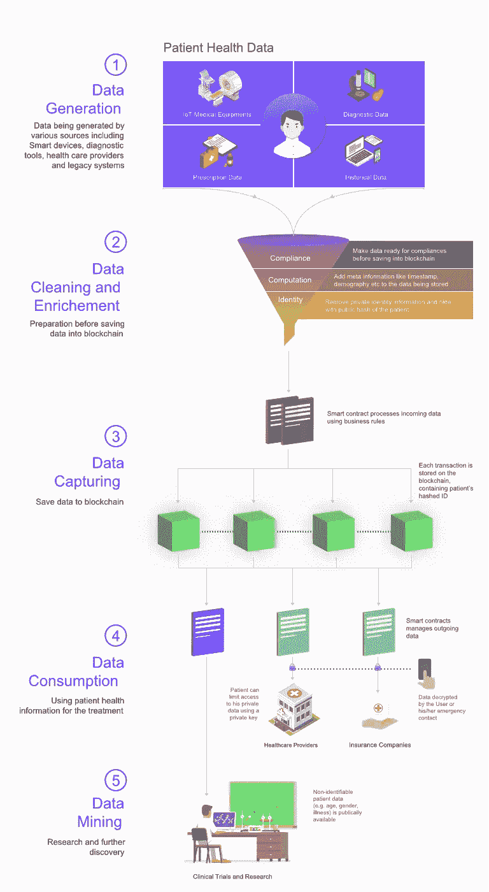

# 区块链如何颠覆医疗保健行业

> 原文：<https://medium.com/swlh/how-blockchain-can-disrupt-the-healthcare-industry-edcf2bb43d52>

医疗保健行业面临着在保持市场竞争优势的同时降低成本的巨大压力。

不同的医疗保健单位，如医院、诊断实验室和医疗保险公司，都希望确保对患者的正确护理，同时保持合规性和技术需求。

毫无疑问，医疗单位正在采用最新的技术趋势，但越来越多的患者使当前的技术无法保持质量标准。由于现有系统缺乏质量和信任，患者的医疗记录受到阻碍。

医疗保健信息交换是一个主要问题，不仅会影响患者，还会影响医疗保健行业。Ponemon 在 2017 年进行的数据泄露成本研究表明，医疗机构的数据泄露成本为每份医疗记录 380 美元。

这就是为什么当前的医疗保健市场需要一个创新的变革来给行业带来巨大的转变。区块链可能是一种可能的解决方案，它可以通过在系统中带来透明度、信任和效率来重建医疗保健组织。

根据 IBM 商业价值区块链研究所的数据，200 名医疗保健高管受到监管，其中 16%预计将在医疗保健领域实施区块链，以安全共享医疗保健记录。

让我们讨论一下[区块链医疗保健](https://www.leewayhertz.com/healthcare-blockchain-how-medical-records-secured-blockchain/)解决方案如何惠及医疗保健行业。

以下是区块链医疗保健的运作方式:

# **在区块链上存储医疗记录:**

患者、医生、实验室技术人员或医疗保健网络中涉及的任何其他成员都可以在区块链上提供与患者健康记录相关的数据。将数据存储在区块链系统上是必不可少的，因为它维护着一个不可变的记录分类账，该分类账是可追踪的，并保持数据的安全。网络中的每个人都可以拥有自己的私钥，从而拥有数据的所有权。

该网络的所有成员都可以访问所有记录，但由于区块链提供受控数据披露的能力，没有人能够操纵或修改它们。因此，存储在区块链上的医疗记录是透明且不可改变的。

# **在区块链上共享医疗记录:**

由于健康链网络的每个参与者都使用他们的私钥来存储数据，因此只能通过使用相应的公钥来解密数据。

例如，如果患者想向医生展示以前的病历，他们必须提供访问数据的公钥。

此外，通过使整个信息通过区块链可用，它将减少每个医疗保健单位相互联系的工作量。如果保险公司想要检查患者的报告以生成索赔金额，他们将不必要求复杂的纸质文件。相反，他们可以从病人那里获得公钥来访问他们的诊断报告。

因此，通过这种方式，健康记录可以快速无缝地共享。

# **确保信任的智能合约:**

智能合同包含决定谁得到什么的重要业务逻辑。因此，在智能合约的帮助下，可以确保数据的质量永远不会受到阻碍。

智能合同提供无冲突的信息交换，并确保网络的正确实体使用数据。

相信像区块链这样的分布式账本技术注定会颠覆医疗保健行业和其他各种行业，每个企业家都应该将区块链引入他们的业务。

雇佣一个有技能的[区块链发展公司](https://leewayhertz.com/blockchain-development-company/)，该公司有潜力为你的组织建立区块链医疗保健。

## 这篇文章发表在[《创业](https://medium.com/swlh)》上，这是 Medium 最大的创业刊物，有+ 377，643 人关注。

## 在这里订阅接收[我们的头条新闻](http://growthsupply.com/the-startup-newsletter/)。

