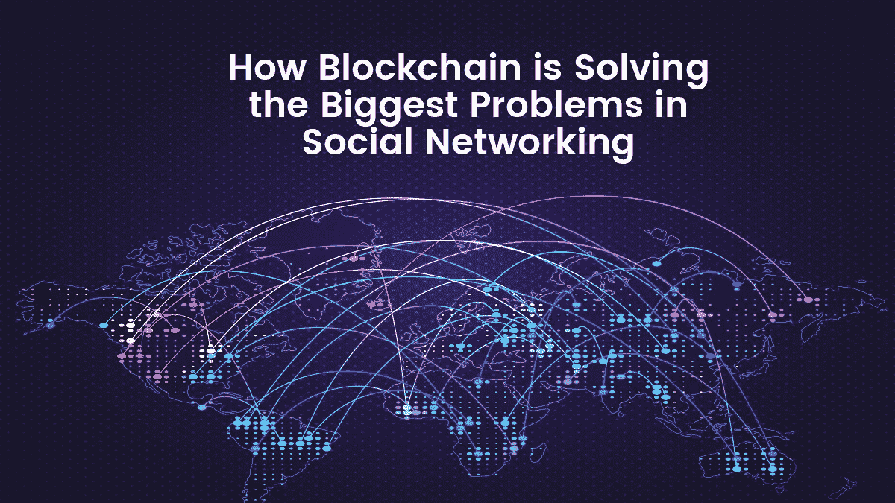

# 区块链如何解决社交网络中最大的问题

> 原文：<https://medium.com/swlh/how-blockchain-is-solving-the-biggest-problems-in-social-networking-4d78faa233fc>

众所周知，社交网络是许多人生活中不可或缺的一部分。如果你像大多数人一样，你可能会在脸书、推特、Instagram、LinkedIn 和许多其他社交网络上。

虽然这些平台是免费的，并提供对其服务的无限制访问，但它们受到许多问题的困扰。隐私、数据收集和内容审查等问题是许多用户非常关心的。

在本帖中，我们将探索与这些传统社交网络相关的主要瓶颈，以及区块链技术如何解决所有这些问题。

Image: [rawpixel.com](https://www.pexels.com/photo/four-people-holding-mobile-phones-1083622/)

## 那么，问题是什么呢？

*   *对数据的控制*

社交网络用户目前无法控制他们的数据。一旦用户在社交网络上拥有账户，就好像他们放弃了对个人信息的权利和对内容的控制。社交网络所有者掌握着全部控制权，他们决定用户可以查看哪些内容，不可以查看哪些内容。有了这种控制，社交网络平台所有者就能够在未经用户同意的情况下从他们的用户那里获利。

*   *隐私*

如果最近的[脸书数据泄露](https://www.theguardian.com/technology/2018/apr/08/facebook-to-contact-the-87-million-users-affected-by-data-breach)事件可以借鉴的话，那么现在的社交网络被证明安全性很差。用户容易受到已知会暴露其个人信息的攻击。

*   *单点故障*

由于其集中的性质，传统的社交网络容易受到攻击，这通常会导致昂贵的损失。黑客只有一个攻击点，攻破哪个就能获得大量用户信息。例如，2012 年[一名黑客闯入 LinkedIn 网络](https://blog.linkedin.com/2012/06/06/linkedin-member-passwords-compromised)，带走了大约 650 万个加密密码，并将它们发布在一个俄罗斯黑客论坛上。四年后，另一个名为 Peace 的黑客出售了更多 LinkedIn 黑客的用户信息。他声称，从 LinkedIn 窃取的数据总数达到 1.67 亿，而不是之前认为的 650 万。其中 1 . 17 亿人同时拥有电子邮件和加密密码。

# 为什么区块链是解决方案

区块链技术是人们期待已久的解决影响当前社交网络的问题的方法。以下特征是区块链技术如此具有开创性的原因。

*   *透明度*

区块链的分布式本质消除了单一实体对平台的控制。由于基于区块链的平台上的每一笔交易都被几个服务器和开发者跟踪和审计，任何人都不可能篡改数据。

*   *对数据的控制*

通过消除中介，分散社交网络上的用户将拥有并控制他们的数据。区块链技术可以确保你在社交网络上发布的任何内容都可以被追踪到，并且永远不会被复制。最棒的是，如果您删除了它，它会在整个系统中被删除，任何未经授权的第三方都无法访问它并从中受益。

*   *相关内容*

一旦你掌握了社交网络平台的控制权，你就可以决定你想看的内容类型。因此，你不会在你的平台上看到那些只对广告商有利而对你不利的不想要的广告。

*   *从社交媒体活动中获利*

基于区块链的平台使你和你的观众、听众、读者，根据你创造的内容，建立直接的关系，这在金钱上对你有利。

# 可以用哪个区块链社交网络平台？

一个利用区块链技术创建革命性社交网络平台的平台是 [Indorse](http://indorse.io/?utm_source=CoinChangeX&utm_medium=article&utm_campaign=blockchainsolution&utm_content=socialproblems) 。

Indorse 是一个去中心化、区块链驱动的社交网络平台，旨在改变专业人士的互动方式。

通过引入区块链技术，Indorse 增强了自身抵御集中式社交网络相关漏洞的能力。因此，可以保证个人有一个安全可靠的交往环境。利用这个平台，专业人士将能够分享他们的技能和经验，并因此获得回报。

# 内部平台模型

目前，以下是在[支持](http://indorse.io/?utm_source=CoinChangeX&utm_medium=article&utm_campaign=blockchainsolution&utm_content=socialproblems)平台中使用的逻辑:

*   首先，你加入平台
*   然后你创建你的个人档案
*   现在你有资格为你的个人资料申请背书了
*   系统将随机选择另一个用户来支持您的索赔
*   被背书人 Dapp 将允许其他背书人提交他们的决定
*   基于达到阈值的最大共识，向支持者奖励支持令牌(IND)。但是恶意背书的用户将失去他的声誉，因此可能影响他在平台上的信誉分数

现在您已经对 Indorse 平台模型有了一点了解，让我们更深入地了解它实际上是如何工作的。

# Indorse 如何工作

该平台为成员提供了两个主要的参与角色。你要么是申请人，要么是鉴定人。

现在，索赔人的第一步是提出与他/她的个人资料相关的“索赔”。这种主张可以是个人技能，也可以是专业技能(例如，我是一名软件开发人员)。作为索赔人，您提出的每一项索赔都需要附上一份或多份信息证明(例如 GitHub 存储库、Bitbucket 等。)

第二步是验证器在区块链平台外验证声明，并对其进行标记或背书。

*实际例子*

让我们通过选择一个已经在使用 Indorse 平台的成员的例子来进一步简化解释。在这种情况下，我们将使用 Jane 和 Mike，Jane 是请求者，Mike 是验证者。

所以简加入了 Indorse 网络。成功注册后，Jane 将能够在她的个人资料中发布一项申请。她需要采取的第一步是创建一个唯一的个人资料标识，并在其中添加声明。在她的声明中，Jane 声明她拥有一项编程技能，该技能有一个公共的 Git 存储库和一份她在哪里获得该技能的证书作为证明。最后，她提交了索赔。

现在[背书](http://indorse.io/?utm_source=CoinChangeX&utm_medium=article&utm_campaign=blockchainsolution&utm_content=socialproblems)，使用匿名背书协议(AIP)，将随机选择一些验证者来背书简的主张。至此，简的主张将进入酝酿期，最终以一致赞同而告终。

随机选择的支持 Jane 声明的成员(Mike)收到一个通知，通知他 Jane 已经放置了一个到她个人的 GitHub 存储库和她的证书的验证页面的链接。因此，他核实索赔的有效性并背书，锁定他的背书分数。

最后，简被奖励以背书代币(IND)。类似地，迈克也获得背书代币作为奖励。

# 如果成员背书错误怎么办？

一个成员谁作出轻率的索赔(索赔人)或以不诚实的方式标记(验证)，将看到他/她的信任分数降低。但是，该会员将有机会通过正确背书赢回失去的分数。

## 技能的验证

作为会员，当您提出索赔时，您有两种背书选择:

1.  使用匿名背书协议(AIP ),将给出一个随机背书——[背书](http://indorse.io/?utm_source=CoinChangeX&utm_medium=article&utm_campaign=blockchainsolution&utm_content=socialproblems)平台将根据与会员的分离程度选择一组随机背书者。为了使申请人的技能得到验证，随机验证者需要达到一定比例的共识，以通过申请人技能的验证。
2.  与人工智能聊天机器人互动并回答一系列问题，机器人将决定你对指定编程语言的熟练程度！

匿名背书协议顾名思义就是从平台中随机选择背书者，并保持他们的匿名性

# 用例

以下是可以使用[背书](http://indorse.io/?utm_source=CoinChangeX&utm_medium=article&utm_campaign=blockchainsolution&utm_content=socialproblems)的途径:

*寻求招聘的公司*——雇主不需要仅仅依赖潜在候选人的口碑、经验和文件，还需要得到支持。这些支持将有助于巩固未来候选人的可信度。

*KYC*——这是通过以分散的方式将个人的身份、档案和成就附加到以太坊地址上。

*广告* —在 Indorse 上收集的数据将用于定向广告，包括查看个人资料的个人和个人资料的创建者。

*自由职业者服务* —在平台上签署证书后，社区成员将能够填写发布的合同工作和工作请求。

# 一锤定音

区块链技术确实将处于重新塑造社交网络行业的前沿。让它变得更具互动性、更值得信赖、提供独特体验的可能性太好了，不容错过。作为开拓者， [Indorse](http://indorse.io/?utm_source=CoinChangeX&utm_medium=article&utm_campaign=blockchainsolution&utm_content=socialproblems) 的目标是把数据的所有权还给会员&奖励他们向网络展示和分享他们的技能。

然而，在这个快速变化的行业中，仍然有一个问题没有得到解答。像 Indorse 这样的公司会开创社交网络的新时代吗？或者我们现有的传统网络会很快调整他们的模式，使之适应区块链模式吗？只有时间会证明一切。

*渴望了解更多关于 FundYourselfNow 的信息吗？在我们的* [*电报*](https://t.me/fundyourselfnow) *群上加入我们的众筹革命对话，或者在* [*推特上关注我们。*](https://twitter.com/fundyourselfnow)

## 这篇文章发表在 [The Startup](https://medium.com/swlh) 上，这是 Medium 最大的创业刊物，有+367，349 人关注。

## 在这里订阅接收[我们的头条新闻](http://growthsupply.com/the-startup-newsletter/)。

