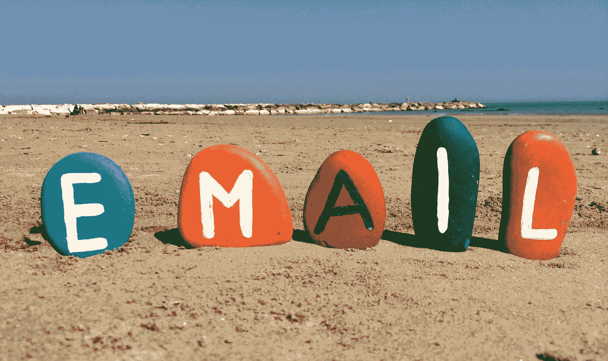
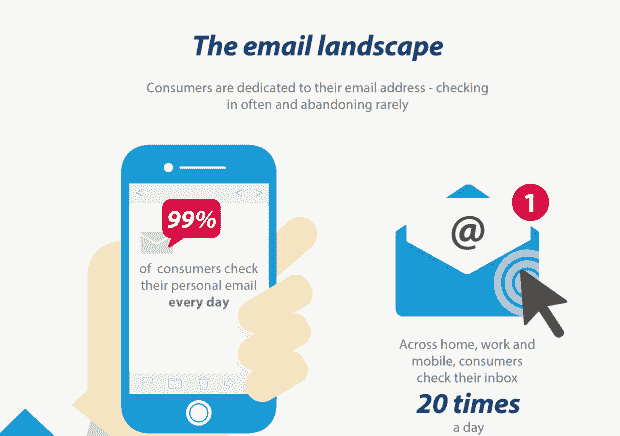
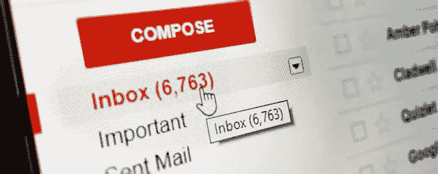
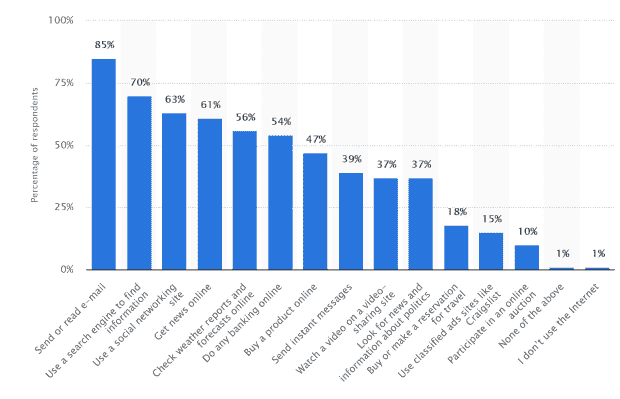

# 区块链如何证明邮件依然是王道

> 原文：<https://medium.com/swlh/how-blockchain-proves-that-email-is-still-a-king-f9092c5bb521>

随着技术的发展和新的交流方式的出现，人们开始怀疑传统的网络交流方式。像*邮箱*。有些人甚至说电子邮件已经死了，很快信使将取代这种乏味的交流方式。

> “这是老派，来吧”。

Triggmine，[电子邮件营销自动化服务](http://www.triggmine.com/smart-ecommerce-marketing?utm_source=medium&utm_medium=social&utm_campaign=medium-blog-outreach)，欢迎您考虑*如何将区块链整合到电子邮件*中，以及它可以在哪些方面进行改革。最重要的是，为什么它很重要。

# 人们试图忘记电子邮件，但每次都失败了

消除电子邮件的尝试并不新鲜。

事实上，这是科技公司几十年来的发展方向。从 **MySpace** 开始，随着**脸书**广泛发展，随着 **WhatsApp** 达到不可思议的顶点，对可以取代电子邮件的通讯工具的探索将会继续。

只是方向错了。邮箱是无法替代的。句号。

✔️If:你认为有东西“扼杀”了电子邮件交流，告诉全世界 37 亿用户吧，他们每天总共发送超过 2690 亿封电子邮件。

So much for being gone. *Source:* [*https://optinmonster.com/is-email-marketing-dead-heres-what-the-statistics-show/*](https://optinmonster.com/is-email-marketing-dead-heres-what-the-statistics-show/)

## 这并不意味着电子邮件会保持不变

尽管电子邮件已经存在了很长一段时间，而且很棒，但这并不意味着电子邮件不能随着时间的推移而进一步发展。这是一个自然的发展过程，很明显，电子邮件通信和营销也会发生变化。

让我们来看看目前最热门的技术之一— **区块链**。我们认为区块链会对电子邮件产生巨大的影响，更重要的是，会产生积极的影响。

# 区块链为电子邮件通信提供了一个新的视角

## **更新数据存储和采集**

无论谁告诉你互联网是免费的，都是在撒谎。在我们访问所谓的“免费信息”之前，我们需要通过浏览器和 ISP 这样的多重把关。

> 仅仅通过访问网站，我们就用我们的数据付出了代价，牺牲了我们的隐私，有时甚至牺牲了数字安全。

让我们想一想，为什么每当你考虑订阅时事通讯时，你肯定会三思而行。现在，你的电子邮件和姓名，以及你在表格中提供的任何东西，都由这家公司全权处理。他们开始随心所欲地给你发邮件，即使被要求把地址从名单中删除。

从电子邮件用户的角度来看， [GDPR](/triggmine/triggmine-is-gpdr-сompliant-debcc2b524b) 在这方面是一个真正的进步。

从现在开始，**公司被迫**限制收集数据的范围，尊重用户的私人空间。但是如果你是有时事通讯的人呢？你需要更好地了解读者，为他们提供更好的内容，但法规让这几乎不可能。

区块链提供了一条出路。

## 这些数据并不存储在第三方服务器上，而是保留在所有者手中。每当用户想要终止与发送者的关系时，他们就带走数据。

这样，对发送者来说更容易，因为他们不必跟踪信息的及时删除，对接收者来说也更容易，因为这完全符合他们被遗忘的权利。

## **保持真实**

电子邮件经常被指责为不够可信。这肯定是一个错误的论点，因为每种类型的在线交流都有可能是伪造的——社交媒体刚刚证明了这一点。

尽管如此，用假名创建一封电子邮件还是很容易的，甚至可能不代表一个真实的人。它危及通信，并使用户处于多种骗局和非法计划的危险之中。区块链也可以解决这个问题，通过集成一个*内置的身份检查*。

*收件箱里充满了虚假的人发来的虚假信息*

区块链是一种存储敏感数据的安全技术，比如作为身份证明的文档。为了进一步证明这一点，Telegram 甚至创建了一个[分散式文档存储](https://cryptonomist.ch/en/blockchain-en/technology/telegram-passport-2/)，电子邮件提供商也可以做同样的事情。

用户将通过上传文件或照片来证明他们的身份，一个基于人工智能的系统可以在几秒钟内分析它们。

消除电子邮件通信中的虚假和欺诈将使它变得透明和安全，就像在最开始的阶段一样。企业也可以从中受益——现在他们会知道他们的时事通讯订阅者是真实的人，而不是伪造的身份。

## **广告中的回转台**

人们喜欢使用电子邮件，但他们不喜欢在邮箱里接收广告。垃圾邮件、直接广告、CPC 横幅使得从一堆垃圾中分离出真正重要的信息变得很困难。

但是，把广告全删了肯定不是办法。首先，这几乎是不可能的——这是多种商业模式的基石。还有，不是所有的广告都是垃圾。我们仍然使用广告来发现真正有趣的产品，并不是所有的促销邮件都没有价值。

事实上，47%的电子邮件用户需要邮箱来购买新产品。广告对此贡献良多。来源:[*https://optin monster . com/is-email-marketing-dead-heres-what-the-statistics-show/*](https://optinmonster.com/is-email-marketing-dead-heres-what-the-statistics-show/)

区块链可以帮助用户和广告商达成共识，让双方都对广告感到满意。事实上，在几个方面。

# **方法 1——创造更好的广告**

我们知道，如果做得好，广告可以减少烦恼。如果个性化越来越难，公司如何制作更好的广告？

技术再一次解决了这个问题。结合区块链和人工智能，电子邮件营销平台可以收集客户的见解，并将其转化为自动化的活动，使其中的广告无缝衔接，精准定位。

这种广告可以更有效，更好地响应客户的需求。如果广告带来更多的价值，受众不会反对。

# **方法 2——让广告对接受广告的人有利可图**

是的，广告商不一定是从广告中获利的那一方。接收广告的人可以因观看广告并与之互动而获得报酬。最重要的是，他们还可以决定喜欢在屏幕上看到什么样的广告，或者完全拒绝看到横幅广告。

如果你想得更深一点，这样的系统不仅仅是优化了接收广告的体验。它把**实际价值放在用户的注意力上**，这些价值被垄断的广告提供商如脸书或谷歌拿走了。

# 如何开始？

## 如果区块链是你愿意在可预见的未来尝试的东西，并且今天你正在寻找一个具有区块链技术实施前景的智能电子邮件营销自动化服务，那么试试 [Triggmine](http://www.triggmine.com/smart-ecommerce-marketing?utm_source=medium&utm_medium=social&utm_campaign=medium-blog-outreach) 。

## 它将向您的客户传递最先进的个性化信息，他们将永远不想离开。也可在 [Shopify](http://bit.ly/Triggmine-on-Shopify-Marketplace) 上获得。

# 结论

我们认为区块链可能是完美的解决方案。这也是我们开发新的电子邮件营销自动化工具的原因——这是一种基于区块链和人工智能的服务，可以分析客户行为，并将他们转化为有利可图的促销活动。

[**订阅**](http://bit.ly/Subscribe-to--Triggmine-Medium) 更多故事。我们认为你可能会喜欢它。你的 [**触发**](http://www.triggmine.com/smart-ecommerce-marketing?utm_source=medium&utm_medium=social&utm_campaign=medium-blog-outreach) 。

## 这篇文章发表在 [The Startup](https://medium.com/swlh) 上，这是 Medium 最大的创业刊物，拥有+366，567 名读者。

## 在这里订阅接收[我们的头条新闻](http://growthsupply.com/the-startup-newsletter/)。

