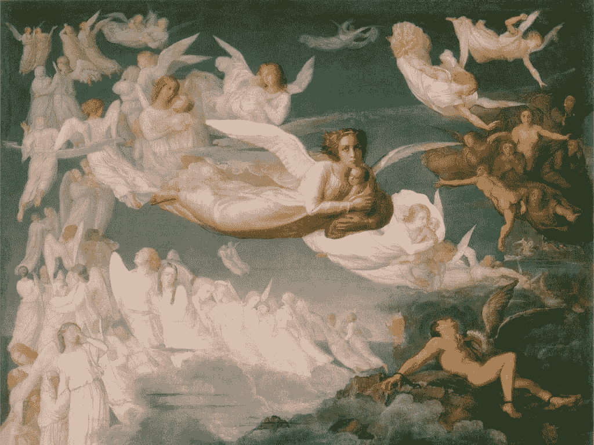

# 波士顿的天使们如何评判企业家

> 原文：<https://medium.com/swlh/how-bostons-angels-judge-entrepreneurs-ec1c1c19f02d>

一个局外人的内心审视天使的深思熟虑

Le Poème de l’âme ­Le Passage des âmes by Anne Francois and Louis Janmot

任务
*我写这篇文章是为了帮助企业家们更好地理解天使投资人的担忧。我们将着眼于真正的天使到企业家的问题以及它们的含义。*

虽然之前已经有人探讨过天使如何评估创业公司的话题，但现在…