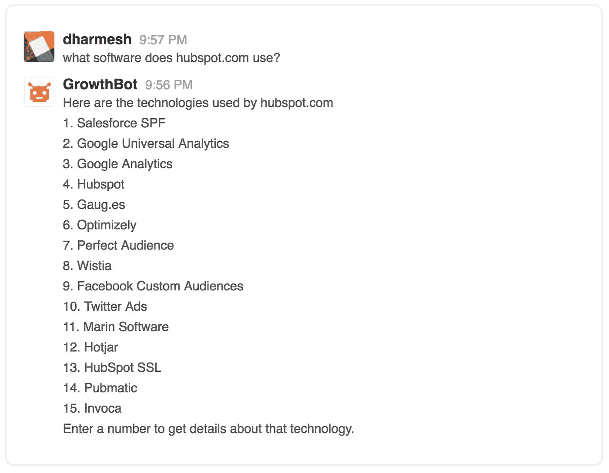

# 机器人如何帮助我们战胜分心

> 原文：<https://medium.com/swlh/how-bots-can-help-us-win-the-battle-against-distraction-7ab915e61e39>

上周二，我的大脑差点爆炸。我在写一些营销材料，我终于进入了状态。话语开始滔滔不绝。

然后出现了五个红色时差通知。一个同事在 WhatsApp 上给我发消息。我的手机嗡嗡作响，我诅咒自己没有把它静音。三封紧急邮件突然出现在我的收件箱里(很遗憾是开着的)，最糟糕的是，我真正的桌上电话响了。

我的注意力消失了。我忘记了自己在做什么，把注意力转向了这些明亮的、嗡嗡作响的警报。我查阅了一些研究数据，被一个关于开普敦水危机的故事吸引住了。

当我最终回到手头的任务时，我不仅仅是心不在焉；我很生气。不知所措。我突然感觉到我的待办事项清单和我想完成的所有事情的重量。

我热爱技术(毕竟我在 [HubSpot](https://www.hubspot.com/) 工作)，但是侵入性的工具会让每个人更难做他们最重要、最创新的工作。不断的任务转换也阻止我们进入心流状态的深度满足。

等等…什么是心流？

“心流”一词是由[心理学家米哈里·契克森米哈](https://www.psychologytoday.com/articles/199707/finding-flow)在 20 世纪 90 年代初创造的，它是一种意识状态，以创造力、享受和对工作和生活的深度投入为特征。这是一种如此全神贯注于一次经历的感觉，以至于其他事情似乎都不重要了[。你的注意力变得如此集中，以至于没有空间去考虑干扰性或不相关的想法。时间被扭曲了，你在那一刻迷失了自我。我们都有过这种难以置信的感觉——心流的基础是专注。](https://www.youtube.com/watch?v=8h6IMYRoCZw)

没有人在查看 Instagram 或杂耍五个活跃的文本线程时达到最佳的心理状态。但是，虽然技术可以极大地分散注意力(也是复杂大脑研究的主题)，但我们都试图掌握的工具实际上可能会让我们自由。

# 机器人是来帮忙的

你听说过机器人——大多数人都与它们互动过——但机器人只是一个自动执行特定任务的计算机程序。它通常通过对话界面与用户聊天来工作。因此，术语“聊天机器人”

聊天机器人的一些早期实验没有什么帮助，甚至完全令人讨厌，但下面是它们的工作方式:

想象一下我们正在进行 Skype 通话。我需要给你寄一些新材料。机器人不会切换程序，找到正确的文件，并最终发送文档或 URL，而是会“听到”我们对话中的引用，并通过消息传递字段自动共享它。

聊天机器人充当数字助手。它会进行任务切换，所以我们可以保持交谈的流畅。我们可以保持专注，不受干扰地完成工作。

当你在写一份重要的报告时，这个机器人可以扮演类似的角色。当你意识到一个日期不见了，你只会问机器人，而不是通过你的电子邮件，客户关系管理或松弛历史挖掘。你可以继续写——这也阻止了你检查脸书，因为你的注意力已经分裂了。

# 但是蠕变因素呢？

当我分享 Skype 的例子时，人们经常使用“潜伏”这个词他们把这个机器人想象成一个数字窃听者，侵犯他们的隐私，在不恰当的时候插嘴。

我理解这种反应，但请记住，机器人只是一个计算机程序。它拥有学习偏好和行为模式所需的人工智能，但缺乏批判性思维技能。它不做判断。这是完全保密的。它是为了提供帮助，而不是评估你是谁，你是如何工作的，或者你在讨论什么。

一种更强烈的反应是纯粹的恐惧。有些人担心机器人会取代人类的工作。我们已经看到自动化是如何消除了从排版到车辆装配的一切。技术继续改变着我们的世界。

但是机器人并不意味着要取代人类。在最好的情况下，它们可以帮助我们排除干扰。它们帮助人们更有效地工作。对于企业主来说，他们实际上可以通过最小化无用功和支持宏观、战略层面的思考来推动增长。

# 人类对机器

我们先来明确一下人和机器的本质区别。

计算机擅长处理、存储和解释数据和信息。

人们擅长发展洞察力，决定下一步行动，审查数据和创造性思维，创造性思维将分散的想法联系起来，以解决问题或表达想法。

不应该相信机器会提出见解，就像人类不擅长存储或处理大量数据一样。我们应该把它留给机器。

这就是通过技术获得自由的地方。当机器人可以将我们从存储和处理中解放出来时，我们可以回收精神空间来做我们天生的人类工作——包括找到心流的最佳点。我们可以在分心的时候把音量关小。

# 思考新兴技术的五种方式

如果你是一名企业家、营销人员、销售领导或任何试图发展业务的人，我想分享一些我们在 HubSpot 探索的东西。就像许多组织一样，我们渴望利用新兴技术。这些都是热门的创新，如人工智能、区块链、AR/VR 和机器人(包括我们新的 [GrowthBot](https://growthbot.org/) )。

但是，我们不想增加骚动。我们的目标是帮助人们重新获得关注。我们相信新技术应该服务于对你最重要的工作，而不是阻碍你实现心流的能力。

例如，Bot 技术将随着它成为主流而发展，但是当我们在这个未知的领域建设时，有五个原则我们正在测试。这些是我们的假设——我希望它们能为你和你的团队带来新的想法。

# 1.每个平台上的用户行为都不一样

最成功的机器人(和其他新技术)将与我们已经依赖的应用程序集成，但这些数字空间并不平等。

例如，在脸书信使和 Slack 上聊天的人使用这些平台的方式不同。

信使对话在本质上更倾向于个人化。虽然脸书在全球拥有数十亿用户，但也有很多噪音。许多公司已经发布了基于脸书的从购物到天气预报的各种机器人。

Slack 主要是一款商务 app。大多数人用它来和同事交流。在传统的朝九晚五的工作日里，交通流量很高，在下班时间，流量会有所下降。更加强调实用性和高效的信息交换。

如果你在使用新兴技术，考虑一下竞技场。想想什么是真正为你的用户服务的。任何新产品都应该以一种支持人们已经在那里完成的事情的方式运行和交流。确保你了解这个平台，并尽可能无缝地集成你的技术。你也可以利用你对这个空间的了解来加强你的营销。

# 2.消息应用可以鼓励病毒式的采用

自从首次亮相以来，现在第一次有更多的人使用社交消息应用(如 Messenger、Slack、WhatsApp)而不是社交媒体(脸书、Twitter、Instagram)。这是一个巨大的转变。如果我们深入研究，这种变化意味着什么？

这是通信技术的下一个合乎逻辑的步骤。例如，我们中的许多人是伴随着电视的单向信息流长大的。你只是袖手旁观。互联网使双向数字互动成为可能。随着手机的兴起，我们变得经常联系在一起。信息应用程序现在提供双向的，24/7 的个人网络连接。

为互联、移动和个人环境增加价值的聊天机器人将有望领先。从更广阔的视角来看，任何尊重这一领域细微差别的新产品和新技术都会赢得更多忠实用户和客户。

也想想社交技术是如何传播的。不是通过广告，而是通过使用和一对一的推荐。如果你在这五个文本线程上的朋友正在使用某个应用程序、机器人或技术，那么你很可能也会开始使用它。对于能够提供真正有价值的服务的人来说，这是一个令人兴奋的消息。

# 3.互联应用提升价值

说到价值，研究表明大多数人定期使用五个不同的应用程序。我们拥有增强日常工作和生活的核心工具。因此，通过下载新的应用程序来对抗分心是不会发生的。这是一个从我们已经使用的好处中挖掘更多好处的问题。

例如，我们正在构建 GrowthBot，用于十几个系统和 API。这意味着机器人可以从 CRM、ERP 或电子邮件系统以及 LinkedIn 等平台获取数据。毕竟，我们有谷歌。没有人需要信息检索系统。但是用一种更智能的方式来连接、整合和管理*你的*信息就是另一回事了。

新技术应该尽量减少噪音，而不是增加噪音。努力精简和连接。减少那些计算机最擅长的活动，把人解放出来更好地工作和生活。

# 4.我们都渴望高层次的体验

“颠覆性技术”是一个被过度使用的术语。但是很难找到更好的参考。像优步、Airbnb 和 Postmates 这样颠覆行业的想法改变了游戏，因为它们改善了体验。它们提高了效用——也满足了我们的情感需求。

例如，我们可能会选择 Lyft 而不是租车，因为这样麻烦更少(没有令人困惑的保险套餐)，而且通常更便宜。深入探究，情感的拉力是关于自由的。它可以让你随时随地去你想去的地方。你不受约束。你可以成为一个有选择、自由和独立的人。

如果我们想想聊天机器人和焦点之战，到底什么是分散注意力？人们希望变得更有效率，但同样，这种体验会更深入。消除分心带来的压力和焦虑让我们觉得我们可以做伟大的工作——重要的工作。我们可以成为最好的自己。这是一件大事。

探索驱动您的用户和客户的核心身份。帮助人们实现这些更高层次愿望的技术将在他们的生活中找到坚实的位置。

# 5.教育需要与技术发展相匹配

是的，机器人需要教育，但人也一样。

这么想吧。你对 Siri 吼过吗？我知道我有。当我们所期望的和我们所经历的不一致时，我们就让咒骂声满天飞。你认为 Siri 会打开地图，而她会拨肯德基。真令人沮丧。

对于任何新的颠覆性技术，我们都需要确保用户了解它的作用和局限性。聊天机器人不是网络浏览器。它的行为方式并不相同，这也不是它提供价值的方式。然而大多数人都有将近 20 年的浏览器使用经验。打开谷歌是一个很难改变的习惯。

作为创始人、产品创造者和营销人员，我们的工作是帮助人们学习新技能。我们可以不断拓展这项技术的功能，我们需要向人们展示如何利用它。

这些是我们目前的假设。我不能说它们是无懈可击的，因为 GrowthBot 仍然是一项实验。随着我们测试和学习如何更好地服务我们的用户，我们会知道更多。

最重要的是，我真的相信机器人(和其他新兴技术)有能力增强人类对话。我对可能性充满热情。技术最终可以将我们从数字革命带来的精神混乱中解放出来，并帮助我们重新获得空间、创造力和联系。

*最初发表于*[T5【blog.growthbot.org】](https://blog.growthbot.org/how-bots-can-help-us-win-the-battle-against-distraction)*。*

感谢阅读。

> 如果你喜欢这篇文章，请随意点击那个按钮👏帮助其他人找到它。

.