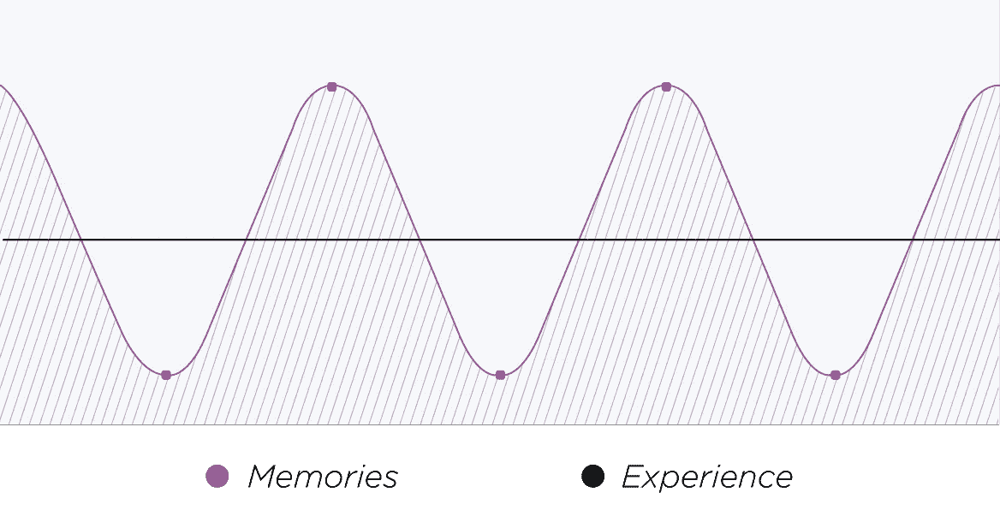
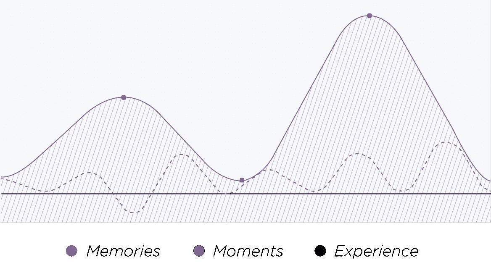

# 品牌体验如何影响顾客的记忆

> 原文：<https://medium.com/swlh/how-brand-experiences-influence-your-customers-memories-cea81bf01c97>

不久前，有人问我最喜欢的 YouTube 广告是什么。我的回答？"四秒钟的比赛结束的和开始的一样快"。问题是，我不记得广告是关于什么的，也不记得是谁做的。

这是因为我只看过一次，它从来没有机会印在我的脑海里，还是因为它真的没有那么令人难忘？

那天晚些时候，我在《T4》杂志上读到一篇 Curt Arledge 的文章，这篇文章再次引起了我的共鸣，文章详细阐述了为什么我们应该为记忆和体验设计网站。

我上面提到的四秒广告是为*体验*而**而不是** *记忆*制作的。

经验是一个常数，本质上是实时的。经验是对当下正在发生的事情的思考过程。然而，我们并不记得所有这些有意识的经历，相反，我们的大脑将所有比基本更大的片段都联系到记忆中。

我们对事件的记忆是在经历中最激烈的时刻(可能是高峰或低谷)和最后时刻形成的。下图展示了我想表达的意思。

一段记忆可能是积极的，并被测量为一个高峰，或者它可能是消极的/痛苦的，而这段记忆将被表示为一个低谷。

这一理论是由获得诺贝尔奖的心理学家丹尼尔·卡内曼通过他的顶点-终点规则理论创立的。因此，如果记忆中最强烈的体验并不那么愉快，并且结果最终是负面的，那么很多快乐可能会被记为痛苦。

# 那么这如何转化为营销呢？

**直截了当地说，用户需要从他们消费你的品牌的经历中获得积极的记忆。**

一个品牌的营销并不总是取决于一个人。当然，有一些公司把所有的事情都放在内部，但是从我的经验来看，在某些时候，代理机构会介入。

但是营销并不是代理的全部目的。

用户体验通常也受他们的支配，一个好的代理应该总是寻求改变来帮助用户更有效地浏览网站。客户有时可以控制这一点，但我认为，每当一个机构参与一个品牌的营销，无论他们是否有权力控制现场的变化，他们应该积极执行 UX 变化。

为什么？

这是因为，如果有任何形式的付费媒体或预算来推动客户有机地访问网站，那么糟糕的用户体验将增加跳出率，这将通过对质量分数的负面影响或在有机结果中促进 pogo sticking 来推高付费预算。

推荐使用 UX 测量工具，如 Hotjar，WhatUsersDo，甚至电话追踪都应该在代理商的任务清单上。

[*Hotjar*](https://www.hotjar.com/) 将提供热图分析和漏斗可视化。

[*WhatUsersDo*](http://whatusersdo.com/) 将允许一个代理进入客户的头脑，并发现他们如何使用网站。

*电话追踪软件(*如 [Ruler Analytics](https://www.ruleranalytics.com/) )可以提供宝贵的见解，帮助了解客户在与客户沟通时是如何处理的。

工具会有所帮助，但是需要在代理和客户之间有一个无缝集成的伙伴关系，让用户享受一个积极难忘的客户体验。这段经历也应该会有所收获。

毕竟，如果营销不能给用户一个明确的目标，那么营销还有什么意义呢？

管理这种体验不能仅仅由一个机构来承担。客户必须对有效交付、与客户的外部沟通和产品质量负责。这些都是营销机构无法直接控制的领域。

如果这些阶段中的任何一个出现问题，那么负面时刻都有可能降低最终产品的满意度(即用户接受/使用客户的产品/服务),并可能造成品牌的负面记忆。

***这本质上是创造客户满意度，并最终增加他们的幸福感。***

如果所有的齿轮都有效运转，那么顾客就有更多的机会从购买中创造积极的记忆。但是，当事情没有按计划进行时，客户、代理商和最重要的客户之间的沟通是防止负面时刻的关键。

举例来说，也许一个产品已经脱销，两个星期后才会回到仓库。如果客户与代理商交谈(我知道这是一个比实际发生的更简单的视图)，客户可以通过横幅通知现场或提供替代产品，通过避免意外延迟交付来防止糟糕的体验。

如果客户和代理商之间没有这种沟通，将会有很多不满意的客户，我们都知道他们不太可能回到这个品牌。

如果客户现场购买后，产品的运输将会延迟，那么通过电子邮件通知他们。提供替代方案甚至退款，尽一切可能防止出现低谷。

# 典型电子商务品牌的理想模式是什么样的？

首先，我不会使用代理/客户模式。为什么？因为我觉得有一家公司比其他任何公司都更能满足“客户体验”模式。

这个例子可以在所有情况下使用。该公司足够大，我们可以想象他们有许多机构与他们合作，以及 1000 名员工，因此部门之间的沟通是他们创造积极的品牌体验的关键。他们是谁？

我们都知道他们是谁，但是想象一下如果你不知道。下面的用户旅程可能会发生。

你可能会通过他们在搜索结果中的优势找到他们的网站，在商店里遇到一个消防电视棒，或者通过他们的[广告](https://www.youtube.com/watch?v=dHSFEjBulms)听说亚马逊 Prime。

这是你对品牌的介绍，如果这是一个积极的时刻，它会把你带到他们的网站。如果是否定的，很有可能你要么不会访问他们的网站，要么你会在到达后弹回，这篇文章的其余部分将变得毫无意义。

*这凸显了通过积极的体验向潜在客户介绍你的品牌是多么重要。*

找到想要的东西后，下一步就是轻松订购你想要的东西。在这种情况下，亚马逊不知疲倦地工作在他们的 UX 上，让人们通过结账过程。

亚马逊还以确保网站加载速度最快而闻名。UX 的一个重要部分是让用户尽可能快速有效地浏览网站，这是所有机构都应该确保他们的客户关注的事情。

然后是送货。Amazon Prime 已经使他们的产品交付成为一个令人难以置信的快速高效的过程。你可以在晚上下订单，然后在第二个工作日收到你的货物，不再收取额外费用。这是你在电子商务领域创造的最积极的在线时刻。

同样重要的是，当顾客意识到送货缓慢意味着他们去商店可能会更容易时，不要让顾客感到沮丧，也不要让他们产生强烈的负面体验。

最后，产品到达，希望它不辜负期望。

我知道以上是实际客户体验的简单版本。然而，为了简单起见，并且不使事情变得过于复杂，我想演示一个过于简单的场景。

如果有一个低谷，这是旅途中最紧张的时刻，会发生什么？它会降低对产品或服务的满意度吗？

我想有可能，但正如阿利奇指出的，“情绪高涨的经历对问题更有弹性。从理论上讲，一个巨大的高点可以压倒一次灾难性的经历”。

我觉得创造新的情绪高潮并降低顾客经历低谷的可能性的最好方法是，**不要让对产品的接受成为品牌体验的结束** *。*

如何始终致力于与客户取得联系，让他们表达他们的反馈，并尝试做出补偿。这可能会引发一个新的积极时刻，挽救局面(如果需要的话),让顾客回到你的品牌。

随着竞争比以往任何时候都更加激烈，企业必须考虑创造品牌福音，确保客户一次又一次地回到品牌，防止最终体验的发生。

那么，在更长的一段时间内，这个模型会是什么样子呢？

该图展示了负面时刻对品牌体验整体记忆影响较小的关系。与用户回到品牌时相比，没有经历低谷，比上次记忆中有更强烈的积极时刻，创造了增强的品牌体验。

我知道以上这些在纸面上看起来很明显，但事实是我在网上一次又一次地看到负面的品牌体验。这些都可以通过在适当的时候进行简单的交流来避免。

这篇文章最初由[安德鲁·阿克森](http://www.akesson.co.uk/)于[文](https://www.venndigital.co.uk/blog/2016/08/how-brand-experiences-influence-your-customers-memories/)发表。

# 如果你喜欢这个，请点击下面的绿色小心脏！