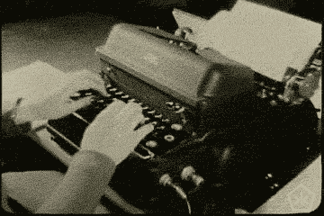
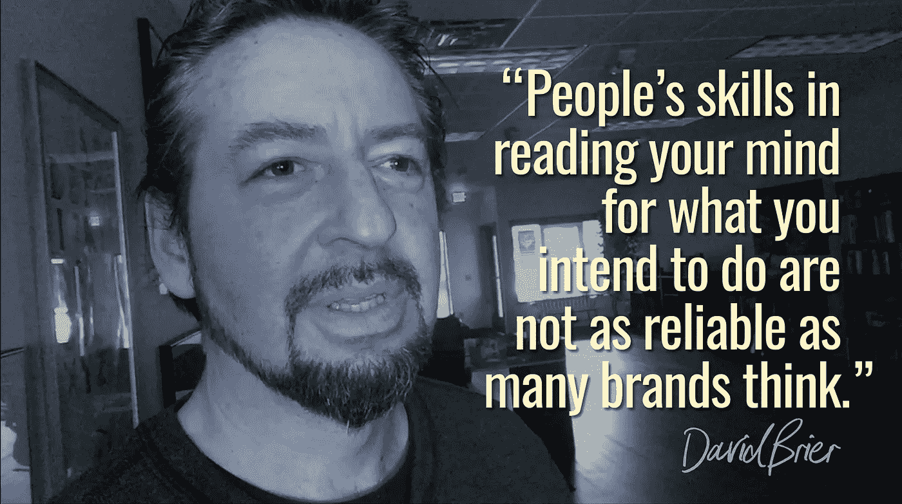

# “我很擅长看电视”——不，你不是

> 原文：<https://medium.com/swlh/how-busy-brands-really-fail-in-60-seconds-b7b55cd04d59>

## 如何用实际成绩消除成绩的假象

忙碌的品牌。疯狂的生活。过多的收件箱。疲惫的生活方式。

我的朋友戴蒙德·约翰在描述他的新书*时写了一些精彩的东西，这真的击中了我的要害:*“我们都有同样的 24 小时。关键在于你如何使用它们。”**

# 忙碌的品牌不是天生的。他们被制造出来了。

我们正处于一个文化流行的时期。

这都与我们花时间做的事情有关。

它影响着我们的生活。

它影响了我们这些创造品牌的人，尤其是我们这些管理忙碌品牌的人。

它影响一切。

# “我真的很擅长看电视”

事实是，你不是。你永远也不会。

你也不擅长盯着最新的音乐视频看。

或者看最新的大片。

或者看最火的新小说。

或者阅读最多的博文。

或者下载最多的关于如何做更多事情的电子书。

曾经有一段时间，我们都专注于我们 ***做过的事情:***

*   掌握我们做某事的技能
*   完善我们的艺术
*   在烹饪、绘画或写作中改进我们的技艺。

> 在生活中，你因做了什么而出名，而不是因消费了什么而出名。

这同样适用于品牌，也同样适用于人。

我说的不是“计划”做事。而是在*其实*做事。

否则，这是一种心灵感应的练习，相信我，人们对你打算做的事情的读心术并不像你想象的那么可靠。

这就是我在本周的《周三一分钟》中所讲述的内容:

# 密切关注方向(消费向内。创作向外走。)

从今天开始，用创造活动代替一种消费活动。

*   与其看一些节目或视频，不如制作一个。
*   而不是从任何地方寻求答案，给别人提供一些建议和帮助。
*   不要坐着看电视，出去散散步(或者更好，打电话给一个也打算坐着看电视的朋友，让你们两个一起去散步)
*   不要看别人创造了什么，自己画或画或写一些东西。

那么明天，你可以用两个创造的活动来代替两个消费的活动。

当我在媒体上读到这篇名为 [*停止消费的精彩文章时，我真的被这个概念打动了。开始创作。乔希·费希特。*](/the-mission/stop-consuming-start-creating-f992bf66f7e0)

在这篇文章中，乔希概述了他生活中的一个关键转变，他只是简单地改变了他所采纳的一种文化趋势，*用创造活动取代消费活动。*

过了一会儿，他发现他的生活发生了戏剧性的变化。

他这样总结道:

“在接下来的一年里，我没有读一百多本书，而是写了三百多篇博文和一本书。

*“在接下来的两年里，我拍摄了三百多个视频，而不是看 YouTube 上的视频。*

*“我没有去健身房锻炼，而是用我所拥有的去锻炼。现在，我参加铁人三项和障碍赛。”*

# 选择你的 30 天挑战

做上面的替换练习，每天一个。

另一种选择是:

我的好友兼挚友 Ted Rubin 向我介绍了这个概念，我测试了一下，发现它就像一颗神奇的药丸。

> 在接下来的 30 天里，每天至少联系一个陌生人(你不认识的人)，或者一段时间没有联系的人，和他们交谈，了解他们的新情况，保持兴趣和参与，想出你能为他们做些什么，为他们的生活增加价值的事情。

在接下来的 30 天里，每天至少有一个人这样做。

为一些神奇的事情做好准备。

说真的。

*最初发表于*[*www.risingabovethenoise.com*](http://www.risingabovethenoise.com/busy-brands-really-fail-60-seconds/)

## 这个故事发表在 [The Startup](https://medium.com/swlh) 上，这是 Medium 最大的创业刊物，拥有 312，822+人关注。

## 在这里订阅接收[我们的头条新闻](http://growthsupply.com/the-startup-newsletter/)。

