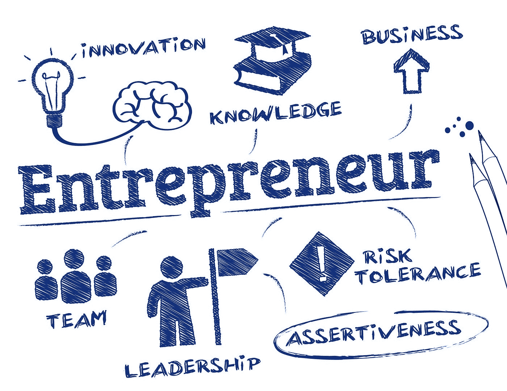

# 孩子们如何学习创业技能？

> 原文：<https://medium.com/swlh/how-can-kids-learn-entrepreneurship-skills-2fb2fae16a47>

正规教育体系中最令人沮丧的一个方面(也是众多方面中的一个)是不鼓励孩子们在职业生涯中掌握自己的事业。

学校教育系统的建立是为了让人们进入职业，获得固定的薪水，并向系统付费，而不是鼓励利用伟大的商业创意的机会。在一个…