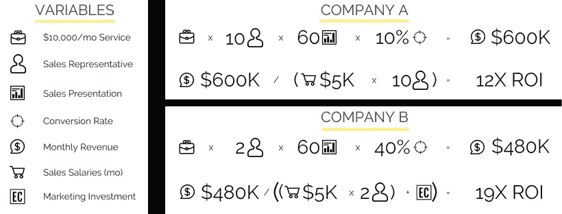
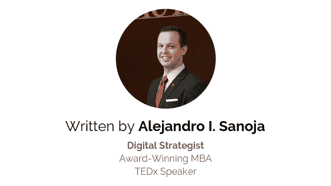

# 创业公司如何衡量其营销策略的投资回报率？

> 原文：<https://medium.com/swlh/how-can-startups-measure-the-roi-of-their-marketing-strategies-a56366ba9156>

你在营销方面的投资回报率是多少？这是每个初创公司在考虑营销投资时都必须回答的问题。拥有良好的营销策略和严格的执行并不足以产生可持续的增长。

**你需要投资营销吗？**没有！事实是，只要有一个好的产品(或服务)和一个销售团队，你就能赚钱。

**不投资营销，经营一家企业有效率吗？**绝对不行！出色的营销会让你的销售人员更容易达成交易，也让你的企业更容易发展。

想象一个没有四分卫的足球队。他们能得分吗？当然，他们会，但这需要大量的工作和沉重的负担。每个场地都会有很多障碍，因为球队必须经过对方几乎所有的防守队员。

现在想象一下，同一个队有一个出色的四分卫。对同一支球队来说，得分会容易得多。

另外，仅仅有一个四分卫并不意味着你的球队得分会更容易。你必须有一个好的四分卫遵循一个好的策略。

销售人员展示的产品具有[令人难忘的名称](https://www.elishaconsulting.com/blog-archive/2018/2/23/want-an-epic-name-for-your-business-use-this-simple-process-to-build-a-legacy) & [标志，](https://www.elishaconsulting.com/blog-archive/2018/1/4/what-you-need-to-know-about-logos)使用[字体](https://www.elishaconsulting.com/blog-archive/2016/7/29/what-font-is-best-for-you)和[颜色传达正确的信息](https://www.elishaconsulting.com/blog-archive/2016/7/27/choosing-a-color-palette-for-your-brand)，并且展示在已经通过其他媒介与您的品牌合作的客户面前，将有更大的机会达成交易。

让我们快速算一下来证明这一点。我们将比较两家公司，一家只投资销售，另一家投资销售和营销。A 公司"*完全是销售*"而 B 公司"*在销售和营销之间平衡他们的预算*。

# 公司 A

提供每月 10，000 美元的服务，10 名销售代表每月进行 60 次销售演示(几乎每天 3 次)，成交率为 10%。这意味着他们的月销售额为 60 万美元。在本例中，我们将销售代表的固定年薪设为 60，000 美元(这意味着每月 5，000 美元)。

这意味着每月 50，000 美元的工资投资将产生 600，000 美元的回报，这是 12 倍的投资回报率(总会有其他成本，但在本例中我们将保持简单)。

# B 公司

同样有每月 10，000 美元的服务，但只有 2 名销售代表，他们每月做 60 次演示，但成交率为 40%，因为他们通过营销努力获得了更高质量的销售线索。这意味着他们的月销售额为 48 万美元。他们向销售代表支付相同的工资，每月花费 15，000 美元用于营销，包括营销顾问和广告预算。

我的例子是营销顾问，而不是员工，因为我有偏见；)

这意味着每月 25，000 美元的销售和营销投资将产生 480，000 美元的回报，即 19 倍的投资回报率。

19 倍投资回报率> 12 倍投资回报率

营销+销售>只是销售

回到我们最初的问题。你如何确定对营销的投资将转化为销售增长？

在商业中，也在生活中，不确定性是敌人。我们都希望我们的问题得到具体和准确的答案。我们想在事情发生之前就知道会发生什么，这样我们才能有所准备。

因为作为人类，我们讨厌浪费资源！

这符合我们的幸存者偏见，因为如果我们不明智地使用我们的资源，我们的生命可能会在许多年内迅速结束。

在一次失败的狩猎旅行中花费太多的精力可能会让我们付出生命的代价。天气的意外变化会毁坏庄稼，危及我们的生命。

我们经常跳舞、献祭、举行尽可能多的仪式来让神眷顾我们，这样我们就能得到我们想要的结果。

尽管我们的环境已经发生了变化，我们的生存也不再那么依赖于一些关键事件的结果，如狩猎或耕作，但我们仍然受到不确定性的严重影响。焦虑、抑郁、心脏病、癌症……所有这些疾病都可能与人们不知道如何应对不确定性有关。

我明白，你不想在决定如何投资营销预算时有不确定性。**那么，你对以利沙咨询公司的投资回报率是多少？**

# 计算营销投资的投资回报率

在企业的任何职能领域，决策者都努力寻找尽可能准确地预测决策结果的方法。

平均而言，统计数字增加了我们“预测未来”的能力。借助回归等工具，我们可以了解一个变量(或一组变量)如何影响另一个变量。理论上，我们可以建立一个模型，将喜欢、评论、关注、博客浏览量和点击量作为“解释变量”，将客户花费的钱作为“响应变量”，以了解我们的战略性数字营销工作如何推动收入增长。

请注意我之前陈述中的“平均水平”。

这很重要，因为这是回归结果必须陈述的方式。比方说，我们运行我们正在谈论的回归，并发现评论和在你的电子商务商店中花费的金钱之间有很高的相关性。如果是这样的话，你不能说“关注者的评论越多，他们在你的电子商务商店上的花费就越多。”

你必须说，“平均来说，顾客花费的 X 元的增加可以用他们对你的帖子的评论数量来解释”。我不想在这里变得太专业，但关键是“平均”让统计学家摆脱了困境，因为:

*   相关性并不意味着因果关系
*   这是来自过去和未来的数据，事情可能会发生变化(例如，谷歌每天对其算法进行 2 次以上的更改)

但是不要绝望！

有很多方法可以衡量你的营销努力，以更好地了解如何做更多的工作，减少不工作。

但是，为了将数字转化为可以付诸行动的知识，必须有适当的流程和跟踪。这就是我们所说的营销专业化。

# 使您的营销专业化，以有效利用数据

让我们从一个简单的公式开始(不要担心，没有更多的回归…目前)。

潜在客户数量 x 转换率 x 每笔交易的利润(价格-成本)=总收入

简单对吗？你的收入将取决于你的目标市场有多少人，你将其中的多少人转化为客户，以及他们每次购买时你赚了多少钱。

根据这个简单的公式，**如果:**，你的营销投资将会有正的投资回报率

*   答:你增加了潜在客户的数量(例如，增加你的追随者或电子邮件列表的宣传活动)
*   b:你提高了你的转换率(例如，提高你的电子邮件活动的标题，使打开率从 10%提高到 30%)
*   c:降低你的产品或服务的成本(即消除你对谷歌或脸书广告的不产生正回报的重复投资)
*   d:增加每笔交易的消费金额(即发现你可能有捆绑销售的机会)

看似很简单，其实并不容易。更好的营销的最大障碍之一是大多数企业没有适当的流程和跟踪。如今，随着数字营销的发展，更容易进行这样的计算。

然而，许多人甚至没有把他们的网站连接到谷歌分析(这是免费的)。此外，大多数人没有清晰的客户旅程地图。

有一次，我们遇到一个潜在客户，**每月在 Google AdWords 上花费超过 1000 美元，并且他们的网站没有连接到 Google Analytics。**这意味着他们不知道每年 12，000 美元的投资是否真正产生了正的投资回报。

从本质上来说，营销就是了解哪些特定的活动有助于增加销售额。但是，为了识别这些特定的活动，你必须有清晰的流程和跟踪系统，因为如果你不这样做，基本上就像是盲目下注。

的确，正如我们以前说过的，在大多数事情中很难找到确定性。但这并不意味着我们不应该努力获得尽可能多的确定性。尤其是现在，我们有如此多的技术工具可以使用。

# 了解客户的旅程

我们在做营销时面临的最大障碍之一是，当我们成为销售者时，我们往往会忘记什么是购买者。

大多数企业想要脸书广告或点击付费活动，这将产生即时销售，并往往忘记他们如何作为一个买家。你上一次因为脸书的广告直接买东西是什么时候？

作为销售人员，我们往往会忘记，在某人做出购买决定之前，需要经过几个步骤。这通常被称为顾客之旅，它解释了人们是如何从对你的品牌和产品一无所知，变成购买你出售的所有东西并不停谈论它的人。

难道我们不都希望像苹果粉丝这样牺牲睡眠、排队几个小时的客户，为一个有些人可能认为定价过高的产品支付数百美元吗？然而，对他们来说，最重要的是成为第一个体验它的人，他们从苹果公司获得了如此多的价值，这是值得的。

你想要疯狂的粉丝吗？然后，你必须花时间规划和理解客户的旅程，然后才能改进它。事实上，大多数人认为，当人们购买时，旅程就结束了，但伟大的营销人员现在认为，这是事情真正开始的那一刻。

每家公司的每张地图都应该不同，但本质上，这一旅程有 5 个关键步骤:

*   未知的
*   意识
*   考虑
*   决定
*   风扇

未知:这是指人们对你的品牌或产品一无所知。他们甚至可能不知道你卖的产品存在，也不知道他们有一个问题可以通过你卖的东西来解决(想想 Airbnb 或优步创业时的情况)。

**认知度:**这是指人们知道你和你的产品，但他们还没有需求。

**考虑:**这是人们已经确定他们需要一种产品并正在评估他们的选择的时候。

决策:这是人们实际进行金融交易和商品交易的时刻。钱往这边走，产品往那边走。

**粉丝:**这是当人们购买你卖的几乎每一件产品，成为你品牌的拥护者，甚至可以影响别人购买你的产品。

这只是你能制作的最简单的顾客旅程图。在每一个不同的关键位置，你可以(也应该)尽可能详细地理解每一个步骤(即客户通常在成为粉丝之前就成为拥护者)。

还有，这不是一个线性的旅程。对于每个品牌，这些步骤(以及每个步骤的时间表)可能完全不同。

一家餐馆可能会在几个月内看到整个周期的发生，而一家汽车公司可能要等好几年才会发生。

那么，你如何开始规划你的品牌的顾客之旅呢？

# 规划和改善您客户的旅程

当你刚刚开始的时候，这可能会很复杂。首先，你可能需要根据你所在行业和竞争对手的信息做出有根据的猜测。但是，如果你的企业已经运营了几年，那么你就没有理由没有一份客户旅程的高级地图。

如前所述，最大的障碍之一是大多数企业没有合适的衡量机制。如果他们这样做了，仅仅拥有大量数据本身并不能解决这个问题。需要对这些数据进行战略分析，以了解它们对客户的旅程意味着什么。数据可以是:

*   订单数量
*   订单规模
*   订单的时间和日期
*   订单的地理位置
*   点击
*   捐款
*   追随者
*   喜欢
*   电子邮件开放
*   购物车的附件
*   等等。

这些都需要进行分组(根据我们谈到的不同关键时刻)，还需要进行准确性测试(例如，有时机器人可能会针对您的网站，您在某一天看到的一些访问或点击可能要打折扣)。

一旦你有了自己的地图，你就必须给每一个关键时刻分配一个货币价值。您想要的主要变量有:

*   客户终身价值(LTV): 这意味着一个客户对你的企业有多大价值。换句话说，在他们的一生中，每个客户从你这里购买了多少。
*   **客户获取成本(CAC):** 这意味着你要花多少钱让某人进入决策阶段并真正购买你的产品。即使你没有营销支出，获得客户也总会有成本，因为你支付给销售团队的工资，或者你在特定地点支付的租金，都可以让你让人们走进你的商店。
*   **客户保留率:**这意味着客户会在你这里呆多久。在他们第一次购买后，客户还会从你这里购买多少次？你的客户中有多少人不再向你购买？

一旦你有了客户旅程图的布局，并对你的 LTV、CAC 和留存率有了清晰的了解，你就可以开始理解如何计算你的营销投资的 ROI 了。

## 这篇文章发表在 [The Startup](https://medium.com/swlh) 上，这是 Medium 最大的创业刊物，有+421，678 人关注。

## 订阅接收[我们的头条](http://growthsupply.com/the-startup-newsletter/)。

# 关于作者

**亚历杭德罗·I·萨诺格是一个痴迷的竞争者。他热衷于面对挑战，解决问题，并创造必要的习惯来克服任何障碍。**

9 年多来，他一直在帮助企业按照自己的方式定义和实现成功。

亚历杭德罗在委内瑞拉出生和长大，毕业时获得经济学学士学位。他于 2015 年搬到休斯顿，参加休斯顿大学的 MBA 项目，并于 2017 年毕业，获得[杰出 MBA 学生奖。](http://bauerticker.uh.edu/graduate/bauer-college-recognizes-outstanding-graduates/)

企业家和企业主的生活充满了障碍。亚历杭德罗一直在那里，他希望通过培养“没有借口”的心态来帮助你达到下一个水平，以完成事情，为你的企业创造价值。

作为一名[数字战略顾问](https://www.latinpresarios.com/)，Alejandro 与各种各样的客户合作过，从需要帮助其品牌创建和走向市场战略的小型企业，到需要为当地项目筹集资金的非营利组织，一直到收入超过 19 亿美元并需要集成数字营销战略的上市公司。

作为一名专业人士，亚历杭德罗总是在寻找回馈社会的方式，并付出更多努力。他通过在不同的商业播客中分享他的经验，为几个在线出版物写作，在鲍尔 MBA 项目上进行持续的客座演讲，在 TEDx 舞台上谈论“积极的苦难”，在休斯顿互动营销协会上担任客座演讲人，他一直在寻找为企业家和企业主创造价值的新方法。

最近，亚历杭德罗加入了拉丁裔德克萨斯州政治行动委员会(T10)的董事会，以帮助增加拉丁裔和拉美裔在选举职位中的代表性，并让所有当选官员对拉丁裔社区负责，不管他们属于哪个政党。