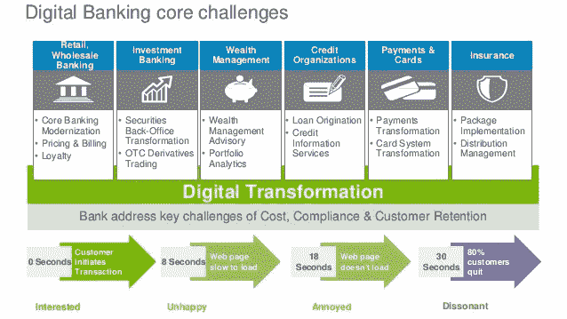

# 聊天机器人如何提升您银行的数字化转型工作

> 原文：<https://medium.com/swlh/how-chatbots-elevate-your-banks-digital-transformation-efforts-2ba0229f919>

数字化转型是一个"[使用技术从根本上改变您的业务的过程](http://www.itpro.co.uk/strategy/28047/what-is-digital-transformation)，并挑战银行以不同的方式思考其组织的每个方面。像[富含人工智能的聊天机器人](https://kore.ai/solutions/fintech-bots/)这样的新兴技术的使用，将员工和客户与系统和人工智能本身的互动转变为对话互动，使数字感觉更简单，更人性化。**还在往下读:** [**【智能聊天机器人】**](/@phanimarupaka/intelligence-in-chatbots-2be2fad3fc0c)**&**[**【未来聊天机器人】**](/@phanimarupaka/chatbots-of-the-future-1a94bb51db18)

# 为什么要使用聊天机器人来增强数字化转型？

根据 Gartner 的调查，*进行数字化转型的公司中，66%的公司期望从其运营中获得更多收入，48%的公司预测更多的业务将通过数字化渠道获得*。数字化转型的一个最终目标是自然地连接不同的流程和数字化项目，从而提高效率并实现无缝的业务运营。

聊天机器人将人、公司、系统和机器连接起来，并允许它们通过智能对话进行交流，就像我们与朋友交谈一样。随着智能与对话界面分层的出现，系统可以足够智能地适应和响应个人需求或行为，独立于人执行任务，并以前所未有的方式与其他系统和机器通信。

连接这些元素可以降低复杂性，而复杂性是推高成本的生产力杀手。SAP 的首席执行官 Bill McDermott 曾经说过“复杂性是我们这个时代最棘手的问题，是一种大范围的流行病，影响着我们的生活、工作，甚至我们的健康。”复杂性也对全球企业的底线施加了巨大的负面压力——仅全球最大的 200 家公司就带来了超过 2370 亿美元的压力[——鉴于大多数发达国家的生产率增长正在放缓或下降，这是一个重大问题。](https://executive.mit.edu/blog/three-ways-to-profit-from-business-complexity)

# 银行利用聊天机器人降低复杂性并增强客户服务。

负责增长、客户体验和数字战略的高瞻远瞩的银行家们[期待机器人](http://info.kore.ai/banking-executive-brief)提升他们的战略。无法提供出色的客户体验会产生不可否认的底线影响。87%的客户表示，客户服务——无论好坏——极大地影响了他们与公司做生意的决定。由于大多数客户更喜欢自助服务——寻找答案和解决问题，而不需要联系现场代理——银行正在寻求给他们想要的东西，同时开发一种成本低得多的服务渠道。

许多数字挑战的解决方案是会话式银行。与使用图形用户界面(GUI)来促进与客户的单向交互的传统银行应用程序不同，对话式银行是双向的，使用客户的语言。

例如，人类可以每分钟说 150 个单词，而打字则是每分钟 40 个单词。寻求报告欺诈活动支持的客户可以使用人工智能丰富的银行聊天机器人，通过语音到文本更快地处理他们的请求。如果与在[企业级平台](https://kore.ai/bots-platform/)上设计的聊天机器人进行交互，客户可以立即获得帮助，并对快速的对话解决感到满意。

# 聊天机器人提高了 IT 服务台工作人员和银行员工的工作效率。

效率低下不仅仅是麻烦。它每年耗费公司 20–30%的收入。使用 ITSM 聊天机器人的银行可以将员工和服务台员工的文本和语音命令翻译成任务，这些任务可以创建和更新系统数据、提取信息或报告，以及回答常见问题、文档和网站上的问题，速度比传统的数字化服务更快。

# 开始用聊天机器人量化潜在的结果。

为了确保银行资源得到优化，并实现聊天机器人技术的全部财务效益，您的金融机构的方法应侧重于产生最大潜力的优先事项。一个完整的人工智能丰富的聊天机器人战略将有利地影响您的银行的底线，这是由于:

*   **增加客户满意度和新业务。**通过聊天渠道与现有客户进行更简单、更人性化的互动，并以更便捷的方式推动新业务，使您的银行能够积极影响客户增长和获取战略。
*   速度、效率和生产力的提高。考虑将日常重复的服务台任务迁移到聊天机器人，即使只降低 50%的成本，也能减少支持呼叫时间。机器人还通过用现代的 24/7 即时对话参与取代耗时的跨屏幕导航和支持门户网站，让用户快速重新工作。
*   **流程人们不再需要触摸**。消除由于不同的流程、系统和渠道而导致的工作流程缺口，避免人工干预；复杂和/或一刀切的用户界面；系统知识/访问仅限于帮助台员工。
*   **培训费用减少或取消。**用对话式用户界面、自然语言和任何人都可以立即使用的熟悉渠道取代需要冗长的系统培训和有限使用的流程。
*   **管理人员编制和/或裁员**。自助服务和自动化工作流优化的自然结果。

探索聊天机器人如何快速完成日常任务，以增加银行的盈利能力。

**又读下去:** [**【智能聊天机器人】**](/@phanimarupaka/intelligence-in-chatbots-2be2fad3fc0c)**&**[**【未来聊天机器人】**](/@phanimarupaka/chatbots-of-the-future-1a94bb51db18)

— — — — -

谢谢你

法尼·马鲁帕卡

领英:[https://www.linkedin.com/in/phani-marupaka-02646b33/](https://www.linkedin.com/in/phani-marupaka-02646b33/)

推特:@phani_teja

## 这个故事发表在 [The Startup](https://medium.com/swlh) 上，这是 Medium 最大的企业家出版物，拥有 353，974+人。

## 在这里订阅接收[我们的头条新闻](http://growthsupply.com/the-startup-newsletter/)。

