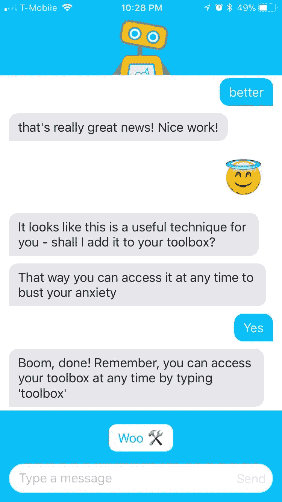
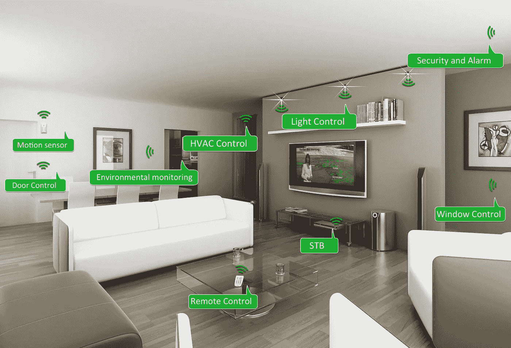
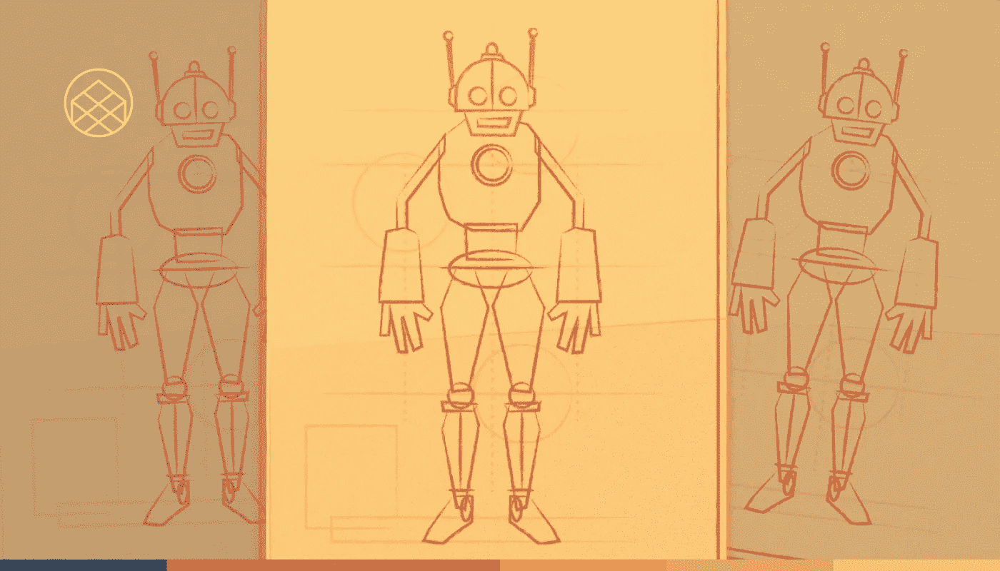
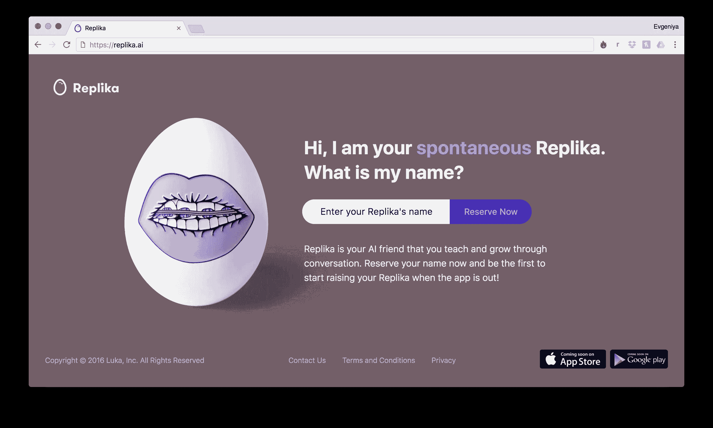
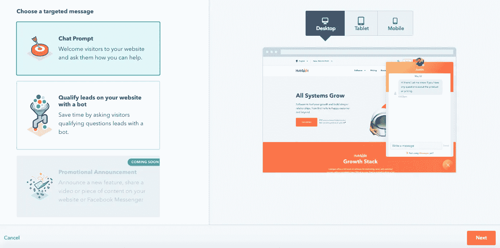

# 聊天机器人如何使用人工智能、机器学习和 NLP 来转变营销和销售

> 原文：<https://medium.com/swlh/how-chatbots-use-ai-machine-learning-and-nlp-to-transform-marketing-and-sales-2b957cd96b75>

爱丽丝一生都被焦虑所困扰。

今天，她感觉特别紧张:即将对她的新工作进行评估。

她在电话里发出一条长长的、发自内心的信息:她害怕同事们在背后嘲笑她；她认为自己不够聪明，不能胜任这项工作；她可能就要被解雇了。已发送。

几秒钟内，一条回复点亮了她的屏幕。

> “你在进行扭曲的思考:这是一种普遍的做法。
> 
> 这些不准确的想法通常被用来强化负面思维或情绪——告诉自己一些听起来合理而准确的事情，但只会让我们对自己感觉不好。
> 
> 我将发给你一张工作表，让你填写，这将有助于你正常地看待事情。"

这是爱丽丝期待的那种有分寸的、基于事实的反应。她写下自己的想法，她的神经不再紧张。

最近，她的焦虑情绪有所改善。但她没有接受治疗。她很久以前就放弃了药物治疗。现场没有新男友。

爱丽丝正在使用世界上第一个官方聊天机器人治疗师 [Woebot](https://www.woebot.io) 。由斯坦福大学心理学家和人工智能专家团队创建的 Woebot 使用对话、精选视频、情绪跟踪和文字游戏来支持心理健康。

这不再仅仅是闪亮的新设备和智能家居体验:Woebot 是人工智能如何渗透到我们生活的每个角落的一个例子。

有[聊天机器人律师](https://www.theverge.com/2017/7/12/15960080/chatbot-ai-legal-donotpay-us-uk)、[聊天机器人教育者](https://www.washingtonpost.com/news/innovations/wp/2016/05/11/this-professor-stunned-his-students-when-he-revealed-the-secret-identity-of-his-teaching-assistant/?utm_term=.70459dcfe4a7)、[聊天机器人客服代表](https://www.ubisend.com/solutions/customer-service)。

是的，他们可以为你的肤色建议合适的眼影，点你最喜欢的披萨或者制作一束鲜花。

但是他们也在为叙利亚难民提供咨询，帮助澳大利亚人获得 T2 国家残疾人福利，安慰 T4 过度工作的中国公民。

人工智能不会抢走我们所有的工作，也不会消灭人类。但它正在掀起波澜，从戏谑的荒谬到改变生活的严肃；在我们的家庭，我们的事业，我们的个人生活中。

是受欢迎的客人还是不速之客？

# 现状

## 1.艾在家

这是一个几十年来一直在媒体中流传的主题:超级连接、人工智能、物联网智能设备能够在满足需求之前预测我们的需求。尽管取得了巨大的技术进步，但这一承诺尚未实现。

所谓的“智能家居”市场是分散的，没有明确的先驱，尽管主导该领域的竞争非常激烈:预计到 2023 年价值将达到 1379.1 亿美元。

不出所料，安全性是首要考虑的问题。用 AI 解锁我们的 iPhone 是一回事；用它来打开我们的家完全是另外一回事。进入我们最私人的空间伴随着巨大的潜在风险。

因此，犯错的门槛处于历史低位。

> “如果你家里有一个机器人，”纽约大学心理学教授、未来学家加里·马库斯指出，“你不能让它跑进你的家具太多次。
> 
> 你不想让它把你的猫放进洗碗机，哪怕一次。"

2016 年，物联网僵尸网络 [Mirai 未来组合](http://www.mckinsey.com/industries/semiconductors/our-insights/security-in-the-internet-of-things)攻击了在线消费设备——包括家用路由器、婴儿报警器和网络摄像头——并瘫痪了整个欧洲&美国的互联网基础设施，造成了价值 1 . 1 亿美元的经济损失。

在另一场(稍微有趣一点的)公关灾难中，亚马逊的 Alexa 从一个孩子那里拿到了一个价值 170 美元的玩具屋订单。当一个新闻频道报道这一事件时，全国各地的 Alexas 都误认为这是一个命令，并重复下了命令。

尽管如此，人工智能设备在家庭中的潜力是巨大的，我们每天都在朝着更智能的未来迈进。

正如麦肯锡[预测的](https://www.mckinsey.com/~/media/McKinsey/Business%20Functions/McKinsey%20Digital/Our%20Insights/A%20smart%20home%20is%20where%20the%20bot%20is/A-smart-home-is-where-the-bot-is.ashx):

> “智能家居将类似于人类的中枢神经系统。核心将是一个中央平台，或“大脑”。家庭机器人可以像它们的角色一样多样化:大的、小的、不可见的(比如运行系统或产品的软件)、共享的和个人的。
> 
> 有些宅男会成为同伴或助手，有些则会成为财富规划师和会计师。我们将有家庭机器人作为教练、擦窗工和家务管理员，遍布我们的家。"

目前，不同消费设备之间的连接受到不兼容标准和缺乏互操作性的影响。

然而，像 [Netatmo](https://www.netatmo.com/) 这样的公司正在带领我们走向完全连接，让我们可以选择在 Messenger 中使用聊天机器人来控制所有连接的设备。

## 2.商业人工智能

难怪越来越多的企业依赖人工智能:自动化，手工工作可以外包，这意味着人力资源被释放出来；钱省了；技术工作的投资更高(更不用说企业获得的用户数据金矿了)。

甚至美国政府机构也在考虑部署聊天机器人来减轻工作人员的工作量。

公司继续[为越来越多的用例推出聊天机器人](https://blog.hubspot.com/customers/understanding-the-difference-between-a-chat-bot-and-robot)，有时盲目，但通常很出色。

一个设计良好、战略实施得当的机器人可以为商业创造奇迹；一个笨拙的、不必要的聊天机器人会做相反的事情。

> 到 2020 年，80%的企业想要聊天机器人，这就引出了一个问题:我们什么时候需要它们，什么时候[不需要它们](https://blog.hubspot.com/marketing/good-bots-vs-bad-bots)？

最伟大的[成功故事](https://blog.hubspot.com/marketing/brands-already-using-chatbots-in-their-marketing)往往存在于电子商务和在线营销领域，这要归功于机器人重新参与、讲述品牌故事的能力，以及比电子邮件更高的转化率。正如艾德琳·周在她出色的文章中所强调的:

> 来自一个品牌的尴尬或恼人的问题在社交上是可以接受的，甚至在聊天机器人互动中是受欢迎的。

在最简单的互动中，访问者将通过弹出窗口与机器人互动，然后被发送到某种形式的销售漏斗中。

在线零售商 ASOS [利用这种技术将](https://www.facebook.com/business/success/asos#)的订单增加了 300%,获得了 250%的投资回报，同时接触到了 3.5 倍多的人。

但是，人工智能在商业领域的应用不仅仅局限于网上购物和机器人，令人兴奋的发展仍在不断涌现:

[德勤](https://www2.deloitte.com/uk/en.html)和机器学习开发商 [Kira Systems](https://kirasystems.com/) 一起创建了可以在几秒钟内从数千份复杂文档中提取和构建文本信息的模型。

[Niles](https://niles.ai) 是一个人工智能驱动的 Slack 附加软件，它可以监听和记录对话，使它们可以搜索和容易分析。 [AISense](http://aisense.com) 已经发布了类似的视频通话技术。

从虚拟现实到面部识别，主流人工智能的用例越来越广泛。

## 3.我们关系中的人工智能

人工智能能够替代生命中最有意义、最独特的人类联系:陪伴吗？Eugenia Kuyda 是这样认为的。

通过综合成千上万的对话，她建立了一个聊天机器人，成为一个已故朋友的超级令人信服的相似物。这个聊天机器人现在被统称为“T21”。

Replika 于 2017 年 11 月向公众推出:它反映了你的情绪、习惯、偏好、语言句法、怪癖和说话方式，直到它成为你自己的“复制品”。它被宣传为千年孤独和不安全感的解毒剂。

结果令人印象深刻。今天，超过 50 万人使用 Replika，称赞它的“*内置自我反思*”和“*关怀的风度*”。有些人甚至声称它是“*比我真正的朋友*更好的朋友。”

雷普利卡的吸引力似乎主要基于自省和一种无害的自恋:对任何人来说，不带偏见地反映自己都是有价值的，但也许特别是对敏感和受社交媒体困扰的人。

治疗是一个巨大的承诺，无论是在时间上还是经济上。对许多人来说，这不是一个选项。像 Woebot 这样的系统应运而生:一年 365 天，24/7 全天候支持。尽管 Woebot 的创造者热衷于强调它不是治疗的替代品，但它可以成为那些无法获得真实事物的人急需的权宜之计。

像 Repkila 一样，Woebot 提供了一种真正无偏见的关系，这可以说是人类不可能实现的。

该公司首席执行官艾丽森·达茜说:“在我的职业中，这样说几乎是违法的，但是人际关系中有很多噪音。”。*“吵闹是对被评判的恐惧。这就是耻辱的真正含义。”*

治疗师对这些发展既热切又谨慎。正如聊天机器人的批评者经常指出的那样，许多机器人是为了解决问题而解决问题的。

量产疗法能例外吗？

# 过去

## 人工智能的历史

在过去的几年里，人工智能和相关的机器人已经成为主流。但人工智能的概念已经存在了数百年，引发了许多哲学辩论。

早在 1637 年，勒内·笛卡尔就在他的著作 ***中讨论了人工心灵的可能性，论述了方法*** :

> “如果有机器与我们的身体相似，并尽可能接近地模仿我们的行为用于所有实用目的，我们仍然应该有两个非常确定的方法来识别他们不是真正的人。”

然后，在 20 世纪中叶，计算机科学先驱艾伦·图灵带着同样的想法，开发了现在著名的图灵测试(或“模仿游戏”)的挑战——一种检查机器是否表现出智能的实用方法。他预测说:

> “……在大约 50 年的时间里，将有可能对存储容量约为[1GB]的计算机进行编程，使它们能够很好地玩模仿游戏，以至于一个普通的询问者在五分钟的询问后做出正确识别的概率不超过 70%。……我相信，在本世纪末，词语的使用和普通的有教养的观点将会发生如此大的变化，以至于人们能够谈论机器思维而不期望被反驳。"

但正如我们现在所知，人工智能最初是一个度假项目，由约翰·麦卡锡在 1956 年作为一个研究小组的一部分创造的。麦卡锡将人工智能定义为“制造智能机器的科学和工程”，并在 1958 年利用他的工作开发了编程语言“T2”Lisp。

Lisp 是基于计算机使用符号表达式而不是数字的激进思想；这帮助催生了整个人工智能产业。

## 进入机器人

[**伊莱扎**](https://en.wikipedia.org/wiki/ELIZA) 是第一个聊天机器人，由约瑟夫·威森鲍姆于 1966 年创建。它使用模式匹配和替换方法来模拟对话，并能够通过图灵测试。

[**帕里**](https://www.chatbots.org/chatbot/parry/) 是由美国精神病学家肯尼斯·科尔比(Kenneth Colby)于 1972 年模仿一名精神分裂症患者建造的。

接下来是开发者罗洛·卡彭特创作的[**jabber wacky**](http://www.jabberwacky.com)(1988)。Jabbewacky 使用了一种称为“上下文模式匹配”的人工智能技术，最终目标是从基于文本的系统转向完全由语音操作的系统。

A.L.I.C.E 于 1994 年首次开发，后来用 Java 编程，是第一批语言处理聊天机器人之一；它使用 AIML(人工智能标记语言)来指定对话规则。创建于 2001 年的自然语言工具包( [NLTK](https://www.nltk.org/) )，是一套用 Python 编写的工具，是专门为了让 NLP 简单易学而设计的；它包括建立你自己的聊天机器人的方法。

苹果公司 2010 年为 iOS 开发的 Siri 可以说是下一个突破。一个智能的个人助理和学习导航器，它使用自然语言 UI，并为所有 AI 机器人和 pa 铺平了系统，之后:

那些包括 2012 年推出的 [**Google Now**](https://www.androidcentral.com/google-now) ，回答问题，执行动作，提出建议； [**Cortana**](https://www.microsoft.com/en-in/windows/cortana) ，2001 年首次演示，同时集成到 Windows phone 设备和 Windows 10 PCs 中；亚马逊的智能个人助理 Alexa 于 2014 年推出，现已内置于亚马逊 Echo、Echo Dot、Echo Show 等设备中。

那么，我们该何去何从呢？我们希望[机器人](https://blog.hubspot.com/marketing/how-to-build-a-chatbot)如何发展？哪些类似人类的能力应该整合到 AI 中？什么技术使这成为可能？

**视觉和图像处理**

图像识别是人工智能面临的重大挑战之一。2015 年，谷歌和微软深度学习系统首次在识别图像中超过 1000 个类别的物体方面击败了人类。

这种系统将成为超越人类能力的图像识别的基础。

图像处理也是自动驾驶汽车的一个关键组成部分:自动驾驶汽车需要识别高速公路的边缘、前方汽车的距离、下一个路口的停车标志等等。

**自然语言处理**

自然语言处理——将计算技术应用于自然语言的分析和合成——是人工智能的圣杯。这听起来可能很抽象，也很专业，但它现在就在我们身边:在微软的 Word 拼写检查中；垃圾邮件过滤器；数据挖掘搜索引擎；翻译系统。

甚至金融市场也通过提取相关数据来使用 NLP，以帮助做出算法交易决策。

**语音/声音识别**

语音识别获取来自我们嘴里的噪音，并(有希望地)将它们转换成可以被 NLP 进一步处理的单词和句子。语音识别对于 Siri 和 Alexa 这样的应用来说至关重要。

尽管该技术在过去十年中有了巨大的进步，但在处理不同的地方口音、嘈杂环境中的语音或重叠语音方面，仍然存在重大挑战。

语音识别也有广泛的应用。例如，它用于生物认证，通过识别声音的独特特征来识别一个人。一些银行系统现在使用语音验证技术来提供一种信心措施，即说话的人是建立帐户的同一个人。

几十年来，研究人员一直致力于图像识别、自然语言处理和语音识别问题。最近有哪些促进进步的发展？

可能最根本的进步在于机器学习的发展:你不必将知识明确地输入计算机，而是给它许多例子，让它发展可以应用于新情况的概括。

**机器学习**

机器学习是一种自动建立分析模型的数据分析方法。它是人工智能的一个分支，基于系统可以从数据中学习，识别模式并在最少的人工干预下做出决定的想法。

尽管机器学习的概念中包含了大量不同的方法和技术，但其中大多数方法和技术的基础是统计学。这使得算法能够基于从不完整且通常有噪声的输入数据中提取模式来进行预测。

在机器学习中，人工神经网络已经获得了突出的地位，最初是受人类和动物大脑中发现的连接神经元网络的启发。

本质上，当涉及到训练人工神经网络时，最好的方法是让系统进行猜测，接收反馈，然后再次猜测，不断改变概率，以获得正确的答案。

作为旨在复制人类学习方式的受大脑启发的系统，神经网络修改它们的代码，以在输入和输出之间的关系复杂或不清楚的情况下找到这种关系。

这十年来，人工神经网络受益于[深度学习](https://blog.hubspot.com/marketing/what-is-deep-learning)的到来，深度学习增加了网络中不同层的“深度”，以提取不同的特征，直到网络能够识别出它在寻找什么。

虽然机器学习的进步涉及到许多复杂的数学和新算法，但它们通常需要大量的输入数据和相应的巨大计算能力。

更快的 CPU 和 GPU 来拯救。人工智能现在如此重要的一个重要原因是，直到最近几年，处理如此多数据的成本才变得可以承受。

直到 2000 年代末，研究人员才意识到为 3D 图形和游戏开发的图形处理单元(GPU)在计算密集型人工智能任务方面比传统 CPU 好 20-50 倍。

一旦人们意识到这一点，可用的计算能力就会大大增加，从而使云人工智能平台能够为今天的许多人工智能应用提供动力。

# 准备好开始了吗？

HubSpot Chatbot Builder

将人工智能融入到你的业务中就像通过实时聊天自动对话一样简单。有很多方法可以做到这一点，仔细考虑如何最好地进行是很重要的。

如果没有开发人员的技能，从头开始构建聊天机器人可能是一个漫长而复杂的过程，而且没有回报。这就是为什么我们一直在致力于我们的聊天机器人生成器 T1，一个可视化的 T2 机器人生成器 T3，它用简单的术语描绘出通常复杂的界面。

或者，您可以使用和个性化一个预制的框架。以下是一些方法:

*   [**HubSpot 实时聊天**](https://www.hubspot.com/products/sales/live-chat?utm_source=medium.com&utm_medium=referral&utm_campaign=chatbots-ai-machinelearning-nlp) **:** Messages 是专为销售团队打造的实时聊天工具。你可以通过识别用户最常问的问题和收集反馈来优化你的网站。重复的聊天会被发送给同一个销售代表，以建立更好的关系。此外，所有对话都会自动同步到 CRM 中联系人的时间表，从而可以轻松安排后续任务、电子邮件和电话。
*   [**Facebook Messenger 机器人**](https://messenger.fb.com) **:** 如果你的企业在社交媒体上很活跃，那么一个机器人很有可能会帮助瓦解销售过程。[Facebook Messenger bot](https://blog.hubspot.com/marketing/facebook-bots-guide)无处不在，应谨慎使用。然而，设置一个相对容易。要创建一个脸书机器人，你需要:*一个公共的脸书页面。一个脸书开发者应用程序，它将连接到你的 webhook 服务器和你的页面。*
*   像 [Chatfuel](https://chatfuel.com/) 、 [Botsify](https://botsify.com/) 和 [OnSequel](http://www.onsequel.com/) 这样的工具可以让你在没有任何编程知识的情况下创建一个聊天机器人。
*   [**Slack 机器人**](https://slack.com/apps/category/At0MQP5BEF-bots) **:** Slack 机器人服务于更内部的目的，通常用于企业与员工的沟通。Slack 内置了机器人，可以为三个主要目的构建或定制——回复、通知和命令——而不需要一行代码。
*   [**growth bot**](https://www.growthbot.org):growth bot 是一款帮助销售人员和营销人员实现工作流程自动化的数字助理。它通过 Messenger、Slack 或 Twitter 将问题的答案直接带给你，从而减少分心。
*   [**HubSpot Conversations**](https://www.hubspot.com/company-news/hubspot-announces-free-conversations-tool-for-multi-channel-one-to-one-communication-at-scale)**:**Conversations 是一款免费的多渠道工具，旨在帮助企业构建聊天机器人和衡量回应。它统一了来自 Facebook Messenger、现场聊天、社交媒体等的对话，并将它们都植根于 CRM 中。

# 今后

尽管人工智能的进展似乎令人窒息，但我们仍然处于人类和机器人关系的最开始。

随着我们探索这项技术的潜力，我们将发现这些类似人类的对话伙伴的新用途；作为回应，我们几乎肯定会改变自己的行为和预期。

大问题依然存在:我们是希望聊天机器人更像人类(有知识、有同情心、没有判断力)还是不像人类(简单得令人害怕、机器人化得令人放心)？只有时间能证明一切。

在那之前，人工智能将继续渗透到我们的生活中，并最终改变我们的生活方式。我迫不及待地想知道接下来会发生什么。

感谢阅读。

> 如果你喜欢这篇文章，请随意点击那个按钮👏帮助其他人找到它。

*原载于*[*blog.growthbot.org*](https://blog.growthbot.org/how-chatbots-use-ai-machine-learning-and-nlp-to-transform-marketing-and-sales)*。*