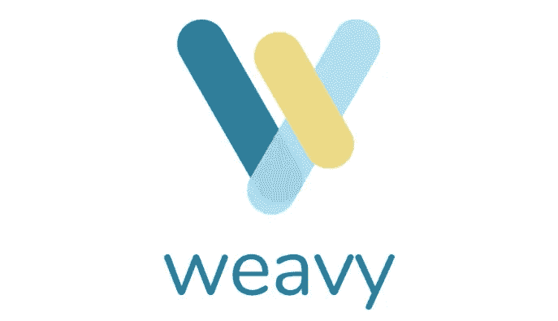

# 技术协作正在发生怎样的变化，为什么开发者应该关注

> 原文：<https://medium.com/swlh/how-collaboration-in-tech-is-changing-and-why-developers-should-care-c1569266a4fe>

(image by: [@samuelzeller via Unsplash.com](https://unsplash.com/photos/VK284NKoAVU))

## 商界目前正在经历一场革命性的变革。在不断变化的人口统计数据、新型移动设备和基于云的应用程序的爆炸式增长以及廉价互联网接入的日益普及的推动下，技术驱动型企业正在寻求利用当今工作不断发展的性质。这一演变的最前沿是在技术和更广泛的工作场所中协作的意义、功能和能力的持续转变。许多当代企业正试图通过采用越来越多的独立应用程序来改善员工协作。针对这一趋势，本文将认为，商业协作的未来植根于集成的社交技术和对应用程序设计和使用的“筒仓方法”的抛弃。如果软件开发人员希望创建未来终端用户会喜欢的病毒式应用程序，他们必须接受工作场所协作的集成特性。

# 工作性质的变化

(image by: [State Farm via Flickr.com](https://www.flickr.com/photos/statefarm/26843056822))

以技术为中心的劳动力市场目前正在经历过去 100 多年来最重大的转变之一。

正在进行的工作类型；从事这种劳动的雇员的种类；工人的期望、惯例和实践；用来完成各种任务的工具正以令人眼花缭乱的速度发生革命。

思科系统公司 2013 年[互联工作场所白皮书](https://www.cisco.com/c/dam/en_us/solutions/industries/docs/workplace/connected-workplace-wp.pdf)描述了“一系列引人注目的变化”,这些变化目前正在“重塑公司的组织方式、运营方式以及吸引和留住人才的方式”,特别提到了三个关键发展:

1.  **劳动力人口统计**:“婴儿潮一代中年龄最大的人——那些在 1946 年至 1964 年间出生的人——在 2011 年达到了退休年龄。仅在北美，今后 20 年每天就有 10，000 名婴儿潮一代达到退休年龄”；
2.  **工作性质的改变**:“在过去的 20 年里，公司已经将许多结构化或面向流程的工作自动化并外包出去。剩下的工作是无结构的、复杂的、高度协作的”；和
3.  **持续的技术创新**:“移动设备的爆炸式增长，加上无处不在的互联网接入和基于云的应用程序的广泛可用性，正在改变工作的地点和方式”。

目前有五代不同的劳动者同时在一起工作。这种动态将持续到可预见的未来，从而保证在未来一段时间内出现相当“混合”的劳动力。

这些[五代人](https://hbr.org/2009/10/are-you-ready-to-manage-five-g)包括“传统主义者”(1946 年前出生)、“婴儿潮一代”(1946 年至 1964 年出生)、“x 世代”(1965 年至 1976 年出生)、“千禧一代”(1977 年至 1997 年出生)和“2020 代人/z 世代”(1997 年后出生)。

**不可否认，千禧一代正在对工作性质的变化施加最大的影响。**

他们是集体进入劳动力市场的最新一代人；截至 2015 年，他们也是历史上最大的一代，也是美国和加拿大劳动力市场上最大的一代(来源: [1](http://www.pewresearch.org/fact-tank/2015/05/11/millennials-surpass-gen-xers-as-the-largest-generation-in-u-s-labor-force/) 、 [2](http://www.canadianbusiness.com/innovation/the-millennial-majority-workforce/) 、 [3](http://www.goldmansachs.com/our-thinking/pages/millennials/) )。

研究表明，与以前的同龄人相比，千禧一代:

*   **期待并寻求职场中更大的灵活性和更多的选择**，定期表明他们愿意不断换工作，直到找到自己完全满意的工作([来源](https://www.cisco.com/c/dam/en_us/solutions/industries/docs/workplace/connected-workplace-wp.pdf))；
*   **期望即时获得信息，从上级那里得到即时反馈**，能够诚实、公开地向同事表达自己的意见，在工作的同时有机会参与个人发展和职业提升(来源: [1](https://www.modolabs.com/blog-post/technology-in-the-21st-century-workplace-millennials-shape-the-status-quo/) 、 [2](https://www.forbes.com/sites/paycom/2017/03/08/the-millennial-expectation-of-technology-in-the-workplace/#7703de64a507) 、[3](http://www.business2community.com/brandviews/magentrix/5-trends-next-generation-employee-collaboration-01628490#6DolfQK7EwV1j1xF.97))；
*   **代表第一代“数字原住民”**:成长于互联网时代，“科技已经完全融入千禧一代的日常生活”(来源: [1](http://www.goldmansachs.com/our-thinking/pages/millennials/) 、[2](https://www.forbes.com/sites/paycom/2017/03/08/the-millennial-expectation-of-technology-in-the-workplace/#7703de64a507))；
*   **大量涉足科技领域**，创立了一些 21 世纪最成功的初创公司(包括 Airbnb 的布莱恩·切斯基、脸书的马克·扎克伯格、Instagram 的迈克·克里格和凯文·斯特罗姆，以及 Lyft 的约翰·齐默)(来源: [1](https://www.forbes.com/sites/williamarruda/2017/08/02/the-surprising-thing-millennials-want-from-their-career/#765ce31824fc) 、[2](https://www.inc.com/rahul-varshneya/top-20-most-influential-millennial-entrepreneurs.html))；和
*   **从根本上致力于将技术的使用**整合到他们工作的几乎所有方面，经常表示(例如，在调查中)工作场所是否存在最先进的技术会显著影响他们接受工作的决定(来源: [1](https://www.modolabs.com/blog-post/technology-in-the-21st-century-workplace-millennials-shape-the-status-quo/) 、 [2](http://www.zdnet.com/article/millennials-at-work-tech-is-more-important-than-free-lunch-and-ping-pong/) )。

随着千禧一代继续对劳动力的规模和形态产生更深远的影响，企业必须继续致力于调整其价值观、哲学和运营以适应这一代人的独特需求、期望和技能。

现代工人，特别是千禧一代，希望他们的雇主提供(物理和数字)基础设施，让员工可以轻松、即时和远程地相互协作。

因此，对于软件行业的企业来说，理解并根据工作场所协作不断变化的本质来发展他们的业务和产品至关重要。

让我们更深入地了解一下当今协作不断发展的本质。

# 当今的合作状态

(image by [Free-Photos via Pixabay.com](https://pixabay.com/en/workplace-team-business-meeting-1245776/))

随着 21 世纪技术的进步继续塑造和完善商业，特别是软件开发，工作场所协作的性质和功能也在不断发展。

现代劳动力的[动态](https://www.cisco.com/c/dam/en_us/solutions/industries/docs/workplace/connected-workplace-wp.pdf)——越来越遥远、自动化和外包；以技术为中心；方向数字化；高度相互依赖且复杂；和非结构化——正迫使企业，尤其是科技企业，越来越重视协作。

“**”可以定义为“一种合作安排，其中两方或多方……为实现一个共同目标而共同努力”。**

> **实际上，协作通常需要“与同事或外部利益相关者一起处理文档、项目计划、报告或其他类型的内容，以创建该内容的修订版或最终版本，或[使]项目得以执行”([Dimensional Research/Alfresco](https://www.alfresco.com/sites/www.alfresco.com/files/dimesional-research-collab-survey-findings-report-082415.pdf))。**

**科技作家[贝基·劳洛尔](https://itbizadvisor.com/2016/10/the-future-of-collaboration-in-the-workplace/)解释了工作性质的变化如何影响工作场所协作的变化特征，同时也受其影响:**

**随着[现代]工作场所的发展，工作场所的协作也在发展。当更多的员工远程工作，团队自然更加分散时，企业正在重新思考员工如何协作。反过来，他们必须开发最有效的方法和工具，供员工在更加数字化的环境中使用。…**

**[当今的员工]需要更多的灵活性和自由来选择完成工作的方式、地点和时间……公司[必须]提供技术资源，以支持高效的数字工作环境……[并]反映[员工]在个人时间在消费设备上享受的迷人而直观的体验”。**

**众所周知，工作场所的有效协作对成功发展企业至关重要。**

**[Shelly Kramer](https://converge.xyz/collaboration-workplace-best-practices-2017/) 指出，以技术为主导的协作不仅为创新和创造性解决问题创造了更多机会，而且“在高效团队能够完成的事情方面，它也提供了一种竞争商业优势”。**

**事实上，**研究表明，有效的工作场所协作会提高生产力**，从而鼓励一系列积极的成果，包括:**

*   **简化操作；**
*   **降低成本；**
*   **增强团队之间的凝聚力；**
*   **更多敬业的员工；**
*   **更高的员工保留率；**
*   **更好的客户体验；**
*   **转诊增加；和**
*   **一个明显更好的底线(来源: [1](https://www.themarketingscope.com/productivity-the-secret-to-a-small-business-competitive-advantage/) 、 [2](https://www.raconteur.net/business/collaboration-is-good-for-business) 、 [3](https://talentculture.com/6-eye-opening-employee-engagement-statistics/) 、 [4](https://www.pcmag.com/article2/0,2817,2493673,00.asp) 、 [5](https://www.pcmag.com/article2/0,2817,2489110,00.asp) )。**

**因此，Jaimee Newberry 坚持认为“公司及其多学科部门的合作从未像现在这样重要”是正确的。**

**事实上，数字协作对现代企业来说是不可或缺的，创造框架让这种协作成为可能的天才开发人员也是如此。**

## **那么，我们自然会问:2017 年科技世界的合作现状如何？**

**这个问题有两个答案:**

1.  **在工作环境(物理和数字空间)中，先进的社交技术的使用越来越频繁和复杂，这推动了协作；但是**
2.  **对使用独立应用程序的广泛依赖，构成了工作场所协作的“竖井方法”，意味着许多企业未能实现与增强协作相关的真正潜力。**

**我想先充实一下这两点，然后再讨论**如何将协作重新概念化为一个*特性*并将其嵌入软件**—[**Weavy**](https://www.weavy.com/)现在使之成为可能——如何显著改善工作场所的协作，从而鼓励你的目标用户接受你的软件。**

# **先进社会技术的到来**

****

**(image by: [@nuchylee via Freekpik.com](http://www.freepik.com/free-photo/businessman-using-smartphone-at-outdoor-of-the-office-building_1160861.htm))**

**正如克里斯蒂安·巴克利(Christian Buckley)所言，“社交协作已经成为现代数字工作场所的基础结构”。**

**这并不令人惊讶，因为一些行业专家，如 Atlassian 的 R&D 主管 Dom Price，估计大约 90%的组织正在处理如此复杂的问题，以至于有必要采用基于团队的解决方案([来源](https://www.entrepreneur.com/article/295265))。**

**事实上，基于互联网的社会互动中的技术进步已经为现代员工一起工作和协作的方式带来了革命性的变化。**

**从“记录系统”时代进入当代“参与系统”阶段后，**以技术为中心的商业的新现实是**:**

> **“社会互动和交谈已经成为我们公司知识的支柱”([克里斯蒂安·巴克利](https://www.beezy.net/2017/01/implementing-enterprise-social/))。**

**首先，[生产资产](https://blogs.adobe.com/creativecloud/why-collaboration-is-the-future-of-work-and-what-this-means-for-designers-going-forward/)的民主化，特别是以开源代码的形式，让设计师和程序员能够找到、构建和分享解决方案，极大地影响了当今技术创新者的合作方式。**

**然而，毫无疑问**基于云的应用和平台**的到来代表了 21 世纪工作场所协作的最具定义性的特征。**

**这些新技术为员工提供了前所未有的自由，可以随时随地与任何人一起工作。**

**为了清楚起见，让我们利用 Investopedia 的条目来简要定义“[基于云的计算](http://www.investopedia.com/terms/c/cloud-computing.asp)”:**

***“云计算是一种提供信息技术(IT)服务的方法，通过基于网络的工具和应用程序从互联网上检索资源，而不是直接连接到服务器。与将文件保存在专有硬盘或本地存储设备上不同，基于云的存储可以将文件保存到远程数据库……[因此]用户无需前往特定地点即可访问[它们]”。***

**流行的云托管应用和平台的例子包括亚马逊网络服务、Basecamp、Box、DropBox、Evernote、GitHub、Gmail、谷歌云平台、微软 Office 365、Skype、Slack 和 Trello(来源: [1](https://www.skyhighnetworks.com/cloud-security-blog/the-20-totally-most-popular-cloud-services-in-todays-enterprise/) 、 [2](https://www.channele2e.com/channel-partners/csps/top-25-saas-cloud-apps-for-business-2017/2/) 、 [3](https://clutch.co/cloud) 、 [4](https://www.upwork.com/hiring/startup/18-essential-collaboration-tools-remote-teams/) )。**

**T 他[2017 年 7 月麦肯锡全球社交工具调查报告](http://www.mckinsey.com/business-functions/digital-mckinsey/our-insights/advanced-social-technologies-and-the-future-of-collaboration)基于来自不同地区、行业、公司规模、职能专业和任期的 2200 名企业高管的回答，发现:**

1.  **基于云的工具现在比以往任何时候都更好地融入了业务运营；和**
2.  **与传统的互动方式(例如电话)相比，如今员工在工作中更依赖社交方式(例如基于手机的消息传递)。**

**该报告显示，“[45%的](http://www.mckinsey.com/business-functions/digital-mckinsey/our-insights/advanced-social-technologies-and-the-future-of-collaboration)[受访者]表示 T18 社交技术已经非常或非常融入到他们公司的日常工作中 T19，而一年前只有三分之一的人这么说”。**

**重要的是，越来越多地使用这种增强自由的技术，以及它们的实时通信和合作能力，似乎正在[向更好的方向](http://www.mckinsey.com/business-functions/digital-mckinsey/our-insights/advanced-social-technologies-and-the-future-of-collaboration)改变工作的性质，使其更加协作、精简和高效:**

***“在使用基于消息的平台的地方，受访者比其他人更有可能说，他们对社交工具的使用使员工能够更频繁地沟通，并与团队成员进行自我组织。他们甚至说，这些技术已经改变了他们工作的本质，变得更加基于项目，而不是基于团队或职能”。***

**该报告的数据还显示，社交工具的使用和相关性正在广泛的业务运营和职能中不断增加。**

**这些包括公共关系、招聘和雇佣、客户关系管理、采购、供应链管理和售后服务。**

**据高管称，基于云的应用和平台的增强集成的[优势](http://www.mckinsey.com/business-functions/digital-mckinsey/our-insights/advanced-social-technologies-and-the-future-of-collaboration)包括:**

1.  ****改善沟通**(并降低沟通成本)；**
2.  ****加强协作**(内部和外部)；和**
3.  ****员工自我组织的能力更强**。**

**一方面，基于云的技术彻底改善了现代工作，使员工能够更轻松、更轻松地开展项目合作，分享想法和问题，接收实时发展更新，并以更大的自主性和自由度开展工作。**

**然而，另一方面,**许多企业——尤其是从事软件开发的企业——尚未充分利用基于云的技术创造的潜在机会**。**

**现在让我解释一下为什么会这样。**

# **独立应用的优势和劣势**

****

**(image by: [Markus Spiske via pexels.com](https://www.pexels.com/photo/mountains-woman-clouds-rocks-105857/))**

**W 尽管开放 API 和协作平台(如谷歌云平台和微软 Azure)的到来表明动态正在开始改变，但 2017 年的社交协作仍然主要由应用设计和使用的“竖井方法”主导。**

**在一个基本的商业环境中,“竖井方法”指的是一个给定公司的不同部门在很大程度上相互独立工作的情况。**

**这些部门作为自我维持的“堆栈”或“筒仓”，履行自己有限的职能，很少(如果有的话)与其他部门进行有意义的沟通或合作。**

**这种经营方式背后的“筒仓心态”指的是:**

***“某些公司中存在的一种心态，即某些部门或行业不希望与同一公司的其他人分享信息。这种心态会降低整体运作的效率，降低士气，并可能导致富有成效的公司文化的消亡”。***

**认为现代工作场所的协作具有“筒仓式方法”和“筒仓式思维”的特征，这似乎有点奇怪。**

**重点不是 Box、DropBox、Slack、Skype 等工具。并没有显著改善科技行业的商业运作方式，尤其是软件公司的运作方式——它们当然改善了。**

****更确切地说，问题在于应用程序继续以一种很大程度上*独立*的方式被设计和使用，因此阻碍了不同程序和平台之间真正的无缝集成。****

**因此，无缝协作的真正潜力——提高效率和生产力、更高的员工满意度和保留率、更强的工作场所文化、增加销售额等。—有待开发。**

> **2017 年的企业仍然在很大程度上致力于将众多独立应用程序结合起来的做法——例如用于消息传递的 Slack、用于视频通话的 Skype、用于税收的 QuickBooks、用于文件存储的 DropBox 等。——努力人为地建立一个程序和平台的集合，以某种方式允许理想的合作出现。**

## **这是一个迫切需要解决的问题。**

**当今世界中的协作仍然典型地归属于一个或多个独立的产品——“协作”?是的，我们使用 DropBox 和 Skype 来实现这一点”——而不是明确地概念化和集成为软件本身内置的功能。**

**正如史蒂夫·奥兰斯基(Steve Olenski)简明扼要地指出的那样，“当今市场上许多协作工具的问题在于，它们…[仅]提供独立的功能，导致需要同时打开几个应用程序”。**

**这导致了 [Dan Storbaek](https://skarpline.com/latest-news/8-collaboration-trends-expect-2017/) 所称的**破碎的工作流程和应用**:**

> **“我们今天使用的许多应用程序都受到结构和技术的限制。它们被开发成可以独立工作的孤岛。其结果是破碎的工作流程和有待实现的生产力潜力。**
> 
> **一个软件开发团队可能使用一个系统来跟踪 bug，另一个系统来给客户开发票，第三个系统来跟踪时间。…[协作]的下一步将是连接破碎的工作流程和应用程序……[这样]协作市场将有效地成为一个独立的生态系统”。**

**我们不应该强迫员工适应李浩(Lee Ho)所说的“干扰驱动的工作场所”，而是应该创造技术，不仅消除不必要的干扰，而且特别是消除独立产品之间存在的降低效率的摩擦:**

***“尽管(现有的)社交渠道是有效的，但如果将它们嵌入一个易于访问的应用程序中，它们会变得更有效。在这种情况下，员工再也不必离开他或她正在使用的应用程序来接受日历邀请、回复电子邮件、ping 同事或发起或加入音频、视频或网络会议会话。***

## **这正是我们在 [Weavy](https://www.weavy.com/) 正在建造的东西。**

**我们正在开发一个强大的多功能框架，它“位于”任何现有的基于网络/云的应用程序之上，并立即添加实时通信和协作功能。**

**这一切都发生在*没有*强迫用户启动(和学习)一个或多个新程序的情况下。**

**这是今天的技术人员希望从软件开发人员那里得到的东西，因此，这也是你应该加入到你的软件包中的东西。**

**2015 年，由演讲家和 Google for Work 进行的一项研究调查了来自北美公司的 258 名高管，他们代表了不同的业务部门和规模，研究发现:**

*   **73%的受访者认为，如果员工能够以更加灵活和协作的方式工作，他们的组织将会更加成功；和**
*   **56%的人选择与协作相关的措施(例如，团队之间更好的沟通)作为对其组织的整体盈利水平产生最大影响的关键因素。**

**Dimensional Research 和 Alfresco 于 2015 年发布的一份报告询问了 750 多名来自各行各业、不同公司规模、不同部门、不同角色和不同年龄段的北美和英国知识工作者对当代协作趋势和技术发展的看法。**

**研究发现:**

*   **59%的受访者(包括 71%的千禧一代)在使用当前的工作场所协作工具时遇到了困难或挑战；和**
*   **21%的人提到使用的工具缺乏一致性，关键利益相关者被排除在外，18%的人提到无法轻松衡量员工的贡献，17%的人提到过时的文档，16%的人指出难以评估任务何时完成是对工作场所协作不满意的主要原因。**

**这些统计数据表明，现代员工的需求和基于协作的期望是:**

1.  **不断变化，以反映我们日益技术饱和的世界；和**
2.  **完全基于自由和轻松地使用最适合个人工作流程和风格的特定技术并提高灵活性和效率的愿望(来源: [1](https://www.forbes.com/sites/paycom/2017/03/08/the-millennial-expectation-of-technology-in-the-workplace/#7689127d4a50) 、 [2](https://converge.xyz/collaboration-workplace-best-practices-2017/) )。**

**强迫员工使用没有内置协作功能的软件工具，即使是当今最受欢迎和喜爱的应用程序，也与科技企业和软件开发人员应该做的事情背道而驰。**

**使用半打或更多的独立应用程序来促进不同人之间的有效沟通和合作，会给整个协作过程带来**不必要的摩擦**。**

**这也阻碍了当今员工日益要求的开放式交流和即时反馈共享。**

**[杰夫·托马斯](http://www.livemint.com/Specials/FOVLwKQ912P48LY3krOJpN/Collaboration-The-key-to-the-future-workplace.html)说得好，他说:**

> **“在未来的工作场所，员工希望更聪明地工作，而不是更长时间”。**

# **未来是完全整合的社交技术**

****

**(image by: [@prostooleh via Freekpik.com](http://www.freepik.com/free-photo/businesswoman-in-cafe_1192186.htm))**

**F 完全集成的社交技术允许企业参与[嵌入式协作](https://www.forbes.com/sites/steveolenski/2015/11/30/next-generation-of-collaboration-is-embedded-collaboration/#35d0cc24495d)，代表了**当前阻止工作场所协作下一次进化转型的“筒仓方法”**的解决方案。**

**如今，许多员工，尤其是千禧一代的员工，越来越不愿意使用正式的项目管理软件。**

**相反，他们希望能够在工作中使用他们的个人设备和首选软件，而不会出现性能下降(例如不必要的摩擦增加)。**

**正如杰夫·托马斯所说，“他们想要一个单一的平台来运行他们的工作和个人生活”。**

## **因此，我们正朝着增强和无缝集成的方向前进，而不是将六到十个应用程序拼凑在一起，希望拼凑出有效的协作。**

**B [ret Taylor](https://www.entrepreneur.com/article/295265) ，脸书前首席技术官，这样描述合作的未来:**

***“将内容和交流融合到一个无缝的体验中，包括文字处理、电子表格、聊天、清单、实时编辑等等。一切都将在一个地方发生，极大地减少了团队发送带有笨重附件的冗长电子邮件线程的需要，或者在无休止的会议中浪费时间的需要"***

**…或者，我敢说，同时使用六个应用程序来完成简单的工作任务。**

**我们在 [**Weavy**](https://www.weavy.com/) 坚信:**

1.  **因为最终用户渴望能够在他们已经使用的软件中进行协作的应用程序，**
2.  **我们必须放弃将独立应用整合到已经杂乱的程序和平台群中的随意尝试**
3.  **协作应该被看作是直接嵌入软件本身的一个特性。**

## **我们正在开发一个框架，允许软件开发人员轻松、透明、高效地创建用户喜欢的协作丰富的应用程序。**

**如果你正在构建下一代 QuickBooks，那么为什么要强迫你的用户添加一个聊天程序、一个视频通话应用程序、额外的文件共享软件和各种其他应用程序，以便他们能够相互交流和工作呢？**

**难道他们不应该能够直接在 QuickBooks 内部执行任何和所有基于合作的活动吗？**

***这*是我们在 Weavy 设想的未来，我们[邀请您加入我们的旅程](https://www.weavy.com/#weavy-signup)！**

****

**([Visit Us](https://www.weavy.com/))**

# **如果你喜欢这篇文章，请随意点击下面的按钮👏去帮助别人找到它！**

## **这个故事发表在 [The Startup](https://medium.com/swlh) 上，这里有 256，400+人聚集在一起阅读 Medium 关于创业的主要故事。**

## **点击这里订阅我们的简讯[。](http://growthsupply.com/the-startup-newsletter/)**