# 社区是如何诞生的

> 原文：<https://medium.com/swlh/how-communities-are-born-a81c3dc36daf>

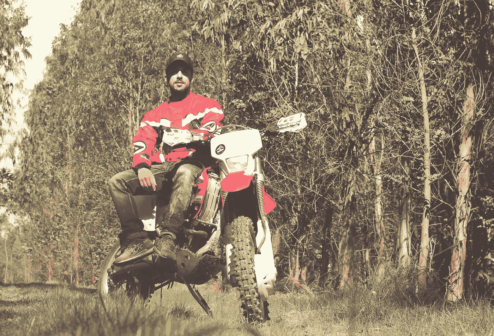

Me and my Honda CRF 250X

让我们先搞清楚基本情况:大多数男性都对摩托车着迷，我也不例外。我不知道为什么，但就我记忆所及，我一直喜欢摩托车，或者至少喜欢拥有一辆摩托车的想法。我总是想象自己穿着皮夹克，**汤姆克鲁斯**风格，**妮可基德曼**坐在后排，穿过**好莱坞** **林荫大道**。

我的热情可能是因为《来自火星的骑自行车的老鼠》这部电影而开始的，它出现在电影中，比如《沙漠热》、《壮志凌云》。

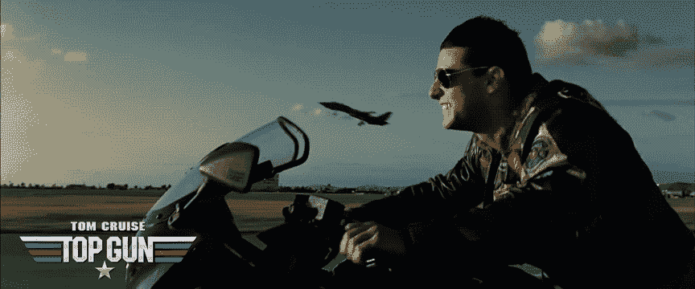

Top Gun

早在 2015 年，我在葡萄牙获得了我的第一份稳定的工作，所以我决定给自己买一份礼物**我一直梦想的礼物**:一辆摩托车，我是说**一辆该死的摩托车**！这是我记事以来为数不多的“我终于自由了”的时刻之一，(另一个是当我得到我的佳能 600d 时。我记得我对自己说:“我还需要什么才能快乐？”哦，我是一个多么快乐的傻瓜。

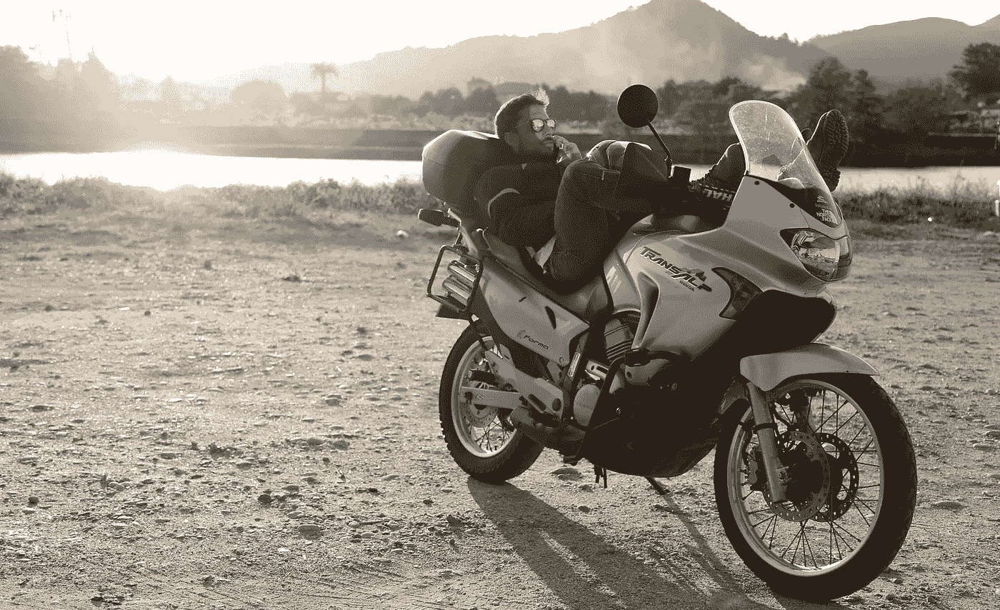

Me and my Transalp 650

我的第一辆摩托车是一辆**本田 Transalp 650** (见标题)这不是最好的自行车，但它绝对是一辆非常可靠和酷的自行车，可以开始骑和旅行。那时我们只是三个朋友，骑着相似的摩托车，总是在两个轮子上等待下一次冒险。我们在葡萄牙海岸进行了我们的第一次旅行，从***Vila Nova de Fama lico***到 ***Nazaré*** ，这是我们经历过的最酷的旅行。从沙质赛道到深夜弯曲的道路，这一切都令人筋疲力尽又充满乐趣。我们甚至制作了这次旅行的视频，你可以在这里看到。

那时我们给自己起了一个名字:***Fama EXPLORERS***，“Fama”来自我们的家乡“Famalicã”，而“Explorers”则代表我们想做的事情，探索世界🙌🙌。

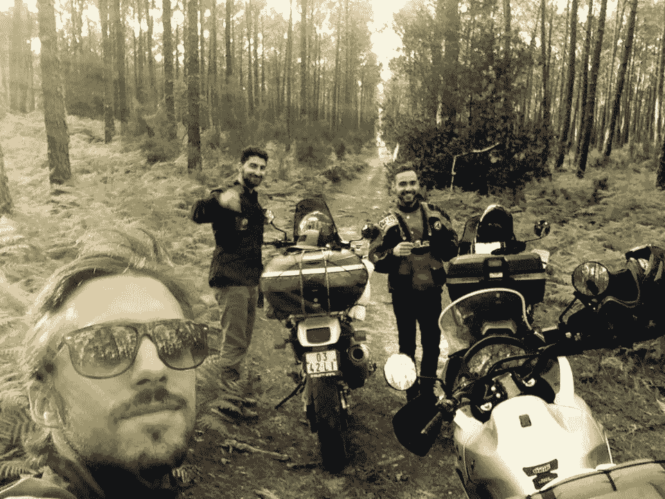

Me, Zé and André in our first trip, the birth of FAMAEXPLORERS

自从第一次旅行以来，我们沉迷于打包行李的感觉，制定一个垃圾路线，并通过我们能找到的每一张路线图中较少有人走过的道路来描绘我们的梦想。

在那个时候，由于没有什么经验，我摔自行车的时间多得数不清(是的，就像一个真正的 noob ),那段时间压力很大。那辆自行车，那个有两个轮子、一个引擎和一个车把的东西，对我来说就像一个人，每次“她”撞到地板时，我都在伤害“她”。我花了一段时间来减少对自行车的关心，更多的是体验，现在仍然是 *WIP* 。

# 自行车远没有体验重要。每次都要把你的经历放在首位！

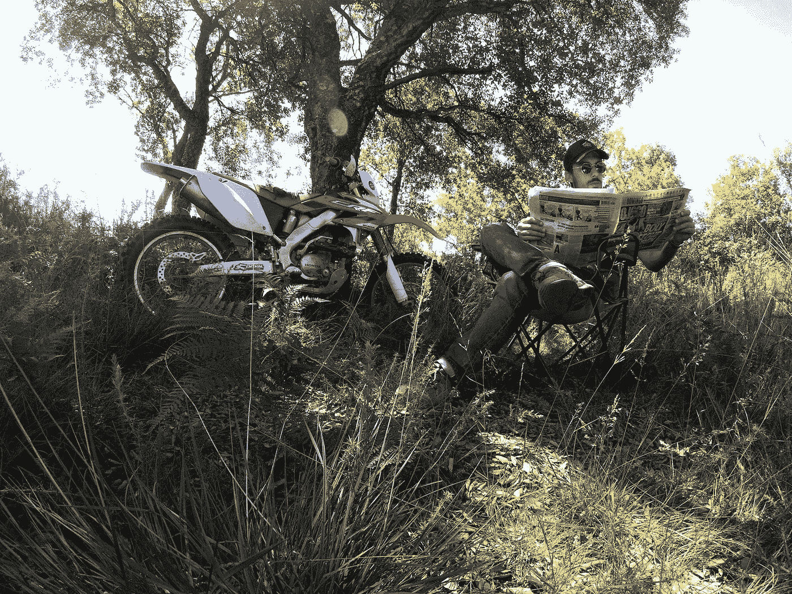

Me and my CRF250X on any ordinary Sunday reading the newspaper

由于这种关系，有些人可能会夸张地说，我用我的自行车给自己买了第二辆自行车，一辆**本田 CRF 250X** ，一辆 enduro 越野车。我几乎没有在泥地骑行的经验，这对于提高我的技术水平来说是完美的，而且不用太担心自行车，因为这辆车是用来撞车的😃。我几乎每周都用“她”(*我又在用*)。即使在夏天，理论上来说，由于灰尘的原因，在泥地里骑车是不可能的，我每个星期天都会起床，去[那里拿报纸，在野外阅读。](https://www.youtube.com/watch?v=n29Rhh3M-DU)

我沉迷于这样一种感觉:我可以带着我的推土机去任何地方。许多人喜欢攀登极端困难的耐力赛赛道的挑战，尽管我喜欢它，但我绝对喜欢的是打包一些吃的东西，去探索未知的道路。

让我试着告诉你我的意思，从树林到海边。

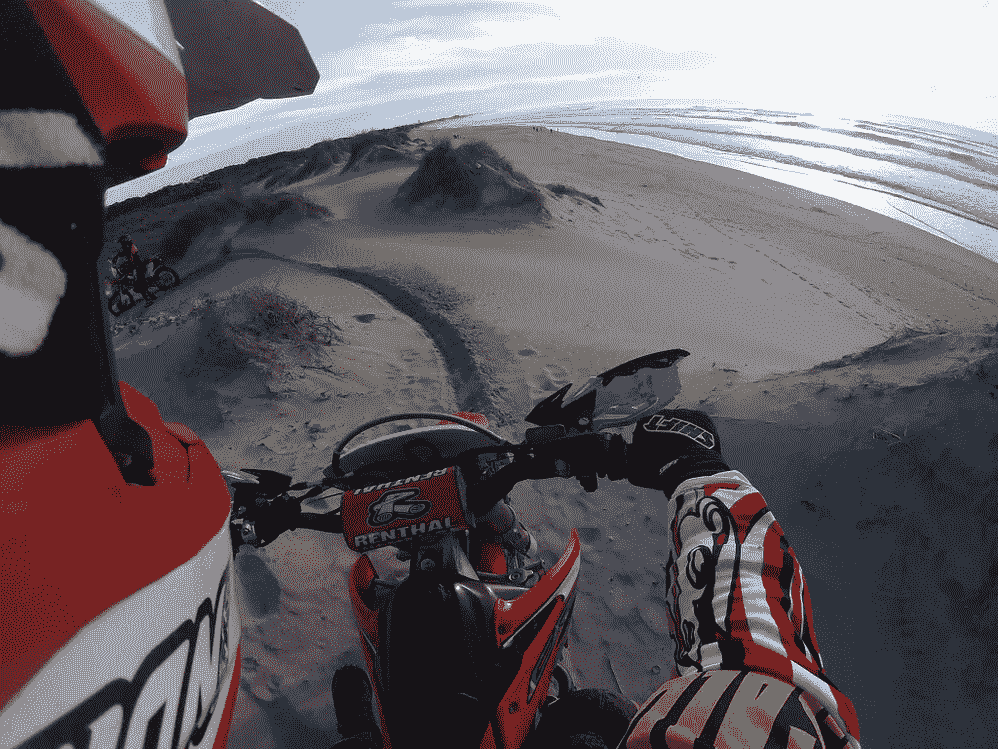

Where I love to go with my CRF 250X

# 2016 葡萄牙西班牙之旅

2016 年夏天，我和我的一个朋友安德烈(André)进行了一次为期两周的旅行，从我们的家乡***Vila Nova de Fama lico***到西班牙***valência***，我们的视线中总是有海。

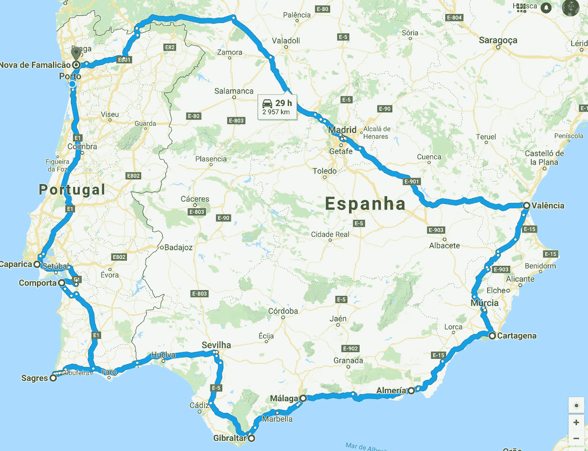

The 2016 trip itinerary

这次旅行有起有落，但这是一次令人惊奇的旅行，经历了令人惊奇的地方和冒险，希望有一天能告诉我的孙子们。

让我给你看一些旅行的照片:

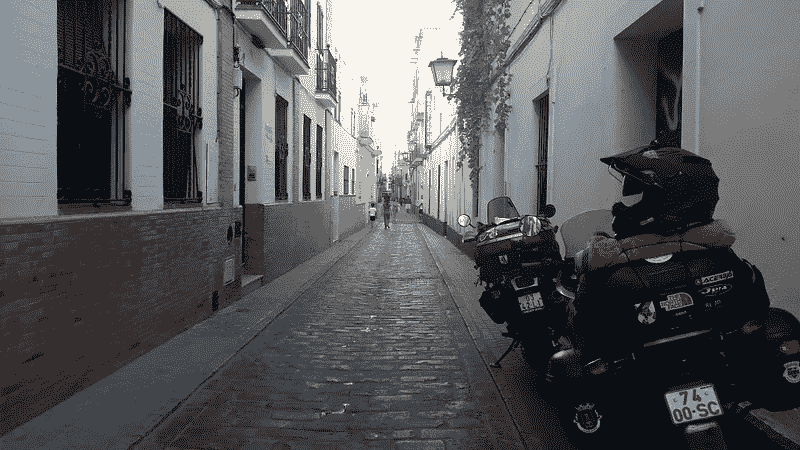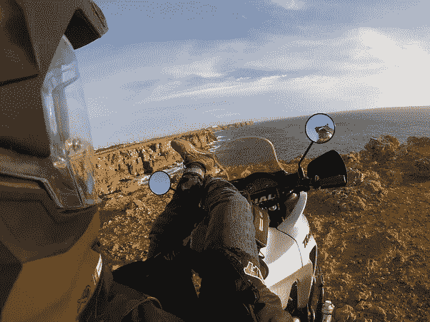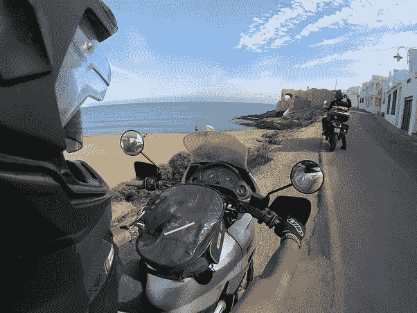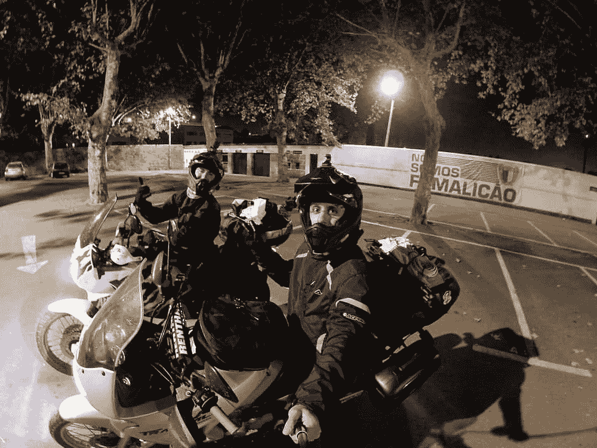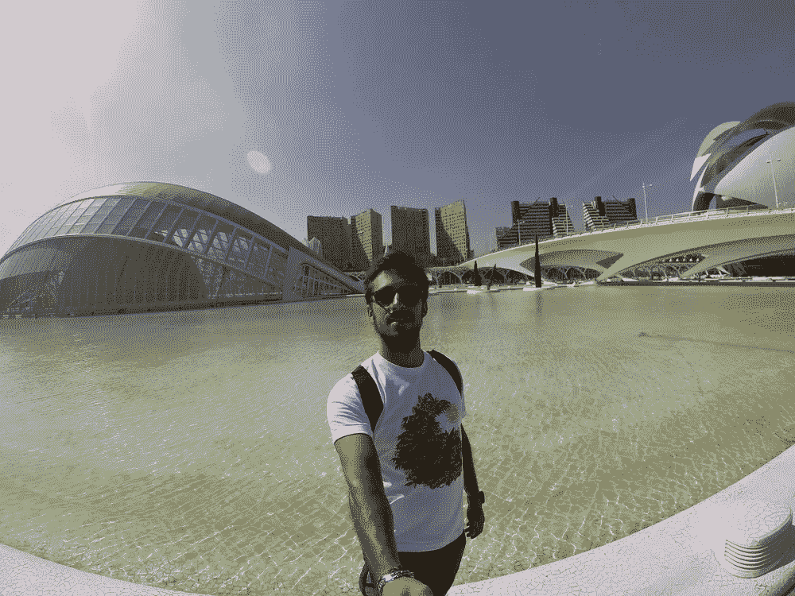

一回到家，我就想我需要一辆更好的自行车来完成更大的旅程，因为我的 650 在高速公路和泥泞的道路上行驶有点受限，于是我买了一辆🌶 ***最热*** 🌶有史以来最快的摩托车:标志性的 **KTM 990 冒险**，我的意思是，这辆摩托车是一个野兽。

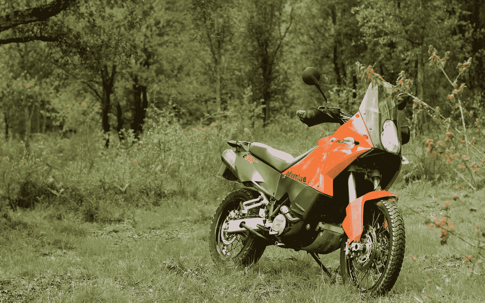

The Beast KTM 990 Adventure

# famae explorers

我们开始和几个朋友分享我们的经历，他们会和他们的朋友分享这个故事，突然我们变成了 26 个有很多共同点的骑手。我们都有自己的故事和梦想，我们开始有一些聚会来告诉他们，计划未来的旅行，只是谈论摩托车。

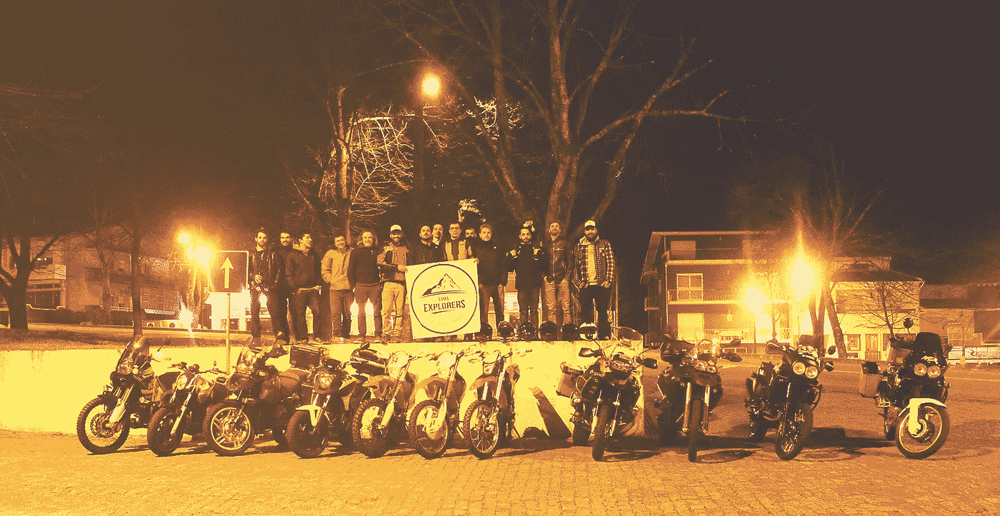

Our first gathering @ café França

# 我们建立了一个社区，famae explorers

就在那里，一个社区以最有机的方式诞生了！

去年，我们组织了一场名为“**famae explorers 第一次骑行 Fama lico-VIEIRA DO MINHO”**的活动，那真是太棒了！这是越野骑行爱好者的盛会。我们创造了两条不同的赛道，一条更适合耐力赛自行车(像我的 CRF)，另一条更适合大型赛道(像我的 KTM)。我们有 50 多人参加了我们的活动，就在这个时候，我们**意识到，有很多人与我们分享激情，他们只是在等待一个机会，结识有同样激情的新朋友，我们给了他们一些期待。**

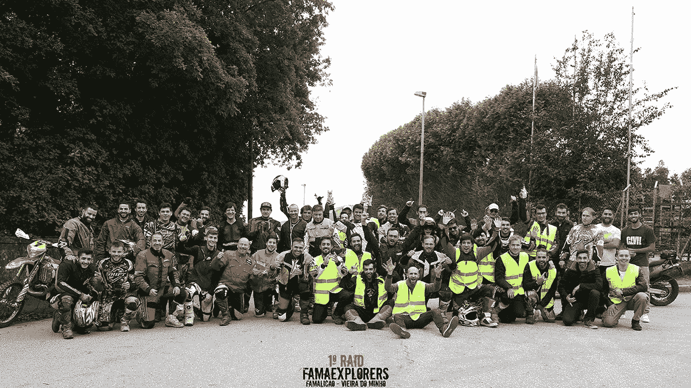

**FAMAEXPLORERS 1ST RIDE OFFORAD FAMALICÃO — VIEIRA DO MINHO**

这是一个我们没有预料到的成功，但我们努力使它变得完美，事实也的确如此。在我的职业摄影师女友、两名受伤的会员和朋友的帮助下，我们为这次活动制作了一场精彩的[照片](https://www.facebook.com/pg/famaexplorers/photos/?tab=album&album_id=1536019499772992)/视频报道。

就连葡萄牙达喀尔传奇人物保罗“老达喀尔”马克斯也参加了这次活动，这里有一张他给参与者一些骑行建议的照片。

你可以在 youtube 上观看整个事件的视频报道[。](https://www.youtube.com/watch?v=7hHkpjhmZyY)

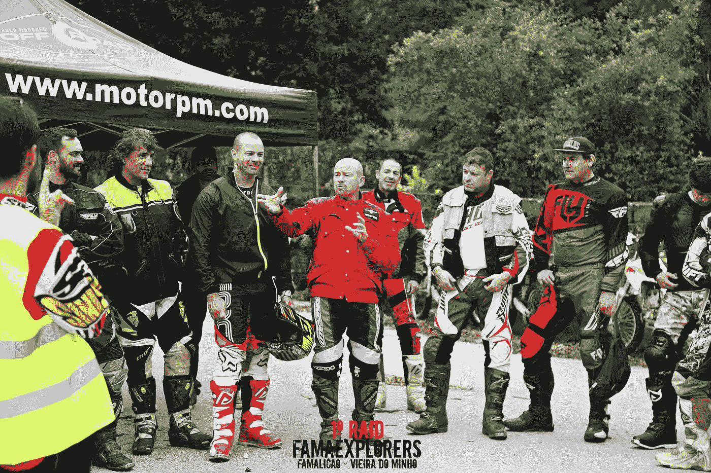

Paulo “Sr. Dakar” Marques

**FAMAEXPLORERS，**起初需要我付出很多努力，因为我是组织会议、处理营销和管理社交媒体的人([脸书](https://www.facebook.com/famaexplorers)、 [Instagram](https://www.instagram.com/famaexplorers/) 、 [YouTube](https://www.youtube.com/famaexplorers) )。现在我有一些成员帮我做一些事情，但是仍然有很多工作要做。

这是一项艰苦的工作，但这种艰苦的工作感觉很好，这是我们一生都在等待的事情。

> 找到你喜欢的东西，让它杀死你——布可夫斯基

# 它有机地成长起来，我们变得像兄弟一样，这是我一生中看到的最美好的事情之一。

# 摩托车和爱情

我喜欢做的另一件事是和我的女朋友骑摩托车旅行，我们一有机会就去做。把我的两种激情结合起来总是很特别。

去年复活节假期，我们去了一趟菲格雷拉·达·福斯*并做了一个视频，你可以在这里[观看，我会给你留下一些照片:](https://www.youtube.com/watch?v=pexObjfH6q0)*

*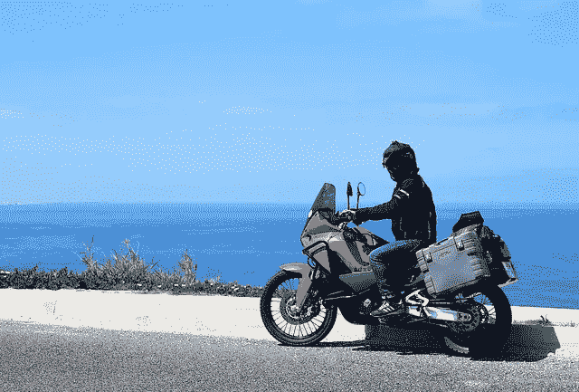**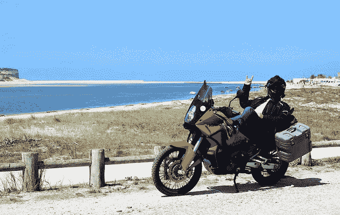**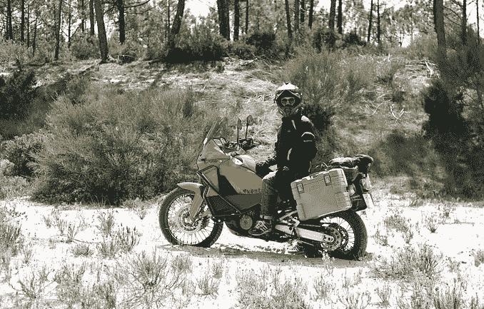**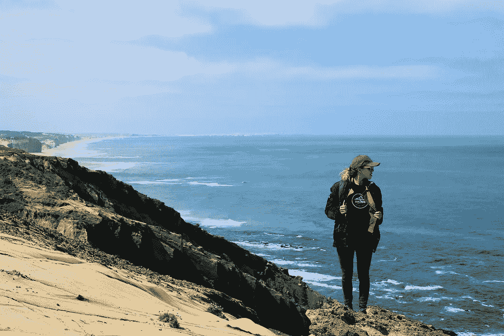**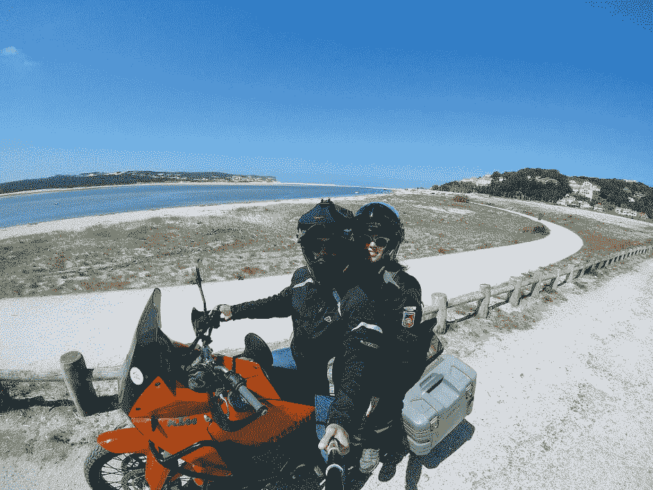*

*Our Easter trip in 2017*

*正如你所知道的，到目前为止，我所分享的似乎都是幸福、快乐、有意义的经历和爱。的确如此。所有这些，还有更多。*

# *独自骑行*

*每个周末我都喜欢带着我的佳能出去兜风，拍一些旅途中很酷的照片，没有调和个人议程和骑行目标的压力。*

*是那种对自己诚实的感觉，不在乎别人想要什么，只是跟着自己的直觉走。我的私人时间，我做主。*

# *当我与焦虑作斗争时，我意识到独自在树林中骑马是我所知道的最好的减压疗法*

*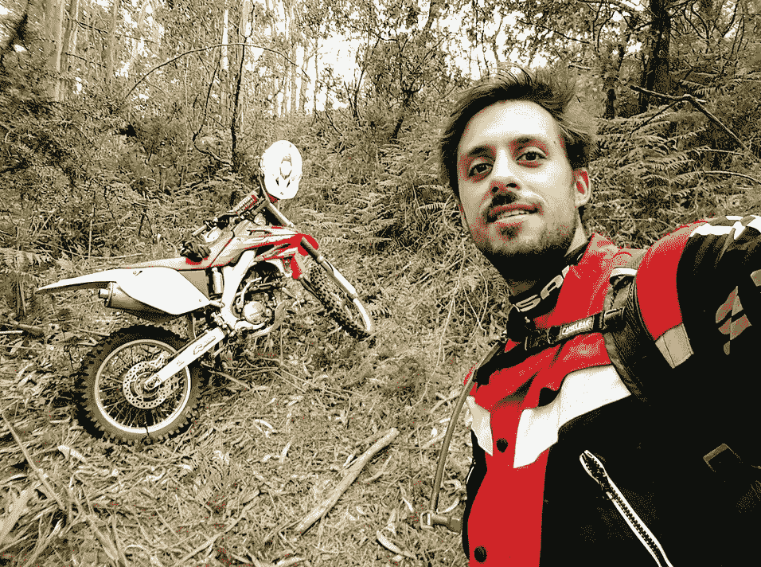**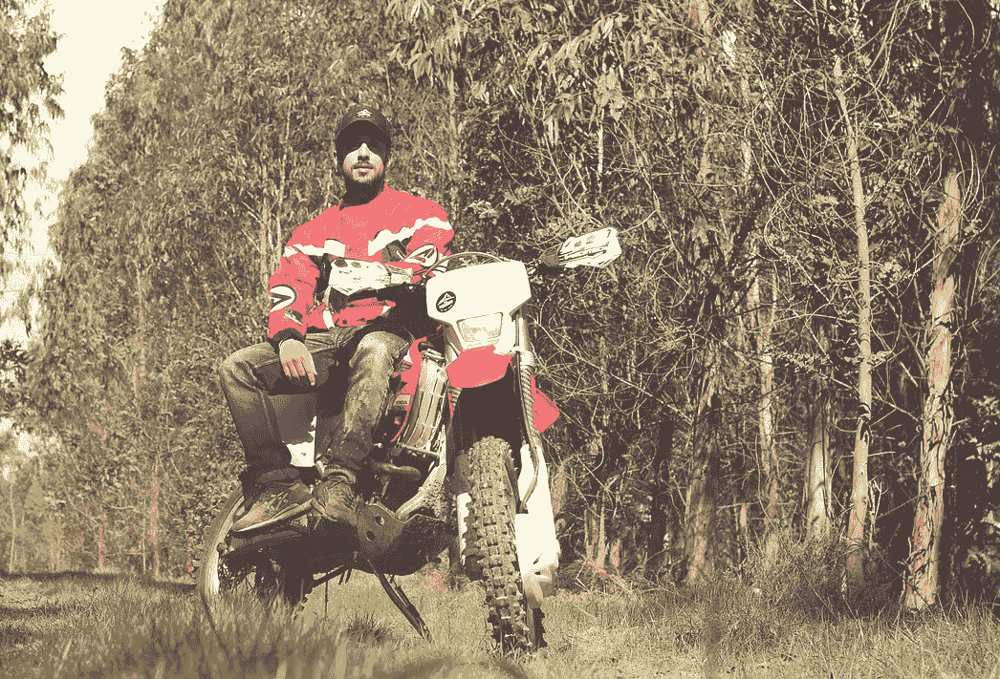*

*My solo expeditions*

*上周末，我独自探险，为第二次“**famae explorers of rad Fama lico—VIEIRA DO MINHO”**探索新的路径，在飞行了至少 4 米的时候，我从一座岩石山上摔了下来。*

*我在离家 70 公里的树林中的一个不知名的地方伤了左肩、右臀和右肘。*

*就在那 2/3 秒，我在空中对自己说“ ***Sh*t .我 fuc**d，Ohhhh sh*t 我希望我不会打破什么东西*** ”。*

# *请不要独自乘车。这是我最喜欢的方式，但也是最愚蠢和危险的。*

*底线是，除了做一些物理治疗，我并没有真的受伤，可能会一直做到二月底。*

*骑行的被迫暂停让我想讲这个故事，因为我非常感激能在这里写下这个故事！*

*好了，这就是所有的人，希望你喜欢它，如果是这样，请在评论中留下你的反馈或你的掌声。*

**

## *这个故事发表在 [The Startup](https://medium.com/swlh) 上，这是 Medium 最大的企业家出版物，拥有 286，184+人。*

## *在这里订阅接收[我们的头条新闻](http://growthsupply.com/the-startup-newsletter/)。*

**