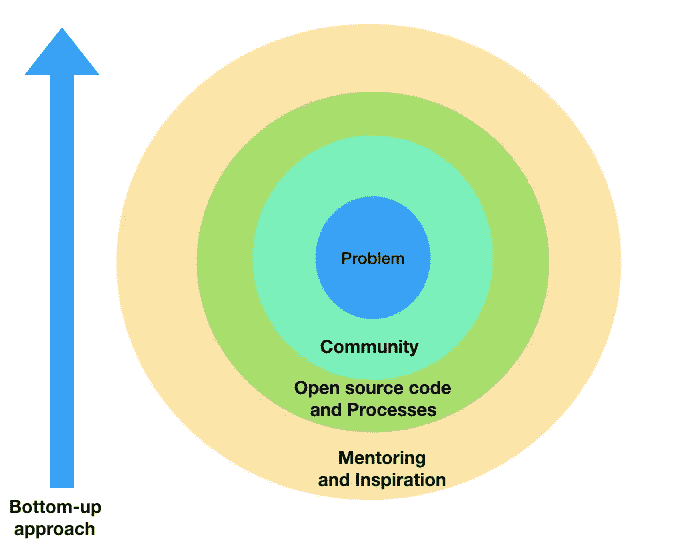
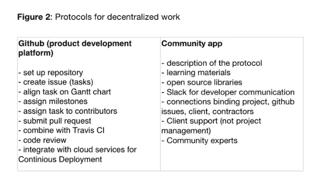

# 社区将如何驱动人工智能的未来，而不是政府或企业

> 原文：<https://medium.com/swlh/how-communities-will-drive-the-future-of-innovation-not-governments-or-corporations-76b573836ba5>

生活中的大事都是偶然发生的。我寻找自己真正热爱并热爱做的事情的旅程也是如此。六个月前，我开始和来自印度偏远地区的 40-50 名学生一起工作。他们的任务是:建立一个机器学习产品，以提高太阳能的采用。

挑战是巨大的:缺乏数据，没有工作经验的开发人员，与素未谋面的人组建团队，以及用于产品开发的少量资金。一个人怎么可能带着这样一群‘新手’去构建任何东西，更不用说复杂的机器学习产品了？

> 尽管面临各种挑战，但他们有一个共同点。他们都很有动力，都渴望打造一个具有社会价值、能够解决问题的真实产品。

接下来的六个月发生的事情令人惊讶。他们不仅在这个项目上投入了大量的时间，而且他们开始互相合作，互相帮助。例如，更有经验的开发人员开始分享他们的工作并帮助不太有经验的开发人员，而新手开始生成数据。在 6 个月内，我们得到了超出我预期的结果。

# 合作而不是竞争

我意识到这可能是一种新的创新模式。这是一种模式，在这种模式下，社区可以一起解决他们的问题，共享他们的数据并构建解决方案。这就是我想要努力的世界。但是这是一个新的想法吗？

由社区驱动的协作工作的想法一直存在，但在此期间很少有新的发展。

在大数据和机器学习的世界里，数据是关键。这不是复杂的算法或更好的团队，而是拥有更好(和更多)数据的团队获胜。发生的第二件事是，由于在线课程的泛滥，教育，特别是像人工智能和人工智能这样的新兴技术，变得容易获得。现在，对于世界上任何地方的任何人来说，从像 Udemy，Coursera 这样的网站开始学习是非常容易的。回想 10-15 年前，当我还是一名学生时，我还无法接触到所有这些知识。现在，一个人不必去麻省理工学院或斯坦福大学或剑桥大学，就能获得一流的教育。发生的第三件事是，很多人把他们的代码开源。因此，任何人都可以使用开源代码，并开始适应他们的需求。

因此，以下是对社区驱动方法感兴趣的人应该遵循的步骤:

1.  建立一个由拥有共同愿景和使命的高度积极的人组成的社区。社区应该拥有多样化的经验和技能。
2.  把他们带到一个平台下，可以懈怠。
3.  遵循协作工作的最佳实践、流程和工具(参见图 2)。
4.  定期举行活动，让社区成员展示他们的工作。
5.  写下他们正在做的工作，以保持动力。每个人都喜欢被认可。

# 管理社区

社区很难管理和维护。在构建 ThinkApps 时，这是我主要关注的——与来自 30 多个国家的开发人员一起构建产品。最好的策略是用一种有共同价值观和动机的语言说话。这是建立“部落”[1]的唯一方法:一群拥有共同意义和联系的人。

另一件重要的事情是有人能把社区粘在一起。斯科特·亚当斯(Scott Adams)在他的书《如何在几乎所有事情上都失败的情况下仍然获得巨大成功》中谈到了建立多样化的技能，这样整体就大于部分之和。我不是最聪明的人，也不是顶级的开发人员，我不是世界上最好的人工智能人员(尽管我有 10 年的经验)，我也不是最好的营销人员或销售人员，或者最好的导师、演讲者或作家，但我确实拥有所有这些，可以让人们来自不同的背景，说一种开发人员和业务人员都能理解的语言，可以指导和激励开发人员，并可以写下正在完成的工作(学生感谢这种认可)。以上所有技能的总和大于总和，没有多少人拥有这些技能。

我正在努力提高的另一项技能是我的沟通技巧。印度哲学家 j .克里希那穆提曾经说过'*观察而不评估是人类智慧的最高形式'。和学生一起工作时，不加评价的观察派上了用场。*

# 社区外的价值

由社区构建的解决方案几乎肯定会被采用。他们知道要解决什么问题，如何获取数据，甚至知道如何构建这些解决方案。他们需要的是支持、指导和鼓励。

> 一个社区创造授权，建立信任，提供数据访问，产生不同的意见，并刺激创新。

但是如果创造的模型产生了经济价值会怎么样呢？这是如何分配的，特别是当一个公司把他们的项目外包给社区的时候？当公司正在使用经过训练的模型时，数据和代码保留在社区中。因此，如果有经济价值的话，从产出中获益对社区和公司都更有意义。

*公司的利益是短期的。社区的利益是长远的。*

这种利用社区的方式甚至可以更大。在观看一部关于一些暴虐政权的纪录片时，我意识到暴虐政权(或公司)的目标是控制人民。这是一种经典的自上而下的方法，一些精英告诉我们其余的人什么时候做什么。

社区驱动的方法正好相反。这不是关于控制，而是关于激发自由思想。这是推动真正创新的动力，也是我认为世界应该走向的地方，我想成为其中的一部分。

当我们接触到自己的感觉和需求时，我们人类就不再是好的奴隶和下属了。

最后，我从 Impact Hub Praha 的联合创始人 Petr Vitek 那里听到了一些东西，“*让社区参与进来，让事情变得有意义和快乐*”。完全同意！

## 这篇文章发表在[的《创业](https://medium.com/swlh)，这是 Medium 最大的创业刊物，拥有+395，714 人关注。

## 在这里订阅接收[我们的头条新闻](http://growthsupply.com/the-startup-newsletter/)。

