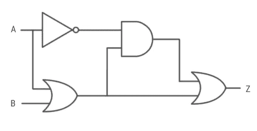

# 计算机如何做数学

> 原文：<https://medium.com/swlh/how-computers-do-math-11af23139db>

要理解本文的后半部分，你需要了解布尔代数。这不是我在本文中讨论的话题。 [*这里的*](https://ryanstutorials.net/boolean-algebra-tutorial/boolean-algebra.php) *是一个链接，你可以在那里了解到。*

Image Source: [https://www.computerscience.gcse.guru/theory/logic-circuits](https://www.computerscience.gcse.guru/theory/logic-circuits)

# **简介**

过去几周，我一直在读查尔斯·佩佐德的《代码》。那本书绝对是信息的宝库。