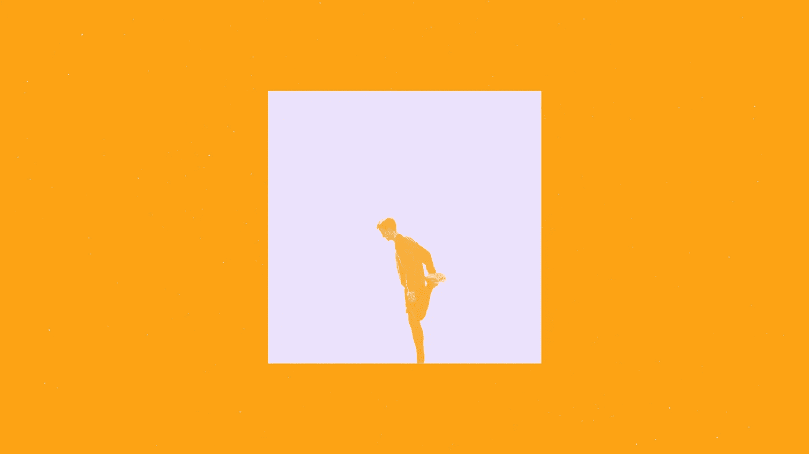

# 让生活变得更艰难，让生活变得更美好

> 原文：<https://medium.com/swlh/how-constraints-breed-creativity-9b4cd59e6c99>

## 当你看到一些看似不可能完成的挑战时，你是否感到心中有一种痒痒的感觉？

This post originally appeared on Crew. Get more like it by [signing up for our weekly newsletter](http://eepurl.com/b_tIPL).

20 世纪 60 年代，丹麦电影制作人桂鑫·莱斯制作了一部著名的短片，名为《T2》*《完美的人类》* 。没有穆罕默德·阿里那么有名，但也足以改变我们制作电影的方式。

在 13 分钟的运行时间里，我们看到一个男人和一个女人，两人都被贴上“完美人类”的标签，在一个完全白色的、像动物园一样的房间里，做着一些无关紧要的动作，比如跳舞或装烟斗。标题和动作之间的脱节让这部电影变成了对广告、品牌和完美理念的讽刺。

似乎成为“完美的人”并不需要太多努力。看起来也不是很吸引人。

多年后，另一只大丹犬——拉斯·冯·提尔——创作了一部关于完美人类*的纪录片*，与其说这是一部电影，不如说是一场电影制作的决斗。这是拉尔斯和他以前的电影学院教授在中午的一次相机大战。

2003 年，冯·特里尔邀请 Leth 过来抽根雪茄聊聊天，同时他们开始拍摄。在寒暄之后，冯·特里尔提出了挑战:桂鑫将不得不五次重拍他的开创性电影，每次都遵循冯·特里尔在飞行中编造的一套不同的“障碍”。

当他们握手时，话题转到了他们的雪茄和他们的古巴血统。冯·特里尔询问莱斯是否曾经访问过这个共产主义国家——他回答说没有。

年轻的电影制作人当场决定，对于第一个挑战，莱斯必须在古巴进行第一次翻拍，为了获得额外的阻碍，电影中的每个剪辑可能只有 12 帧长。

明确地说，在电影中 12 帧等于半秒。这是那种会引起电影观众癫痫病发作的剪辑。

当莱斯离开去接受挑战时，他对挑战中明显的不可能性感到愤怒。

但是，神奇的事情发生了。当他的头脑开始处理障碍时，他的创造力似乎集中在问题的中心。他设计了一个计划，飞到古巴，拍摄他的电影，然后回到剪辑台，创作一部比原版*更有趣的电影《完美的人类*。

正是在这里，我们学到了关于我们的思想和创造过程的最有价值的东西之一:

> 阻碍越高，对问题越专一，创造性思维受到的挑战就越大。

想象一下，一匹马向一个拱顶冲去。一格——几乎不用试。但是障碍越高，马需要的肌肉就越多。

这是一个奇怪的类比，但我们的创造性大脑以同样的方式工作。

向我们敞开世界，无限可能。但讽刺的是，我们没有探索，反而感到孤立。没有什么可以激发想法的。没什么可联系的。独自在野外，我们有创造力的灵魂很容易迷失。

在广告中，我们有时指的是简洁的自由。我认为这是一个很好的表达真相的方式。

当一个创意团队坐下来解决一个沟通或业务问题时，如果问题的边界被清楚地定义，这真的会很有帮助。

# 广告之外的一个例子

当我穿着广告尿布的时候，我为一家南非火焰烤鸡餐厅(Nando ' s——是的，就是那家走向全球的餐厅)的一个大客户工作。那家公司的领导了解公关的力量，所以他和广告公司一起开始了有争议的活动，这些活动将在媒体上获得比他们必须购买的媒体更多的播放时间。

但每当你收到南多的简报时，你都会感到害怕。你可以做任何事情，客户很可能会购买。虽然从商业角度来看，这听起来像是一个梦想客户，但作为创意人员，这种自由让事情变得难以置信。

在其他情况下，品牌有严格的指导方针需要遵循，这就像是在字里行间涂色。结构和形式都摆在那里，让它们脱颖而出就看你自己了。

我知道这听起来像是对关于创造力的传统智慧的诅咒——做你喜欢的任何事情——但事实是创造力在有阻碍的情况下工作得更好。

为了进一步证明这一点，你可以继续观看冯·特里尔和莱斯之间的战斗。障碍的力量在第三部重拍时变得很明显，莱斯因为没有任何障碍而受到“惩罚”。第三次翻拍，没有障碍，是最糟糕的一次。

# 如何在约束中找到自由

所以如果你的挑战没有挑战性，你会怎么做？

我们总是能让自己变得更难。

没有规定说你不能给问题制造自己强加的障碍。

怎么会？好吧，如果我们:

*   将我们的移动应用程序设计成也能在“简单”手机上运行？
*   用灰度制作我们的新网站？
*   制作了没有任何图片的新产品介绍视频？

一些世界上最大的企业是通过寻找严格定义的问题并找出如何以最具创造性的方式解决它们而建立起来的。

哈瓦斯媒体公司战略与创新高级副总裁汤姆·古德温、[写道](https://techcrunch.com/2015/03/03/in-the-age-of-disintermediation-the-battle-is-all-for-the-customer-interface/):

*   没有汽车，我们如何建立世界上最大的出租车公司？
*   我们如何在不创造任何内容的情况下创建世界上最大的媒体公司？
*   在没有任何房地产的情况下，我们如何建设世界上最大的住宿提供商？

创造这些约束的好处是，它们集中了我们的创造力，并诱使我们从一个新的角度看待问题。

分析一下这个过程:这就好像你在强迫你的意识关注一个新问题，同时让你的潜意识进行真正的创造和横向思维。

具有讽刺意味的是，焦点是让我们自由的东西。

最有创造力的人知道约束和阻碍不会束缚他们的努力——事实上，它们会给你的头脑一个飞跃的动力。

当你看到一些看似不可能完成的挑战时，你是否感到心中有一种痒痒的感觉？这是你的大脑开始加快处理能力，你必须做出这一飞跃。这是伟大的开始。

[***最初发表于剧组***](https://crew.co/backstage/blog/how-constraints-breed-creativity) ***。每周获得更多赞通过*** [***报名我们的快讯***](http://eepurl.com/bINIcT) ***。***

# 利用你头脑的约束，[(不是你的技能)](https://crew.co/?utm_source=Medium&utm_medium=CTA&utm_campaign=MediumCTAs)。

## 看看 Crew 吧，这是一个人才市场，在这里你可以见到最好的设计师和开发人员，并与他们一起工作。超过 1000 万人使用了剧组生产的[产品。超过 300 万人阅读了我们的博客。在这里加入他们](http://crew.co/?utm_source=Medium&utm_medium=CTA&utm_campaign=MediumCTAs)。