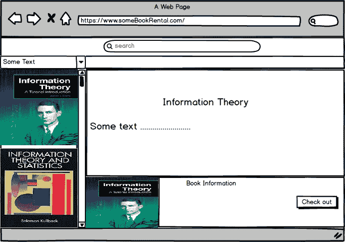
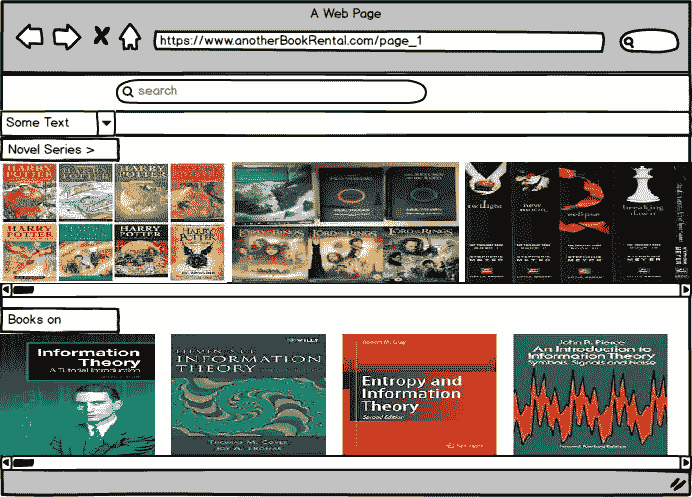
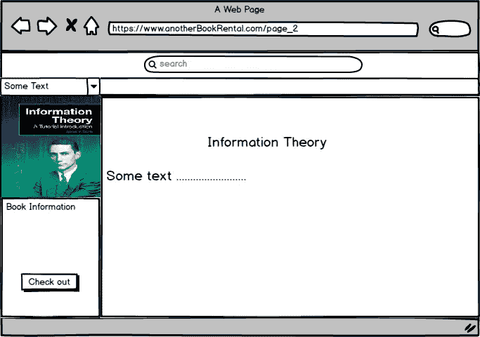
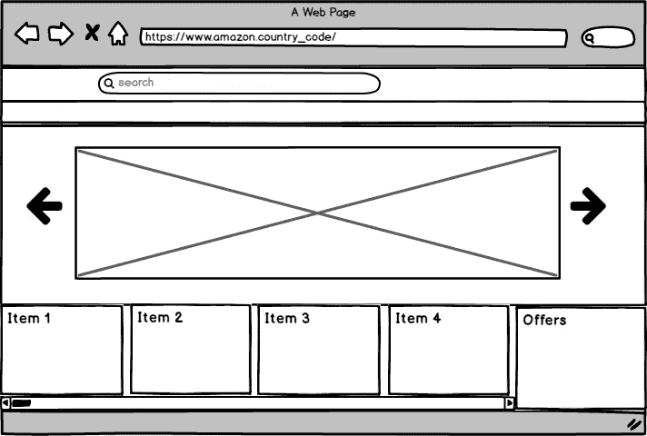
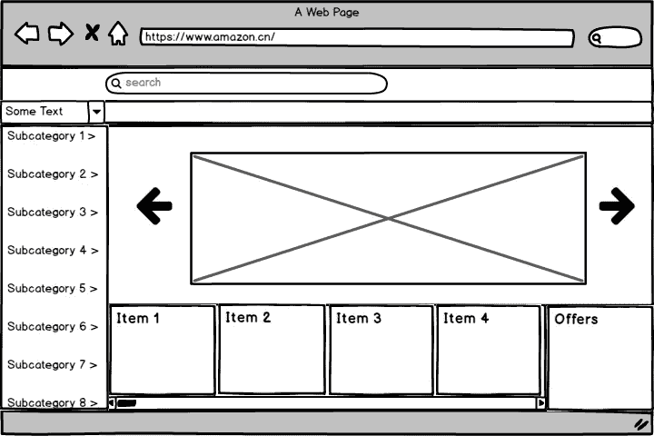

# 文化如何重新设计在线市场？

> 原文：<https://medium.com/swlh/how-culture-redesigned-online-marketplaces-and-what-startups-can-take-from-it-3824ba72331f>

***对中国本地市场和网上市场的观察***

你如何在网站上展示信息，和信息本身一样重要，有时甚至更重要。

网站已经成为人们访问互联网的门户。企业和实体通过避免现实生活中市场的喧嚣，使用网站来销售他们的产品，这也是消费者所接受的。首字母网站只是作为获得服务的一种选择，但随着时间的推移，在线市场已经不仅仅是一种选择；它们已经成为一种体验。

随着新技术的发展，更好的服务，如云托管，以及对与互联网和网站相关的软件开发周期和数据流的更好理解，网站正变得越来越好。深思熟虑的设计以及新的高效方法，如材料设计，使用户体验更加友好。随着时间的推移，开发人员正在遵循一些[标准](https://www.forbes.com/sites/denispinsky/2018/02/12/website-design-standards/#77cf4b9ef54f)和[趋势](https://blog.hubspot.com/marketing/elements-of-modern-web-design-list)，比如倾向于遵循“只显示重要内容”概念的极简主义方法；因为过多的信息可能会让人不知所措，但不一定对客户有用。这些概念的证据可以从[汉堡菜单](https://en.wikipedia.org/wiki/Hamburger_button)的流行和广泛接受中得到。

尽管不是每个开发人员都严格遵循这些设计标准，但事实证明，这样的开发提供了更好的体验和更快的学习。但是不管网站是否遵循这样的方法，几乎每个人都更喜欢获取相关的特定上下文内容。通过上下文特定的方式，重点是“**显示什么**”，就像求职网站不应该发布房地产属性。但是，即使有相关的内容，我们也观察到网站的不同接受程度。造成这种情况的原因有很多，但是这篇文章将会讨论一些关于文化偏见是如何随着时间的推移重新设计网站内容呈现的观察结果。

在线市场必然改变了我们的在线形象，大多数懂互联网的顾客都是在网站上购物的。当我们打开一个网站进行交易时，直觉上我们希望网站看起来像一个现实生活中的市场，例如，一个图书租赁网站应该显示一些类别的书籍，而不是杂乱无章的。这个期望看似很琐碎，但我们想一次，是那么琐碎还是有什么原因？！

我们来实验一下。假设你要去一个图书租赁网站，并希望做两件事

*   检查不同的书
*   阅读概要/情节/摘要和租赁

下面是两个图书租赁网站的框架。第一个在左侧滚动窗格中显示书籍，并将两个任务集成到一个页面中，而

Wire-frame of first site

第二个站点为您提供了一个具有相同功能的两页解决方案。在后一种情况下，我们将任务放在两个不同的页面上。

Wire-frame of second site with two pages

现在想一想，假如你没有特别想租的书，在现实世界中你会选择哪一本。我想，我们大多数人都会同意这样一个事实，即只有在我们喜欢这本书的某些方面，如作者、领域甚至是吸引人的封面后，我们才会阅读摘要，因为没有必要花时间去阅读一本书而不喜欢它的任何方面。我们希望有明确的选择。这是一种由事实产生的偏见——***我们喜欢选择我们想读的*** 。

在心理层面上，我们希望在网上门户看到的商品就像我们在现实市场中看到的一样。例如，如果你去实体图书租赁店，那里有新书或原版/签名书的专属位置。同样适用于其他市场，手表店，珠宝店，鞋类，衣服；到处都是。这些做法既定义了“**如何展示**”又定义了“**展示多少**”，并产生了特定于一个社会的偏见。在大多数情况下，当我们把这些想法投射到一个特定的环境中时，这些想法都成立，随之而来的是更多的约束。为了让这个想法更加清晰，我将提供一个观察结果。

在中国，市场看起来充满了选择，塞满了同一种东西的几种类型，同一种东西被不止一个卖家出售。他们喜欢有许多选择，这样他们就能以理想的价格买到商品。在许多地方，据说在中国，人们经常与当地的卖家讨价还价，以获得更低的价格(这也适用于其他一些国家，如印度)；即使有这么多选择。不管是什么原因，似乎有很多选择和讨价还价已经成为这些社会购物的一个组成部分。因此，这种购物习惯在他们的社会中产生了偏见，久而久之就形成了一种文化。

让我们来看看亚马逊网页。如果你观察正确的话，亚马逊网站的内容轮廓是这样的。

General Amazon site content contour

与大趋势相反，如果你检查亚马逊的中国网站，它看起来像这样，每个边界代表一些信息。

China Amazon site content contour

你可以看到，中国亚马逊网页不同于其他亚马逊网页，似乎遵循一个通用模式。亚马逊已经学会(有意或无意地)通过允许文化细节将市场复制到在线平台，这将有助于中国人通过满足他的购物偏好从真实市场中获得他期望的东西。

从一个非中国人的角度来看，你会发现中国亚马逊网站的信息更加丰富。如果你认为[杂乱无章](https://econsultancy.com/blog/67466-why-do-chinese-websites-look-so-busy)仅仅是因为中文的空间密度，那么看看日本的亚马逊页面。尽管如此，中国和日本的文字都是空间密集的；如果你是你所在国家的亚马逊页面的常客，你会发现你在日本的网站上看起来更舒服。

> *所以文化有时会重新定义“在线平台应该是什么样子？”*

不要相信我的话。我举一个事件来证明。

易贝进军中国市场的尝试失败了，如果我们从字里行间去体会，你会发现这些偏见导致了易贝的失败。
当易贝在亚洲大举扩张时，它收购了中国拍卖网站易趣网 33%的股份。易贝向易趣网投资了 3000 万美元，易趣网在互联网发展初期被认为是中国最重要的在线交易社区之一。这笔投资比阿里巴巴早期阶段的投资规模更大。在这次投资之后，易趣和易贝之间有了更多的互动，最终，易贝获得了一些决策权。在这些决定中，许多遭到反击，这是易贝在中国失败的原因。在这些决定中，一个选择是将易趣网平台移至易贝平台，改造网站的设计和功能。易贝的中国网站，在很大程度上模仿了美国的易贝，对当地用户来说看起来很陌生。

与易贝的做法相反，阿里巴巴坚持在网上市场保持真实市场的温暖；感谢马云。

在《interview⁴》中，当时负责 eBay 中国业务的 eBay 高管梅格·惠特曼(Meg Whitman)说，

> “我们犯了一个大错误。我们应该把易趣留在他们中国的平台上。相反，我们所做的是把易趣放到全球易贝平台上，因为它在任何地方都可以工作。”

当然，文化并不是重新定义网站的唯一因素，毕竟我们可以检查[网站以前的快照](https://web.archive.org/),结果发现它们中的大多数在同一时间以相同的方式发生了变化，而不管它们属于哪种文化。

互联网的开放文化和国际边界之间的更多互动在很大程度上减少了文化特定的细节，但谁知道一点文化接触可能会帮助你的网站平台脱颖而出。

[1][2][4]这些信息摘自《阿里巴巴:马云建的房子》一书。

[3]选择的可能性和讨价还价的机会

## 这篇文章发表在[《创业](https://medium.com/swlh)》上，这是 Medium 最大的创业刊物，拥有+367，690 读者。

## 订阅接收[我们的头条新闻](http://growthsupply.com/the-startup-newsletter/)。

