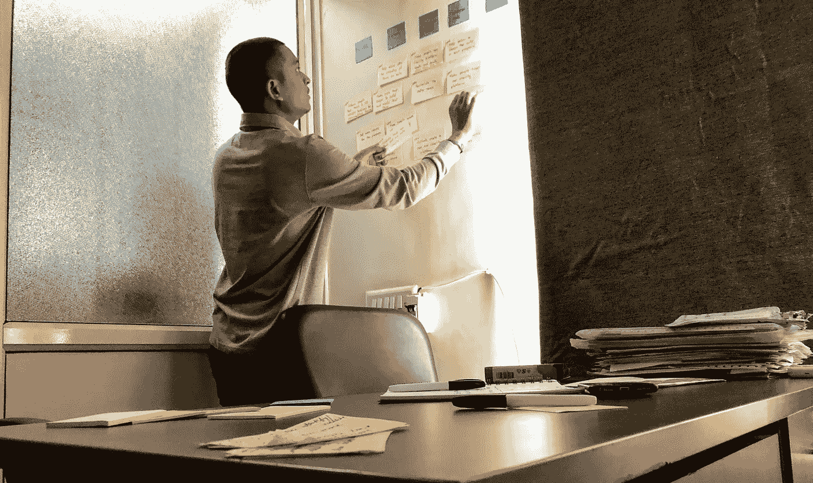
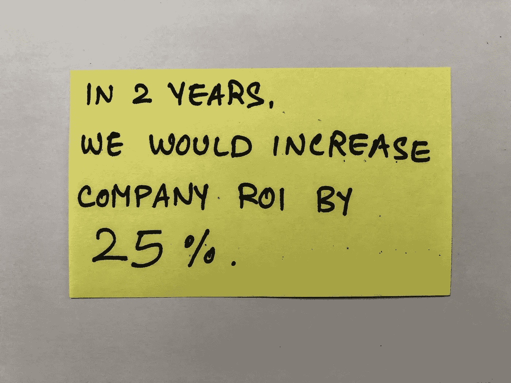
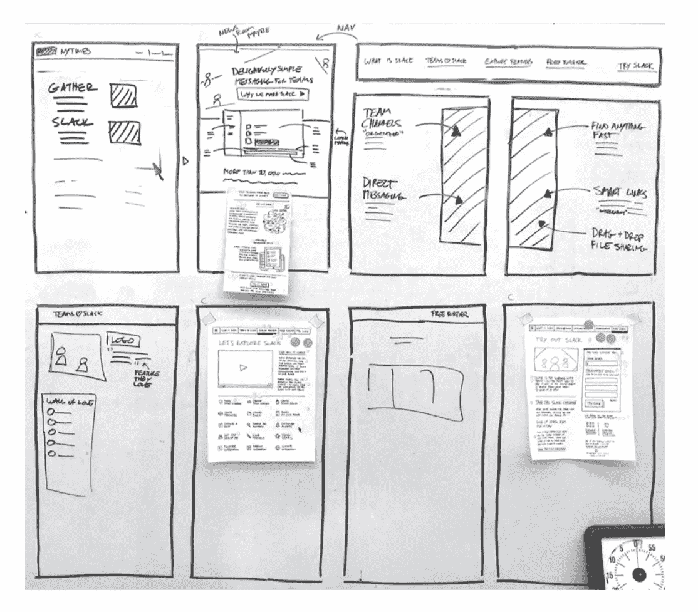

# 设计冲刺来改进组织过程

> 原文：<https://medium.com/swlh/how-design-sprints-work-to-improve-organizational-processes-4c9da0a9c01e>

**设计冲刺**是一个为期一周的过程或框架，通过设计思维、原型制作和与真实(目标)用户的测试来帮助回答关键的业务问题。它包括各种练习和激烈的团队合作，以更快地取得切实的成果。要了解更多信息，请访问 [GV 的设计冲刺](http://www.gv.com/sprint/)页面或购买[的冲刺书](https://www.thesprintbook.com/)(物超所值)。

## NDA

是啊！我们必须一直签 NDA，我们不允许分享任何东西。尽管如此，在客户的允许下，我还是有机会写了这个故事。我不会在这篇报道的任何地方提到任何人的名字。我不会分享所有细节，但这会让你对设计冲刺如何为组织过程工作有所了解。我将分享我们和 sprint 成员的感受，哪里出错了，哪里有效，技巧，学习等等。

# 这样做是为了改进组织过程

在 [**SprintCube**](https://www.sprintcube.com) 的前期，我有过做几个数码产品设计冲刺的经验。然后，我们接到一家代理机构的咨询，要求帮助他们开发流程。它是一家数字代理公司，设计和构建电子商务项目。

## 挑战

挑战在于简化开发过程。几乎没有一个项目能在规定的时间内交付。结果，项目举步维艰，他们无法实现期望的投资回报。这是对挑战的高层次看法。

然后，我们(我和[纳伦德拉](/@narendravaghela))一头扎进了“从询价到发货”的全过程我们看到了其中的一些差距，并认为这些需要得到填补。总的来说，我们认为进行设计冲刺是一个很好的挑战。

但是我们的问题是，我们从来没有为组织过程做过设计冲刺。我只有为数码产品冲刺的经验。所以他们没有 100%准备好(真实和明显的)锁定他们的关键人员整整一周来改进他们的过程。

幸运的是，公司的首席执行官听说过设计冲刺，所以这对我们来说是一个有利因素。但是，有一个神话，设计冲刺只能用于数字产品。此时，展示一些[冲刺的故事](https://sprintstories.com/)帮助我说服了他。他也很兴奋能看到它的运行。哇！舞台已经搭好了。

> 别说，秀出来。效果总是更好。

# 为冲刺做准备

首先，你需要一个大的挑战来开始设计冲刺。它应该足够大，锁定 4-7 个关键人物的整个星期的时间似乎值得解决这个挑战。我们面临着巨大的挑战。

## 建立冲刺团队

整个过程包括来自不同部门的成员，如销售、分析、开发、测试和交付。我们需要每个部门的关键人物来跑冲刺。他们知道他们部门内的一切是如何运作的。他们也知道其他部门在他们的流程中是如何工作的。所以我们挑选了销售、分析、开发、测试的领导和 T2 项目经理。在我们这边，纳伦德拉和他们在一起。我们建立了一个由 **6 人**组成的冲刺团队。我本打算加速冲刺。首席执行官是决策者。看到并体验一场设计冲刺，他是如此的热情和兴奋。所以他随时都可以做决定。这对我们来说是一大优势。

## 寻找执行冲刺的最佳时间

我们将进行为期 4 天的设计冲刺。我们还没有弄清楚如何测试流程原型(像一个应用程序原型)，所以我们没有考虑用户测试日(第 4 天)。所以我们不得不锁定整整 3 天来达成一个流程原型。我们决定在 sprint 团队成员的日程不太紧的时候执行设计 Sprint。所以我们决定在星期三而不是星期一开始。

## 支持

我们还准备了来自每个部门的第二好的高级成员来处理 Sprint 期间的部门级工作。各部门领导将必要的信息交给他们的第二好成员，以便他们可以在没有领导的情况下采取必要的后续行动和行动。这真的帮助了我们，因为 Sprint 成员能够专注于设计 Sprint，而不用担心他们的日常事务。此外，我们会定期休息，以便他们可以与自己的团队会面并采取后续行动。

## 树立期望

在开始冲刺之前设定期望值是很重要的。我收集了 Sprint 团队每个成员的期望。我让他们大致了解了我们每天要做的事情，快速解释了设计冲刺的每个练习的目的，以及结果会是什么。这帮助我在冲刺时跑得更快。

其中一个期望是，他们会得到一个完美的解决方案来解决他们在过程中面临的每个问题。请注意，设计冲刺不是为了获得完美的解决方案。它是关于获得对你有用的解决方案，并更快地测试它们；这样你就可以快速迭代和改进。

我们认为世界上不存在完美的解决方案。一个解决方案只能迭代和改进。

# 第一天

***议程:*** 整个团队一起工作**单独**定义挑战，并建立大量他们认为可以解决挑战的解决方案。

在开始冲刺之前，我们已经经历了所有部门的挑战。CEO 作为专家向 Sprint 团队提出了所有的挑战。项目经理作为合作专家与首席执行官一起出席。团队成员以 **HMWs** 的形式重新组织了整个挑战，我们对他们进行了分类。在看了墙上悬挂和分类的 HMW 后，他们开始了解最大的挑战在哪里。

***提示:*** HMWs 是可以看出团队中是否有人字写得不好的阶段。如果你发现这是一个问题，你可以让他们在整个冲刺阶段都用大写字母写。最好不要等到这个阶段。给他们一个记号笔和便利贴，写下他们对设计冲刺的期望。这将让你了解每个人的期望和想法，这将有助于你一周的工作。此外，你还可以知道团队中是否有人写得不好。

然后，我们确定了 HMWs 的优先级。我们确实讨论了**长期目标和冲刺问题**。

然后，我们创建了一个**用户旅程图**。我们开始用地图绘制 HMWs。这个练习的目的是为剩下的冲刺阶段确定一个目标。在这里，我们与**决定目标**打了个平手。我们用相同数量的 HMW 得到了地图的两个不同部分。嗯……问题是瞄准哪一部分并继续前进。一场讨论持续了 3-5 分钟。最后，我们决定把目标放在左边。

> **记住:**当你想决定一个目标，并且你在地图区域之间有平局的时候，选择左边的那个总是更好。因为那是用户首先经过的，然后是右边的。最好是解决旅途早期出现的问题，这将在后期支持你。

我们有很多击掌庆祝，🖐，让每个人都充满活力是很重要的。我们午休了。我收集了每个人对他们目前经历的反馈；这样我就能想出在接下来的日子里我应该怎么做。

接下来，我们从**闪电演示**开始。每个人都喜欢这个练习，因为他们可以访问互联网，寻找可以解决挑战的想法，并向团队提出想法。

然后，我们从 **4 部分草图**开始。每个人都写下了前半部分的重要笔记。然后，他们确实经历了素描的想法和疯狂的 8。一个团队成员说:他没有创造力。参加短跑比赛让他觉得自己很有创造力。

然后，我们休息了一会儿，这样他们可以呼吸新鲜空气，喝茶/咖啡，检查邮件等等。那时我们从 3 步概念练习开始。每个人花 45 分钟时间画出他们认为可以解决挑战的解决方案。结果，我们总共得到了 6 个不同的解决方案(每个成员一个解决方案)。

第一天到此结束。我们喜欢看到整个团队都很开心，因为他们都在一起工作，但为了一个共同的目标而独自工作。他们得到了 6 个不同的解决方案，几乎没有任何口头讨论。

# 第二天

***议程:*** 整个团队选择一个或多个他们想要继续进行的解决方案进行测试。并且，他们创建一个他们将要测试的故事板。

第一天的所有答案都在墙上。团队成员开始研究解决方案并**投票**通过。基本上，我们必须从投票中生成一个**热图**。

每个团队成员**投票并展示**他/她选择的解决方案，他/她认为这些解决方案更适合制作原型并进行测试。这是一个帮助决策者做出最终决定的辅助练习。

然后，决策者被要求对他想要原型化和测试的解决方案做出他的**最终决定。他选择了整个解决方案，以及另一个解决方案中的一小部分。**

然后，整个团队经历了**用户流**练习。这个阶段，我们午休。

午休后，整个团队开始创建**故事板**。这是解决方案的详细用户旅程，将在第 3 天转换为原型。基本上，一个故事板被分成 8 个单元(阶段)。这是它的样子。

A storyboard from the Design Sprint Book

第二天到此结束。整个团队对设计冲刺印象深刻。经过两天紧张的团队合作，他们大致了解了应对挑战的解决方案。

# 第三天

***议程:*** 从故事板中创建一个原型，与目标用户一起测试。

## 原型制作工具

当我们为流程进行冲刺时，我们决定创建流程的演示。我们决定采用[主题演讲](https://en.wikipedia.org/wiki/Keynote_(presentation_software))。你也可以用[的微软 PowerPoint](https://products.office.com/en-us/powerpoint) 或者[的谷歌幻灯片](https://www.google.com/slides/about/)。或者你也可以使用[页面](https://en.wikipedia.org/wiki/Pages_(word_processor))、[微软 Word](https://products.office.com/en-us/word) 或[谷歌文档](https://www.google.com/docs/about/)来创建文档。

## 创建原型

我们不得不**草稿(原型)**从故事板到演示文稿的整个过程。我们查看了故事板，并将每个单元分配给相关的部门领导来起草基调。例如，两个单元需要销售团队采取主要行动，因此我们将这些任务分配给销售主管。整个团队定期检查以了解原型的状态。

最后，我们都聚在一起，从每个团队成员那里收集幻灯片，并将它们拼接成一个演示文稿。出于校对的目的，我们仔细检查了很多遍，并在需要的地方做了修改。最后，我们有了流程原型。

另一方面，我和决策者正在考虑如何测试原型，因为从调查到交付是一个漫长的项目过程。

## 大错🌪

如何测试一个可能需要几周或几个月的流程原型？——这是一个巨大的挑战。这个过程将通过每个部门，我们需要从目标用户(每个部门的关键/高级成员)那里获得反馈。因此，我们决定向他们解释流程原型，并计划从下周开始真正遵循它。我们决定每周收集一次反馈。我们在第一周没有从每个部门得到任何重要的反馈。我们等了第二周，第三周。

令人失望的是，我们没有尽快得到反馈。我们花了 3 周时间才得到反馈。一天(第 4 天)的用户测试转换为 3 周。然后，我们做了一个**迭代冲刺**来迭代流程原型。T21 花了将近 6 周的时间才相信新流程现在可以工作了。

## 错误与学习

决定实现流程原型是一个大错误。我们失去了动力。我们必须记住，设计冲刺不是实现和获得真正的反馈，而是找到一个解决方案并获得反馈来迭代它。

一旦我们在迭代冲刺阶段完成了流程原型，我们只向 5 个关键人员展示了原型并得到了反馈。它以一种比实际实现更好的方式为我们工作。

# 流程改进的又一次冲刺

一个月后，我们确实得到了另一个机会来完成一个非常相似的过程。同样，我们需要在组织层面上改进现有的流程。这一次，我们有了早期设计冲刺的经验。对于用户测试，我们只决定**向目标用户展示流程原型，以达到获得反馈**的目的。在过程的早期迭代冲刺中，它对我们更有效。这一次，我们也成功了。我们在一天内收到反馈，然后，我们在下一周进行迭代冲刺。而且，该机构准备在两周内满怀信心地实施该流程。耶！🤩

# 结果呢

在上述两种情况下，设计冲刺对我们都有效。

在第一种情况下，它需要更长的时间来获得信心，所以我会说它部分有效，但它在 6 周内改善了流程。这仍然比他们获得更好过程的默认方式要短。

在第二种情况下，它真的像我们预期的那样工作得很好。
两个机构都在日常工作中实施了修订后的流程。

当我们对他们进行最后一次跟进时，他们说他们只使用设计冲刺来参加他们流程中的小型/中型挑战。现在他们知道了设计 Sprint 是如何工作的，他们不运行完整的 Sprint，但是他们从中做一些练习，并迭代他们的组织过程。

👉想从我们这里了解更多关于**产品设计、开发和创业的事情**？在 insta gram[**@ sprint cube**](https://www.instagram.com/sprintcube)上关注我们。

👉免费获取 [**Design Sprint 快速入门指南**](https://www.sprintcube.com/dspdfguide) 开始自己跑 Sprint。

👉获得我们的 [**Design Sprint Master 幻灯片组**](https://gum.co/designsprint2/mdum30) 以 30 美元的优惠价格像专业人士一样进行冲刺。

冲刺快乐！

## 这篇文章发表在 [The Startup](https://medium.com/swlh) 上，这是 Medium 最大的创业刊物，拥有+ 370，771 人关注。

## 在这里订阅接收[我们的头条新闻](http://growthsupply.com/the-startup-newsletter/)。

