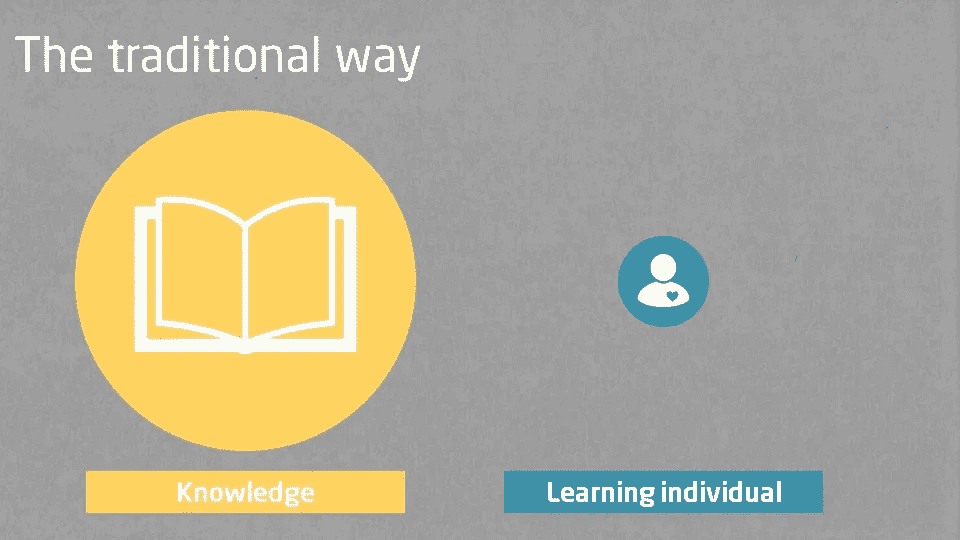
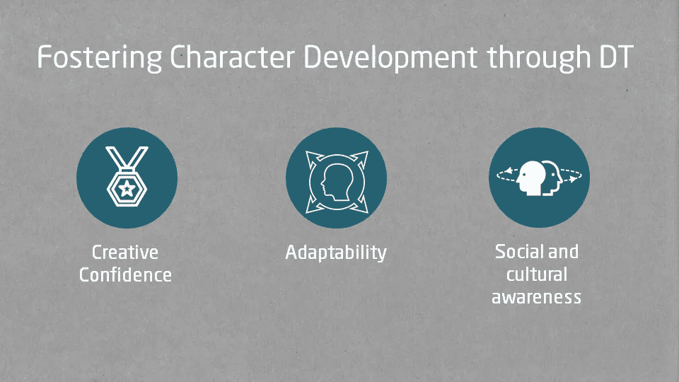
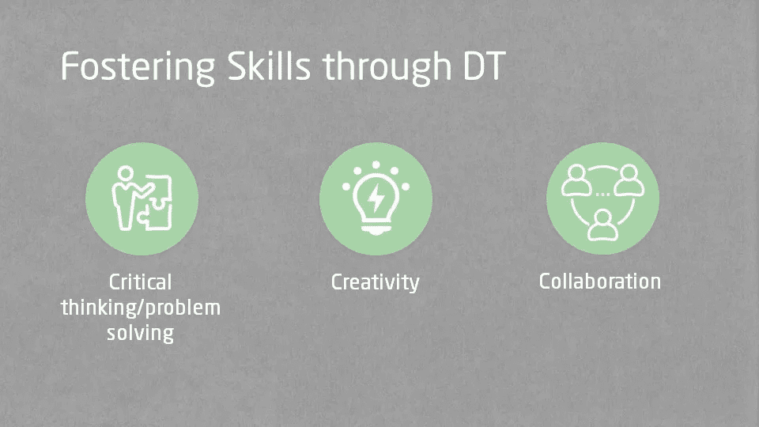
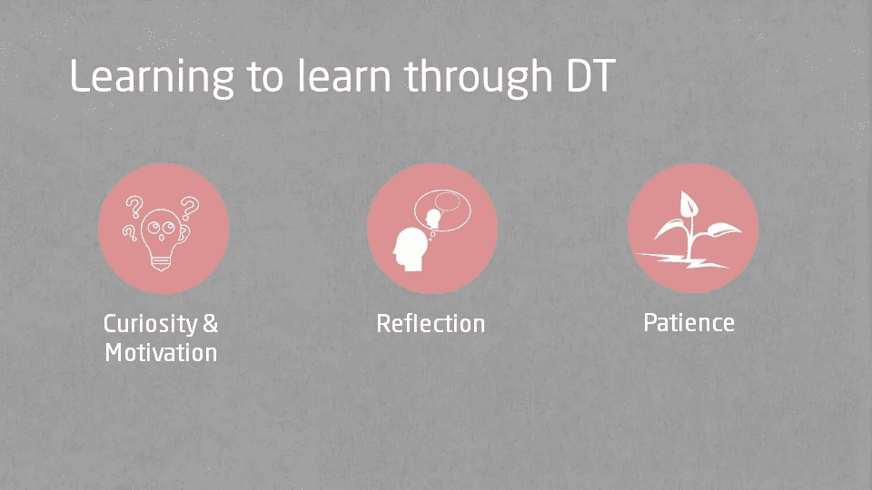

# 设计思维如何让教育受益

> 原文：<https://medium.com/swlh/how-design-thinking-can-benefit-education-2bba35450771>

设计思维作为一种创造性解决问题的思维方式和工作态度，已经成为教育和高级培训中许多活动的关键。在这篇文章中，我将思考设计思维给教育带来的附加值。我相信教育和终身学习是我们生活中一切的基础。然而，我们思考教育的方式迫切需要向更现代的形式转变。过去，教育的重点是内容和知识的传递。关于大学教育，Norman 和 Spohrer 在二十多年前(1996 年)就注意到了这一点:

> 课程围绕识字、历史、社会研究、科学和数学等基本主题进行组织。对于每个内容领域，专家将主题分成小的、可管理的包，然后根据规定的课程计划教授每个包。这个框架支配着世界上大多数的教学，从上课的第一天，一直到大学教育。

因此，教育设计一直专注于如何将现有知识的“可管理的捆绑”纳入人们大脑的问题。但是，我们正走向一个世界，在这个世界里，作为纯粹知识容器的人类比作为未来自信而有创造力的设计师的人类更不被需要。正如英国著名教育和创造力专家肯·罗宾逊爵士所说:“创造力在当今教育中与识字同等重要，我们应该给予它同等的地位。”

然而，问题是，今天的教育不仅没有促进创造力，反而扼杀了创造力。我同意肯·罗宾逊爵士的说法:“我们不是成长为创造力，而是成长为创造力之外的东西。或者说，我们从中获得了教育。”每当我和我的两个四岁的侄女一起玩耍时，我总是对她们的好奇心、热情、创造力和发明能力印象深刻。但是上了学校，上了大学，这还能剩下多少？让人们记住所谓的“唯一正确的答案”，设计标准化的知识驱动的课程，一种“一刀切”的方法——所有这些都导致人们的创造力被吸走。

因此，我建议教育的重点需要从传递循环的标准化知识包转变为以学习者为中心的教育。以学生为中心的教育意味着

> 重点是学习者和真实的问题，而不是对课程内容的结构化分析——尽管这两者显然都是必要的。(诺曼和施波尔，1996 年)

这就是设计思维作为一种以人为中心的方法可以发挥作用的地方。

将设计思维引入教育意味着强调我们人类的天赋和能力。值得一提的是，这既不是全新的，也不打算完全取代已经运行良好的东西。但设计思维已被证明是一种有效的方法，可以在研究、商业和管理等各种职业领域做出改变。事实上，众所周知，设计思维已经成功地应用于 K-12、本科、研究生和专业培训的教育中，因此有许多例子已经显示出设计思维在教育中的益处。

在下文中，根据致力于改善教育的非营利全球组织课程再设计中心(Center for Curriculum Redesign)的四维教育框架，我想简要地概述一下设计思维可以给传统教育带来什么。

下面的四维教育框架侧重于知识(知道和理解什么)、技能(如何使用这些知识)、性格(如何行为和参与世界)和学会学习(如何通过不断学习和成长来反思和适应)。

设计思维在增加“性格”、“技能”和“学会学习”这三个维度的价值方面特别强大。我将讨论与这三个方面相关的三个具体方面。

# **字符**

先说性格维度。通过培养个性发展，你为终身学习打下了基础。

> 品格教育是关于获得和加强美德(品质)、价值观(信仰和理想)以及为全面的生活和繁荣的社会做出明智选择的能力。(法德尔等人，2015 年)

我将强调三个我认为与现代世界所有人都相关并且在设计思维中起重要作用的性格品质:创造性自信、适应性和社会文化意识。

*   **创意自信**

创造性自信是汤姆和大卫·凯利在 2012 年引入的一个术语，是一种天生乐观的方式，看待可能发生的事情，相信自己有能力改变周围的世界。假设是大多数人生来就有创造力，但它需要不断的练习，否则就会减弱。设计思维不断激励你增强你的“创造性肌肉”。它基于一种成长的心态，并促进对行动的偏好。你必须面对未知，积极行动，经常参与和尝试。在这样做的时候，你会意识到你有多少能力去设计一些有意义的东西，并成为实现某些目标的贡献者。

*   **适应性**

不断适应不断变化的情况和环境，接受新的想法是设计思维的关键特征之一。创新的本质是不可预测的，因此你会不断受到挑战，需要重新思考并敢于向新的方向前进。

*   **社会文化意识**

设计思维为跨学科合作提供了一个框架，因为它的核心是一种相互创造的 we 文化。多元化不仅得到了容忍，还被提升为这一过程的重要组成部分。你和与你不同的人一起工作。你沉浸在对你来说可能陌生的生活世界中。因此，你会不断地面对和学习新的视角和观点。

# **技能**

技能一直是教育讨论的主题，而且总是有这样一个问题，即什么样的技能在未来是相关的。我将提出我认为设计思维最能培养的三种技能:批判性思维/解决问题、创造力和协作。

*   **批判性思维/解决问题**

设计思维是一种以人为中心的解决问题的方法。它为你提供了一个解决复杂问题的框架。设计思维提醒你永远是一个质疑的思考者，因为它促使你检查和测试任何一种被接受的命题。

*   **创意**

创意自信需要创意。设计思维帮助你应用、探索和实践创造力。它提示你使用你的两个大脑半球，也就是你大脑中逻辑和直觉的那一边。作为一种开放和有趣的方法，设计思维给你必要的自由去成为未知的探索者。

*   **协作**

复杂的问题只能通过具有不同技能、背景和观点的人之间的合作来解决。然而，某人与自己的差异越大，就越不容易一起工作。设计思维在两个方面是有益的。一方面，它为团队提供了一种共同的语言来完成创作过程。另一方面，通过在对人类、他们的需求和他们的环境的深刻理解中的基础实践，设计思维促进了团队成员观点的一致，因为他们朝着改善人类生活的共同目标努力。因此，团队成员有一个结构化的过程来合力实现改善生活的目标。

# **学会学习**

学习如何学习，或称“元学习维度”，基本上涵盖了所有其他维度(“知识”、“技能”和“性格”)，并支持持续的发展。

> 学会学习促使学习者在先前的学习和生活经验的基础上，在各种情况下使用和应用知识和技能[……]。这种能力包括意识到自己的学习过程和需求，识别可用的机会，以及克服障碍以成功学习的能力。(欧洲议会，2006 年)

好奇心&动机、反思和耐心是设计思维培养的“学会学习”的三个特征。

*   **好奇心&动机**

阿尔伯特·爱因斯坦曾经说过:“我没有什么特殊的才能。我只是强烈好奇。”好奇心和动机在设计思维中扮演着重要的角色。设计思维鼓励你承认你可能知道一些事情，但是仍然有很多东西需要探索！在设计思维中，你不断尝试采用初学者的心态，从不同的角度探索事物。通常情况下，这是你为用户建立的同理心的结果，因为你有改善他们体验的内在动力。

*   **倒影**

反思是对你做什么和为什么做的建设性提问，然后决定未来的下一步。这是设计思维中迭代工作过程的一个中心方面。你不断地从你自己、你的团队和用户那里得到反馈。

*   **耐心**

耐心是一种美德。没有解决问题的神奇工具，没有创新的捷径。设计思维也是如此；这不是一些人希望的简单解决方案。然而，设计思维为你提供了一个持续的过程，你可以相信最终会出现一个有用的解决方案。通过其丰富的多样性，设计思维给你信心，好的事情需要时间。

# 摘要

综上所述，教育迫切需要向关注人类及其潜力和才能的方向转变，以下是设计思维可以支持这一转变的三种方式:

**字符:**

创新信心|适应性|社会和文化意识

**技能:**

批判性思维/解决问题|创造力|协作

**学会学习:**

好奇心和动力|反思|耐心

谢谢你看完这些，希望这对你有帮助。让我知道你是否有设计思维和教育的经验，或者你是否已经将设计思维引入教育。反馈和额外的想法总是很受欢迎。

*参考文献:*

唐纳德·诺曼和詹姆斯·施波尔。(1996).以学习者为中心的教育。

法德尔，查理斯&拜力克，玛雅&特里林，伯尼。(2015).四维教育。

欧洲议会。(2006).欧洲议会和理事会 2006 年 12 月 18 日关于终身学习关键能力的建议。

## 这篇文章发表在《创业公司》杂志上，这是 Medium 最大的创业刊物，有 326，962 人关注。

## 订阅接收[我们的头条](http://growthsupply.com/the-startup-newsletter/)。

