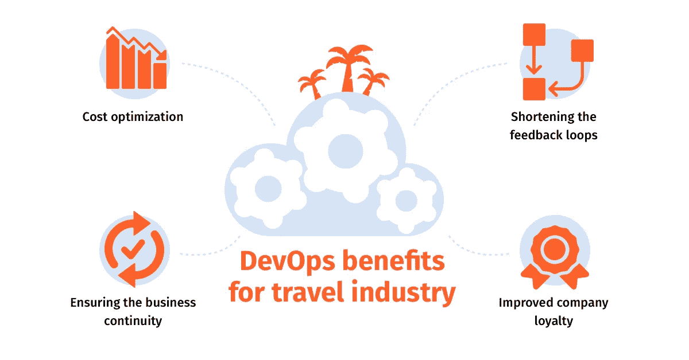

# DevOps 如何改变旅游业

> 原文：<https://medium.com/swlh/how-devops-is-transforming-the-travel-industry-3c3501d63c4c>

在旅游业中实施 DevOps 有多种原因，成本效益、性能优化和业务连续性是主要原因之一。下面是如何做到这一点。

旅游业是技术和创新的最大消费者之一。在过去的 20 年里，它发生了很大的变化。在呼叫中心，公司代表必须检查打印的票价并通过电话咨询客户，旅行转移到 Kayak.com 等价格聚合器，这些价格聚合器对各种注册器进行 API 调用，并在网络或移动应用程序中提供方便的价格比较。然而，这种操作的背景是涉及在专用服务器数据中心上使用复杂的大型机工作负载的高成本过程。

这一发展过程中最困难的部分是需要快速适应快速发展的客户需求。以上面的例子为例，20 年前，旅行社的客户满足于打电话给他们选择的机票预订公司，让代理人检查可预订的机票。如今，人们更喜欢使用价格聚合应用程序，它从多家公司收集数据，形成一个可用报价列表。通过这种方式，只需几分钟，就可以在一个应用程序中预订一整套航班、轮船或火车票、酒店房间、汽车租赁和观光旅游，而无需在很长时间内与多家公司合作。

然而，每个旅游企业都必须以不同的方式解决这一任务，每个企业最终都拥有不同的 IT 基础设施，由各种专有系统和定制模块组成，每个都以其独特的方式运行。最坏的结果是这种操作的过度复杂性和成本。这就是为什么实际上旅游行业的每家公司都在积极寻求简化和降低 IT 运营成本的新方法。DevOps 软件和运营交付方法是实现这一目的的正确选择。

# DevOps:少花钱多办事的方法

[devo PS](https://itsvit.com/blog/devops-devops-services-nutshell/)究竟是什么？

> *Devops 是一套文化实践、Devops 工具、技能和工作流的总称，旨在提高运营的稳定性和绩效，同时通过自动化和消除浪费来降低时间和资金成本。*

让我们分析一下这个定义的每一部分:

1.  DevOps 是一套文化实践。 [DevOps 文化](https://itsvit.com/blog/devops-culture-huge-step-mankind/)是从瀑布式软件交付生命周期到协作式方法的结构性转变，瀑布式软件交付生命周期的口号是“把代码扔到墙外，让别人来关心”，在协作式方法中，开发人员和运营人员一起设计未来的软件。这种沟通导致了高效的协作，因此开发人员知道他们的软件将如何在生产中运行，并提前计划资源使用和应用程序结构( [monolith、微服务或无服务器](https://itsvit.com/blog/the-monolith-microservices-and-serverless-computing-pros-and-cons/))。Ops 知道将需要什么样的底层 IT 基础设施，并提前构建这个代码为 (IaC)的**基础设施，以及自动化的**持续集成/持续交付** (CI/CD)管道，从而大大缩短新产品和产品功能的上市时间。**
2.  **DevOps 工程师使用 DevOps 工具。** DevOps 的 IT 基础设施管理方法与手动服务器供应和配置有很大不同，后者是许多旅游平台 IT 工作负载的特征。DevOps 工程师运营裸机服务器、OpenShift 等本地云中的虚拟机，或者像 [AWS 或 Azure](https://itsvit.com/blog/aws-vs-ms-azure-cloud-provider-choose/) 、GCP 或 DigitalOcean 等公共或私有云中的虚拟服务器。这是通过利用多种专有或开源 [DevOps 工具](https://itsvit.com/blog/must-have-devops-tools-make-things-right-get-go/)实现的，如 Docker、Kubernetes、Terraform、Jenkins、Ansible、Zabbix、Prometheus+Grafana 等。使用此工具集有助于自动化大多数流程，并构建防错的自动化工作流。
3.  **DevOps 以自动化和消除浪费为中心。**效率优化的 DevOps 方法要求显著减少对运营多个方面的执行控制。因此，工程师不必在服务器供应和配置周期中等待多次批准。更进一步说，管理人员不必担心过程的结果，因为它是由自动化工具根据容易配置的 [Terraform 或 Kubernetes](https://itsvit.com/blog/use-terraform-kubernetes-manage-worlds/) 清单来执行的。通过这种方式，重复操作实现了自动化，没有人为错误和昂贵的重新配置的空间。

DevOps 的这些核心原则允许各种规模的公司进行其[数字化转型](https://itsvit.com/our-whitepapers/how-to-perform-a-successful-digital-transformation-guideline/)，并通过降低运营费用、缩短反馈实施时间和提高平台性能来获得竞争优势。

旅游业如何从 DevOps 中受益？
devo PS 为企业差旅行业带来的核心优势已在上文中多次提及，为方便起见，我们将简要列举如下:

1.  **成本优化。** [过渡到开发运维](https://itsvit.com/our-whitepapers/transition-to-devops-the-reasons-methods-and-results/)工作流从对现有 it 基础架构以及工具和流程进行审核开始。通常，这种审计与接收来自公司利益相关者的输入一起允许识别系统瓶颈和服务交付链的薄弱环节。随后，这种检查的结果导致设计新的系统结构，这总是更具成本效益。这可以大大降低为客户提供价值所需的计算资源和人力成本。
2.  **缩短反馈回路。**顾客希望他们使用的产品能够响应他们的偏好和期望。如果需要某个功能，它必须在最多几个月的时间内开发出来，否则客户会转向提供该功能的竞争对手。因此，实施客户反馈和推出新功能是任何企业长期成功的重要组成部分，旅游业也不例外。当软件开发过程的所有常规部分都自动化时，开发新的特性就大大缩短了。当任何开发人员都可以执行开发运维人员编写的命令，启动构建服务器、测试服务器、试运行服务器，并通过微补丁、重启时的应用内更新或跨平台的滚动更新将更新投入生产时，反馈循环将变得更短。
3.  **确保业务连续性。**现在有多种 IT 基础设施，但没有一种是完美的。服务器停机可能由于多种原因而发生，所以问题不在于它是否会发生。问题是，一旦出现问题，您的 IT 团队将如何确保业务连续性？监测约占开发运维活动的 50%。然而，像 Zabbix、Prometheus+Grafana 和 ELK stack 这样的 DevOps 工具支持[预测性](https://itsvit.com/blog/predictive-analytics-in-devops-applications-and-benefits/)和[规定性](https://itsvit.com/blog/prescriptive-analytics-devops-next-progress-phase/)分析、智能警报、详细日志记录和深入效率分析。也就是说，不是处理崩溃的结果，而是使用 [DevOps 监控工具包](https://itsvit.com/blog/5-parts-svit-logging-monitoring-toolkit/)来完全避免停机。此外，根据 Dora、Puppet 和 Atlassian 对 2018 年 Devops 采用状况的最新研究，滚动更新的做法可以将发布期间的错误数量减少 7 倍。
4.  **提高公司忠诚度。DevOps 文化不是以越过被解雇的员工实现业务目标为中心。它接受失败，并教导我们要准备好将失败的影响最小化，而不是去寻找责怪别人的方法。系统错误不会被认为是某个人的错误，而是系统改进空间的指示器，是团队学习和专业成长的机会。这样，团队成员对他们的工作更加自信和满意，从而提高了对公司的忠诚度和奉献精神。**

这些听起来都很棒，也很有用，但是有没有旅游业公司通过采用 DevOps 方法做生意而获益的真实例子？当然啦！

# 旅游业中成功实施 DevOps 的真实例子

以下是三个使用案例，展示了 DevOps 实践和工具如何帮助企业旅游公司改善服务。

# 案例 1:为一家旅游行业领导者构建内部云

Amadeus 是全球最大的旅游运营商之一。他们的系统与所有旅行相关交易的 90%进行交互，为超过 700 家航空公司和大约 600，000 家酒店提供服务，在高峰负载时每秒处理超过 55，000 次操作，而且这个数字还在不断增长。

该公司使用私有云，虚拟机由 vagger 和 vSphere 提供服务。然而，花费在维护基础架构的虚拟机管理程序层上的计算资源量太高，处理速度不是最佳的，而即使几秒钟的延迟也会给旅游运营商带来巨大的损失。

该公司选择了 [Docker，而不是 travel](https://itsvit.com/blog/vagrant-vs-docker-better-software-development-environments/)，并决定迁移到运行 OpenShift、 [Docker 和 Kubernetes](https://itsvit.com/blog/docker-kubernetes-till-death-us-part/) 的本地云。通过使用专有的 DevOps 管理系统，他们能够高效地利用其整个 IT 基础架构，利用以前由虚拟机管理程序使用的资源。这占了他们计算能力的近 **20%** 。也就是说，该公司通过有效利用其 IT 基础设施，获得了价值数百万的计算资源。此外，Kubernetes 集群中运行的 Docker 容器允许实时处理工作负载，因为没有虚拟机管理程序层，所以没有延迟。

# 案例 2:泛澳旅游平台使用 DevOps 运行

澳大利亚以前有 8 个传统旅游平台，每个平台由当地州和旅游企业协会运营和维护。退一步说，他们之间的互动很复杂，计划穿越欧洲大陆的旅行或与外国旅行社合作也很麻烦。去年，澳大利亚旅游数据仓库(ADTW)启动。

它是由澳大利亚旅游协会、云服务提供商 Rackspace 和 DevOps&数字营销咨询公司 SapientNitro 合资成立的。该平台支持超过 **40，000** 个 **10** 类别的旅游列表，并为各种规模的旅游企业(从跨国公司到小型家庭企业)提供多种功能。这些功能包括推广、文案、白名单应用，以及由 SapientNitro 的机器学习算法提供支持的定制大数据分析平台。Rackspace 于 2018 年**2 月**进行了平台首次展示，目前提供持续的产品支持。

在一个利用最新云技术和 DevOps 工作流的集中式平台上工作，使所有澳大利亚旅游运营商在提高服务水平的同时，减少了在 IT 基础设施上的支出。在上线后的第一天，ADTW-Online 已经处理了超过**160 万**个 API 请求，提供了超过 **35 万**个独立访客，并为大约**1800**个旅游运营商提供服务。该平台目前可以与任何外部旅游应用程序进行良好的交互，并帮助澳大利亚和世界各地的旅游公司在一个干净高效的系统中工作。

# 案例 3:一家领先的欧洲旅游运营商向 AWS 的云转型

e-Travel 是一家成立于 2007 年的希腊初创公司，拥有 30%的年增长率。这家初创公司成立于经济危机的边缘，很快就找到了自己的定位，成为一个比较和预订最便宜的航班、酒店房间和汽车租赁的平台。35 名开发人员不断致力于将新的服务和功能集成到平台中，而将近 180 名工程师总是忙于向他们的专用服务器提供商提供和配置服务器。硬件故障导致的频繁停机严重阻碍了业务增长。

2012 年，由于 AWS IaaS 服务的成熟和丰富的成功创新项目组合，该公司决定迁移到云，并选择 AWS 作为迁移的目的地。欺诈预防和监控系统首先被转移，因此运营部能够直接使用 AWS 功能和基础架构。在那之后，大部分的**系统在一个晚上的 4 小时停机时间**内被转移到 AWS，这是电子旅行客户经历的**最后一次停机时间**。

如今，e 旅工作人员积极使用 AWS SDK 套件来添加更多的 Ruby 和。并计划利用 AWS 亚洲可用性区域扩展到东南亚、日本和韩国。该公司使用 **AWS EC2** 实例、 **AWS S3** 存储、 **AWS SNS** 和 **SQS** 消息代理以及其他功能来确保电子旅行系统的防故障操作，从而显著缩短了上市时间。

# 关于在旅游行业使用 DevOps 的最后思考

如您所见，旅游业可以从使用 DevOps 实践中大大受益，金融、保险和医疗保健行业也是如此。优化 IT 开支，最大限度地缩短新产品和新功能的上市时间，确保更稳定的运营、更好的监控和更安全的业务连续性，所有这些都可以通过 DevOps 文化和工作流实现。

那么，如何开始贵公司的 DevOps 之旅呢？选择一家声誉良好的托管服务提供商，他们可以提供可靠的 [DevOps 服务](https://itsvit.com/our-services/devops-service-provider/)，要么共同改善您的 IT 基础架构，要么将 IT 运营完全外包给专门的 DevOps 团队，这样您的内部员工就可以专注于为客户提供更多价值，而不是执行日常任务。有什么问题吗？[请便](https://itsvit.com/contacts/)，我们随时乐意协助！

*原载于 2018 年 11 月 7 日*[*itsvit.com*](https://itsvit.com/blog/devops-transforming-travel-industry/)*。*

## 这篇文章发表在 [The Startup](https://medium.com/swlh) 上，这是 Medium 最大的创业刊物，有+389，305 人关注。

## 在此订阅接收[我们的头条新闻](http://growthsupply.com/the-startup-newsletter/)。

