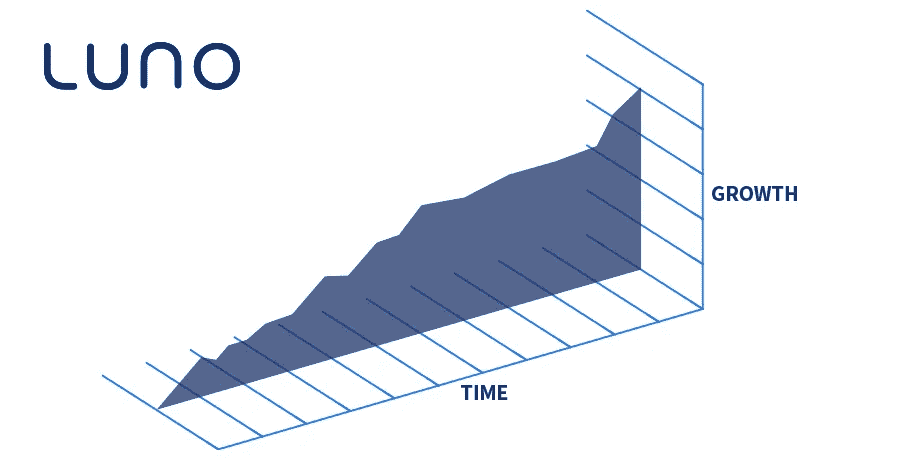
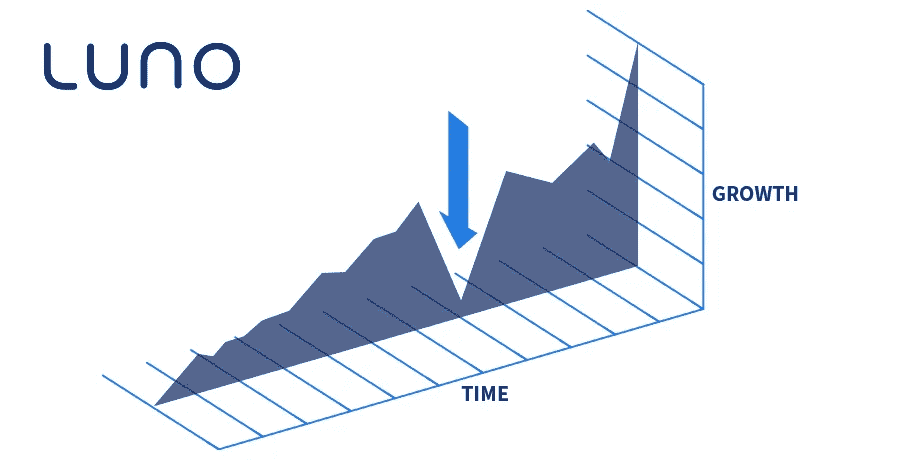
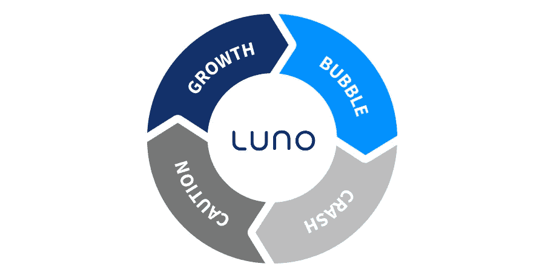

# 金融泡沫究竟是如何运作的？

> 原文：<https://medium.com/swlh/how-do-financial-bubbles-really-work-9d2ffca8de7>

Photo by [Alejandro Alvarez](https://unsplash.com/photos/63YVMrL2d6g?utm_source=unsplash&utm_medium=referral&utm_content=creditCopyText) on [Unsplash](https://unsplash.com/search/photos/bubble?utm_source=unsplash&utm_medium=referral&utm_content=creditCopyText)

这是我们的*货币演变*系列的下一集，在这里我们来看看货币是如何随着时间的推移而变化和发展的，以及未来可能会怎样。在这个故事中，我们将关注**金融泡沫** : *的起因、迹象、后果和好处。*

**首先，什么是金融泡沫？**

# 金融泡沫是指资产价格的大幅上涨，而这并不反映其真实价值的上涨。

泡沫通常基于资产价格将继续上涨的信念。人们**支付更多**因为他们期望**卖更多**。这种信念进一步推高了价格。最终，现实开始出现，泡沫“破裂”。

它们已经存在了几个世纪，但很罕见，发生的频率低到足以让我们在下一个开始之前忘记上一个。这让人们更容易相信这次不同了。

最早的例子之一发生在 18 世纪早期。尽管没有利润，南海公司的股票价格还是爆炸式增长。你也会经常听说荷兰郁金香泡沫，这可能从未发生过。

# 如果某物既有限又有需求，它就有价格。如果它有价格，就有可能引发投机热潮。

这包括股票、房地产、贵金属、自然资源、学生贷款、收藏品(比如豆豆娃)，甚至整个经济。

然而，如果泡沫**破裂**，那只是泡沫。资产经历[从未逆转的突然价格上涨是很常见的。尽管媒体经常暗示金融泡沫是直接的、可预测的，但它们不是**而不是**。](https://www.ft.com/content/e22cc860-ef4f-11e6-930f-061b01e23655)

> 原因往往是复杂的，绝大多数预测的崩溃从来没有发生。

# 金融泡沫发生在四个阶段

我们只能在事后识别泡沫，但当我们回头看时，它们往往涉及四个阶段。

## **触发**

金融泡沫的最初火花是什么？往往是**兴奋**。新事物出现时，我们不知道该如何反应。但它似乎可能会改变世界，所以我们无法计算它的确切价值。

> 随着时间的推移，这种模糊性很容易证明价格上涨的合理性。

**我们高估了技术的短期影响，低估了它的长期影响**。这是[阿马拉定律](https://www.pcmag.com/encyclopedia/term/37701/amara-s-law)，它解释了人们对未经证实的概念的过度兴奋。尽管并非所有的泡沫都与新技术有关，但触发因素通常是变化。

**比如:**

*   2000-2003 年的利率下降导致了次级贷款，导致了房地产泡沫
*   铁路的发明导致了 19 世纪 40 年代的铁路热
*   [互联网的兴起导致了本世纪初的网络热潮](https://en.wikipedia.org/wiki/Dot-com_bubble#Prelude_to_the_bubble)
*   [20 世纪 60 年代新镍矿的发现，导致矿业股票泡沫](https://en.wikipedia.org/wiki/Poseidon_bubble)

在触发阶段，市场通常很小，价格也很低。在这个阶段买入的投资者获利最多，前提是他们及时卖出。

Photo by [Leo Rivas](https://unsplash.com/photos/wtxcaDIdOCM?utm_source=unsplash&utm_medium=referral&utm_content=creditCopyText) on [Unsplash](https://unsplash.com/search/photos/bubble?utm_source=unsplash&utm_medium=referral&utm_content=creditCopyText)

泡沫不同于庞氏骗局，因为没有故意的欺骗或欺诈。人们不会制造泡沫。它们就这样发生了。

## **意识**

随着越来越多的投资者意识到这种资产，价格就会上涨。

> 一旦泡沫开始运动，它就会引发一个自我延续的反馈循环。

知识导致涨价，涨价导致认知度更大等等。人们开始猜测。

## **热潮**

最终没有太多相关了解的人开始购买。他们期望将来别人会为它付出更多，所以他们认为不需要理解它的价值。价格大幅上涨和早期投资者致富的故事对媒体来说就像猫薄荷。持续覆盖只会进一步推动价格上涨。

> 我们称之为[非理性繁荣](https://en.wikipedia.org/wiki/Irrational_exuberance):相信价格会永远上涨，因为它们在过去上涨过。

虽然没有人类心理的这种怪癖，泡沫可能不会发生，但有许多有利因素。例如，外国投资涌入一个国家可能会推高资产价格，因为更多的钱投向了同样数量的机会。

聪明(或幸运)的投资者在这个阶段卖出，并获利。

## **爆裂/撞击**

只有当泡沫破裂时，我们才能肯定地知道，它首先是一个泡沫。但迹象是无可争议的:资产价格的快速下跌比日常波动更为显著。当每个人都同时卖出时，市场就会泛滥。

根据市场的规模和资产的流动性，这可能需要几天到几年的时间。事前有微妙的迹象，但大多数投资者忽略了它们。

# 当泡沫破裂时，我们通常会问‘为什么没有人对此做些什么？’

> 肯定有人预见到了。肯定有人可以阻止混乱的后果。事实上，人们通常看到它的到来，并试图警告他人。但这并没有多大帮助，原因有三。

首先，正如我们所见，**在崩盘之前，不可能知道一项资产是否正在经历泡沫。每当资产价格大幅上涨时，你都会听到许多人称之为泡沫。有这么多的噪音，没有简单的方法来验证这些说法，我们不知道该听谁的。**

关于人性，最难接受的事实之一是[我们以自己想要的方式看待世界。如果有人想相信某项资产正在经历泡沫，他们会找到证据。如果其他人想相信同样的资产被合理定价，他们会找到令人信服的证据。你可以向两个人展示相同的信息，他们会以支持他们信念的方式来解读。](https://www.psychologytoday.com/gb/blog/science-choice/201504/what-is-confirmation-bias)

第二，让泡沫持续下去的反馈回路太强大了，无法停止。

第三，人们可能意识到了泡沫，但他们希望派对继续下去。投资让位于赌博。如果你打不过他们，他们可能会说，你还不如加入他们。

值得注意的是，崩盘不同于市场调整，市场调整是在不合理的上涨后下跌 10%以上。修正使价格更接近“正确”水平，而不是低于它。

# 铁路狂热

让我们来看一个金融泡沫的例子，以了解这一切是如何结合在一起的。铁路热是整个 19 世纪 40 年代英国的一段投机热潮。

今天，铁路可能看起来平凡无奇。但在当时，他们是革命性的。

> 他们的影响有时被比作互联网，因为两者都允许信息以新的方式传播，将原本不会互动的人联系起来，并开辟了新的赚钱方式。

铁路网络自 16 世纪就已经存在，早期的系统由不同公司运营的许多不相连的线路和车站组成。到 19 世纪，技术已经发展到足以形成第一个国家系统的基础。

Photo by [Jack Anstey](https://unsplash.com/photos/XVoyX7l9ocY?utm_source=unsplash&utm_medium=referral&utm_content=creditCopyText) on [Unsplash](https://unsplash.com/search/photos/railway?utm_source=unsplash&utm_medium=referral&utm_content=creditCopyText)

## 像互联网一样，铁路需要对复杂的基础设施进行大量的前期投资。

随着现有铁路公司开始大幅盈利，它们的股票价格飙升。

投资者，其中许多是工业革命的新富，将他们的储蓄投入铁路公司——这是第一次，可以在报纸上宣传他们的股票。随之而来的狂热提供了建设横跨英国的轨道所需的投资。

不幸的是，股票价格的暴涨使得成立铁路公司成为了当时的快速致富计划。无数不择手段的公司涌现出来，利用这种喧嚣赚钱，却没有资源，甚至不愿意建造可用的铁路。

## 到 1850 年，泡沫破裂，铁路股票损失了大部分价值。

许多愚蠢地把所有的钱都投入铁路股票的人失去了一切。

但从长远来看，英国可能会受益。狂热留下了一个可用的轨道网络，一些大公司以其真实价值的一小部分买下了它。

如果没有失控的投机，接下来的社会和经济变革可能需要更长的时间。

# 那么，我们知道是什么导致泡沫破裂吗？

*是和否*

继 1987 年[10 月 19 日股市崩盘](https://en.wikipedia.org/wiki/Black_Monday_(1987))(价格下跌 22.6%)之后，诺贝尔奖获得者[罗伯特·J·希勒](http://www.econ.yale.edu/~shiller/)调查了 [1000 名投资者。他想知道为什么它们都在同一时间出售。从逻辑上讲，我们会期待一个明显的崩溃催化剂，比如一条新闻。](http://www.nber.org/papers/w2446.pdf)

但是席勒并没有发现这一点。没有新闻报道或谣言对此负责。投资者表示，那一周发生的事情与他们的决策没有多大关系。尽管许多人事先感到不确定，但他们只是在价格开始下跌时才卖出。

这是一个先有鸡还是先有蛋的局面:每个人都在卖，因为其他人都在卖。泡沫往往就是这样破裂的。

> 反馈循环发生逆转，尽管有时有明确的原因，但通常只是随机的。

一旦下跌开始，就像上涨一样不可阻挡。价格越跌，卖的人越多，卖的人越多，价格越跌。

许多人做决定并遵循一些规则的行为，导致了一种[涌现模式](https://en.wikipedia.org/wiki/Emergence#Economics)。例如，股票市场可以被想象成一个系统。

如果你放大个人投资者的行为，它可能会显得混乱。但当你缩小视野，把市场作为一个整体来看，你会看到一个更有序的模式。

没有人控制它——运动是自己出现的。

# 尽管金融泡沫在短期内可能是毁灭性的，但从长期来看却有好处。

美国经济学家海曼·明斯基(Hyman Minsky)认为，它们可能更多的是一种特征，而不是失败。明斯基写道，我们倾向于把经济想象成这样，有稳定、持续的增长:

除此之外，偶尔会有一次大的冲击或灾难，在一切恢复正常之前会扰乱一段时间:

根据明斯基的金融不稳定假说，这是错误的思考方式。明斯基认为，经济从根本上说是不稳定的，会经历自我延续的周期:

## 当情况好的时候，我们希望它们保持这种状态。

在成长期间，个人和组织承担越来越多的风险。从短期来看，这进一步刺激了增长，导致了更多的冒险行为。所以最初的稳定导致了泡沫。

## 但在泡沫破裂后，我们不会回到以前的状态。

尽管可能会有严重的后果(取决于规模和传染程度)，但增长吸引了投资。

崩溃通常会留下新的基础设施、技术发展和其他改进。人们从别人的错误中学习，并利用他们留下的东西。

泡沫留下的基础设施可能无法获得融资。例如，铁路泡沫留下了有益于后来企业的铁轨。

> 例如，本世纪初的网络繁荣可以说有着持久的好处。它通过向人们介绍这一想法并为我们现在使用的技术奠定基础，启动了互联网革命。今天一些最重要的公司都是在那段时间成立的。几年后，变化是巨大的。

在我们的日常生活中，我们都从过去的泡沫中获益，不管这些泡沫在当时有多么具有破坏性。

# 变化是不可避免的。正如我们所见，这也非常令人兴奋。

有时这会导致过度自信，因为我们知道新事物是好的，只是不知道有多好。

这是货币进化的一部分，随着我们进入新时代，认识到加密货币与任何其他资产非常相似是很重要的。

可能会有[失控的市场、](https://www.luno.com/blog/en/post/runaway-markets?utm_source=medium&utm_medium=content&utm_campaign=september)突如其来的暴涨，以及估值过高的资产(比如 ico。)即使某样东西确实经历了泡沫，也不会抹黑它的内在价值。重要的是要认识到这是成长的自然部分。

我们都有责任做出正确的决定并保持理性。**升级到一个更好的金融体系的一部分，是对过程中可能出现的挑战保持现实态度。**

> 对未来感到兴奋是很重要的，但从长远考虑并脚踏实地也很重要。

## 这篇文章发表在[《创业](https://medium.com/swlh)》上，这是 Medium 最大的创业刊物，拥有+ 372，390 名读者。

## 在这里订阅接收[我们的头条新闻](http://growthsupply.com/the-startup-newsletter/)。

