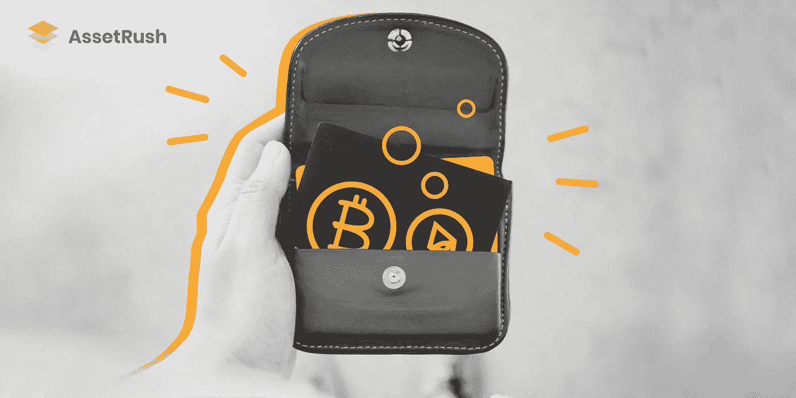

# 如何选择代币钱包？

> 原文：<https://medium.com/swlh/how-do-you-choose-a-token-wallet-909b65547358>

你准备好买一些 20 元的代币了吗？在你这样做之前，你需要决定你将把它们存放在哪里。在众多的钱包中导航是一项挑战，因此，[我们](http://assetrush.com)决定给你一个最常见的钱包的简要概述。

首先，你要回答一些关于你未来钱包的问题:

你会用它来进行日常交易还是购买密码进行投资？

无论你在哪里，你都需要你的钱包在手边吗？

它是否应该具有某些特定的特征，例如完全的隐私和安全性、出色的界面等。？

你打算储存许多不同的代币和硬币吗？

你想要一种简单直观的方法来跟上你的代币和其他代用币的汇率吗？

回答完这些问题后，你就可以考虑我们所研究的钱包的利弊了。

# **imToken 钱包**

一个中国团队设计的界面很好的漂亮钱包。它将保护您的 ETH 和 ERC20 令牌的安全。

**优点**

在 Android 和 iOS 上运行

可访问界面

以太网和令牌费率

**缺点**

不支持其他硬币

无钱包内兑换

受支持的令牌不太受欢迎(根据 coinmarketcap.com 费率)

# **信任钱包**

这个钱包有很多有用的选项，可以成为加密世界中真正的朋友。这是一个存储你的 ETH 和令牌的合适平台，但是注意它的界面是针对更高级的用户的。

**优点**

适用于 Android 和 iOS

支持以太网和令牌

支持的收藏品

**缺点**

无钱包内兑换

无费率图表

面向更高级用户的界面

# Jaxx

它是一种众所周知的钱包，可以让你存放几种硬币和代币。一些新手似乎觉得它的界面不方便，但是 Jaxx 有用的选项有助于弥补它的缺点。

**优点**

在许多平台上运行

里面有许多硬币和代币

钱包内兑换

安全的

**缺点**

不方便的界面

没有价格图表

# **米露钱包**

这个钱包的创造者关心他们的用户:它很方便，界面非常直观。另一个好处是它有每日、每周、每月和每年的价格图表。此外，米露的每个代币都有单独的钱包。

**优点**

支持 iOS 和 web 界面

钱包内兑换

可以添加许多硬币和代币

直观的界面

绝对安全

信息价格图

**缺点**

Android 版本不支持令牌或 ETH

# **面包钱包**

一款设计亮丽的钱包，您可以在其中存放代币和 ETH，并有机会在钱包内购买或交换它们。

**优点**

在 Android 和 iOS 上运行

支持以太网和令牌

钱包内交换(也可以为菲亚特购买密码)

**缺点**

没有价格图表

# **最后的想法**

选择钱包时，一定要考虑上述问题，因为它们会让你清楚地了解你在寻找什么，从而缩小你的选择范围。仔细检查你正在考虑的每个钱包的利弊，不要忘记任何关于钱包的文章都有一定的主观性，所以最终的决定应该最终由你做出。

## 这篇文章发表在 [The Startup](https://medium.com/swlh) 上，这是 Medium 最大的创业刊物，有 326，962+人关注。

## 订阅接收[我们的头条新闻](http://growthsupply.com/the-startup-newsletter/)。

