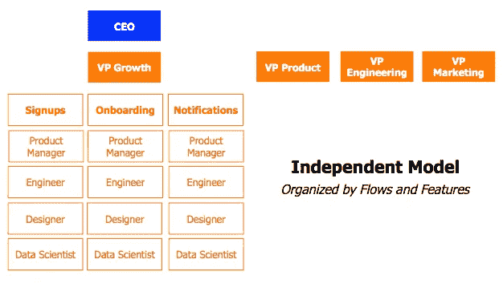
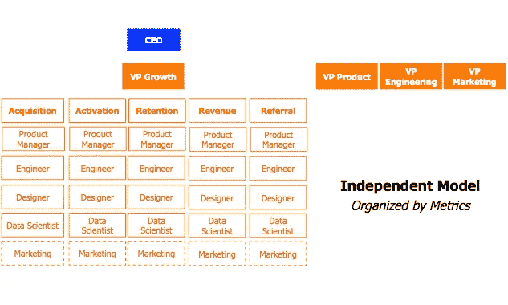
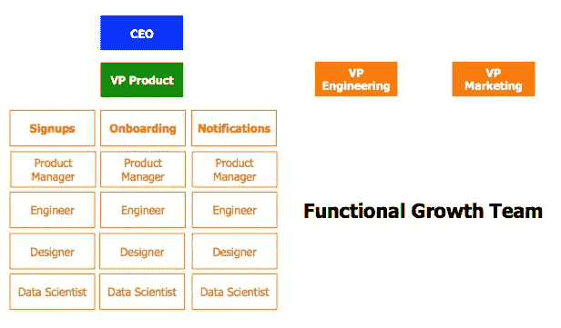

# 你如何选择最佳的成长团队模式？

> 原文：<https://medium.com/swlh/how-do-you-choose-the-best-growth-team-model-632ad5a85be9>

我们采访了 Pinterest 和 FanDuel 等一些发展最快的公司的 20 位增长负责人，以帮助你回答这个关键问题。

经过 30 多个小时的采访，有一件事变得非常清楚:选择正确的成长团队模式不仅能促进成长，还能强化文化。([点击发微博](http://ctt.ec/vWF8a))

## **成长团队模式**

在我们的采访中，出现了两种构建成长团队的流行模式。

一个是*自主车型*；另一个是*功能型*。两者都是“当游戏的名字是向上和向右的时候”你可能想要如何构建你的增长团队的良好起点。每种模式都专注于“加深对你的增长模式的理解”([Tilt 增长主管 Mike Duboe](https://www.linkedin.com/in/mikeduboe) )，两种模式都专注于在整个漏斗中释放增长。

**独立**

*总结*

优步和脸书使用独立模型。我们在采访中最常遇到的这种模式的两个版本组织如下:。

在这两个版本中，都有一个负责发展的副总裁领导团队。例如，在优步，艾德·贝克是增长副总裁，向首席执行官特拉维斯·卡兰尼克 T20 汇报。Ed 带领 100 多名具有产品、营销、工程、设计和数据专业知识的人员致力于需求和供应方面的增长。

同样根据我们的贡献者，优步使用这个模型围绕速度和迭代建立强大的团队 DNA。优步重视速度和迭代，因为它们使增长团队能够在优步的产品中建立强大的反馈循环。

反馈环帮助一群用户创造另一群用户，通常由搜索、付费和推荐机制触发。例如，基于现有骑手的推荐进行第一次骑行的骑手是推荐反馈循环的结果。通过点击“和优步一起开车”广告成为司机的司机是付费广告循环的结果。在每一种情况下，这些反馈循环都有助于现有用户创造新用户，无论是在产品的需求方还是供应方。

优步的成长团队的工作就是让这些反馈回路尽可能强大，以增加它们的乘数效应。例如，假设优步推荐反馈回路的乘数效应是“10 倍”这意味着通过线性渠道(如付费广告)获得的乘客数量将增加 10 倍。如果团队通过付费广告获得 1000 名骑手，这些新骑手将通过推荐循环创造另外 10000 名骑手。

乘数效应越大，优步的增长就越快。

*张力和分辨率(独立模型)*

[Pinterest 的首席增长产品经理凯西·温特斯(Casey Winters)](https://www.linkedin.com/in/caseywinters)表示，这种模式并非没有矛盾。

当 Pinterest 使用独立模式时，增长团队的人数不断上升。事实上，Pinterest 的指标增长如此之快，以至于其他团队开始担心增长是以牺牲更广泛的用户体验为代价的。

例如，当增长团队实施新的注册流程时，激活量和关注度都有了显著增加。其他团队认为该流程提供了糟糕的用户体验。然而，数据表明，尽管这些其他团队的直觉相反。

T 维持用户体验和获得强大的增长指标之间的紧张关系是我们的贡献者说他们在领导独立增长团队时面临的最大挑战。([点击发微博](http://ctt.ec/Czk42))

*增长是以牺牲用户体验为代价的吗*这是一个反复听到的论点，如果不加以适当反驳，“它会在组织内造成不信任。”这是温特斯的观点，他接着说“人们应该知道(并且相信)他们的成长团队正在为用户创造最好的体验。”

*建立信任*

你如何在团队中建立这种基本的信任？

Casey 提到的建立这种信任的一个好方法是签订一份书面协议，声明你的增长团队不会尝试损害用户体验的增长指标。这来自另一位撰稿人，他建议让你的首席执行官成为这份文件的所有者，因为公司文化始于首席执行官，并让你的增长和产品副总裁帮助撰写协议。这样你可以减少这个贡献者在独立模型中看到的另一种紧张。

Invoice2Go 的增长主管 Naomi io nita(Evernote 前增长主管)表示，增长计划不可避免地会与产品计划重叠。根据她领导这两个独立增长团队的经验，她解释说，如果你的角色和职责得到了明确定义和广泛沟通，或者你的增长和产品负责人有着牢固的工作关系，这种紧张是可以避免的。归结起来就是“信任、透明和客观”

**功能**

*总结*

答根据我们的参与者的说法，当从事增长计划的人向职能部门主管(如产品、工程等)汇报时。)，其他人认为成长指标将通过正确的方式实现。([点击发微博](http://ctt.ec/R903q))

Pinterest、Twitter、LinkedIn、Dropbox 和 BitTorrent 使用功能模型。

三大优势让这种模式大行其道。

1.职能负责人(如产品、工程等。)决定实施哪些增长计划

2.职能主管平衡增长计划和非增长计划

3.产品副总裁通常是负责增长的职能部门主管

让我们看看实践中的最后一个优势。

Pramod Sokke 是所有 BitTorrent 平台上所有客户端的产品负责人。他负责 BitTorrrent 的增长指标和非增长指标。这意味着 Pramod 必须为增长和非增长 KPI 制定产品路线图，因为他负责这两套 KPI。在 BitTorrent 不从事增长计划的人相信，他以平衡的方式优先考虑增长计划，以确保每个人的长期成功。

*张力和解决方案(功能模型)*

尽管如此，用户体验和增长指标之间的矛盾仍然存在。由于上面提到的优点，它不像在独立模型中那样明显。但仍然存在，因为从用户参与的角度来看，大量有效的“增长材料”可能是违反直觉的。

这就是为什么我们的贡献者也提倡纵向分析。它通过分析一段时间内的用户行为，回答了增长是否是以牺牲参与度为代价的问题。从中可以清楚地看出，增长计划是否不仅能获得用户，还能推动参与度。

我们还了解到，当最终负责增长指标的人是数据驱动的，并且认识到产品是迭代的和学习驱动的时，功能模型工作得最好。这不是仅仅基于直觉或直觉对产品路线图下大赌注。

例如，Pramod 采用非常数据驱动和迭代的方法来生产产品。这使得团队中唯一的成长项目经理安娜贝尔·萨特菲尔德更加高效。为什么——因为他们的两个过程配合得很好。

安娜贝尔解释说，她的成长过程是数据驱动和迭代的。这不是关于直觉或胆量，而是关于过程:看数据(定性和定量)，做假设，推出测试和 MVP，看结果，展示或重新开始你的新学习。

现在，让我们假设他们的过程没有很好地对齐，以说明这个模型中的另一个潜在的紧张关系。

假设 Pramod 采用非迭代方法来管理 Annabell 迭代开发的产品。Pramod 最有可能要求 Annabell 为产品路线图下大赌注，这将需要 6-12 个月才能完成。安娜贝尔会给 Pramod 这些大赌注，但她很可能在几周内(如果不是几天)使用她的学习驱动迭代过程使它们无效。安娜贝尔认为，这只会增加产品规划成本，而不会增加收入或用户。

我们的一些贡献者会通过将产品路线图转化为泳道来解决这种紧张。在我们假设的例子中，Pramod 可能希望在他的每个产品路线图中包含两个泳道，而不是只有一个泳道用于所有产品工作。一方面是 Pramod 的非迭代方法所决定的大赌注。另一条路线是由 Annabell 的迭代过程决定的增长计划。每条路线都有自己的专用产品、工程和设计资源，以确保所有工作按时按预算完成。

*领导层买入(在两种模式中都是“必须有的”)*

即便如此，领导层也需要接受数据驱动和迭代思维来推动增长。如果领导力不能做到这一点，那么无论你如何构建你的成长团队，你都会失败。

## **结论**

在我们生活的软件世界中，增长与产品交织在一起，这意味着很难知道产品的终点和增长的起点。这仍然是一个相对较新的现象，使得选择最佳的增长团队结构具有挑战性。

在采访 20 个增长线索时，出现了两个流行的模型:独立模型和功能模型。这两者都是在业务的可扩展增长阶段，你可能希望如何构建你的增长团队的良好起点。这是游戏的名字在右上的时候。

独立模型有助于提高运行生长实验的速度和迭代次数。然而，它提供的增长计划的透明度较低，这可能会在组织内造成不信任。功能模型通过对增长采取更平衡的方法提供了更大的透明度。然而，用户体验和增长指标之间的矛盾仍然存在。

有趣的是，我们没有发现这两种模型的最终结果有太大的不同。这意味着一种模式不一定比另一种模式更能在产品中实现更大的增长乘数。

这是一个重要的发现。

这表明选择一个基于文化、组织和战略契合的成长团队模式可能是更好的前进道路。不要为了成长而选择。选择适合。

选择一个你的“团队 DNA”能够最好地解决紧张关系的模型，并选择一个成长团队的领导者，他的品质也要适合这种情况。([点击发微博](http://ctt.ec/YkEUt))

你的成长团队领导与你的产品团队互动的好坏，将对你选择的模式的成功，以及你的公司整体的成功产生巨大的影响。

如果你喜欢这篇文章，请推荐和分享。别忘了在推特上关注我们([德鲁](https://twitter.com/ahmcinnes)和[景岛乐](https://twitter.com/daimiyoshi))，了解我们接下来的文章。

## **作者**

安德鲁·麦金尼斯在 Tradecraft 工作。在 Tradecraft 之前，Drew 是社交游戏和移动游戏业务增长的产品经理(最著名的是在 Zynga)，他希望继续帮助打造增长引擎。因此，如果你在寻找一个产品驱动型的成长型人才，请随时在 LinkedIn 上联系他。如果你只是想成为朋友，就联系他 [@ahmcinnes](https://twitter.com/ahmcinnes) ，或者发电子邮件到“mcinnean (at) gmail.com”。

景岛乐(Dice-K)Miyoshi 是 Tradecraft 的一名成长型营销人员/前谷歌员工，他热衷于帮助使命驱动型初创公司打造增长引擎。如果你正在寻找有付费收购和数据分析经验的成长型营销人员，请随时在 LinkedIn 上联系他。如果你只是想成为朋友，就和他联系 [@dicek344](https://twitter.com/daimiyoshi) 或者发邮件给他“daisuke (at) tradecrafted.com”。

## **贡献者**

请和我们一起感谢我们的 [**惊人贡献者**](https://docs.google.com/spreadsheets/d/1gA_3hJn8Un-WpMmCe8TbfJXWzUJCtxPYFzl5gCXMqvQ/edit#gid=0) (部分是 [**招聘**](https://docs.google.com/spreadsheets/d/1gA_3hJn8Un-WpMmCe8TbfJXWzUJCtxPYFzl5gCXMqvQ/edit#gid=1333699530) )！

他们富有洞察力的贡献使我们成为更好的成长团队领导者。

我们也感谢[@ drake ballow](https://twitter.com/search?q=%40DrakeBallew&src=typd)、 [@mishachellam](https://twitter.com/mishachellam) 和 [@TsarDarr](https://twitter.com/TsarDarr) 为阅读、编辑和改进本文所付出的时间和精力。

发表于*[**【SWLH】**](https://medium.com/swlh)**(***创业、流浪、生活黑客)**

******