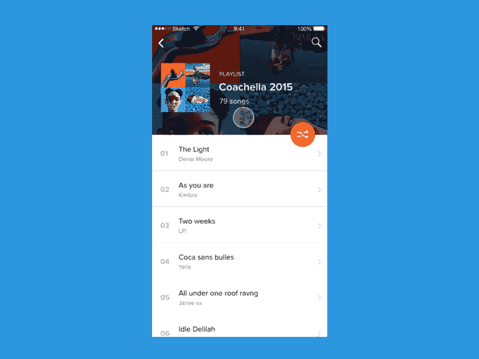

# 你如何确保开发团队理解设计？

> 原文：<https://medium.com/swlh/how-do-you-ensure-that-the-dev-team-understands-the-design-b7043ea01cd8>

## 如何向开发者展示你的设计

Illustration by [Nico Encarnacion](https://dribbble.com/nicoencarnacion)

确保设计可行，与开发人员建立共鸣，使用相同的语言与他们交流，如果你懂 C #、Objective-C 或 Swift，你就能掌控开发团队。

几天前，我对我正在开发的应用程序的新界面有了一个有趣的想法。在观察了可用性和设计之后，我向一位开发人员描述了我的想法。我得到了一个快速的回答:*“我们不能这么做！”*。这并不意味着我的评论是错误的。我的想法会损害代码实现的整体架构，稳定性和整洁性。建造它需要大约两个月。

因此，由于开发的限制，时间的限制，以及最终倾向于保持代码整洁的开发人员的限制，我经常不得不计算任何技术约束。所以团队合作是不断协商和尊重小的基本规则避免浪费时间的结果。

我怎样才能不惹怒开发者？

*   **不要太有远见。这些想法必须奏效。**
*   **显示 app 的流程。**点击后我去哪里？
*   **用真实数据工作，思考一个*“可扩展设计”*** *。*如果有很长的文字，会怎么样？它在其他语言中是如何工作的？如果将来菜单上会增加更多的项目，会发生什么？
*   **空态**如果你不知道它们是什么，那就去了解一下！
*   **解释你选择布局**、颜色和互动的原因。
*   风格指南和资产对开发人员的工作至关重要。你必须展示哪些是颜色，字体和界面。还需要以正确的方式收集资产，并放在有正确名称的文件夹中。
*   创造一个工作原型，自己去了解你的设计是否可行。
*   **工作原型？**好的，给开发者看看。
*   **加** **如果** **你会说开发者的语言，你就能得到尊重。如果你对编程语言(HTML、CSS、Java、PHP、JavaScript、C #、Objective-C 或 Swift)有很好的了解，你可以成为他们中的一员，他们会很乐意听你说话。**
*   **永远不要忘记用户**

这些是我每天谨记在心的规则，以便最好地与开发团队一起工作。

Prototype of a playlist made with Principle, by [Frank Rapacciuolo](https://dribbble.com/frankiefreesbie)

最近，对我帮助最大的是关于工作原型的规则。它之所以有效，是因为我知道我的设计是否可行，而且对开发者来说也更容易理解。有了 prototype，你可以测试手势、交互、流程、可用性、排版以及外观和感觉，所有这些都一步到位。非凡！

有几个工具可以让你创建工作原型，包括:视觉，漫威，像素和原则。在我看来，其中最好的是原则，因为它允许你用逼真的动画创建原型。

我想这一天，原则将允许我达到 100%，将是一个永恒的爱！

**结论**

正如在每个领域一样，团队合作对取得好成绩至关重要。在宁静的氛围中，每个成员都与团队的其他成员感同身受地工作，这表明流程的每个齿轮都在工作。如果所有的团队都遵守规则，最终的产品会很棒。

我把我多年来学到的一些规则纳入其中，既考虑到了管理方面，也考虑到了人的方面。有了他们，我确信开发团队清楚设计团队做了什么。

希望这个媒介能有所帮助。

*_
我是谁？我是*[*musix match*](http://about.musixmatch.com/)*的产品设计师。致力于让产品更具吸引力、功能性和易用性。***[*推特*](https://twitter.com/frankiefreesbie) [*领英*](http://it.linkedin.com/in/frankrapacciuolo)**