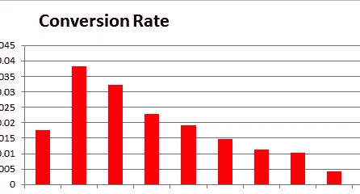

# 你如何找出转换率下降的原因(并扭转这一趋势)？

> 原文：<https://medium.com/swlh/how-do-you-isolate-the-reasons-for-and-reverse-the-trend-of-a-declining-conversion-rate-858dd04fe7c6>

我建议的一家公司正面临一个有趣的挑战——它的网站范围内的电子商务转化率下降了，他们不知道为什么。如果这种情况发生在你的业务上，你会回顾哪些数据和分析来建立一个假设？

这是一个巨大的挑战，需要以系统的方式来应对。挑战包括确定变革的潜在驱动因素。请记住，除了产品驱动的特性变化之外，还可能有(通常会有)多个业务驱动因素。但是首先，在我们开始之前，让我们先弄清楚一些事情。

**一些总体思路:**

1.  衡量标准应该始终是对等的(相同的相对时间框架，例如:当前与去年，以消除游客和购买行为的季节性)。
2.  我们假设 AOS(平均订单规模)保持不变，以标准化促销/折扣的影响(否则，AOS *转换率可能是更好的跟踪指标)。
3.  这种下降可能有多种驱动因素，它们可能不会都朝着同一个方向驱动结果。深入之前先从广度开始。
4.  最后，在构建假设时，总体数据远不如分段数据有用。

**进场:**

**步骤 1:** 隔离(或排除)漏斗中一个或多个步骤的问题:

逐步查看总体漏斗转化率(包括购物车放弃率)。任何步骤的转换下降了吗？它是由产品变化或错误引起的吗？它是一个关键驱动因素吗？是否有未经测试的副本/设计/产品变更？否则，进行第 2 步来分析访问者的行为。

**第二步:** *广义*分段，比较*总体*转换率(针对 2 个时间帧)所用变量:

1.  营销渠道(有机、付费、本地、附属机构、电子邮件、社交、直邮、电视、广播等)
2.  设备(手机、平板电脑、台式机、其他)
3.  位置(仅全球与美国，然后按美国州)

这将判断丢弃是由一个或多个通道、位置还是一个或多个设备上的错误引起的。不要在这一步分析变量的组合。

**第 3 步:**挑选第 2 步中确定的顶级驱动程序，然后*进入下一级*:

在这一步看变量的组合。假设，如果下降是由三个因素驱动的:1。脸书，2 岁。手机和 3。加利福尼亚州和亚利桑那州，

然后，一些后续数据点可以查看以下转化率:按设备细分的脸书、按位置细分的脸书、按渠道细分的移动设备、按位置细分的移动设备、按渠道细分的 CA+AZ 状态、按设备细分的 CA+AZ 状态，以及上述各项的组合。如果需要，这些数据点将是更深入研究的起点。

**最终想法:**

1.  如果多个市场渠道/设备出现整体下滑，那么可能是市场和竞争力量在起作用。
2.  如果某个特定地区出现下滑，可能会有*当地*市场或竞争力量在起作用。
3.  重复购买行为下降(以及新信息的相对增加)可能表明品牌认知度或其他市场力量的下降。

这种方法将有助于揭示见解，以建立一个假设和计划的行动方针。

注:本文是[最初发布到我的 Linkedin 网络](https://www.linkedin.com/pulse/help-my-conversion-rate-going-downnnnnnnnnn-kunal-punjabi/?trackingId=z9y7G62oWmRQTJWF2aGV9Q%3D%3D)上的。如果你有兴趣在我发表类似的其他文章时得到通知，请在 [Linkedin](https://www.linkedin.com/in/kunalspunjabi/) 上关注我(当然还有这里的 [Medium](/@connecteev) ！)

## 这篇文章发表在 [The Startup](https://medium.com/swlh) 上，这是 Medium 最大的创业刊物，拥有 282，454+人关注。

## 在此订阅接收[我们的头条新闻](http://growthsupply.com/the-startup-newsletter/)。

