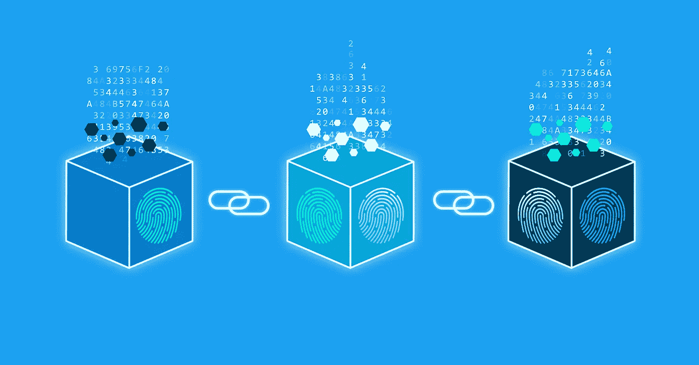
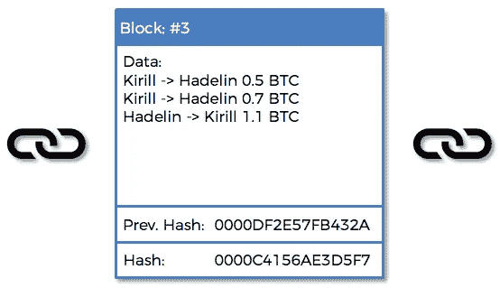
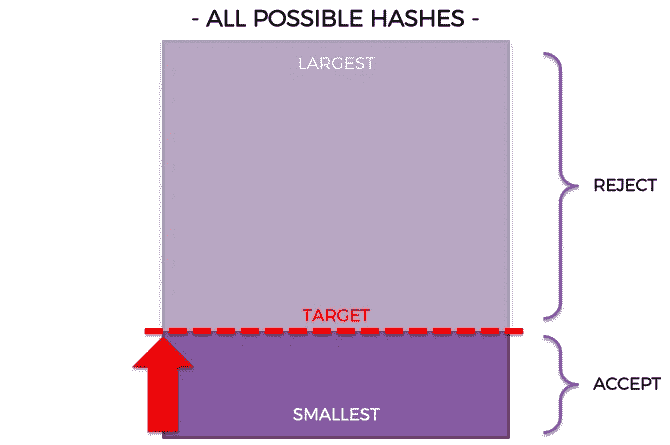
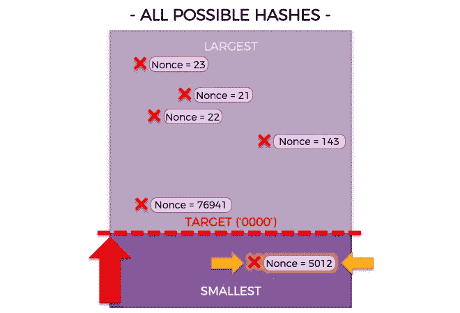
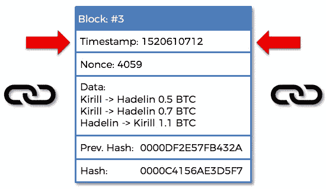
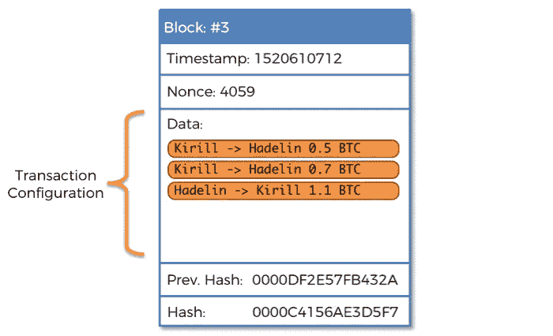
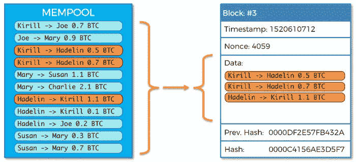

# 比特币/区块链挖矿是如何工作的？

> 原文：<https://medium.com/swlh/how-does-bitcoin-blockchain-mining-work-36db1c5cb55d>

从物流到医疗保健，从社交媒体到房地产，从能源部门到全球经济，预计区块链将在未来十年内改变几乎每一个行业。这项技术经常被描述为比人工智能更具革命性，它正以惊人的速度进入我们的生活。

虽然总体上令人鼓舞，但这种极端的速度也有消极的一面:这意味着教育根本跟不上。区块链缺乏高质量的培训项目，这意味着许多人要么会错过这个令人兴奋的新领域的机会，要么更糟——会基于对可能和不可能的错误理解，过早地做出职业选择。

有很多概念允许区块链驱动的项目和想法存在。覆盖所有这些主题需要整个在线课程*(更多细节见本文末尾)*。这就是为什么今天我们将只强调一个概念。对于这篇文章，我选择了可能是最常用的，同时也是最容易被误解的主题:采矿。

我们都听说过比特币挖矿和矿工。我们甚至可能用过这些术语。但是这些矿工到底是干什么的呢？采矿是什么？这些是我们今天要回答的问题，我们将分三部分来回答:

*   第 1 部分:什么是加密哈希？
*   第 2 部分:密码难题
*   第 3 部分:块配置

*注意:我们将看看比特币的例子。以太坊等其他加密货币可能使用不同的思想(例如不同类型的哈希函数)，因此具体细节会有所不同，但基本概念保持不变。*

# 第 1 部分:什么是加密哈希？

您可能已经听说过，区块链是一系列用密码连接在一起连续块:

但是这意味着什么？这与采矿有什么联系？让我们仔细看看。

区块链中的单个块包含以下元素:块号、存储在块中的数据、前一个块的散列和当前块的散列。

哈希(或加密哈希)是一个长数字，它充当任何数据集合的数字指纹。在比特币中，使用了 [SHA256 哈希函数](https://en.wikipedia.org/wiki/SHA-2)，生成一个 64 位十六进制数。例如，本段中单词的加密哈希是:

> c 019286295 F2 cdec 9958 bee 25 b 9603 b5 f 94c 76 b 2 CCC 69 a 59 ce 54872 ed 26 DC 479

*注意:在这里的图片中，为了便于说明，散列被缩短了。*

哈希算法有许多有趣的属性，然而今天我们最感兴趣的是三个:1)sha 256 函数是确定性的——如果用相同的输入重新计算该函数，您将总是得到相同的哈希输出；2)不可能对 SHA256 函数进行逆向工程。这意味着在实际计算之前，您永远无法预先知道将得到什么样的哈希值；3)如果您向 SHA256 函数提供两个稍微不同的输入(例如，您将一个点改为一个逗号)，您将得到完全不同的输出。

在上面的示例中，我们将当前块的编号、存储在块中的数据以及前一个块的散列输入到 SHA256 函数中，以获得当前块的散列值:

> SHA256(块号，数据，**前一个块的散列** ) - >散列

现在，我们可以看到这些块是如何链接的，不仅每个块都引用前一个块的加密哈希，而且实际上，该哈希直接影响当前块的哈希值。因此，如果任何人篡改任何给定块的数据，这种行为不仅会使*那个*特定块的散列无效，而且会使*后面所有*块的散列无效。

区块之间的这种联系意味着区块链作为一个整体比标准的数据库结构和其他记录保存方法更加防篡改。由于区块链本质上是记录的账本，这种防篡改属性被称为“不可变账本”属性。

好极了。这就是区块链工作方式。但是这和采矿有什么关系呢？直截了当的回答是，挖掘就是计算添加到链中的最新数据块的哈希值。然而，事情并没有那么简单。

事情是 SHA256 函数只需要几分之一秒的时间来计算。然而，你可能听说过众多的矿池，如 BTC.com 和蚂蚁池，甚至工业规模的矿——都在竞争产生下一个比特币区块。所以问题是——为什么我们需要所有的计算能力？

# 第 2 部分:密码难题

这是增加复杂性的起点。系好安全带。

区块链的区块还有一个我们还没有谈到的油田。该字段被称为“Nonce ”,代表仅使用一次的*号*:

Nonce 是一个整数，与块号、数据和先前的散列一起，Nonce 用作 SHA256 函数的输入，以计算当前块的散列:

> SHA256(块号，**随机数**，数据，前一个块的散列)- >散列

与块的其他组件不同，Nonce 被设计为完全在我们的控制之下。这意味着现在我们有了一种机制来改变当前块的散列，同时保持其中的数据不变。事实上，由于散列函数*(我们上面讨论中的属性#3)，*的性质，每次我们为同一个块选择一个新的随机数，得到的散列将是一个不同的值。

好吧，太好了。但是这和采矿有什么关系呢？这就是我们有趣的地方。

总共有 16⁶⁴可能的 SHA256 加密哈希值(每个十六进制数字有 16 个可能的值，在一个哈希中有 64 个)。然而，并不是所有的散列都是有效的。这是为什么呢？好吧，每两周比特币网络会定义一个哈希的最小目标。高于这个目标的任何内容都将被拒绝，低于这个目标的任何内容都将被接受。

上图显示了所有可能的 SHA256 哈希的池(不要与“挖掘池”混淆)，从底部开始，从最小的哈希到最大的哈希。在垂直方向的某个地方，我们有了目标。请注意，此图仅用于说明目的，因为它不成比例——我们稍后会看到原因。

撰写本文时的目标是:

> 00000000000000000005 d97d 00000000000000000000000000000000000000000000000。

目标中真正重要的是前导零的数量。就像在十进制系统中一样，固定大小的数字中的前导零将决定其大小。每个前导零将数字的大小减少 16 倍(十进制系统中的 10，但这里我们使用的是十六进制)。

当前目标中有 18 个前导零，这意味着有效散列的总数是 16⁴⁶(只剩下 64-18=46 个非零数字)。因此，随机选取的散列有效的概率可以计算如下:

> 16⁴⁶ / 16⁶⁴ = 16^(-18) = 0.00000000000000000002%

在比特币挖矿术语中，这是任何给定 Nonce 值将为当前块生成有效散列的概率。我们现在可以看到为什么这个图不成比例了:与完整的 SHA256 池相比，实际上有效散列池非常小。

这就是密码难题的全部内容:矿工们竞相寻找一个随机数(也称为黄金随机数)，它将为即将到来的块生成一个有效的散列。谁先找到它，谁就可以把方块加到链子上，并获得 12.5 个比特币的奖励。在撰写本文时，一枚比特币价值约 10，000 美元，这使得采矿成为一项相当有价值的活动。

*如何阅读这个图表:红色的“X”标记与 SHA256 哈希相关，而旁边的标签说明了哪个随机数生成了哪个哈希值。*

目标是根据网络的 hashrate(所有比特币矿工的总计算能力)来定义的。加入网络的矿工越多，目标就越低，因此就越难找到合适的散列。这个难度算法的目标是确保每 10 分钟只添加一个新块。这是比特币货币政策的一部分，以控制流通中的硬币总数。

简而言之，这就是数以百万计的挖掘机器日以继夜所做的事情——它们只是迭代不同的 Nonce 值，希望第一个找到下一个块的有效散列。一旦找到有效的散列，块就被添加到链中，并且竞争再次开始，这次是为了下一个块。

# 第 3 部分:块配置

就在你以为我们结束了的时候…还有更多。

Nonce 是一个分配了 32 位内存的整数值。这意味着它具有大约 40 亿个值的有限范围。这带来了两个问题:

首先，即使一个普通的挖掘设备每秒也可以计算多达 1 亿个散列，因此将在 40 秒内通过 Nonce 范围。这是一个普通的矿工。矿池和工业规模的矿能够在几分之一秒内通过 Nonce 范围。

其次，找到有效散列的机会非常小，即使尝试 40 亿次，成功的概率仍然非常低:

> 4 * 10⁹ * 0.0000000002% = 0.0000000001%

那么解决办法是什么呢？

首先，这个块包含…你猜对了——另一个我们还没有谈到的领域。该字段是一个时间戳，表示当前的 [Unix 时间](https://en.wikipedia.org/wiki/Unix_time)(自 1970 年 1 月 1 日以来经过的秒数):

时间戳也包含在 SHA256 计算中，用于正在挖掘的当前块的哈希:

> SHA256(块号，**，时间戳**，随机数，数据，前一个。块的散列)- >散列

并且由于时间戳不断刷新(直到成功挖掘出块)，这有效地每秒重置 Nonce 范围。为什么？正如我们在开始时讨论的那样，即使 SHA256 函数的输入略有变化，也会导致哈希发生变化。

因此，如果我们为其他输入(块号、时间戳、数据、前一个块的散列)的固定组合尝试了所有 40 亿个 Nonce 值，但是没有找到有效的散列，我们所要做的就是等到时间戳增加。时间戳的变化将意味着组合现在不同，如果我们再次尝试所有 40 亿个 Nonce 值，每次我们都将获得一个全新的哈希值。

时间戳为普通矿工解决了这个问题，因为它会在他们到达随机数范围的末尾之前重置*(提醒:普通矿工需要 40 秒来完成 40 亿次传递)*。然而，对于一个*矿池*或*工业规模的矿商*来说，即使一秒钟也太长了——正如我们所讨论的，他们会在几分之一秒内通过 Nonce 范围。那么他们如何解决问题呢？这就是块事务配置的用武之地。

比特币网络的参与者无时无刻不在相互交易。但是，每隔十分钟才添加一个新块。那么，在将事务添加到块之前，它们去了哪里呢？新条目被添加到一个叫做 mempool 的临时区域。然后，矿工的工作是从内存池中挑选一批这样的事务，并将它们添加到他们正在挖掘的新块中。

块的大小是有限的，并且不是所有来自 mempool 的事务都适合新的块。这意味着矿商可以选择哪些交易将进入下一个区块。这也意味着采矿者可以随意改变交易的配置(在区块被成功开采之前)。

这就是矿工如何获得对散列的额外控制。嗯……控制不是正确的词，因为散列不能被逆向工程或预测。可变性在这里是一个更好的术语:更改事务的配置会在散列函数输入中产生额外的可变性。

类似于时间戳的情况，每当我们尝试 Nonce 范围内的所有 40 亿个可能值并且运气不好时，我们所要做的就是稍微改变我们从 mempool 中选择的事务的组合。

这里的主要区别是我们不必等待。通过改变所选的事务，我们可以随意重置随机数范围——因此我们可以每秒钟做任意多次。当然，这一切都是在算法上完成的。这样，即使是矿池和工业规模的矿工也可以连续测试新的散列值*而没有任何空闲时间。*

# 让我们总结一下

我们已经走过了很多地方。让我们回顾一下比特币/区块链挖掘过程，以确保我们没有错过任何东西:

1.散列是任何数据集合的数字指纹。区块链中的块是加密链接的，因为每个块在计算自己的哈希时都包括前一个块的哈希。篡改任何一个数据块中的数据都会导致该数据块和所有后续数据块的哈希无效。

2.密码难题要求挖掘者找到一个小于设定目标的散列才有效。挖掘器通过迭代块内的指定参数(称为 Nonce)来搜索有效的散列。谁先找到有效的散列，谁就可以添加方块并获得奖励。

3.随机数范围包含 40 亿个可能值，这不足以找到具有高度确定性的有效散列。通过包括当前时间戳并通过改变块中包括的事务的配置来实现随机数范围的重置。

# 加入我们

今年 3 月，我们成功资助了一个 Kickstarter 项目，创建了世界上有史以来最全面的区块链在线课程。

今天，这门课程在 Udemy.com 直播，已经有超过 3000 名学生注册，以掌握区块链、比特币、智能合约等概念。如果你想成为区块链的先驱，那么就加入我们这场不可思议的冒险，让你的职业生涯更上一层楼:

> [https://www.udemy.com/build-your-blockchain-az/?couponCode=MEDIUM90](https://www.udemy.com/build-your-blockchain-az/?couponCode=MEDIUM90)

上面的链接已经为我们的媒体读者提供了一个特别的优惠券。用它打九折。

里面见！

基里尔·叶列缅科

## 这个故事发表在[的创业](https://medium.com/swlh)上，这是 Medium 最大的创业刊物，有 320，924+人关注。

## 订阅接收[我们的头条新闻](http://growthsupply.com/the-startup-newsletter/)。

