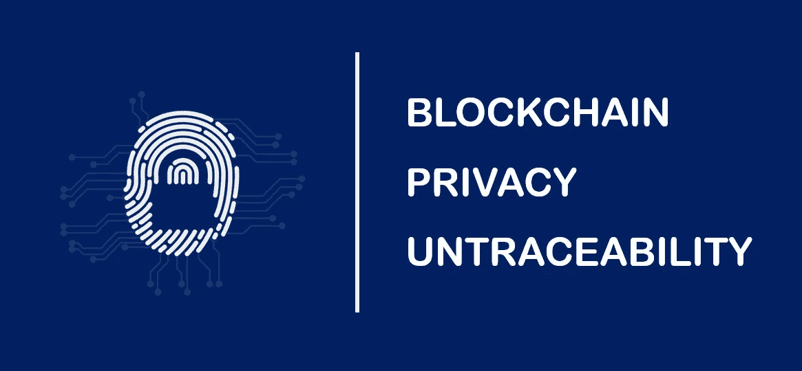
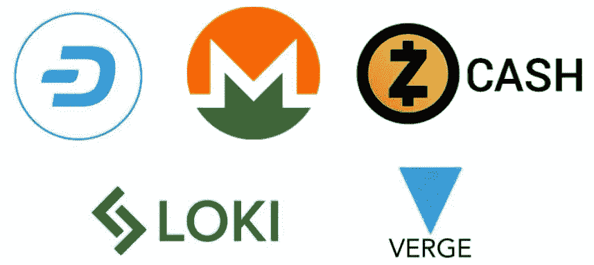
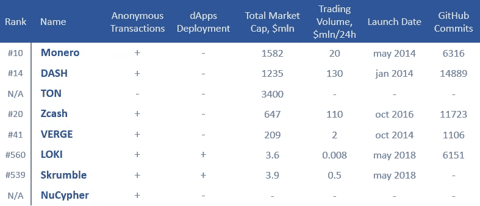

# 区块链如何帮助保持隐私？主要市场参与者和使用案例。

> 原文：<https://medium.com/swlh/how-does-blockchain-help-to-stay-private-the-key-market-players-and-use-cases-87c4b0791ad8>

最近，匿名区块链协议变得越来越流行。在本研究中，我们将讨论匿名货币市场的主要参与者、现有的加密机制及其使用案例。

# 匿名区块链协议用例

匿名区块链协议有两个主要的用例。

1.  **匿名交易**由于这种类型的区块链协议，用户可以安全消费，因为他们知道其他人无法看到他们的余额或跟踪交易活动。这允许在任何司法管辖区之间进行跨境转账，隐藏转账方向和金额以达到避税目的，提供了规避制裁制度的机会。资助世界上任何地方的慈善、教育、政治组织，而不考虑一个国家政府的意愿。
2.  **基于所提供的区块链架构部署用户分散式应用**(私有 dApps)。比如洛基信使。与集中式匿名信使的主要区别在于，由于分布式架构，恶意行为者无法从服务器中泄漏元数据。

# 支持匿名交易的区块链

市场上已经出现了几种匿名区块链协议，它们在某种程度上允许网络参与者隐藏他们的操作。在这些项目中， [Monero](https://getmonero.org/) 、 [Dash](https://www.dash.org/) 、 [Zcash](https://z.cash/) 、 [Loki](https://loki.network/) 、 [Verge](https://vergecurrency.com) 脱颖而出。让我们简单描述一下每一个。

The most promising anonymous blockchains protocols

[**Monero**](https://getmonero.org/) 是一种建立在 [CryptoNote 协议](https://cryptonote.org/)基础上的加密货币，专注于增加交易的匿名性。Monero 的主要特点是 CryptoNote 协议，使用[环签名 ringCT](https://www.mycryptopedia.com/monero-ring-confidential-transactions-ringct/) 和[隐形地址](https://www.mycryptopedia.com/everything-need-know-stealth-addresses/)来屏蔽交易。CryptoNote 和添加的混淆协议提供了被动混合:系统中的所有交易都是匿名的，系统中的所有参与者都可以使用[似是而非的可否认性](https://en.wikipedia.org/wiki/Plausible_deniability)以防被捕获。

> *Monero 使用* [*环签名*](https://en.wikipedia.org/wiki/Ring_signature) *，其本质是为每笔交易创建 10 个代理的池，其中只有一个代理是实际的发送方。此外，通过创建临时公共帐户来接收交易(称为秘密地址)，接收者的公共地址不会被公开。*

Monero 的主要缺点是交易规模大——平均而言，它们的交易规模是比特币交易的八倍。此外，缺点之一是货币匿名性差，这一点已在一些研究中得到证实。来自麻省理工学院的科学家在 2016 年的一项[工作](https://arxiv.org/pdf/1704.04299/)中发现，在 90%的情况下，追踪交易的移动是可能的，这将匿名性几乎降低到零。这个问题已经被修补，当他们的协议中的缺陷被发现时，Monero 一直在为增加隐私而战斗。

[**破折号**](https://www.dash.org/) 是分散支付系统。Dash 和其他匿名加密货币的主要区别是使用了几种加密算法的组合，即 CoinJoin，以及挖掘 Dash 的更高能效。CoinJoin 是在 Dash 的 PrivateSend 功能中混合硬币。更高能效的原因是，采矿 Dash 的复杂性不是固定增长的，而是使用 *DarkGravityWave* 机制，根据网络负载进行调节。矿工的报酬也不是固定的，也不与特定的模块或复杂指标挂钩，而是根据特定的公式计算出来的。得益于内置的 *InstaSend* 技术，Dash 还可以让你进行即时交易。

**TON** 或 [**电报开放网**](https://telegram.org/) 最初的定位是匿名加密货币，要从电报信使的客户端基础开始构建。然而，后来项目团队[表示](https://forklog.com/blokchejn-platforma-ton-otkazhetsya-ot-anonimnosti-kriptovalyutnyh-operatsij/)为了建立大型合作伙伴关系，将放弃对创造的加密货币进行匿名化的想法。

[**ZCASH**](https://z.cash/) 也是一种能够提供选择性隐私的匿名加密货币。Zcash 成立于 2014 年，成为第一种基于[零知识加密概念证明协议](https://en.wikipedia.org/wiki/Zero-knowledge_proof)的加密货币。区块链专家称赞 Zcash 实现了非凡的交易匿名水平。ZK-斯纳克协议隐藏了除时间戳之外的任何外部数据。

还有，2017 年，著名的隐私卫士爱德华·斯诺登[称](https://news4c.com/edward-snowden-picks-zcash-as-the-most-safe-cryptocurrency/) Zcash 为“最有趣的比特币替代品”。

[**VERGE**](https://vergecurrency.com/) 使用开放的注册表，允许跟踪大多数交易。然而，该协议使用 *Tor* 和 *I2P* 来屏蔽 IP 地址，从而保护用户的个人数据。Verge 使用 Tor 来加密流量，并通过世界各地的电脑链进行路由，然后也使用 I2P。此外，使用[幽灵池](/verge-currency-xvg/what-is-the-wraith-protocol-bd1dfb289cda)，边缘网络的用户可以进行公开和私人的区块链交易。

# 基于区块链协议构建隐私 Dapps

[**Loki**](https://loki.network/) 是 Monero 的分支之一。该项目的核心是基于 Monero 的源代码，大大扩展了它的功能。功能的主要扩展是[服务节点](https://loki.network/tag/service-nodes/)系统，它允许用户创建服务节点应用(SNApps)的网络。就其核心而言，SNApps 就像链外 dApp，能够在生态系统内匿名传输任何数据包。这可能会重复以太坊在匿名区块链领域的革命性。与 Monero 一样，Loki 使用环签名，目的是匿名化网络中的交易。

> *在 Loki 网络上开发的第一个 SNApp 将是用于匿名消息传递的分散式 Loki Messenger。相对于集中式应用程序，它对元数据收集的阻力较大。*

此外，由于 Loki 服务节点，将有可能将出口节点部署到常规互联网，类似于 Tor 中使用的方法。在 Loki 生态系统中引入的 Dash 中会有和 Instasend 一样的功能。

Loki 使用自己的开源协议进行流量路由，这是 Tor 和 I2P 的混合体，名为 [LLARP](https://github.com/loki-project/loki-network) 。

这个 [**Skrumble**](https://skrumble.network/) 项目旨在改变信使中的通信，通过创建一个去中心化的架构使其更加安全。还有，Skrumble 打造去中心化的第三方 app 进行沟通。Skrumble 区块链节点可以使用哈希消息协议相互通信。这个结构中有两种不同类型的节点:对等节点和验证节点。对等节点可以发送、接收和传递事务或块，而验证节点可以生成数据块。

[**NuCypher**](https://www.nucypher.com/) 基于密码[密钥管理系统](https://github.com/nucypher/nucypher/wiki/How-NuCypher-KMS-Works) (KMS)，确保公共区块链网络和分散应用中信息的私密性。使用 NuCypher，开发人员可以在公共区块链上构建需要安全存储、共享和处理私有数据的 dApps。同时，KMS 的使用为数据提供了更可靠的保护和控制。该系统使用代理再加密(proxy re-encryption)，允许分散的节点网络在不访问私钥或未加密数据的情况下提供关键的管理操作。通过智能合约，NuCypher 允许您公开提交和撤销对任何应用程序的访问。

该项目正处于原型阶段。然而，该平台已经用于 MediBloc(医疗记录)、Datum(用户数据)、Wolk(加密数据库)。

下表显示了所考虑的硬币的主要特征。*这些数字是 2018 年 8 月 22 日的正确数字。*

# 加密货币的其他匿名方式:CoinJoin、Mimblewimble、Breeze Wallet、Exchanges。

除了上面讨论的匿名加密货币，还有针对流行加密货币的服务，旨在使交易匿名。最受欢迎的有**混音器** (CoinJoin，Breeze Wallet)和 **Mimblewimble** (包括 Grin 和 Beam)。让我们仔细看看它们。

**硬币混合器** 是流行加密货币的附加组件，可以让你增加操作的匿名性。他们工作的算法非常简单:用户向混合器的地址发送加密货币，加密货币是为每个客户端单独生成的。然后，在这个地址，硬币与其他用户的交易混合在一起，或者在里面的几十万个钱包之间分配。之后，经过“处理”的加密货币被发送到用户要求的地址。

Gregory Maxwell 开发的 CoinJoin 使用了一种分散硬币混合的方法，将通常金额相同的几笔交易结合在一起，以增加跟踪它们的难度。

Coinjoin 的继任者是 **Mimblewimble 协议**，该协议使用所谓的“致盲因子”，通过加密交易值，允许比特币区块链中的交易匿名。当您创建新块时，MimbleWimble 完全摆脱了事务。然而，在其当前形式下，mimble 与比特币协议不兼容，因为它需要从交易中删除脚本。这样一来，就没有空间留给比特币的其他功能了，比如锁时交易等。 [**Grin**](https://grin-tech.org/) 和**[**Beam**](https://www.beam-mw.com/)**都是 MimbleWimble 协议的轻量级实现，尽管仍然是高度实验性的。****

******Breeze Wallet** 是一款桌面钱包，其主要特点是集成了 *TumbleBit* 硬币混合服务。TumbleBit 是比特币之上的一个插件，它让用户能够混合硬币，而不必相互信任或接受钱包。Breeze Wallet 用户可以“混淆”交易，即给交易一个伪装的外观。****

> ****此外，即使是定期向加密交易所转账也可能是隐藏交易的有效方法。在目前的情况下，交易所很少公布有关其工作的信息。这就是为什么用户可以简单地通过将钱发送到交易所，然后转移到所需的钱包，将钱藏在加密货币中。****

# ****结论****

****尽管多次尝试开发匿名区块链解决方案领域的产品，但市场仍远未成熟。在这方面，很难预测哪些产品将成为该领域的佼佼者。此外，在大多数发达国家，每种解决方案已经满足或将面临监管限制，但几个区块链协议的匿名性可能有助于克服监管问题。****

> ****欲了解未来见解，请订阅 [ICOscoring Telegram](http://t.me/icoscoring) 频道，并访问我们的[网站](http://icoscoring.com)。****

********

## ****这篇文章发表在 [The Startup](https://medium.com/swlh) 上，这是 Medium 最大的创业刊物，拥有+369，518 名读者。****

## ****在这里订阅接收[我们的头条新闻](http://growthsupply.com/the-startup-newsletter/)。****

********