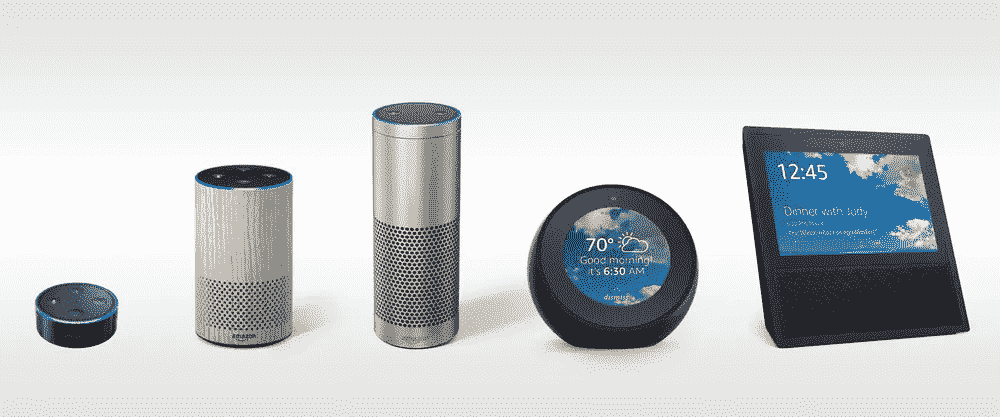
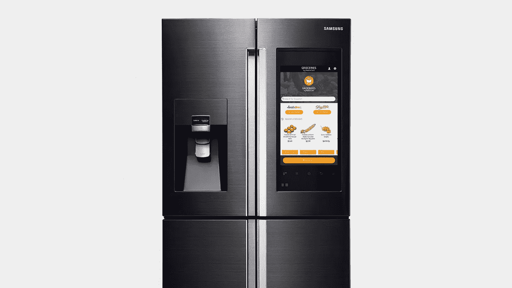

# 未来 5 年电子商务将会发生怎样的变化，你能为此做些什么？

> 原文：<https://medium.com/swlh/how-e-commerce-will-change-in-the-next-5-years-and-what-you-can-do-about-it-c5588a770c47>

早在 1998 年，当我创建我的第一个网站时，我无法想象它会对我的生活和事业产生什么样的影响。所以每当我和世界上一些最大的电子商务商人坐在一起时，我都忍不住想象接下来会发生什么。在这篇文章中，我想分享一些我认为未来五年电子商务领域将会发生的事情。

> 新平台带来了新机遇。

## **传统业务**

上个世纪，如果你想创业，你可以选择两种商业模式中的一种。要么你创造了一个产品和品牌，要么你是一个零售商，在一个特定的类别中销售不同品牌的产品。

作为一个产品/品牌，你应该考虑如何分销你的产品。大多数情况下，你会将商品批发给零售商。零售商会在他们的店里展示你的产品，根据产品的展示方式，顾客会购买产品。或者品牌的营销活动，会创造对产品的需求，这将导致更多的销售，并会给零售商一个展示商品的动机，使其容易被发现。

## **电子商务世界**

随着电子商务的引入，传统的分销渠道已经从在商店购买产品转变为在网上购买产品。有效地，把品牌变成零售商。所以现在，单个产品在网上销售，为品牌网站带来流量，或者由 Amazon.com[这样的大型在线零售商销售。](https://www.amazon.com)

随着移动技术的出现，人们互动和获取信息的方式再次发生了转变。市场营销会引导人们通过[谷歌](https://www.google.com)搜索产品，或者在 Amazon.com 搜索，而现在消费者通过社交媒体([脸书](https://www.facebook.com)、 [Instagram](https://www.instagram.com) 、[推特](https://www.twitter.com)、 [Youtube](https://www.youtube.com) 、 [Snapchat](https://www.snapchat.com) )看到产品，点击图片、视频、链接或内容，然后进入商家的网站。在那里他们可以获得更多的信息，并最终直接从该品牌购买产品。

然而，我们互动的方式已经成为其中的另一个重要部分。我们过去常常打电话和销售人员或客户服务代表交谈(同样的事情，不同的名字只是不那么吓人)，而不是发电子邮件，但这已经变得太慢了。因此，现在我们使用聊天或直接信息来获得我们正在寻找的答案。

## 新的商业浪潮

随着电子商务变得越来越移动，客户支持由使用人工智能的聊天机器人负责，我相信下一波颠覆即将到来。

我相信，像亚马逊 Echo、谷歌 Home 和苹果 HomePod 这样的语音设备可以成为新的守门人，从而极大地改变商业模式。如果在接下来的几年里，大多数家庭在家里都有一台这样的设备，并习惯于通过说“Alexa，订购卫生纸”或“Ok Google，订购尿布”来订购产品，那么谁能完成订单，谁就能从所有其他商店中胜出，这些商店无法成为亚马逊、谷歌或苹果商业生态系统的一部分。

Amazon Echo Family

**物联网商务又称物联网商务** 一个更大的颠覆者实际上可能是物联网。从冰箱、洗衣机到牙刷，连接到互联网的智能厨房甚至可以扫描你橱柜中的物品，并自动订购你快用完的产品。家用电器已经以品牌代言而闻名，想象一下你的新家，它预先储备了产品，每当产品快用完时，就会自动重新订购这些产品。不是通过亚马逊或者 Google Express，而是直接从品牌那里，就像你的电动牙刷直接用佳洁士下单买牙膏，或者你的冰箱订购一箱斐济水。

Samsung Smart Fridge

## 怎么办？

那么，如果你正在经营一家电子商务商店，或者你是一家零售商，你可以做些什么来防止自己在未来五年内倒闭？

*   首先，如果我是一名零售商，我会开始投资成为一个品牌，这意味着我会拿出很大一部分利润，投入研发以创造新产品。作为一名零售商，你已经知道什么好卖，什么不卖。所以为什么不创立你自己的品牌呢？一开始可能是私人品牌，然后开始创造你自己独特的产品。
*   第二，我会开始专注于让自己与亚马逊、谷歌和苹果这样的把关者保持一致。你可以通过亚马逊以 FBA 的形式销售产品，成为与谷歌快递合作的零售商，并将 Apple Pay 集成到你的应用程序、网站和商店中。
*   **第三**，我会想出，我可以与哪些物联网设备合作。如果我销售易腐食品或洗涤剂，我会联系 LG 或三星提供产品，并弄清楚包装如何与设备一起工作。咖啡豆、洗洁精甚至微波炉餐都可以相互协作，成为未来物联网设备的首选产品。

## 科幻还是现实

当然，许多人可能会认为这是科幻小说，并认为我们仍然需要几十年才能适应语音人工智能和物联网设备来帮助我们，但就像智能手机一样，你告诉你永远不会得到，因为你有一个寻呼机。我想提醒你，十二年前没有智能手机，我们有“哑手机”，大多数人说他们不需要手机。随着新一代人在社交媒体、增强现实、虚拟现实和语音设备的陪伴下成长，未来五年可能会极大地改变我们与技术互动的方式，随着消费能力来自新一代人，他们将决定公司如何与他们互动或不复存在。

## 感谢阅读；)，如果你喜欢它，请点击下面的掌声按钮，这对我意义重大，也有助于其他人了解这个故事。通过在[推特](https://twitter.com/dwaynegefferie)或 [Linkedin](https://www.linkedin.com/in/dwaynegefferie/) 上联系让我知道你的想法。

## 这篇文章发表在 [The Startup](https://medium.com/swlh) 上，这是 Medium 最大的创业刊物，有 290，182+人关注。

## 订阅接收[我们的头条新闻](http://growthsupply.com/the-startup-newsletter/)。

