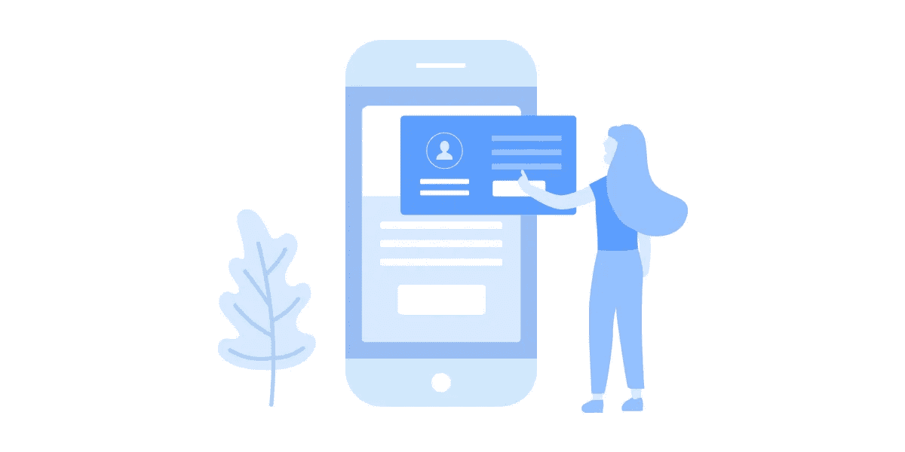
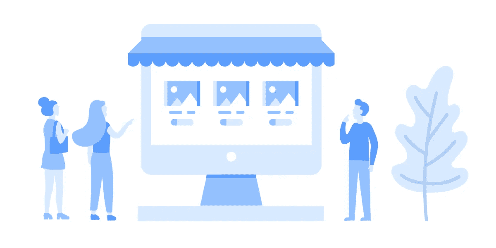

# 你的销售线索生成有多有效？

> 原文：<https://medium.com/swlh/how-effective-is-your-lead-generation-ad819926d1f4>

# **了解销售线索漏斗的基础知识**

无论你是试图开创自己的事业，还是试图发展现有业务，你的研究无疑会让你被行业术语淹没。某些销售和营销术语无处不在，但似乎没有人能够完全解释它们的含义。你可能遇到过的一个老生常谈的短语是“销售漏斗”什么是销售漏斗，它如何帮助你发展业务？

漏斗是销售过程的简单可视化，顶部是你的品牌知名度，底部是成交。漏斗有一百万种不同的描述，每一种都有自己的标签、标题、条形图、箭头和粒度级别。但这是将在本章和指南中使用的一个:访问者>销售线索>合格销售线索>机会>客户。

本指南的目的是帮助你引导新访客进入漏斗，将他们转化为潜在客户，并在整个过程中培养他们，直到他们成为客户。但是，在您进入这个复杂的过程之前，这里有对销售线索漏斗每个部分的深入定义。

# **访客**

访问您的任何在线资产、网站或物理位置的人被视为“访问者”这个人以前可能不知道你的公司，并且仍然在进行随意的调查。理想情况下，你的产品或服务的信息是可见的，足够吸引人，他们的兴趣被激起，他们被吸引到销售漏斗中。

根据普华永道最新的全球网上购物趋势分析，对于某些商品，62%的全球购物者更喜欢在网上搜索。这意味着，如果你的企业没有从一开始就吸引和抓住每个访问者的注意力，你就不太可能留住他们并把他们转化为顾客。

要实现让访问者了解你的业务的目标，一个方法是拥有一个设计良好的网站，清楚地传达你解决的问题，你如何解决它，以及他们如何能得到它。消除噪音和创造清晰的信息是确保访问者想要继续了解你的公司的最好方法。当他们做出这个决定时，他们已经从一个访问者变成了一个领导者。

# **导语**

潜在客户是指选择从贵公司接收信息和/或在未来与贵公司联系的人。潜在客户可能是在网上填写表格或在不同类型的收集服务中输入联系信息的人。

来自 Zapier 的 Matthew Guay 在《营销漏斗指南:如何确认销售线索并将其转化为客户》中说得很好。他们可能会成为未来的潜在客户——尽管现在，他们还不知道你的产品。另一方面，领导采取了行动。他们走进来，签了名，拿起电话，问道。

销售线索处于销售流程的初始阶段，需要培养才能进一步深入漏斗。在这个阶段，销售线索是指对你的产品或服务感兴趣，但仍没有明确购买意向的人。

在这里，你的工作是激起领导的兴趣，让他们愿意采取下一步行动:培养更深的兴趣，开始接触你的产品或服务。为此，您需要向他们提供信息，鼓励他们参与销售线索漏斗流程。此时，您仍然不清楚该销售线索是否真的愿意或能够从您这里购买。

# **合格铅**

合格的销售线索(或“潜在客户”)是已经证明他们有能力和可能性购买您的产品或服务的人。确认销售线索有几种方法。例如，有些销售线索会通过向购物车中添加商品来证明自己的资格；其他人可能是通过在你的报名表中问一些具体的问题来获得资格的，比如收入水平或者喜欢的品牌；还有一些人可能有资格使用软件来评估一个人从你这里购买的可能性。

在确定销售线索时，将他们分为“有能力的人”(已经证明有能力和意愿购买您的产品或服务的人)和“没有能力的人”(没有能力或意愿购买您的产品的人)。真正会购买你的产品的人是那些你会培养的人，把他们带到销售漏斗的下一步。其他人——或者那些只希望你永远向他们提供免费的高质量信息而不实际购买的人——可以留在“只收邮件”的被动候选人名单中。

以这种方式进行资格认证有助于防止你在那些永远不会转化的潜在客户身上花钱，并让你把精力放在那些最有可能转化的客户身上。一旦你有了一个合格的潜在客户名单，你就可以开始与他们进行双向沟通，单独接触他们，开始个性化的沟通，这会让他们对你的产品或服务产生信任。此时，您的目标是将人们从销售线索转移到机会。

# **机遇**

机会是正在积极考虑购买你的产品或服务的人或企业。你的开始培育步骤是引导消费者达到这一点的不可或缺的。所有机会都必须具备三个特征:

他们有特定的难题，您可以为他们解决。没有这个，他们不会购买。他们对你的产品或服务特别感兴趣。他们可能知道他们的痛苦存在，但并不完全有兴趣去解决它。
它们特别适合您的公司。你的产品或服务是为他们这种规模的公司或有预算的人开发的。

一旦您将一个合格的销售线索确定为机会，您的目标就是找出潜在的机会需要或想要从您那里获得什么信息。记住这一步——以及之前的每一步(见第 9 章)——都是为了做一件事:建立关系。您需要提供他们想要或需要的必要信息，以便从您这里购买。大多数人基于情感做出决定，然后用理性支持这些决定；你的工作是发展这种情感关系，然后提供足够的信息来支持它。

机会是你主动卖给的人。这可能是你销售漏斗中要求最高、最关键的阶段，也可能是你销售漏斗中最长的阶段。此时，您已经验证了消费者对您的产品或服务的需求和适合度。这是您完成交易的时候，也是您抓住机会创造客户的时候。

# **客户**

这个术语几乎不需要介绍。顾客是采取行动购买你的产品或服务的人。你知道他们已经喜欢你所提供的足够给你钱。就这样，对吗？不完全是。现在，你的工作是继续与他们接触，继续培养他们。

转换软件 [Invesp](https://www.invespcro.com/) 的作者兼首席执行官 Khalid Saleh 解释说，获得一个新客户的成本[是留住一个老客户的五倍](https://www.invespcro.com/blog/customer-acquisition-retention/)；因此，在顾客第一次购买后很长一段时间内继续向他们销售对你最有利。

一旦某人在您的潜在客户生成漏斗中达到这一水平，您希望通过向他们销售相同的产品来鼓励他们再次采取行动；通过向他们追加销售额外的产品或服务来扩大他们的初始购买量；把你和你的产品或服务推荐给他们认识的每一个人。鼓励客户再次采取行动的一个简单、自动的方法是将不同的应用程序或服务集成到您现有的表单中(参见我们不断增长的[选项目录](https://apps.jotform.com/)了解想法)。因为这些消费者已经表明对你的产品感兴趣并购买了它，你可以利用这种信任感和可靠性来提供更多的商品和服务。

培养客户最重要的一部分——也是经常被忽视的部分——是推荐。尼尔森最近的一项调查显示，90%使用互联网的消费者相信他们认识的人的推荐，当朋友推荐时，人们购买产品的可能性是朋友的四倍。您应该如何处理这些信息？

与您的客户接洽并请求推荐。你已经赢得了他们的信任，并使他们有资格成为能够并愿意购买你的产品或服务的人。现在，您可以跳过销售漏斗中的一些步骤，让您的客户为您带来新的合格线索，这些人已经对您的产品感兴趣，并且愿意和能够购买。他们与你有情感上的联系——他们的朋友刚刚担保了你的产品——而你有了一条线索，可以更快地进入最终的“客户”阶段，而且投资更少。

# **结论**

本指南的其余部分旨在帮助您了解如何让访问者访问您的网站，将他们转化为销售线索，培养他们，并衡量您的销售线索生成和转化工作。最终，您的工具箱中会有一个新的多功能工具，它将帮助您与潜在客户建立关系，将他们转化为客户，并发展您的业务。

【www.jotform.com】最初发表于**。**