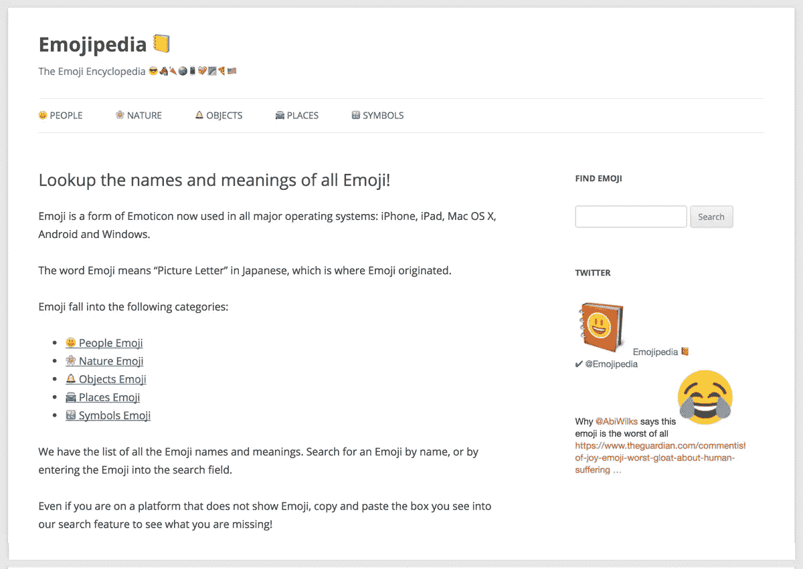
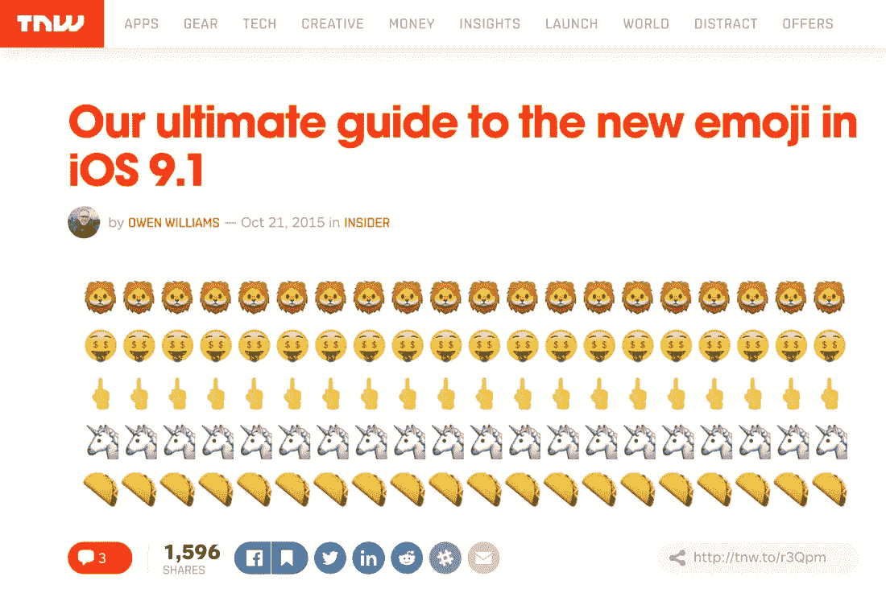

# Emojipedia 是如何从一个副业发展到每月 1500 万次页面浏览的

> 原文：<https://medium.com/swlh/how-emojipedia-grew-from-a-side-project-to-15-million-page-views-a-month-c868a56cf3ae>

## 杰里米·伯格通过对表情符号进行分类，建立了一项年浏览量达 1.8 亿的业务。事情是这样发生的。

“Emojipedia！就是这个名字。”

2013 年 7 月 14 日，当他从庆祝生日的晚上走回家时，他突然想起了这个名字。“就这样，”杰里米回忆道。“那天晚上我进去注册了域名。”

自那晚以来的三年里发生的事情就像坐过山车一样——从每天一两个访客的卑微开始， [Emojipedia](http://emojipedia.org/) 现在拥有每月超过 1500 万的页面浏览量和六位数的年收入。

我们采访了杰里米，了解他如何推出 Emojipedia，以及它如何从一个辅助项目转变为科技界最受欢迎的网站之一。

# “互联网的失败”如何激发了 Emojipedia 的想法

2012 年，杰里米是一名网络开发人员，他对表情符号的迷恋开始体现在他为一些客户将表情符号添加到网站上。然后，当 iOS 6 推出时，包括了一系列新的表情符号，杰里米正在努力识别哪些是他以前没有见过的:

“光是在 Twitter 上搜索，我就快把自己逼疯了”‘x’表情符号是新的吗？我在谷歌上的搜索结果是，“青蛙表情符号是新的吗？”以及“甜甜圈表情符号是新的吗？"

在这个阶段，一些人在谈论表情符号，但这是一个小众的主题，网上没有杰里米需要的所有信息。“这看起来就像是互联网的失败，因为它不存在，”他说。

> *“这似乎是互联网的失败，因为它不存在。”*

“你希望互联网有答案。我觉得你应该可以在谷歌上输入‘这是新表情吗？’或者，“新的表情符号是什么？”找到答案。而这种资源并不存在。这个想法在我脑海中酝酿了一段时间，直到我想到了“Emojipedia”这个名字。对我来说，这是关键。一天晚上，这个名字突然出现在我的脑海里，我说，‘是的，就是它。’。我必须建立这个网站。"

“当我想到表情百科时，我并不觉得，‘我是一个真正聪明的人，因为我想出了记录表情符号的方法。’甚至名字看起来都很明显，但我认为这些是最好的想法。我几乎觉得不得不建造它。我不想成为那种认为‘这是一个好主意，有人应该建立一个名为‘Emojipedia’的网站，然后不去做的人。很明显，如果我不做，就会有人来做。"

# Emojipedia 的 v1 大楼

杰里米对表情符号进行了更多的研究，并发现了 Unicode Consortium——一个负责表情符号及其开发的非营利组织。他还发现每个表情符号都有一个特定的名称，并开始在他新创建的网站上列出这些名称。

Emojipedia 的第一个版本非常简单，最初是一个仅适用于 iOS 的数据库，每个 emoji 都有三条基本信息:

*   当它被添加到 ioS 时
*   它在 iOS 中是什么样子
*   表情符号的正式名称是

Emojipedia 的早期版本。

该网站远非一夜成名。“几个月来没人关心它，”杰里米回忆道。“我看到人数从每天一两个人慢慢增加到每天几百人。但说实话，前六个月过得很慢。”

# 流行文化中表情符号的崛起(以及表情百科的腾飞)

[每天有 60 亿个表情符号](http://digiday.com/brands/digiday-guide-things-emoji/)被发送，根据 Swyft Media 的数据，[74%的美国人](http://www.statista.com/statistics/301061/mobile-messaging-apps-sticker-emoji-usage/)经常在他们的在线交流中使用贴纸、表情符号或表情符号，平均每天发送 96 个表情符号或贴纸。

表情符号现在也是大新闻——几乎每一个 Unicode 的新版本都会成为互联网甚至主流媒体的热门话题。这种趋势始于中指表情符号的发布(*或* [*倒过来的手，中指伸出*](http://emojipedia.org/reversed-hand-with-middle-finger-extended/) *，用它的正式名称*)。

杰里米解释说:“这是人们对表情符号进行文化和科技叙事的地方。”“直到那时，它只是显示比萨饼或海龟什么的。关于这些事情真的没什么好说的了。你只能写这么多字，‘我们对苹果添加甜甜圈表情符号有什么看法？’"

中指表情符号是 2014 年新表情符号草案的关键特征。这正是人们感到兴奋的地方，比如，“为什么会有中指表情符号？”“这真的会出现在我们的手机上吗？”这难道不令人不快吗？它给了它更多的重量，就像在你的键盘上加了一个脏话。它让人们思考这个问题，而在此之前，他们是更无害的角色，我想人们只是说，'他们是表情符号，我们一直都有表情符号。'"

# Emojipedia 的全新世界

这一新发现的主流报道和对中指表情符号的兴趣导致表情百科的流量激增。

2014 年初，Jeremy 发布了一份新的 Unicode 表情列表草稿，“我认为它很有趣，但几个月来没有人关注它，”他说。

然后，出乎意料地，大量的流量开始流向表情百科:“一个技术网站，链接到我们的列表，并说，‘看，表情百科有新表情列表。’然后就有了滚雪球效应，越来越大的网站开始链接到它。最终，英国广播公司和世界各地的主要网站都在网站上链接到这个列表，说:“这是新的表情符号列表。”。这绝对是一个转折点。"

“网站崩溃了，当时我正在度假，试图用手机修复它。我知道一切都得从某个地方开始，但与第一个月的 100 次页面浏览相比，其中大多数是我。是的，这是一个全新的世界。那天之后，很多人都回来了。”

在最初的高峰之后，Emojipedia 在一年左右的时间里没有看到这样的流量。但尽管如此，它仍在继续增长，有望在 2016 年达到 1.8 亿的页面浏览量。

# 天时地利人和

时机是 Emojipedia 成功的关键因素，在主流媒体关注之前成为 emoji 的详细数据库，有助于将该网站定位为所有 emoji 的首选资源。

“我认为，在主流媒体开始关注表情符号之前，表情百科就已经存在了。因为我已经做了一两年了，Emojipedia 作为一个权威出现，拥有所有的信息。”

“等到人们真的关心它的时候，他们可能会回过头来想，‘这些人实际上一直在记录这件事。只是我们没有注意到。"

“几年前，这个话题在科技媒体上几乎不会被提及，现在，每当表情符号发生变化，我们都会谈论突发的主流新闻。我想这是正确的地方，正确的时间，我在转变发生之前就在那里了，”杰里米解释道，他现在已经在 BBC 和 CNN 新闻节目中讨论最新的表情符号更新。

2015 年，杰里米可以辞去咨询工作，全职在 Emojipedia 上工作。他现在也有一名设计师和开发人员和他一起工作。“是啊，现在是真的了，”他开玩笑说。

# 展望未来

接下来，杰里米和他的团队计划专注于支持网站上的多种语言，并找出如何适应表情符号的快速发展:

“事实上，Emojipedia 只有英文版，这是一个相当大的失败，”他说。“几乎可以肯定的是，我们必须弄清楚如何进入不同的语言，我认为这很大程度上取决于表情符号的发展。它变得越来越个性化，而且有传言说头发的色调或颜色样本会从红酒变成白酒。在 Unicode 上有所有这些提议，这确实影响了我们如何建立网站以及人们想从中获得什么。我认为这将是下一个有趣的步骤，即表情符号和 Unicode 会发生什么，以及我们如何将它带到对话的最前沿，并使其易于浏览和掌握。”

鉴于表情符号在过去几年中的受欢迎程度和使用情况，以及表情百科从零到 1500 万每月页面浏览量的爆炸性增长，杰里米·伯格和他的团队可谓前途无量。

这篇文章是由 [PostReach](https://www.postreach.co/?utm_source=content&utm_medium=frontcourt) 带给你的:

轻松发现你*(和你的竞争对手)*发布的每个帖子的关键流量统计、来源和有影响力的分享者。[**免费上手**](https://www.postreach.co/?utm_source=content&utm_campaign=state-2016&utm_medium=medium) **。**

*原载于 2016 年 11 月 29 日*[*frontcourt.co*](http://frontcourt.co/how-emojipedia-grew-from-a-side-project-to-15-million-page-views-a-month/)*。*