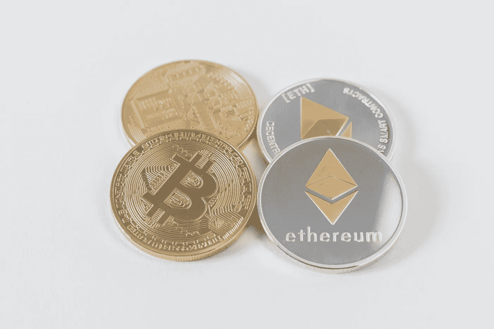
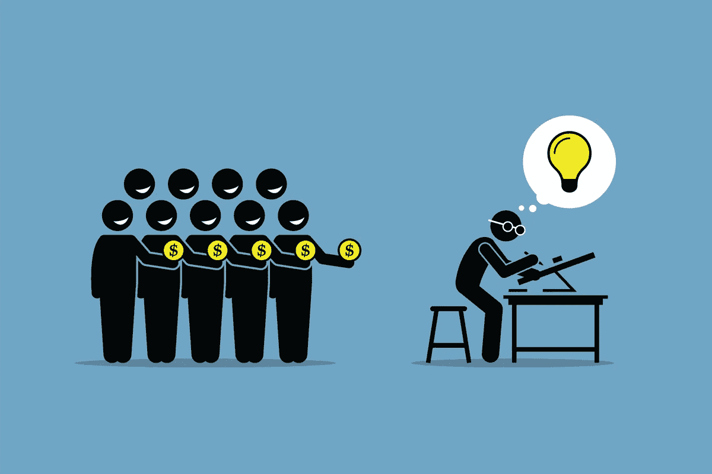

# 企业家如何在 2018 年利用区块链

> 原文：<https://medium.com/swlh/how-entrepreneurs-can-leverage-blockchain-in-2018-32102873437a>

也许区块链难题中最令人兴奋的部分是这项技术如何催生一批全新的企业家(工程师、设计师等)。)比以往任何时候都更快、更高效、更大。区块链的巨大机遇对我们这个时代来说是独一无二的，毫无疑问，在未来的五年里，我们将会看到许多重要的创新来自于此。因此，这里有一些想法让你思考区块链在 2018 年的影响。

# 1.消除背景调查

让我们开始推断，在人力资源行业，区块链可能会如何验证信任。就像 Twitter 添加蓝色复选标记来验证帐户一样，LinkedIn 这样的公司可以利用区块链来验证雇佣关系。不用让每个公司的人力资源部门打电话给以前的雇主来核实候选人的就业历史，区块链可以用来核实诸如就业开始和结束日期、头衔和工作职责等世俗(但重要)的事情。

这一简单的技术变革将节省无数的时间和大量的资源投入，仅仅是为了证明候选人在简历(或 LinkedIn 个人资料)上声称的事实上是真实的。

顺便说一句，如果你和我一样对 Equifax 事件感到不安，这种想法很容易被应用到银行和信贷检查中。当您可以使用区块链私下安全地验证您信用记录中的每一步时，为什么要付钱给像 Equifax 这样的公司来处理容易被黑客攻击、高度敏感的个人身份数据呢？

Photo by [Antenna](https://unsplash.com/photos/cw-cj_nFa14?utm_source=unsplash&utm_medium=referral&utm_content=creditCopyText) on [Unsplash](https://unsplash.com/search/photos/hr?utm_source=unsplash&utm_medium=referral&utm_content=creditCopyText)

# 2.完全自动化的法律协议。

许多行业目前都在致力于商业区块链的应用。众所周知，区块链是缺失的一环，它将使法律协议能够在完全自动化的水平上运作。也就是说，因为区块链本质上是一个“智能合同”，企业将能够完成编制其法律协议的整个过程，而无需今天的人为干预来减缓这一过程。

有多少次，企业就条款达成一致，只是为了让合同放在某人的电子邮件收件箱里等待签字——数字的或者“签字、扫描并回复电子邮件？”区块链可能会消除这种延迟，因为企业已经很好地定义了他们的条款，客户希望在没有等待额外批准和签名的传统延迟的情况下参与进来。

Photo by [Samuel Zeller](https://unsplash.com/photos/vpR0oc4X8Mk?utm_source=unsplash&utm_medium=referral&utm_content=creditCopyText) on [Unsplash](https://unsplash.com/search/photos/legal?utm_source=unsplash&utm_medium=referral&utm_content=creditCopyText)

# 3.供应链验证

在区块链，另一个强有力的先锋是它在公司供应链中的应用。企业知道他们直接从谁那里购买，但通常不知道他们的供应商是谁。区块链可以帮助企业立即理解召回的含义。或者，当一个组件出现故障时，使用区块链，您可以立即看到原始供应商是谁，并在几分钟内确定每个可能受到影响的可疑产品或零件。

区块链还有助于验证道德采购、避免假冒零件和防止童工行为等。将可验证的透明度引入供应链将暴露自全球采购开始以来一直困扰企业的许多不确定性。它还将授权企业核实其供应商是否满足其采购要求。

Photo by [chuttersnap](https://unsplash.com/photos/xewrfLD8emE?utm_source=unsplash&utm_medium=referral&utm_content=creditCopyText) on [Unsplash](https://unsplash.com/search/photos/ship-port?utm_source=unsplash&utm_medium=referral&utm_content=creditCopyText)

# 4.获得资本

对有想法的企业家来说，一个巨大的进入障碍是为他们的项目筹集资金。此外，在美国以外的世界许多地方，企业家无法获得可以帮助他们高效、廉价地为公司筹集资金的现代融资和筹资工具。

世界大部分地区的许多贷款机制对小型成长型企业来说并不理想。与传统贷款相关的成本隐藏在增加的费用和最低存款限制中。所有这些都增加了创业的挑战，这已经非常困难了。

区块链将使世界上任何地方的任何企业家都可以至少获得资本。虽然并不是所有的创意都是平等的，都应该得到资助，但至少所有的创客都有机会为他们的创意筹集资金，因为比特币等数字货币的运作不受地理位置的影响。换句话说，每个人都能够接受和发送加密货币，而没有隐藏的国际费用和交流。

Photo by [Didier Weemaels](https://unsplash.com/photos/ZKVBM2_Dp84?utm_source=unsplash&utm_medium=referral&utm_content=creditCopyText) on [Unsplash](https://unsplash.com/search/photos/investor?utm_source=unsplash&utm_medium=referral&utm_content=creditCopyText)

# 5.更有效的筹资

创业就是要快速行动，尽快解决问题。创建一家公司的最大摩擦点之一是必须在筹资过程中分配昂贵的时间和资源。虽然在正确的时间从正确的人那里筹集资金对你的路线图极其重要和关键，但它确实会占用你核心业务的大量时间。事实上，从风险投资家的传统途径筹集资金可能需要几个月的会议、旅行和来回发送电子邮件，才能最终确定任何事情。企业家从事的是快速行动的业务，而不是花时间筹资。

使用自我验证系统区块链，风险企业可以在做出投资决定后短短五分钟内转移资金。这将加快整个筹资过程，减少筹资渠道中的摩擦。

# 6.透明和负责的航运和物流

多年来，企业家们一直以同样的方式处理问题:依靠他们的“集中模式”管理工具包。区块链引入了一种全新的方式来控制访问和信息，这反过来又可以打开一系列新的机会。

总部位于区块链的平台 ShipChain 利用这种分布式思维来优化货运、物流和航运业。他们使用以太坊智能合约来消除对昂贵的货运经纪人的需求。相反，他们的技术自动跟踪和验证复杂的运输和物流过程的每个阶段，本质上是充当全球承运商的数字经纪人。

他们的解决方案的独特之处在于，如果没有区块链，这是不可能的。他们不是让一个集中的代理控制系统，而是将“信任管理”置于分布式账本的权力之下。这种方法带来了这个行业前所未有的透明度和问责制。

Photo by [Jens Rademacher](https://unsplash.com/photos/kJOj4dU76mE?utm_source=unsplash&utm_medium=referral&utm_content=creditCopyText) on [Unsplash](https://unsplash.com/search/photos/shipping?utm_source=unsplash&utm_medium=referral&utm_content=creditCopyText)

# 7.交易之外的应用

现在，你明白了，所以让我们来探索一些“在那里”的想法，让你的创造力流动起来。暂且考虑一下约会应用 Tinder 的含义，如果它将区块链应用于一个人的约会历史——本质上是给出一个人约会档案的透明账本。

想想看，如果一个政客的每一笔财政捐款都经过区块链验证，会有什么后果。了解帮助政客当选的资金来自哪里，将为游说活动带来新的透明度。

考虑到这些事情，透明度和问责制在你的业务中还有哪些地方是有帮助的？这些都是值得进一步探索的机会领域。如果这让你感到沮丧，其他人可能会喜欢同样问题的解决方案，这可能是你公司的竞争优势。

Photo by [Willian Justen de Vasconcellos](https://unsplash.com/photos/ASKGjAeIY_U?utm_source=unsplash&utm_medium=referral&utm_content=creditCopyText) on [Unsplash](https://unsplash.com/search/photos/transparent?utm_source=unsplash&utm_medium=referral&utm_content=creditCopyText)

# 8.透明和负责

与区块链共同发展的一个核心要素是其透明和负责的性质。公共账本上发生的所有交易都是安全和加密的，因此没有人能够操纵系统。当谈到了解和跟上行业交易时，企业家经常坐在黑暗中，但有了区块链，所有的信息都可以被验证和信任。

当我们寻求使用智能合约验证交易时，我们将看到为什么区块链技术的力量远远超过其目前与加密货币的联系。

Photo by [Chris Liverani](https://unsplash.com/photos/dBI_My696Rk?utm_source=unsplash&utm_medium=referral&utm_content=creditCopyText) on [Unsplash](https://unsplash.com/search/photos/blockchain?utm_source=unsplash&utm_medium=referral&utm_content=creditCopyText)

****************************************************************

鼓掌 1 次或 50 次。它帮助我获得曝光率。谢谢大家！

_

阐述我多年来的想法，并超级热衷于写区块链、交易、加密货币和生活。

我的目标是以一种精致、易懂的方式将加密货币带给大众。复杂无助于任何人，有偏见的媒体也是如此。

是的，我认为这个系统是一个巨大的谎言，是时候改变它了。

_

#longlivecrypto。

*   **************************************************************

## 这个故事发表在[的创业](https://medium.com/swlh)上，这是 Medium 最大的创业刊物，有 306，792+人关注。

## 在这里订阅接收[我们的头条新闻](http://growthsupply.com/the-startup-newsletter/)。

