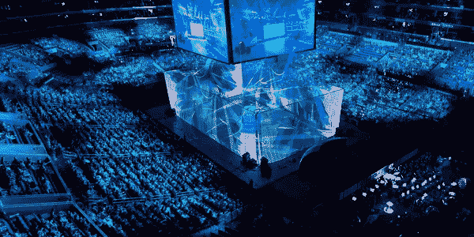

# Eventum 的区块链技术如何变革电子竞技

> 原文：<https://medium.com/swlh/how-eventums-blockchain-technology-can-revolutionize-esports-789d5de1509>

Source: Unreality Mag

如果你是一名营销人员、技术人员，也是一名精明的粉丝，对竞争热情有着敏锐的眼光，那么这是你应该开始密切关注的事情。电子竞技不是什么新技术或时尚，它是娱乐和流行文化的全面转变，迅速吸引了消费者和传统巨星的大量时间和注意力。首先，一些事实:

**什么是电子竞技？** —电子竞技让竞技视频游戏体验成为全世界关注的焦点。虽然直播事件和比赛长期以来一直是视频游戏文化的一部分，但宽带直播从根本上扩大了观众群。

**它有多大？** —该行业的规模和增长令人震惊:

1.  领先的电子竞技流媒体网站 Twitch.tv 的峰值互联网流量超过了脸书和亚马逊。
2.  该网站的用户每月平均观看 421.6 分钟，比观看 YouTube 的用户多 44%。
3.  观看英雄联盟(电子竞技游戏)第三季总决赛的人数超过了观看 MLB 世界职业棒球大赛或 NBA 总决赛的人数，总数约为 3200 万。
4.  该行业预计将在 2020 年创造约 50 亿美元的收入。

**为什么这么受欢迎？**——电子竞技才刚刚开始触及其市场天花板，原因有很多:

1.  千禧一代喜欢看电子游戏。
2.  观众保留率非常高。
3.  竞争让玩家更加投入。
4.  职业运动业主正在加入进来。
5.  通过与电子竞技相关的赌博可以赚钱。

# **问题**

尽管它具有发展潜力，但仍有可以改进的差距。首先，游戏制造商正在关闭他们的生态系统，阻止其他服务依赖实时数据。

以数据服务为例。在传统体育领域，实时数据的收集和反馈已经成为推动类似[体育雷达](https://sportsradar.us/)和 [Opta Sports](https://www.optasports.com/) 的业务的主要驱动力之一，这些业务帮助价值近[70 亿美元的体育博彩和梦幻联盟。到目前为止，电子竞技中这种服务的基础工作还没有到位，这意味着该行业正在失去一个潜在的电子竞技梦幻联盟 1B 机会。](https://qz.com/1068534/how-the-7-billion-us-fantasy-football-industry-makes-its-money-in-2017/)

# **限制**

现在，从根本上来说，[体育雷达](https://sportradar.us/)、 [Opta 体育](https://www.optasports.com/)或任何其他数据服务提供商都可以轻松部署他们的资源来满足这一新兴需求。然而，即使政策改变解决了监管和合作伙伴关系的行业治理，这些类型的服务*仍然*在整个体育博彩综合体中有局限性。

1.  **缺少定制数据—** 根据付费多少，数据包限制了可以在 API 上访问的信息类型。通常，这些 API 不够灵活，即使对于最高级的包，它们也不提供粒度级别。
2.  **高费用—** 为了运营一个跨多个领域的实时梦幻体育联盟，需要一个 API 来提取统计数据，以促进联盟参与者之间的货币交换。这种原料药的年价格从几千美元到近百万美元不等。
3.  **集中化** —这些服务分配一个或少数资源来覆盖任何一个事件的数据提取。这种收集方法增加了报告时出现单点故障的可能性。
4.  **不可靠 *—*** 虽然数据馈送可能会提供有关直播体育赛事的实时信息，但也有信息不完整的情况。例如，如果一名球员被交易到一支新球队，他们的球衣号码或球队信息不会立即更新。

# **解决方案**

进入 [Eventum](https://eventum.network/) ，这是一家总部位于区块链的初创公司，致力于通过分散的方式改善实时数据的收集和验证。Eventum 的“群体智慧”逻辑旨在利用社区驱动的输入，以减少数据报告中的单点故障。通过令牌化奖励系统激励用户快速准确地报告事件详情，该系统将 Eventum 令牌(EVT)分发给那些输入经过实时验证并符合生成的共识的用户。Eventum 平台的目标是多种用例，如假新闻识别、内容审核和图像分析，但 Eventum 主要是建立在弥合当今幻想体育的差距上。

尽管 Eventum 的解决方案尚未完成，但该团队已经发布了一个工作原型——Eventum Alpha(T1)，以展示其概念证明。Alpha 已经通过一系列模拟现实世界应用程序的现场活动进行了公开演示，其中一个应用程序采用了实时报告电子竞技锦标赛统计数据的用例。

# **现场活动概述**

这项活动要求参与者观看一场在线游戏锦标赛的冠军赛，并报告哪支队伍能够先发制人。参与者在现场活动的门户中记录他们的输入，以便全面测试 Alpha 的智能合约和验证节点架构。

# **什么走对了**

1.  **概念验证**—Alpha 建立了一个全面的概念验证。自始至终，阿尔法的智能合约接受了超过 250 名参与者的现场活动，并记录了每个人的投票历史。验证节点帮助生成正确的共识结果，允许智能合约将 EVT 分配给那些成功促成共识的参与者。Alpha 甚至能够展示一些新功能，如检测“假阳性”投票——这些投票有正确的答案，但由于在第一次流血发生之前的早期猜测而被排除在共识之外。
2.  **用户体验—**Alpha 也致力于提供强大的 UX。作为参与者，门户的导航是无缝的，投票的报告机制易于使用。验证每个参与者交互的底层节点及其在智能合约上的后续存储被跟踪，并在此处[可用](https://ropsten.etherscan.io/address/0x9c7609db4ee4bcce256b9ebc3391e05d058e9162)。

# **什么需要改进**

和所有的 MVP 一样，许多都是正在进行的工作，Alpha 也不例外。在活动开始时发生了一个小问题，因为 Eventum 的服务器由于现场活动参与者的容量过剩而崩溃(顺便说一下，这不是一件坏事！).该问题导致门户功能超时，从而导致重要事件信息延迟和通知系统崩溃。不幸的是，这导致一些参与者在活动结束后不知情地投票，这意味着他们的投票在共识收集期间没有被包括在内。

# **我的外卖**

尽管出现了失误，Alpha 仍然是一个独一无二的原型，它真正阐明了去中心化的概念，并展示了其具有工作验证节点和智能合同的技术基础。该团队非常积极主动，已经为他们的下一个事件制定了解决产能过剩问题的解决方案。我将继续关注 Eventum 的进展，并期待看到新更新的实现。

*关于我使用 Alpha 进行电子竞技直播活动的更多细节，请在这里阅读我的帖子***。**

**

## *这篇文章发表在 [The Startup](https://medium.com/swlh) 上，这是 Medium 最大的创业刊物，拥有 306，072 多名读者。*

## *在此订阅接收[我们的头条新闻](http://growthsupply.com/the-startup-newsletter/)。*

**