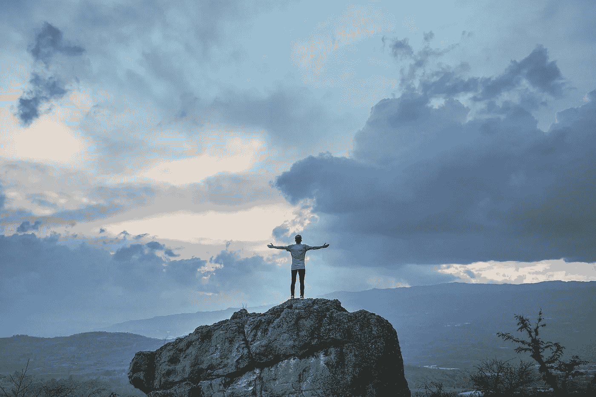

# 这就是超常人变成那样的原因

> 原文：<https://medium.com/swlh/how-extra-ordinary-people-become-extra-ordinary-5717fe8b6976>

> “你必须努力让你的思维变得清晰，让它变得简单。但最终还是值得的，因为一旦你到了那里，你就可以移山。”
> 
> ~史蒂夫·乔布斯。

我们承认。

有些人生来就与众不同。

以这个孩子为例， **Tanmay Bakshi，**年仅 13 岁，第九标准生，在谷歌年薪 125 万美元。你说，“什么？”

是的，他被谷歌聘为 IBM 人工智能平台上最年轻的程序员。下面他的简短采访剪辑显示了他的牛逼。观看这段内容丰富、令人捧腹的视频:

好的，让我们再拍一张…

再举一个另一个神童的例子——**约书亚·怀茨金，一位美国国际象棋选手**，他在六岁时就开始下棋。11 岁时，他和另一个神童是仅有的两个在表演赛中与世界冠军加里·卡斯帕罗夫打成平局的孩子，当时卡斯帕罗夫同时与 59 名青少年比赛。

两年后，他获得了国家级大师的称号，并在 16 岁时成为了国际级大师。**他年轻时是八届全国象棋冠军，也是《寻找鲍比·费舍尔》一书和电影的主角。**

那简直太神奇了。不是吗？

让我们也承认，当我们在如此年轻的时候看到如此高成就的人，有时，我们开始怀疑和怀疑自己的能力。这些孩子在十几岁时取得的进步，通常需要任何正常人经过三十年到四十年的刻意练习才能达到(即使在那之后也没有保证)，这让我们这些正常人有时感到紧张不安。

但是，坚持住！

对于我们这样的正常人来说，生活不应该就此止步。

超常不是只有神童才有可能的事。如果一个人下定决心，真正有目的，每个人都可以在生活中获得非凡的成就。

现在让我们来看看一些人，他们因为采用了成长的心态和坚持不懈的追求而变得不同寻常。

像 J.K .罗琳、亚伯拉罕·林肯、马云、肯德基创始人桑德斯上校以及更多我们今天所敬仰的人，在他们的生活中仍然经历了多次失败。他们最好的部分是他们的成长心态和他们在一次又一次失败后的坚持。

Alibaba.com 的创始人马云现在身价 390 亿美元，但他的背景是中国一所大学的教师。他在达沃斯世界经济论坛的一次采访中说，

> “我两次未能通过重点小学考试，三次未能通过中学考试，两次未能通过高考，毕业时，我申请的大多数大学外工作都被拒绝。我申请了 10 次哈佛，被拒绝了 10 次，我告诉自己‘有一天我应该去那里教书。’"

请看 **J.K .罗琳，**她现在身价超过 6 . 5 亿美元，因其著名的《哈利·波特》系列而广受欢迎。在她变得非凡之前，她不断地失败。用她的话说，

> “我经历了空前的失败。一段异常短暂的婚姻破裂了，我失业了，成了单亲妈妈，除了无家可归，我是现代英国最穷的人了。我父母对我的担心和我对自己的担心都变成了现实，按照通常的标准，我是我所知道的最大的失败。”

**迈克尔·乔丹**被认为是世界上最好的篮球运动员之一。他已经获得了很多荣誉，比如六次 NBA 总冠军，五次 NBA 最有价值球员，十四次 NBA 全明星等等。但是他被高中篮球队除名了，因为他比打篮球的最低身高还要矮。那天，他回到家，把自己锁在房间里，哭了几个小时。但他有一种成长导向思维，愿意学习和坚持更长时间。他下面的名言很好地解释了他的心态和性格。

> “在我的职业生涯中，我已经错过了 9000 多次投篮。我已经输了将近 300 场比赛。有 26 次我被委托去投制胜一球，但我都没投进。我一生中失败了一次又一次。这就是我成功的原因。”
> 
> ~迈克尔·乔丹

这些人没有固定的思维模式。让他们与众不同的是他们的成长心态。在 ***固定的思维定势中，人们把自己的技能看成是固定的特质，无法改变*** 。他们认为他们的想法是固定的，如果他们失败了，他们会认为他们不是天生的，并放弃了。

而在成长思维中，人们相信我们的头脑是有可塑性的，可以学习任何新东西。他们把失败视为一种反馈，认为他们选择的方法是低效的。他们把失败当成学习和成长的机会。

> "有时改变一下视角就能看到光明。"
> 
> ~丹·布朗

我们之前提到的乔希·威兹肯，除了是一个神童之外，也有一个高度成长导向的心态。在他的书《学习的艺术:达到最佳表现的内心旅程》中，他解释了从他精通的国际象棋中选择一种完全不同的运动的原因。他，事实上改变了他成功的事业，现在选择学习和玩武术。他表示，他想测试自己作为一个人的潜力，并验证他的信念，即人类的大脑可以学习和掌握任何它想要的东西。**他从不认为人类的能力或资质是从出生就注定的。**

他举了国际象棋的例子，他说**每赢下一局，级别都比上一局高，这本身就证明了大脑有巨大的学习和成长潜力**。心态的力量可以引导人进行超乎想象的思考。带着这种坚定的信念，他选择接受新鲜和新的挑战——从智力游戏转向需要巨大体力和警觉性的运动。

他也很快证明了自己对武术的精通。Josh Waitzkin 是武术冠军，除了几个世界冠军头衔之外，还拥有 21 个全国冠军头衔。你会看到这两种完全不同的运动，以及他是如何在这两种运动中都取得成功的。这都是通过成长思维的力量。

拿破仑·希尔几十年前就已经说过了:

> "只要人类的头脑能够想象和相信，它就能够实现."

令人欣慰的是，神经科学已经做了足够的研究，并建立了神经可塑性的概念，这意味着我们可以通过接触不同的环境、思维模式和行为来改变我们的心态。我在我的畅销书 [***《心态改造》中广泛讨论了神经可塑性这个话题，如何从固定心态转变为成长心态。***](https://www.amazon.com/Mindset-Makeover-Transform-Potential-Unstoppable-ebook/dp/B0798RCCSG)

简而言之，如果一个人不是生来就与众不同，这并不意味着没有成为与众不同的人的可能性。每个人都有潜力变得与众不同。我们不知道我们能成为什么样的人。事实上，我们最关心的应该是每个人自出生以来所拥有的最大潜力，不应该浪费掉。一粒种子永远不知道自己可以变成一棵大榕树。如果你能和一颗年轻的种子说话，告诉它有成为榕树的潜力，也许它会嘲笑你。想象一颗小种子嘲笑你说:*“得了吧，你在开玩笑。我怎么会是这么大的树？”但是当这颗种子嘲笑你的时候，你可能会同情它，或者同情这颗种子没有意识到它的潜力。*

如果我们走出自己的路，并发展一种以成长为导向的心态，我们每个人都有潜力变得与众不同。

富兰克林·罗斯福曾经正确地说过:

> **“成功之间的障碍并不存在于现实世界中:它纯粹由对能力的怀疑构成。”**

**希望你喜欢这篇文章。**

你介意为此鼓掌吗？

# 如果你喜欢上面的，你也会想看看我下面的其他文章:

[**学会这六步公式，找到你的为什么**](https://blog.usejournal.com/learn-this-six-step-formula-to-find-your-why-c2b891bdd88e) **！**

[**一个简单的公式激活"流动状态"的方式高执行者做到**](/@sombathla/this-is-how-peak-performers-get-into-state-of-flow-and-you-too-can-c32bfca47493) **！**

[**人们拖延实现目标和梦想的三大原因**](/swlh/3-reasons-why-people-procrastinate-their-work-and-dreams-too-84d9938cd5e9)

# 想提高你的表现(和结果)吗？

# [点击此处下载免费报告，了解 5 种心态转变，在短短 30 天内提升你的表现](https://sombathla.com/mentalshifts/)

Photo by [Quino Al](https://unsplash.com/@quinoal?utm_source=medium&utm_medium=referral) on [Unsplash](https://unsplash.com/?utm_source=medium&utm_medium=referral)

# [Master 5 心态转变，在短短 30 天内提升你的表现——下载你的免费报告](https://sombathla.com/mentalshifts/)

## 这个故事发表在 [The Startup](https://medium.com/swlh) 上，这是 Medium 最大的创业刊物，拥有 290，182+人关注。

## 在这里订阅接收[我们的头条新闻](http://growthsupply.com/the-startup-newsletter/)。

