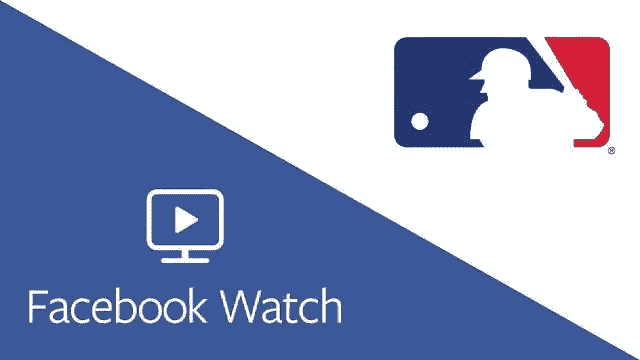
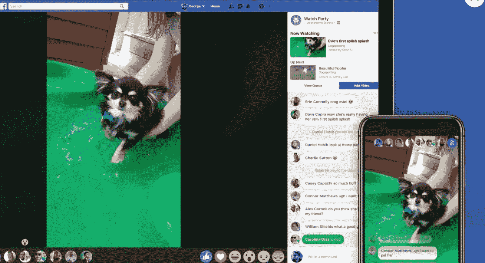
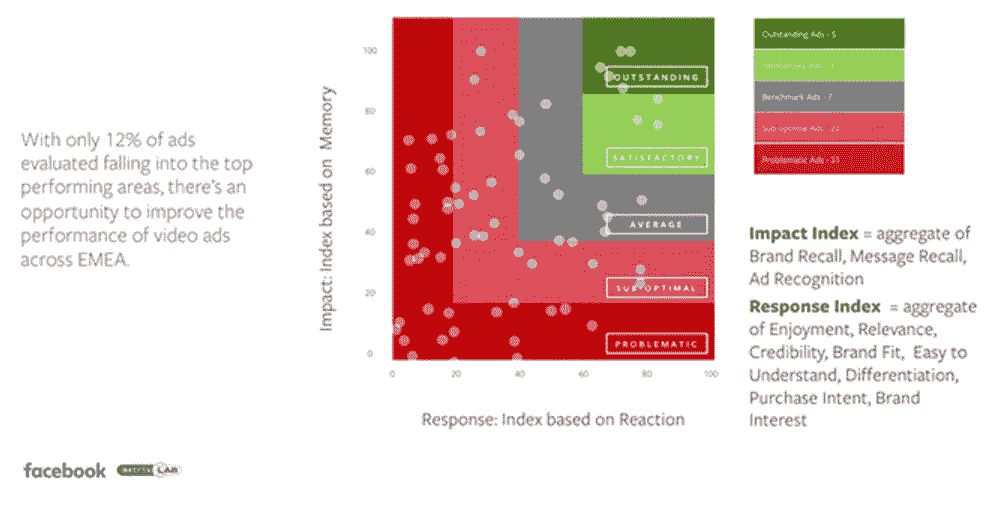
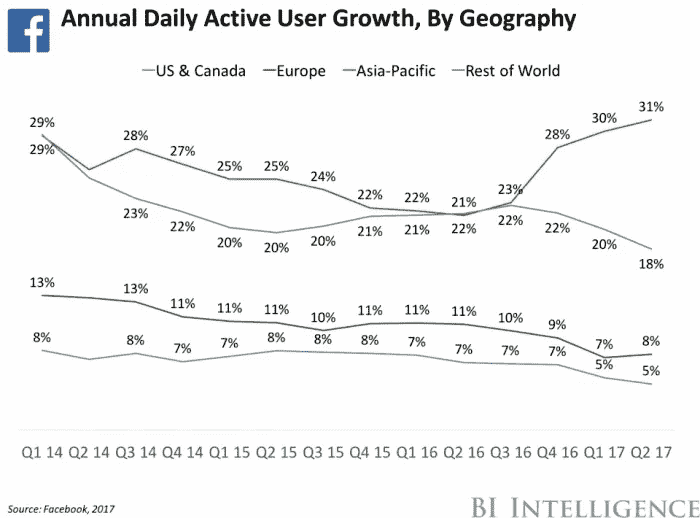
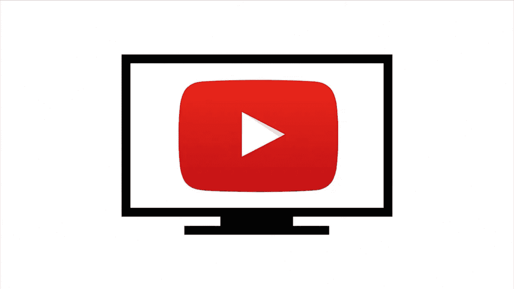
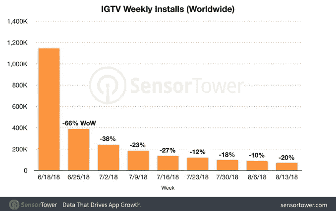
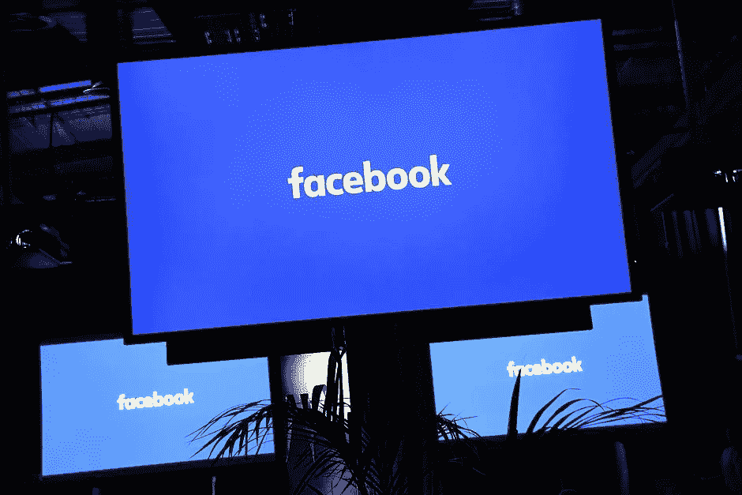

# Facebook Watch 如何挑战 YouTube 以及全球电视市场

> 原文：<https://medium.com/swlh/how-facebook-watch-is-taking-on-youtube-and-the-global-tv-market-748dad24858c>

## Facebook Watch 将如何影响数字广告支出，营销人员需要知道什么？在 IGTV 缓慢但稳定的起步之后，脸书是否学到了关键的经验，可以帮助 Watch 赢得忠实的观众？

**脸书的** [**宣布其 Facebook 观看视频服务的**](https://newsroom.fb.com/news/2018/08/facebook-watch-global/) **显然是为了通过进军利润丰厚的电视市场来增加其广告收入。**

这项名为 [Watch](https://newsroom.fb.com/news/2017/08/introducing-watch-a-new-platform-for-shows-on-facebook/) 的新功能承载了一系列类似电视的原创内容(直播和录制)，旨在将在线流媒体服务的可定制特性与社交网络提供的公共观看体验相结合。最初的合作伙伴包括美国宇航局、赫斯特和 BuzzFeed，预计不久将有至少 40 多个频道可用。

Facebook Watch 在桌面、平板和移动设备的脸书界面中有一个单独的标签。脸书[最近发布的数据表明，“自 2018 年初以来，在 Watch 上观看视频的总时间增加了 14 倍。”](https://newsroom.fb.com/news/2018/08/facebook-watch-global/)

它现在已经在全球范围内发布，所以 Facebook Watch 平台的影响力远远超过了任何传统的电视网络。其他功能包括 Watch Party，旨在重建“共享观看体验”，本质上融合了看电视和在社交媒体上做出反应的双屏行为。它也可以与 YouTube 相提并论，但具有小组讨论的实时元素。

这种全球产品发布对许多行业观察人士来说并不意外，因为脸书非常清楚，它需要在增加广告收入和维持活跃的用户群之间找到一条微妙的路线。

有一种清晰的感觉，社交网络需要提供一些新的和有吸引力的东西来让用户在网站上停留更长时间；它寄希望于 Facebook Watch 提供这个平台。然而，在 Facebook Watch 成为电视观看的首选之前，它仍有一长串未解的问题。

本文将介绍 Facebook Watch 是什么(以及不是什么)，然后再探讨促使这一宣布不可避免的更广泛的背景。最后，我们将评估 Facebook Watch 相对于其长长的竞争对手名单的优势和劣势。

# Facebook Watch 是什么？

Facebook Watch 是脸书去年推出的下一代视频标签。它将承载广泛的内容，但预计观看节目将致力于 YouTube 视频和 HBO 和网飞等公司的优质作品之间的中间地带。

至少这可能是早期的战略，但 YouTube 已经展示了迎合自我发布内容长尾的好处，而 [Creator 应用](https://techcrunch.com/2017/11/16/facebook-creator-app/)已经为较小的影响者创造高质量内容开辟了潜力。

> “时间本身并不是目标。我们希望人们花在脸书的时间鼓励有意义的社会互动。因此，我们将把我们的产品集中在围绕人们分享和观看的视频建立社区的所有方式上。这是脸书能够独一无二地做到的事情。”—马克·扎克伯格

从用户的角度来看，Facebook Watch 中将有一个 Discover 部分，它将根据他们和他们朋友的行为数据来推荐节目。用户也可以将节目保存到他们的观看列表中，当然还有趋势和“最受关注”内容的部分。

虽然早期节目通常长度在 5 到 10 分钟之间，但该平台允许 2 到 240 分钟之间的任何长度的视频。早期报道[声称](https://www.theverge.com/2017/7/26/16035000/facebook-tv-vox-buzzfeed-attn-ad-revenue)脸书的主要目标是主持 20-30 分钟的视频系列，社交网络是这些内容的唯一所有者。这些节目中会有插播广告，为脸书及其合作伙伴带来额外的广告收入。

所有这些都是由人们对世界上最大的公司之一的预期融资水平所支持的；一些制片人声称脸书是 T4，提供每集 10，000 到 25，000 美元从制片人那里获得极具价值的原创内容。对于拥有大量观众的节目来说，每集的费用将会大幅增长。

与 Group Nine Media、Mashable 和 Vox Media 建立了其他合作伙伴关系，同时一些大联盟棒球比赛将进行直播。

随着亚马逊[传言](https://www.theguardian.com/media/2017/aug/11/premier-league-broadcast-battle-hots-up-as-sky-face-doling-out-extra-600m)准备斥资数十亿美元收购英格兰超级联赛足球转播权，看到脸书获得一个同样值得关注的妙招让人们加入 Watch 也就不足为奇了。虽然脸书目前没有直接瞄准网飞或亚马逊 Prime，但如果它能在未来 12-24 个月内获得忠实观众，这可能会成为一个现实的提议。

脸书总结了如下好处:

> **发现新视频的地方:**在您的个性化观看订阅源中找到涵盖娱乐、体育、新闻等内容的最新视频。
> 
> **与你喜欢的创作者和发布者保持联系的一种方式:**在你的观看提要顶部，你会看到你的观看列表，这是你关注的页面中最近视频的集合。通过在 Watch 中关注更多页面或从您的关注列表中删除页面来自定义此部分。
> 
> **保存视频的地方:**如果您在新闻订阅源中看到一个视频，但没有时间立即观看，您可以将其保存在 watch 中稍后观看。
> 
> **您可以参与的视频:**我们正在构建新的视频体验，以人为本，让他们能够塑造内容的方向。随着时间的推移，你将能够在你的观看提要中找到新的视频体验，如[观看派对](https://newsroom.fb.com/news/2018/07/watch-party-launches-around-the-world/)，首映，以及专注于观众参与的视频——如新的琐事游戏节目 Confetti。我们将让您更容易找到现场视频，以便您可以讨论正在发生的重大时刻。

# Facebook Watch 与现有的脸书视频有何不同？

脸书毫不掩饰这样一个事实，即它将视频视为一个巨大的机会，以保持其超过 20 亿的用户群的参与，并吸引广告商对社交网络进行大量投资。

脸书上已经有很多出版商，其中许多人专门为这个平台创作原创内容。脸书越来越多的出版商考验了马克·扎克伯格的一贯主张，即他们是“一家科技公司，而不是一家媒体公司”随着脸书全力发展数字流媒体服务，未来几个月这一界限可能会软化。

脸书显然渴望最大限度地发挥这种形式的潜力。然而，一个挑战是，品牌没有创造出最适合在移动设备上观看的资产。用户通常会快速浏览他们的新闻提要，当他们的兴趣被激起时会暂时停下来，但许多视频不足以保持他们的注意力。事实上，85%的脸书视频是在没有声音的情况下观看的。

脸书最近与 MetrixLab [合作](https://www.facebook.com/business/news/building-for-both-feeds)来评估视频在不同设备上的表现。如下面的截图所示，只有 12%被判定为表现良好，大多数属于“一般”、“次优”和“有问题”类别。

显然，在脸书视频目前的迭代中，品牌和用户之间存在脱节。

# 那么 Facebook Watch 将如何帮助解决这些问题呢？

首先，这些视频不会像目前许多视频那样，通过自动播放来中断新闻订阅。Watch 的目的将是吸引观众留出时间来赶上他们最喜爱的节目，而不是希望他们在此期间停留在新闻提要中。

如果用户(或他们的一个朋友)关注他们，出版商可以在新闻提要中提供内容，但这些内容可能是完整剧集的预告片。

作为早期的合作者，Quartz 执行制片人 Solana Pyne 说，“主要目标不是当他们滚动提要时抓住他们的眼球，而是创造人们会观看的东西。”

Watch 还将雇用编辑来管理观看列表，尽管这项工作的大部分将由[人工智能](https://www.clickz.com/category/emerging-technology/ai/)系统完成，这与网飞根据用户偏好和观看行为推荐节目的方式非常相似。

脸书有更多的历史数据输入这些系统，因此这可能成为社交网络的一个重要竞争优势。

正如[官方声明](https://newsroom.fb.com/news/2017/08/introducing-watch-a-new-platform-for-shows-on-facebook/)中所强调的，脸书将充分利用这些数据来创造一种更加公共的观看体验:

“你会发现像《最常谈论的》这样的栏目，它突出了引发对话的节目，《是什么让人们发笑》，其中包括许多人使用哈哈反应的节目，以及《朋友在看什么》，这有助于你与朋友联系，了解他们也在关注的节目。”

此外，Facebook Watch 的主要目标之一是让用户定期收听，获得接近传统的向后倾斜的电视体验。对脸书来说，这是一个相当大的转变，其不断增长的用户群需要一些时间来适应。脸书正在非常温和地处理这一点，在扩展到更广泛的节目之前，通过通常 5 到 10 分钟长的视频让用户放松。

它还要求用户以一种非常不同的方式与脸书互动。到目前为止，让用户暂停并观看社交网络上的视频一直具有挑战性，因为他们习惯于在好奇心被激起时暂时滚动和停止。

# 为什么脸书会和电视扯上关系？

脸书已经痛苦地意识到过多广告使新闻内容过度饱和的危险。他们的数据团队分析了数十亿次用户互动，以评估他们的行为模式，并敏锐地关注他们因过度接触广告而筋疲力尽的点。

他们的集体用户群的注意力跨度是他们最大和最可销售的资产，但在不增加新产品的情况下，很难保持股东和广告商希望看到的增长。拥有超过 20 亿用户的脸书需要从现有用户中获取尽可能多的信息。

理论上，从电视市场分一杯羹将在某种程度上让人们对脸书的增长重新感到乐观——特别是在像北美和西欧这样高度饱和的市场。

[*来源:和毕的情报*](http://www.businessinsider.com/why-facebook-is-focusing-on-tv-like-content-2017-8)

一段时间以来，行业观察家预测数字广告支出将超过电视广告的预算。这在很大程度上归因于不同人群和地区在线时间的增加，尽管数字定位和测量远非完美，但它们仍是传统电视广告方法的进化飞跃。

因此，电视和数字正在以多种方式融合。纯数字电视流媒体服务有无数选择，但数字广告模式现在也应用于线性电视广告。

程序化电视购买有可能在自动化、高针对性的实时拍卖中将数字和线性电视库存购买联系起来。在该行业兑现其雄心勃勃的承诺之前，还有一段路要走，但随着谷歌和脸书的大力参与，我们可以期待许多改进。

越来越多的“断线钳”也为新的数字平台开辟了潜在受众。插队者通常是受够了支付高昂的费用来注册他们不想要的电视频道包，只是为了得到他们确实想要的几个频道。

在消费者习惯于拥有控制权(或者至少是控制的幻觉)的时候，一些有线电视公司显得过时了，与他们的观众不同步。

在美国，从 2012 年到 2016 年，没有付费电视的人数增加了 860 万。人们对电视的欲望依然存在，但人们希望以新的方式体验电视节目。这就是脸书等公司希望介入并找到市场缺口的地方。

鉴于已经有很多人在社交媒体上看电视和谈论这部剧，将所有东西都放在一个平台上似乎是一个明智的进步。

因此，Facebook Watch 的推出似乎是一个完美的逻辑。脸书的机会看起来很明显；然而，仍有许多未解之谜。

我们对任何新生的、雄心勃勃的技术都有这种预期，但这种向类似电视的流媒体的转移带来了更多的问题，我们现在无法提供答案。例如:

*   用户会改变他们的行为，在他们习惯浏览的网站上看电视节目吗？
*   脸书将如何获得足够内容的独家版权来吸引用户？
*   谁将能够推出渠道？会像 YouTube 一样开放，还是更有选择性？
*   与网络达成合作关系就足够了吗？[网飞从 NBC 招募珊达·瑞姆斯](https://www.engadget.com/2017/08/14/netflix-signs-shonda-rhomes-away-from-abc/)(*丑闻*和*实习医生格蕾*的制片人)表明这种合作关系是脆弱的。
*   广告定位的效果如何？在植入式广告中传递个性化信息将是一项艰巨的任务，我们应该相信这一任务会顺利完成。

然而，有一个问题我们已经可以开始回答了。

# Facebook Watch 的主要竞争对手是谁？

首先是 YouTube。

谷歌的视频流媒体网站具有庞大用户群的内在优势，这些用户习惯于在该平台上观看较长的视频。最近推出的 YouTube TV 见证了谷歌与 Sling 和 DIRECTV NOW 等其他流媒体网站的正面交锋，提供直播的有线电视体验，而没有有线电视合同的包袱。

作为谷歌数字产品套件的一个组成部分，YouTube TV 通过其 DoubleClick 广告服务联系在一起，似乎是 Facebook Watch 在这些非常重要的广告预算方面的直接竞争对手。

尽管如此，就目前情况来看，YouTube 电视远非一个完整的套餐。尽管有一些过于急切的预测称，YouTube 将在推出后不久取代电视，但要真正提供更好的观看体验，还有很长的路要走。如果不拥有任何电视内容，它就面临着内容制作者也会把他们的产品带到其他地方的风险。

例如，迪士尼[宣布](http://nerdist.com/what-to-expect-from-disneys-new-streaming-service/)他们将从网飞分离出来，推出自己的流媒体服务(包括 ESPN 和美国广播公司在内的一系列电视频道，以及一系列深受喜爱的电影),这表明没有人能免受这种威胁。网飞正在适应抵御这样的挑战，但 YouTube 需要做的不仅仅是提供一个更便宜的数字有线电视包来吸引观众。

Twitter 也应该警惕 Facebook Watch 带来的挑战。前者已经涉足 NFL 和 MLB 比赛的直播世界，希望观众更喜欢社交网络和直播电视的结合优势。就在这一主张开始站稳脚跟的时候，Twitter 可能会因为脸书复制这一前提的计划而受挫。

最终，脸书将 Watch 定位于吸引广告商的中间地带:介于 YouTube 的草根内容和 HBO 的高端产品(以及它们带来的昂贵广告时段)之间。随着苹果[也将在未来 12 个月内投资](https://www.wsj.com/articles/apple-readies-1-billion-war-chest-for-hollywood-programming-1502874004)10 亿美元在原创内容上，这个高端领域看起来将变得越来越拥挤。

作为 IGTV 的对手，它有一个不起眼的开始，但肯定有巨大的潜力，脸书基本上可以在两条战线上打这场仗。它还具有跨平台快速分享经验的优势，从而获得很少有人能利用的竞争优势。

# Facebook Watch 对品牌意味着什么？

为品牌提供一种新的广告选择的需要，推动了上述许多活动。更长的节目将为脸书提供一个理想的机会，以类似于传统电视广告的方式使用其中置广告形式。这将有望带来一些创新的与用户互动的新方法，基于脸书用于馈送其目标算法的数据量。

品牌也将有机会创建和推出自己的内容，或者赞助其他制作人创建的内容。在脸书上有一个专门用于高质量、长格式视频内容的空间，可能会鼓励品牌考虑制作自己的视频内容，而不是每天花时间在多个帖子上。

总的来说，花在网站上的时间越多，意味着脸书有更多的库存可以出售，这将有助于调节广告商的价格。在过去的 18 个月里，这是一场持续的斗争，随着库存停滞和更多广告商的加入，价格不断上涨。尽管脸书已经采取了多种措施来减轻广告商的预算负担，但开放一种全新的媒体形式可能是迄今为止最有效的策略。

另一个试探性的问题是，究竟谁来管理 Facebook Watch 的广告预算。如果品牌决定在流行节目期间投资植入式广告，这将比脸书标准的潜在客户挖掘或重新定位活动更昂贵。

这可能会继续争论这种类型的活动是否应该由专业的数字营销团队管理，或者被视为电视活动的延伸。这两个世界已经融合了一段时间，这些讨论很久以前就开始了，但这些问题仍然会给企业带来组织挑战。

如果有一件事应该是明确的，那就是脸书在手表上投入巨资，他们希望帮助品牌从这些形式中获得价值。最近给希望为脸书和 Instagram 改编电视广告的品牌的建议进一步证明了这种合作方式。

因此，如果品牌计划推出手表，它们应该会将脸书视为一个宝贵的合作伙伴；说一场成功的竞选活动的好处是相互的是一种保守的说法。

## 这篇文章发表在[《创业](https://medium.com/swlh)》上，这是 Medium 最大的创业刊物，拥有+364，117 名读者。

## 订阅接收[我们的头条新闻](http://growthsupply.com/the-startup-newsletter/)。

