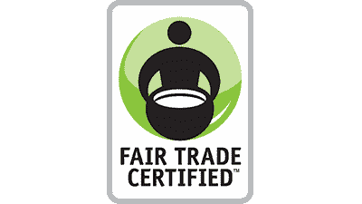
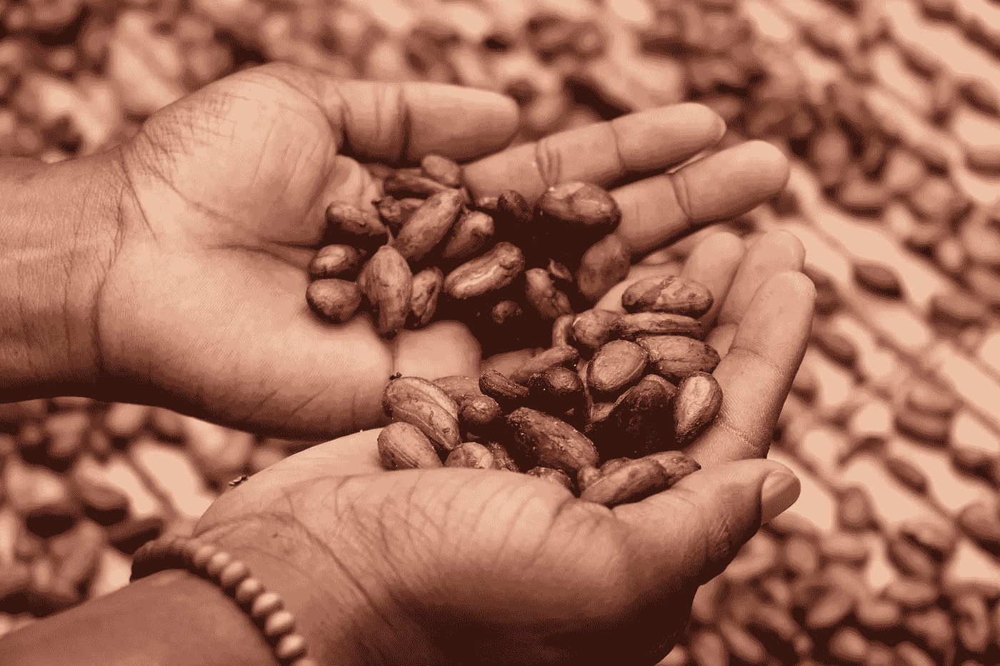

# 美国公平贸易如何轻松地向同事和合作伙伴传达信息

> 原文：<https://medium.com/swlh/how-fair-trade-usa-easily-communicates-information-to-colleagues-and-partners-cb9c11ca4880>

吃饭，睡觉，*购买*。

购买商品和服务已经成为我们社会的第二天性——以至于我们很容易漫无目的地消费，而不去想在知名品牌和时尚包装下我们在支持什么。

这就是为什么[美国公平贸易](https://www.fairtradecertified.org/)把扰乱人们的购物方式作为他们的使命。

[他们的信念很简单](https://www.fairtradecertified.org/why-fair-trade):我们买卖的产品与他人的生计息息相关，因此公平贸易是一种为更美好的世界做出自觉选择的方式。

自 20 世纪 80 年代初以来，美国公平贸易组织创始人保罗·赖斯一直与世界各地的农民、渔民和工人合作，根据公平贸易条款销售他们的产品。

多年来，公平贸易为所有利益相关者创造“共享”价值的模式让农业社区等摆脱了贫困，让他们能够负担起基本的必需品，如住所、自来水和电力。

公平贸易的模式基于可持续的生产、贸易和消费。它遵守一丝不苟的标准，如公平的劳动实践和负责任的土地管理，以确保所有利益相关者得到公平对待。

一旦产品得到评估和批准，它就会获得[公平贸易认证印章](https://www.fairtradecertified.org/why-fair-trade/our-global-model)——证明产品是以可持续的方式生产和销售的。

Fair Trade Seal

咖啡、茶、小吃、海鲜、服装和家居用品等产品在北美很受欢迎，随处可见。通过提供大量可供选择的商品，公平贸易为全球农民和工人带来了 5 . 51 亿美元的额外收入。

公平贸易大有作为，这不是谎言。为了管理所有复杂的业务需求，他们需要一个强大的数据收集工具来组织传入的信息、提高效率并简化工作流程。

公平贸易大约在七年前开始使用 JotForm，并且一直没有回头。技术创新副总裁 Bennett Wetch 在寻找一款经济实惠的软件工具来帮助他提高工作效率并轻松高效地收集数据时发现了 JotForm。

> “JotForm 大大加快了我们启动 web 表单的速度——以前我们需要手动编写代码，这需要花时间进行 QA，以确保它确实运行良好。”

Bennett 和他的团队使用 JotForm 的最重要的方式之一是让来自世界各地的数百名咖啡农注册公平贸易活动。

例如，他们的咖啡供应链团队参加专业咖啡协会的会议(一年中最大的咖啡会议)，并协调来自世界各地的数百名咖啡豆农民的旅行细节，以便他们也能加入。咖啡供应链团队在 JotForm 中构建表单，确保它们有适当的品牌，然后轻松地将它们嵌入到他们的网站上。

公平贸易的标准团队也使用 JotForm 来修订他们的大型农业生产标准，这是非常重要的，因为公平贸易是一个认证机构。标准小组用英语和西班牙语创建表格，并询问关于人们的个人信息、对标准的意见等多个详细问题。

这项审查的很大一部分是筛选收集到的数据。在使用 JotForm 之前，团队必须手工导出响应，这既繁琐又耗时。但是现在有了 JotForm 的管理仪表板，团队可以很容易地根据需要查看、分析、导出和共享数据。

使用 JotForm，Fair Trade 的团队不仅可以简化表单构建过程，还可以轻松地访问、管理信息，并与同事和合作伙伴交流信息。

> “只要我能找到一个工具，它能做承诺要做的事情，做得很好，并使我们能够更快地交付，这对我们来说是一个巨大的好处。”

公平贸易使社会能够做出负责任的、可持续的采购决策。JotForm 为他们的信息收集提供了动力。

你用 JotForm 做什么？如果您对我们在博客或视频中介绍您的企业感兴趣，请填写我们的简介 [*案例研究申请表*](https://form.jotform.com/chad/case-study-request) *！*

*最初发表于*[*www.jotform.com*](https://www.jotform.com/blog/fair-trade-usa-easily-communicates/)*。*