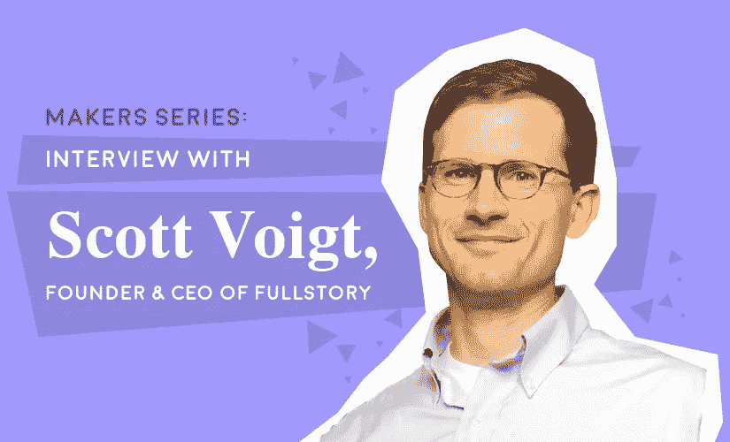
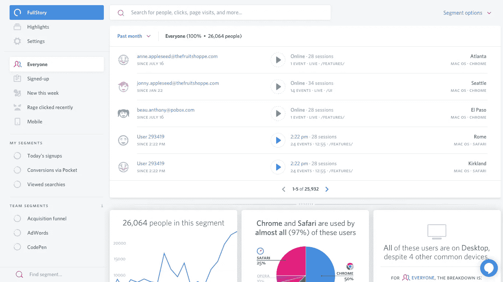
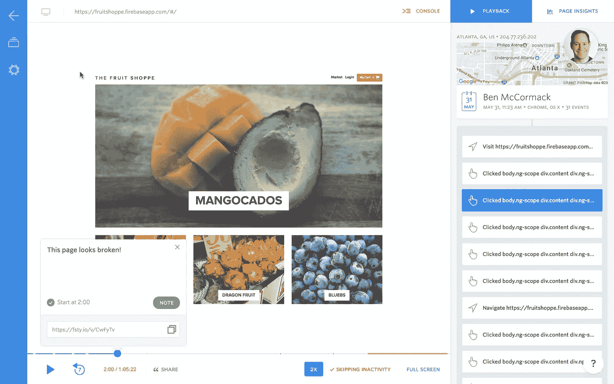
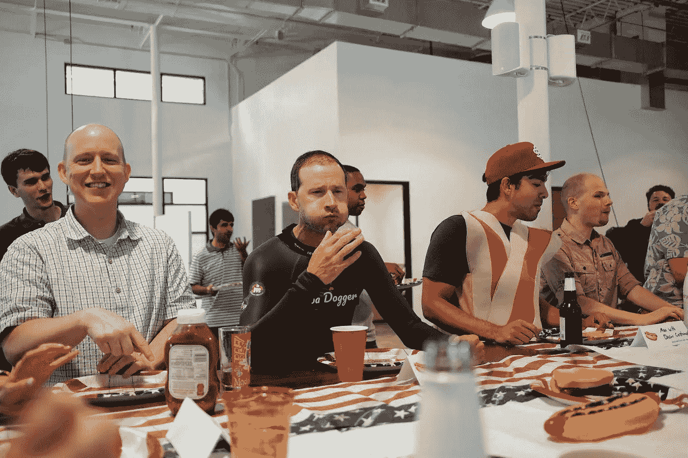
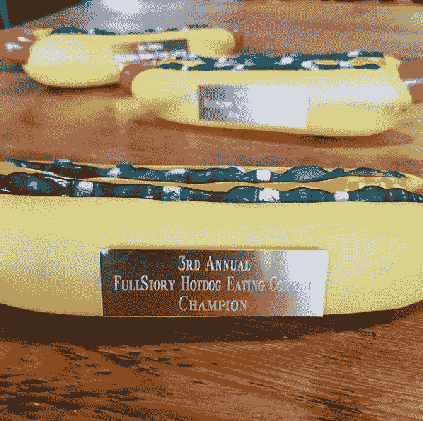

# FullStory Founder 如何成功创业

> 原文：<https://medium.com/swlh/how-fullstory-founder-built-a-successful-startup-11e299a9b57e>

## 了解 Scott Voigt 的创业之旅，以及他是如何在创业环境中航行的。

与普遍的看法相反，并不是所有的创业公司都是在硅谷的车库里开始的。

以 [FullStory](https://www.fullstory.com/) 为例。

Scott Voigt 在佐治亚州亚特兰大市共同创建了 FullStory，他还担任该公司的首席执行官。FullStory 是一个在线记录和再现用户体验的工具，因此组织可以支持客户，提高转化率，并更快地调试。

但是斯科特的旅程并不是从完整故事开始的。在投身这一事业之前，他曾就读于宾夕法尼亚大学沃顿商学院(Wharton School of The University of Pennsylvania)，攻读 MBA 学位，在企业界工作过，并创办了几家其他公司。可以肯定地说，斯科特已经学会了一两件如何驾驭创业场景的事情。

在我们的采访中，斯科特坦率地谈论了他是如何运营 FullStory 的，为什么客户体验在今天的世界中就是一切，他所面临的挑战，以及对企业家的建议。

# 斯科特，是什么影响你走上了创业之路？

我上大学时在一家大型咨询公司工作，对咨询行业的生活有所了解。当我在 1997 年毕业时，有一个新事物，“万维网”掀起了波澜，所以我去和一些兄弟会的兄弟们一起为一个 10 人的创业公司工作，它为网络建立互联网银行解决方案。我们把公司从 10 个发展到几百个，并在 1999 年上市。**制造一个全新的产品、见证一个新行业的诞生、体验一家公司的快速成长是如此令人兴奋，这让我着迷。**

# 快进到完整的故事。你是如何为你的公司想出这个惊人的主意的？

**你知道在电影中总有那么一个“啊哈时刻”FullStory 的现实与此完全不同。**

退一步说，在 2005 年，我在一个三人公司工作，与你能想象到的最聪明的人一起工作，布鲁斯和乔尔，他们是我今天的合伙人。但我们是一家三人小公司的一部分，这家公司被谷歌收购，并成为谷歌亚特兰大工程办公室的基础。我喜欢和布鲁斯和乔尔一起工作——非常有趣——他们都是很棒的人。

几年后，他们仍在谷歌工作，而我继续做其他事情，我们真的只是想让乐队重新在一起。他们辞掉了在谷歌的工作——我辞掉了现在的工作。**我们并不是因为想要开发一款产品而辞职，而是因为我们想一起创办自己的公司。**

我们实际上推出了一款名为 Homebase 的产品，我们试图了解我们自己的客户是如何使用我们开发的产品的。我们发现，当时市场上可用的其他工具，如谷歌分析，给了我们一个如此狭隘的数据视图，让我们想要更多。

FullStory 的想法是我们问，“我们如何才能更好地了解我们自己的客户对第一个产品。”与此同时，第一个产品并没有真的让世界着火，所以我们在想，“我们还能造出什么更有趣的公司呢？”所以这两件事的交集导致了 FullStory 的想法。

我要提醒一件额外的事情，那就是 FullStory 的核心前提之一(也是我们不怎么营销的东西)它真的很像 Google for business，因为我们索引所有的东西。用户的每个用户事件都是可搜索的。我们试图让它更容易找到，更容易理解——就像谷歌为消费者做的那样。我们依靠谷歌的一些经验说，“伙计，那些家伙在索引整个互联网方面是如此雄心勃勃——我们不能为我们自己的客户尝试这样做吗？”

FullStory Segment

# 你认为用户体验对一个产品有多重要？

我认为随着时间的推移这是最重要的事情。因为消费者和产品用户是产品的决策者。如果你不给他们一个很好的体验，他们会互相交谈说，“我试图从这家公司购买一些东西，这是一个可怕的体验”或“我试图使用这个产品，这是一个可怕的体验。”再好的营销也不能帮助你改善糟糕的客户体验，因为真相会暴露出来。

# 你认为有可能用 FullStory 创造一个“完美”的客户体验吗？

有一段时间，我们的关键词之一是，“提供更完美的客户体验。”有点像“更完美的结合”我相信完美是一个不断变化的目标。当第一部 iPhone 上市时，第一版 iPhone 给人的感觉就像你把未来握在手中，很难想象还有比这更好的东西。

**现在完美的东西可能会改变，所以你必须永远站在完美的前沿。**我认为一个人可以做到尽善尽美，但要确保每个人——至少在网络上——都有一致的客户体验，这是很难的。因为你可能在一个分辨率或一个移动设备上优化你的站点或一个浏览器，但是拥有不同连接或不同版本操作系统的人的长尾效应会导致糟糕的体验。

FullStory Playback

# 除了使用自己的产品，FullStory 是如何研究其用户的？

我们用自己的产品！

# 就这样？！

没错。嗯，我们像其他公司一样经历传统的产品管理实践。如果我们有一个想法，我们会研究这个想法，我们会和一些人交谈，我们会对什么有趣和不有趣有一个感觉。

如果我们发布一个特性，我们将使用 FullStory 来理解与该特性的交互，进行小的迭代，并观察与这些特性的交互。我们在我所谓的“传统用户测试”方面做得不多我认为人们在接受采访时会有一些固有的偏见——他们以某种方式回答——通常是他们认为采访者想听到的。

# 为什么你认为每个企业都能从 FullStory 中获益？

嗯，老实说，我不知道所有的业务。但是，每一个关心数字化客户体验的企业都绝对可以从 FullStory 中受益。**这又回到了我们的核心前提，即你应该能够捕捉所有的数据，并赋予每个人客户体验的权利——无论是对工程、产品管理、市场营销还是销售的支持**。所有这些人都有责任让客户体验变得更好，许多人只是没有合适的工具来给他们提供帮助客户所需的超能力。

信不信由你，这个世界上有很多人不是数据科学家。似乎大多数公司让客户体验回到分析师和数据科学家身上。这就是为什么让人们通过回放轻松访问和理解数据，将有利于每一家希望完善用户体验的公司。理解事物。

# 强大的公司文化如何促成了 FullStory 的成功？

在 FullStory，我们对彼此非常诚实，我们对信息开放，你不会一直试图歪曲事实。这对公司文化很有帮助。这可能听起来很俗气，但我们喜欢感觉非常有机的东西。所以很多公司把文化和办公环境、桌上足球之类的东西混为一谈。**我们希望人们觉得自己有能力做一些事情，让公司感觉这是他们的公司。**

举个例子，我们有一个人认为对周一、周三和周五做俯卧撑感兴趣的人会很有趣。所以他提供了一个“俯卧撑训练”公司对俯卧撑的采用很疯狂，这不是“兄弟之情”，这更像是有机发生的有趣的事情。

Bruce Johnson, Co-founder of FullStory (left) and Scott Voigt, Co-founder & CEO of FullStory (middle).

FullStory’s HotDog Eating Contest trophies.

# 你认为 FullStory 给你带来的最大挑战是什么？

我曾经在一些公司工作过，在那里你总是在紧张地思考，“我们能建立什么来扩大我们的市场？”你总是试图创新。FullStory 现在面临着相反的问题。

我们创建了这个平台来吸收数据，并为组织内的多个人员提供支持，我们真的在努力明智地选择我们为公司内的哪些人服务，以及我们如何为他们服务。问题是我们不应该建造什么，而不是应该建造什么。

雇佣优秀的工程师总是很棘手，尤其是当你在亚特兰大的工程师人数相对有限的时候。

# 如果你能给所有企业家一条建议，会是什么？

倾听你内心的声音。

我知道这听起来很疯狂。当你试图找到适合市场的产品，并努力确保资金到位，以及所有这些令人紧张的事情时，事情在早期是非常紧张的。

有人让我打开了 Headspace 应用程序。所以我开始每天花 20 分钟冥想，冥想的一部分是学会倾听自己的想法。如果你真的能善于倾听自己，那将有助于你找到正确的方向。这也能让你避免欺骗自己，让错误的决定合理化。

# 这是你为了成为最有效率的自己而做的事情吗？

最近，我一直在尝试“开窗”

在懈怠、邮件、短信、电话之间，很难进入良好的工作节奏。所以关掉所有的窗户，关掉空闲时间，关掉电子邮件，把自己锁在一个房间里两到三个小时，不开会，这真的有助于确保你能找到时间来取得进展。

# 工作之余你喜欢做什么娱乐？

我认为曲棍球客观上是世界上最好的运动。我发现它已经很晚了。我有两个经常打曲棍球的孩子，我们一挂断电话，我就要去田纳西州的查塔努加，去看我女儿打曲棍球比赛。

办公室里有人听到我谈论我的孩子打曲棍球，他们说服我加入一个老人曲棍球联盟。大约三年前我开始从事这项运动，我将在周日晚上和一群老家伙一起去打曲棍球。看着很歇斯底里，但玩着还是很好玩。

# 当一切都结束后，你希望如何被人记住？

有头发。

*原载于 2018 年 8 月 13 日*[*【www.jotform.com】*](https://www.jotform.com/blog/interview-with-fullstory-founder/)*。*

## 这篇文章发表在 [The Startup](https://medium.com/swlh) 上，这是 Medium 最大的创业刊物，拥有+364，117 名读者。

## 在这里订阅接收[我们的头条新闻](http://growthsupply.com/the-startup-newsletter/)。

